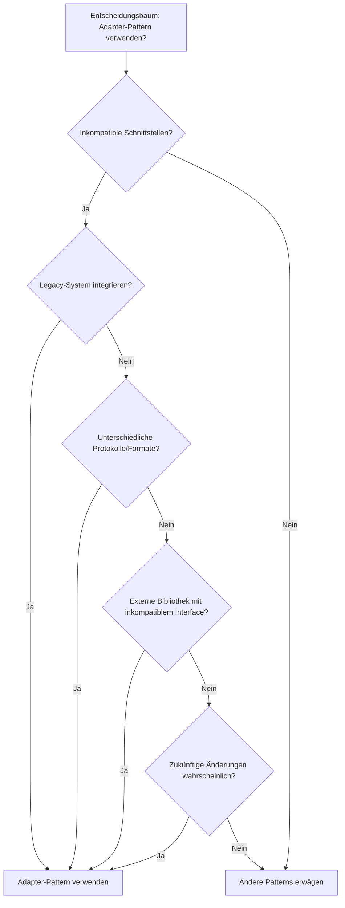
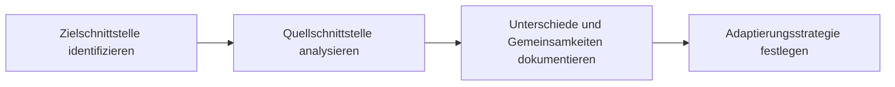
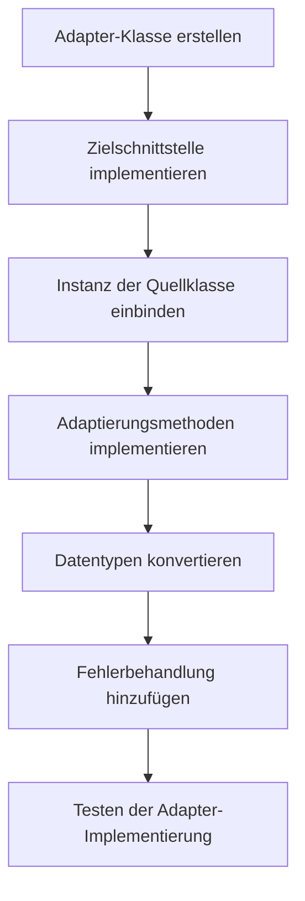
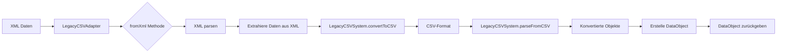
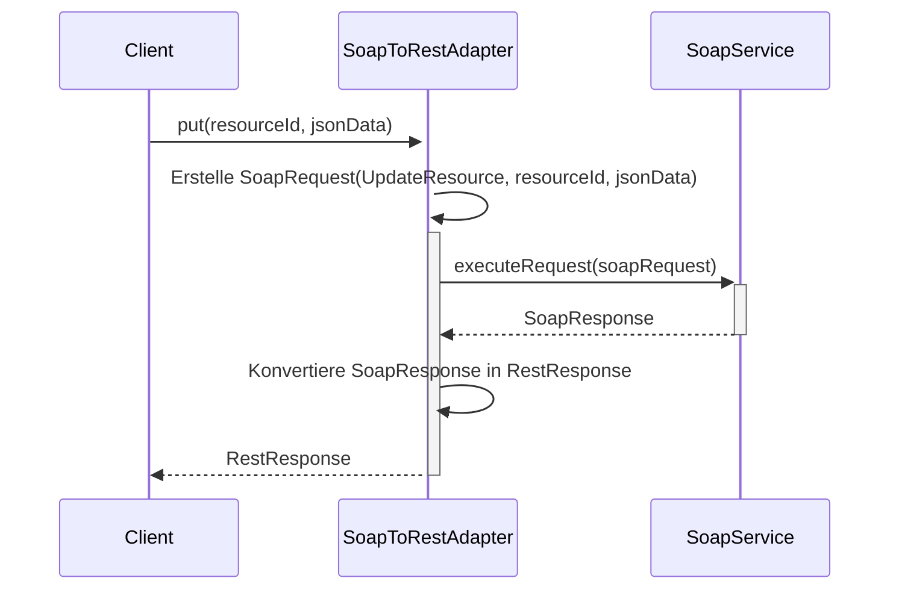
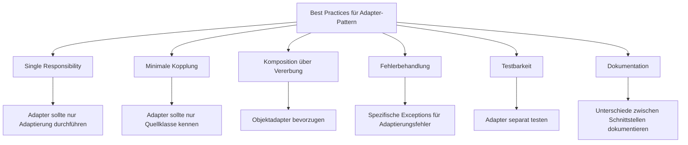
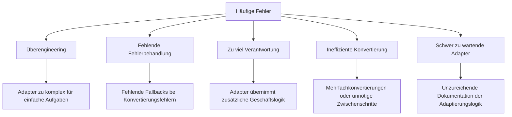
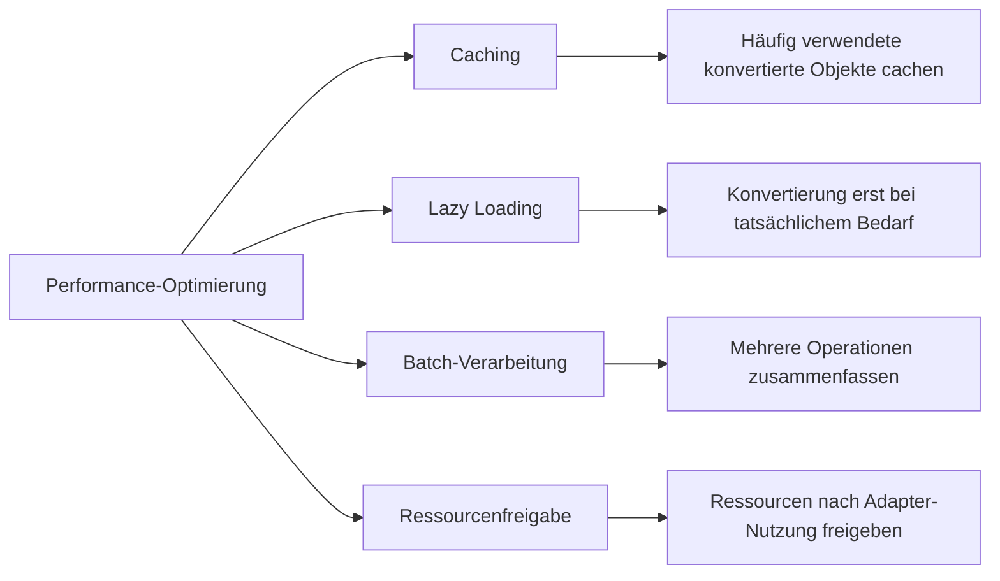

# Implementierungsleitfaden für das Adapter-Pattern

Dieser Leitfaden beschreibt den Implementierungsprozess des Adapter-Patterns in verteilten Systemen anhand praktischer Beispiele aus diesem Projekt.

## Inhaltsverzeichnis

1. [Wann sollte das Adapter-Pattern verwendet werden?](#wann-sollte-das-adapter-pattern-verwendet-werden)
2. [Schrittweise Implementierung](#schrittweise-implementierung)
3. [Implementierungsbeispiele](#implementierungsbeispiele)
4. [Best Practices](#best-practices)
5. [Häufige Fehler](#häufige-fehler)
6. [Performanceüberlegungen](#performanceüberlegungen)

## Wann sollte das Adapter-Pattern verwendet werden?

Das Adapter-Pattern ist in folgenden Situationen besonders nützlich:

## Schrittweise Implementierung

### 1. Ziel- und Quellschnittstellen identifizieren

### 2. Adapter-Klasse implementieren

## Implementierungsbeispiele

### Beispiel 1: Format-Adapter (Objektadapter)

Dieses Diagramm zeigt den Datenfluss bei der Konvertierung von XML in das Legacy-CSV-Format:

### Beispiel 2: Protokoll-Adapter (SoapToRestAdapter)

## Best Practices

## Häufige Fehler

Die folgenden Fehler sollten bei der Implementierung des Adapter-Patterns vermieden werden:

## Performanceüberlegungen

