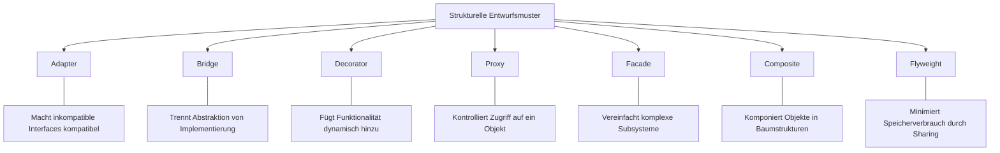
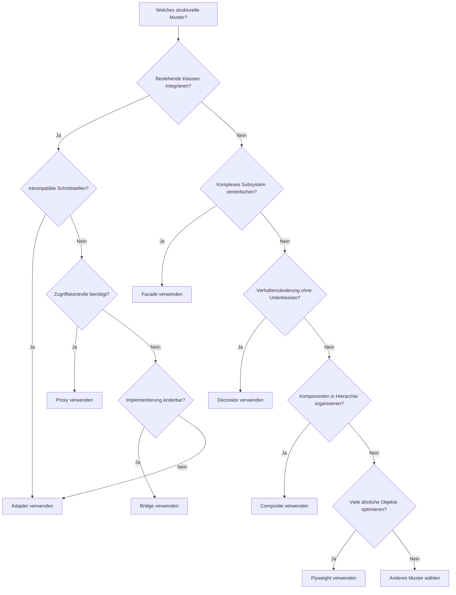
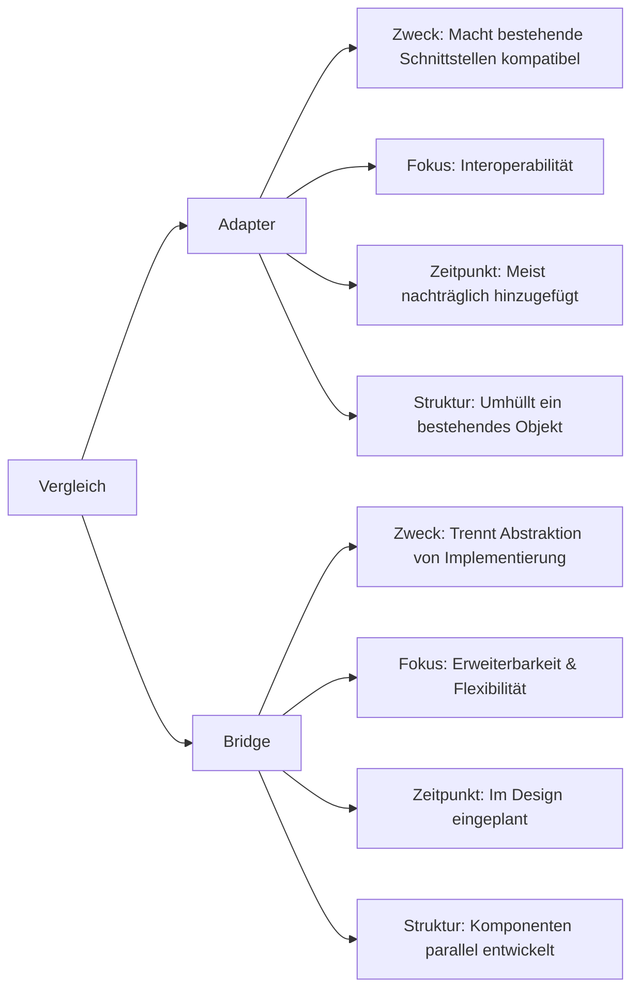
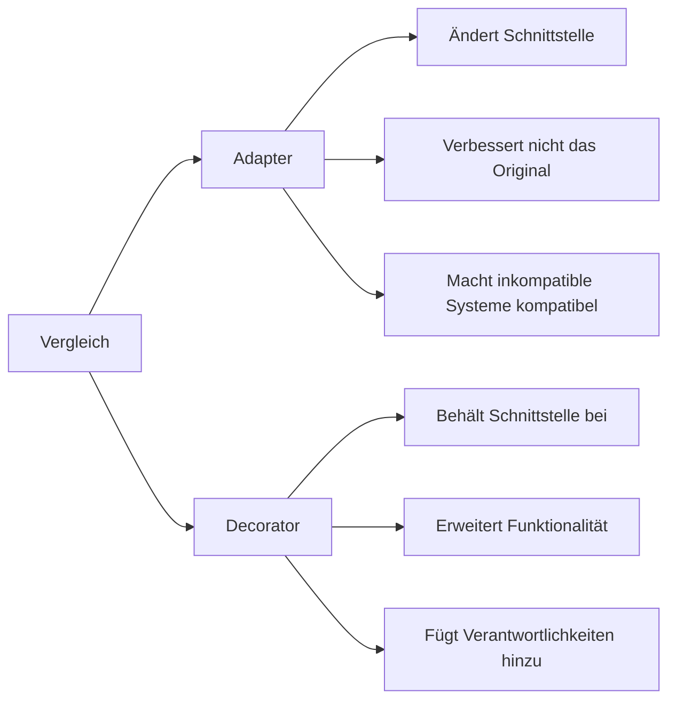
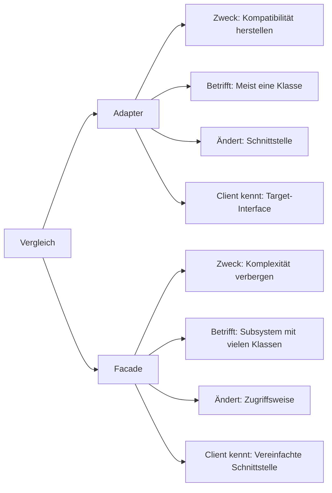
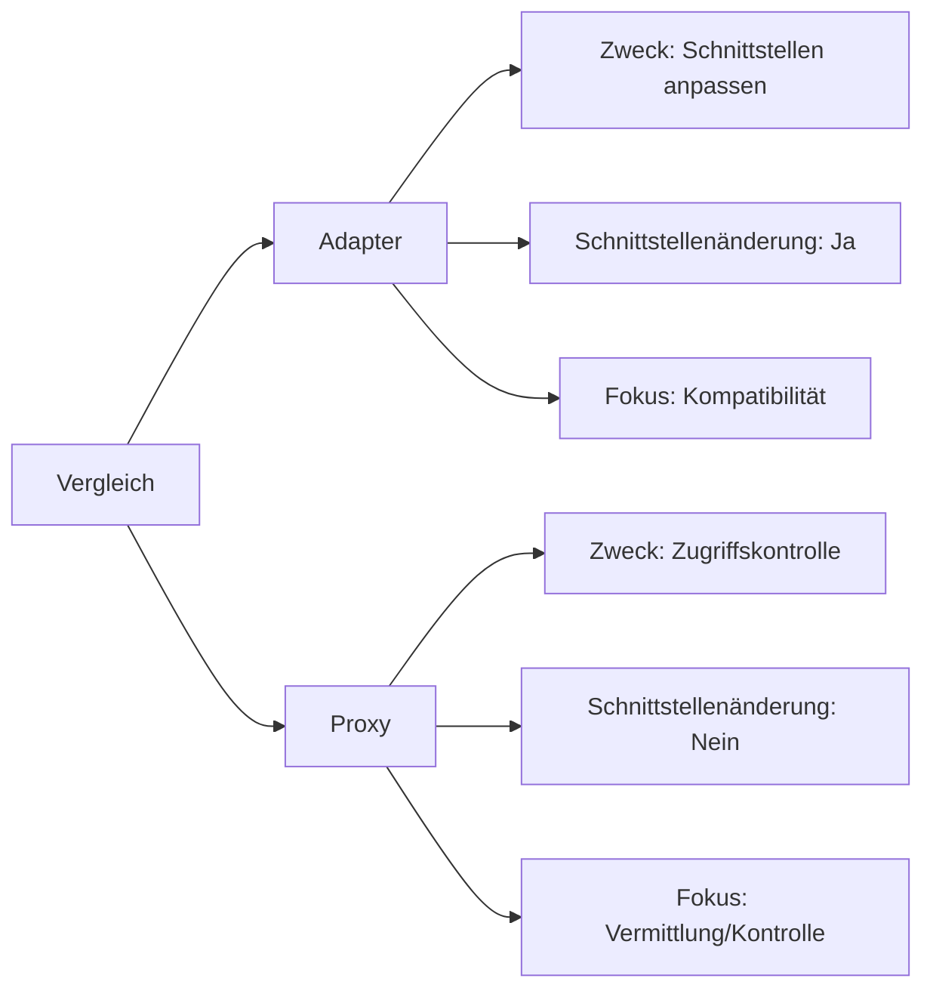
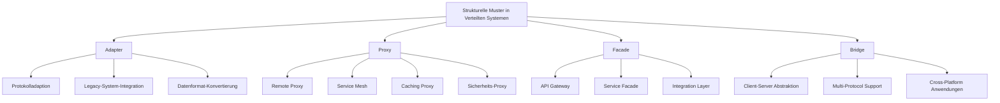
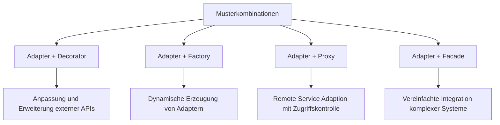
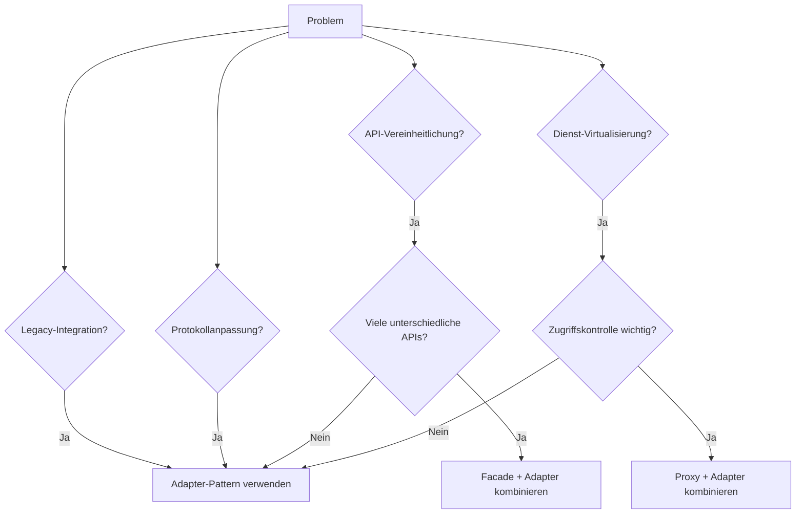
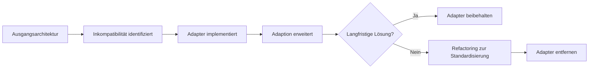

# Vergleich des Adapter-Patterns mit anderen Strukturellen Mustern

Dieses Dokument vergleicht das Adapter-Pattern mit anderen strukturellen Entwurfsmustern und hilft bei der Entscheidung, welches Muster in verschiedenen Situationen am besten geeignet ist.

## Adapter vs. andere strukturelle Muster

## Entscheidungshilfe: Welches Muster wann?

## Detaillierter Vergleich: Adapter vs. andere Muster

### Adapter vs. Bridge

### Adapter vs. Decorator

### Adapter vs. Facade

### Adapter vs. Proxy

## Anwendungsfälle verschiedener Muster in Verteilten Systemen

## Kombination von Mustern

## Entscheidungsmatrix für Verteilte Systeme

## Evolutionspfad für Pattern-Anwendung

