# Adapter-Pattern Dokumentation

Diese Dokumentation enthält verschiedene Diagramme zur Veranschaulichung des Adapter-Patterns und der konkreten Implementierung in diesem Projekt.

## Inhalt

- [Komponentendiagramm](#komponentendiagramm)
- [Klassendiagramme](#klassendiagramme)
- [Sequenzdiagramme](#sequenzdiagramme)
- [Zustandsdiagramme](#zustandsdiagramme)
- [Aktivitätsdiagramme](#aktivitätsdiagramme)

## Komponentendiagramm

Das folgende Diagramm zeigt die Hauptkomponenten des Projekts und ihre Beziehungen zueinander:

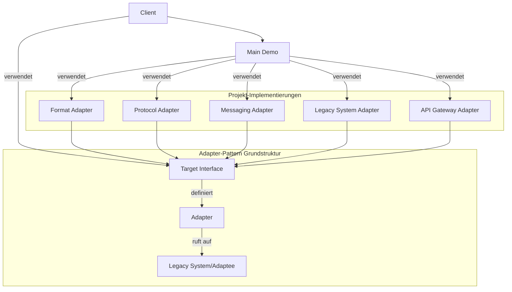

## Klassendiagramme

### Allgemeines Adapter-Klassendiagramm

Das folgende Diagramm zeigt die allgemeine Struktur des Adapter-Patterns:

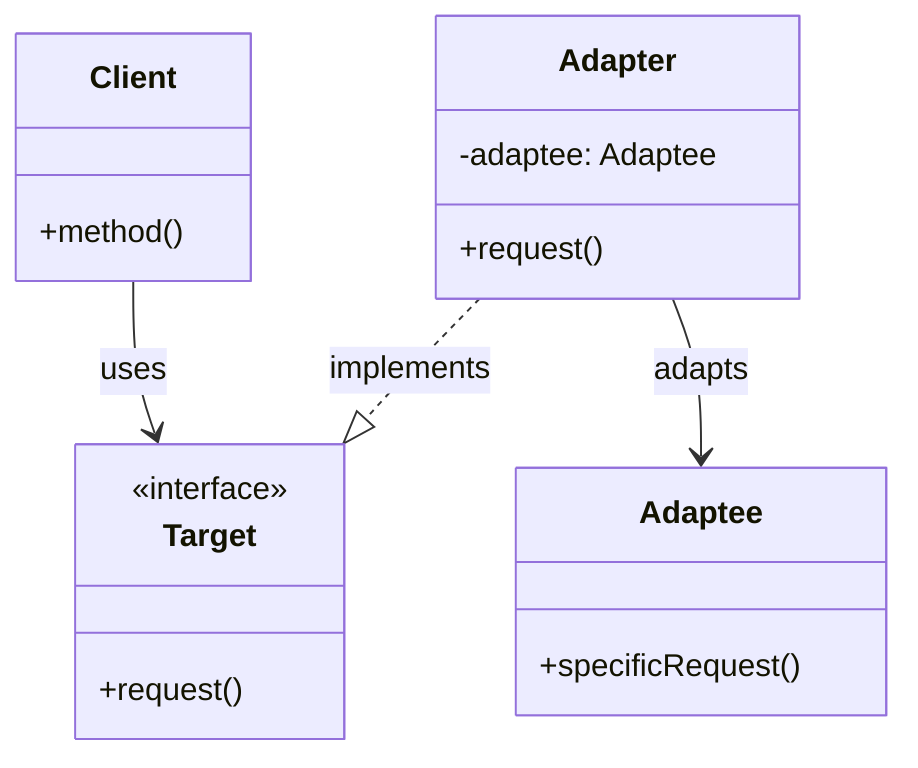

### Format-Adapter-Klassendiagramm

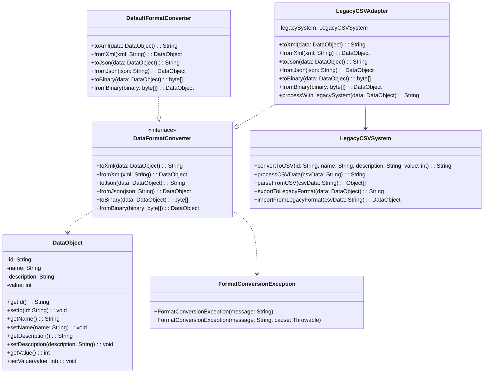

### Protokoll-Adapter-Klassendiagramm

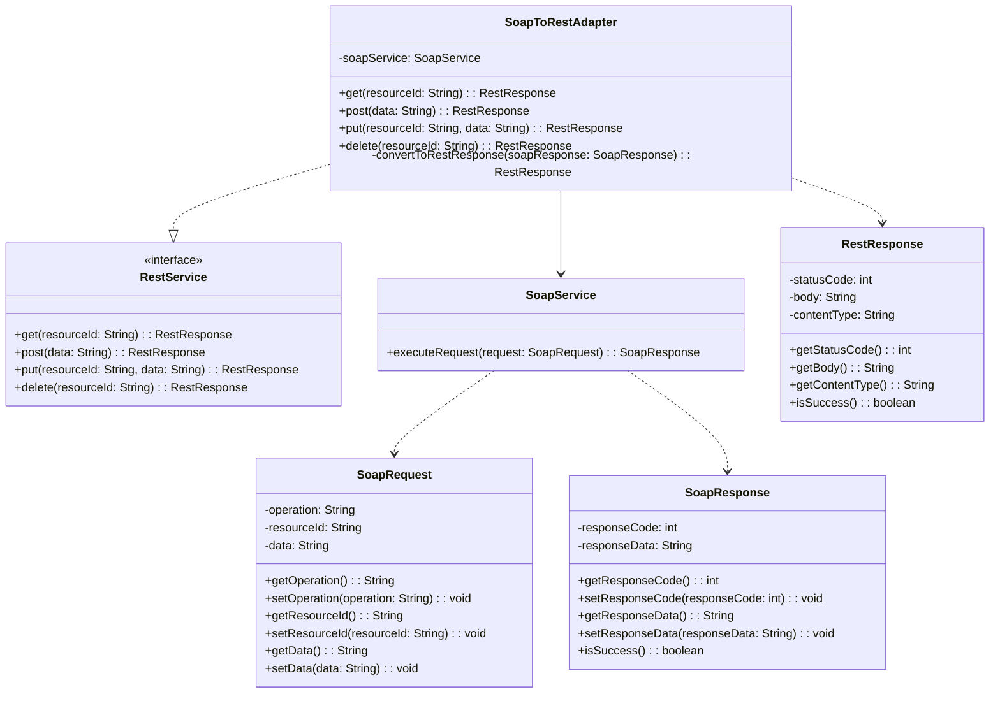

### Legacy-System-Adapter-Klassendiagramm

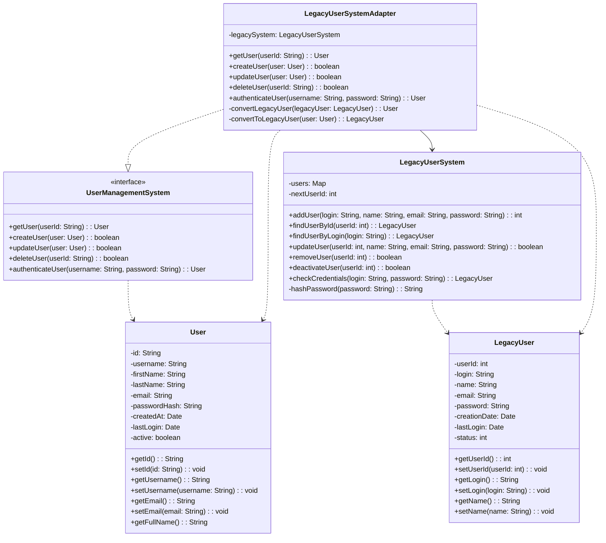

### API-Gateway-Adapter-Klassendiagramm

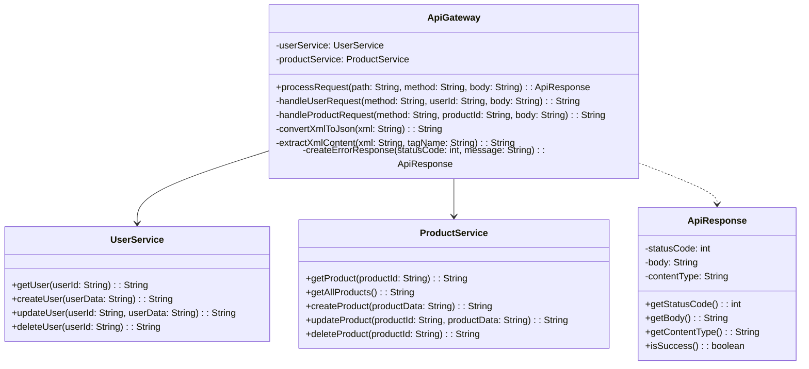

### Messaging-Adapter-Klassendiagramm

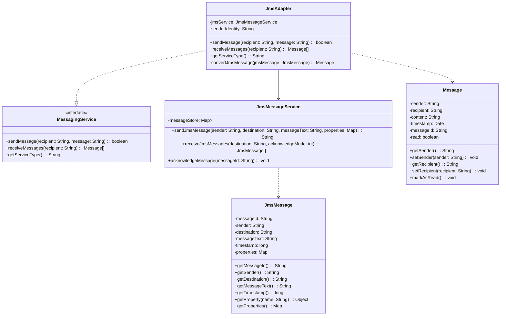

## Sequenzdiagramme

### Format-Adapter-Sequenzdiagramm

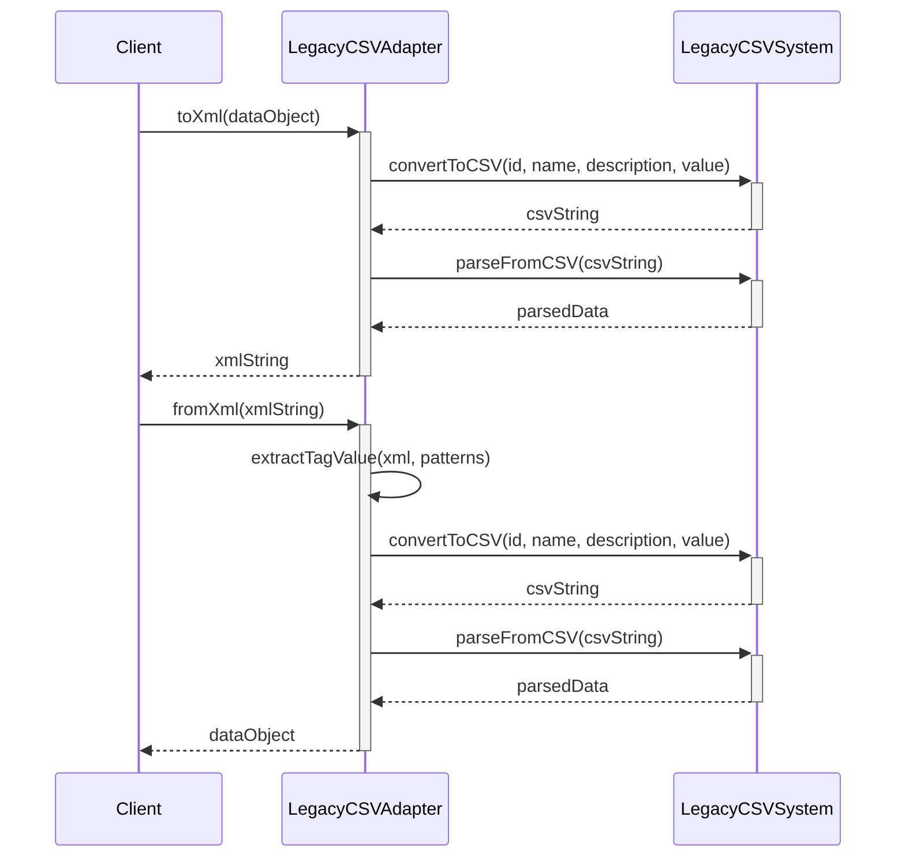

### Protokoll-Adapter-Sequenzdiagramm

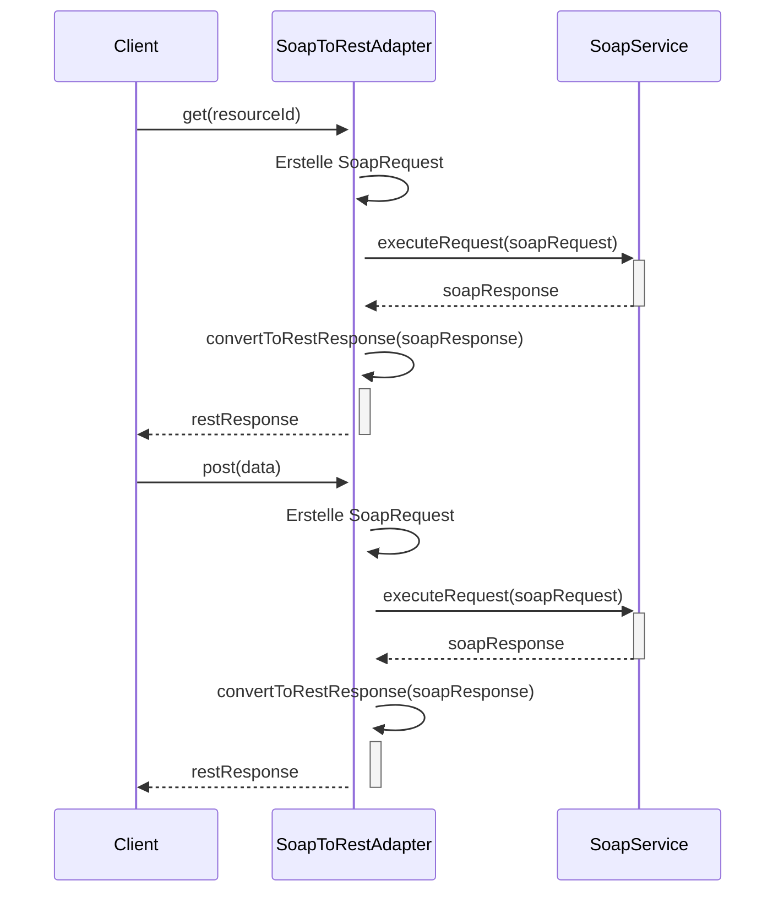

### Legacy-System-Adapter-Sequenzdiagramm

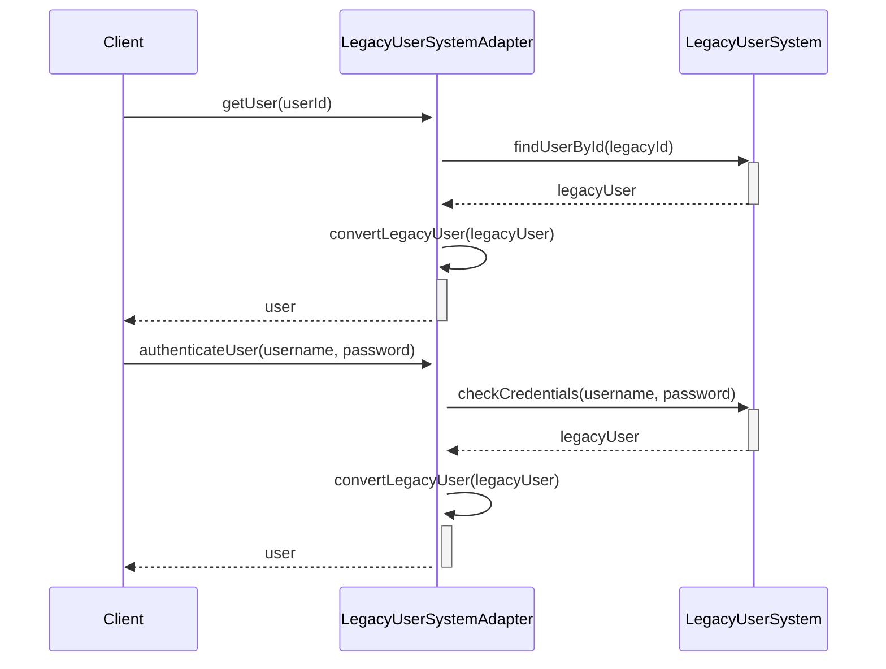

## Zustandsdiagramme

### Nachrichtenverarbeitung in JmsAdapter

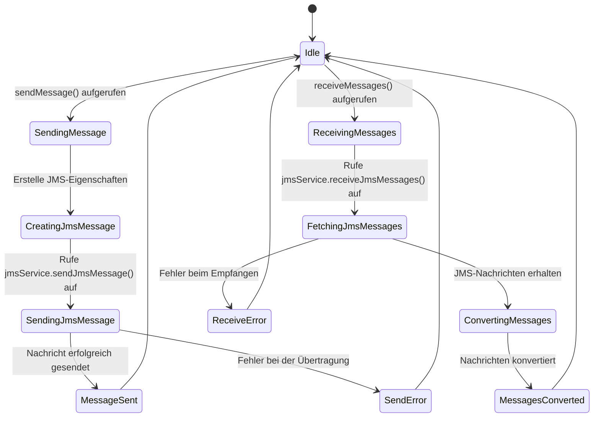

### API-Gateway-Zustandsdiagramm

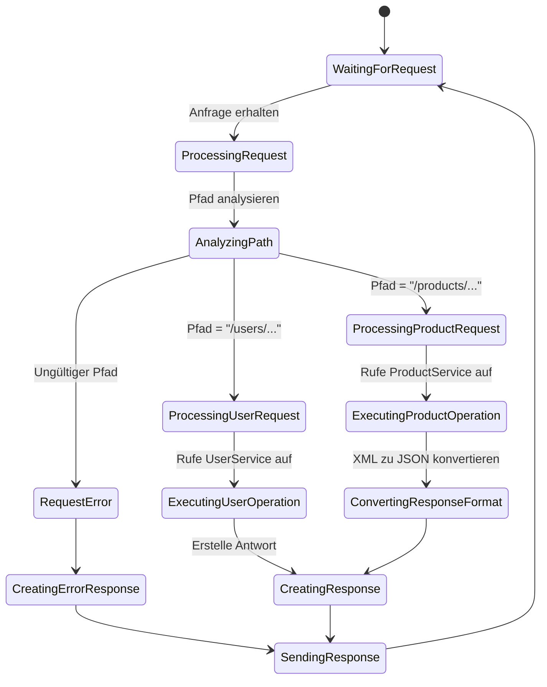

## Aktivitätsdiagramme

### Format-Adapter-Aktivitätsdiagramm

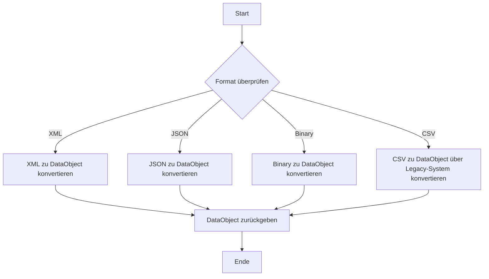

### Protokoll-Adapter-Aktivitätsdiagramm

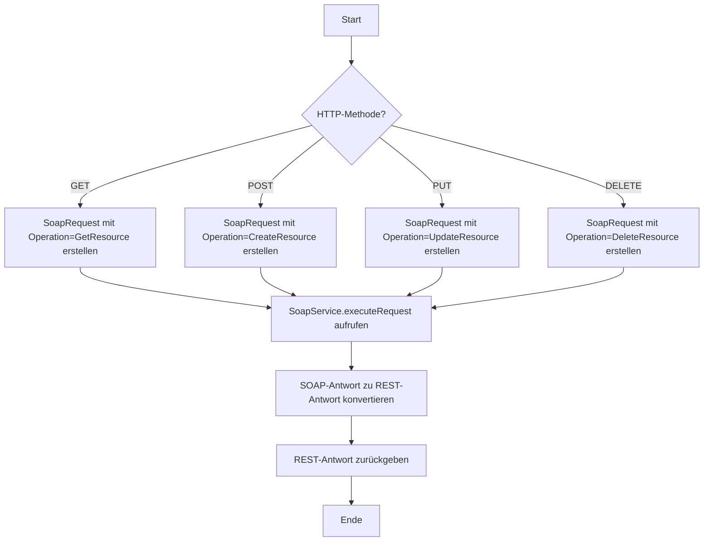
