# Anwendungsbeispiele des Adapter-Patterns in verteilten Systemen

Dieses Dokument stellt reale Anwendungsfälle des Adapter-Patterns in verteilten Systemen vor und analysiert deren Implementierungsdetails.

## Übersicht der Anwendungsfälle

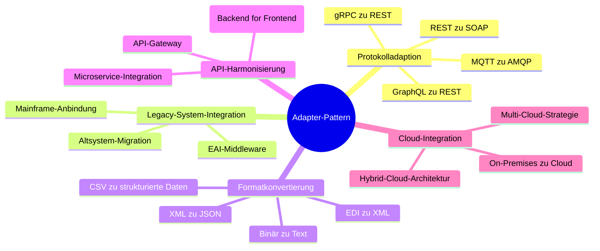

## Detaillierte Anwendungsfälle

### 1. Protokolladaption in Mikroservice-Architekturen

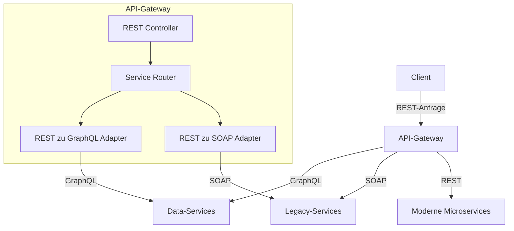

#### Protokolladaption: Sequenzdiagramm für REST zu SOAP Konvertierung

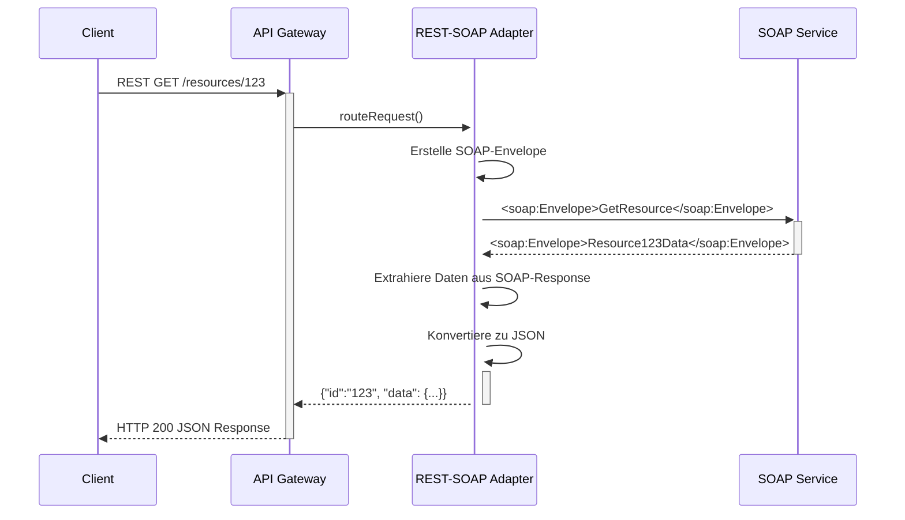

### 2. Datenformat-Transformation

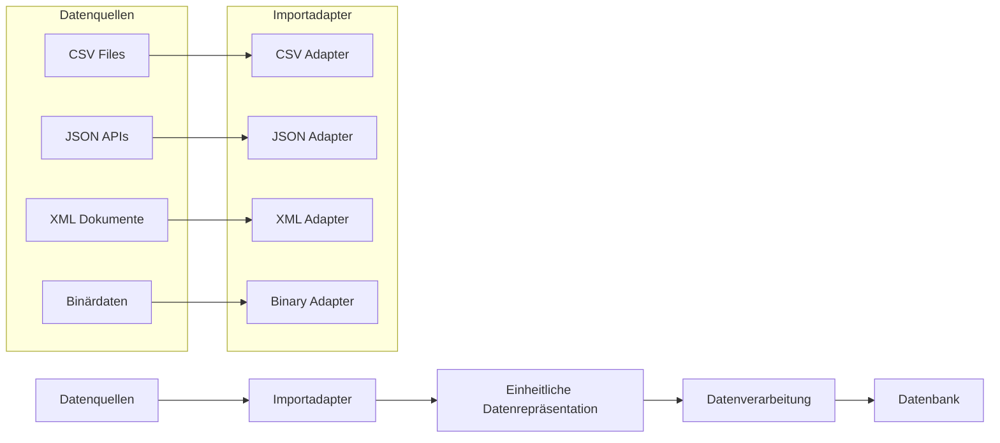

#### Aktivitätsdiagramm eines Format-Adapters

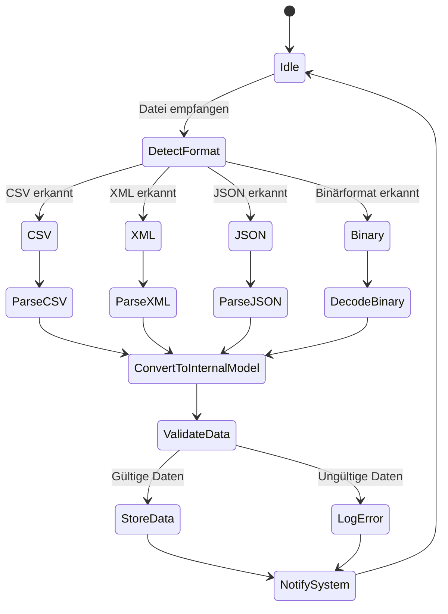

### 3. Legacy-System-Integration

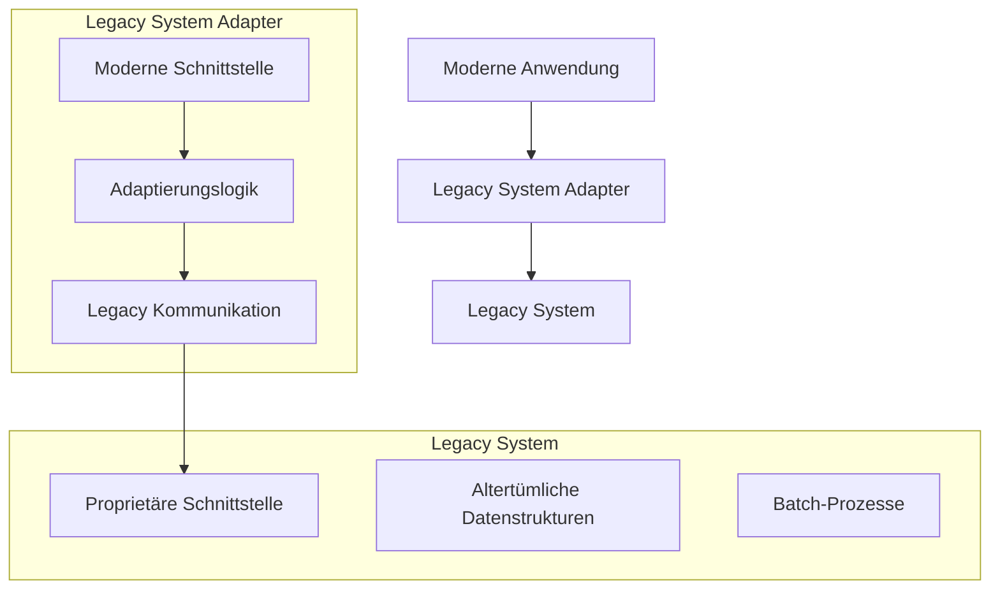

#### Legacy-Integration: Komponentendiagramm

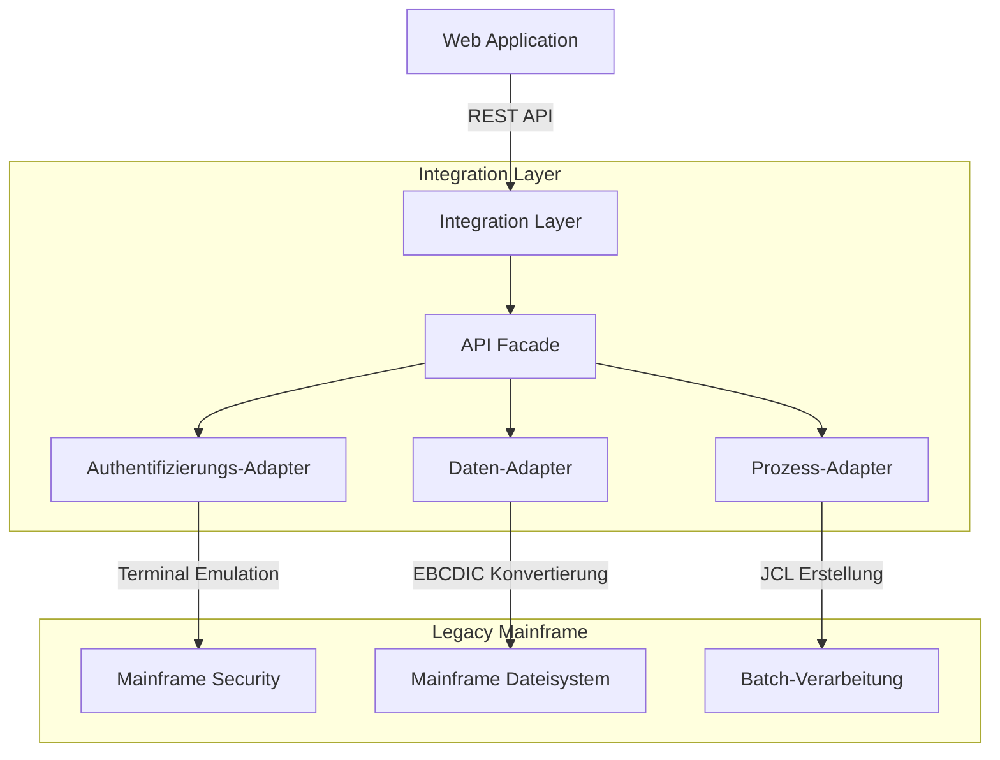

### 4. Cloud-Integration mit Adaptern

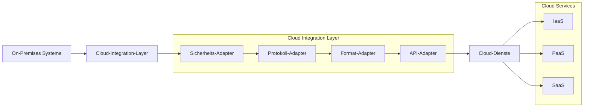

#### Multi-Cloud-Strategie mit Adaptern

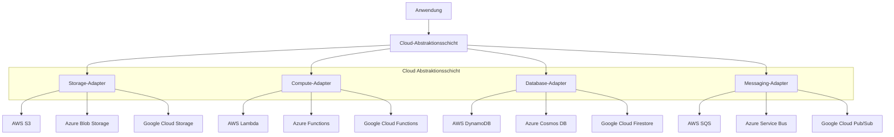

## Design-Entscheidungen beim Adapter-Einsatz

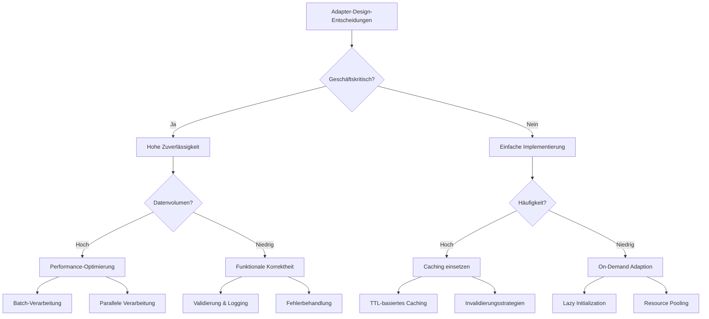

## Evolutionspfad für Adapter-Pattern

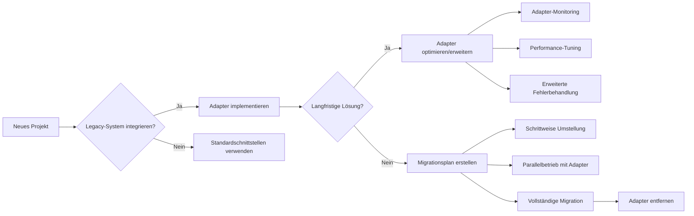
