# Implementierungsleitfaden für das Callback-Pattern

Dieser Leitfaden beschreibt den Implementierungsprozess des Callback-Patterns in verteilten Systemen anhand praktischer Beispiele aus diesem Projekt.

## Inhaltsverzeichnis

1. [Wann sollte das Callback-Pattern verwendet werden?](#wann-sollte-das-callback-pattern-verwendet-werden)
2. [Schrittweise Implementierung](#schrittweise-implementierung)
3. [Implementierungsbeispiele](#implementierungsbeispiele)
4. [Best Practices](#best-practices)
5. [Häufige Fehler](#häufige-fehler)
6. [Performanceüberlegungen](#performanceüberlegungen)

## Wann sollte das Callback-Pattern verwendet werden?

Das Callback-Pattern ist in folgenden Situationen besonders nützlich:

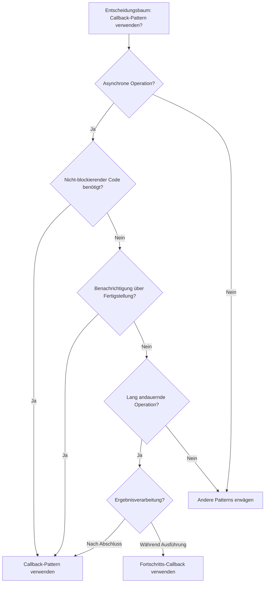

## Schrittweise Implementierung

### 1. Callback-Schnittstelle definieren

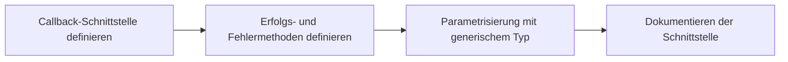

### 2. Asynchrone Operation implementieren

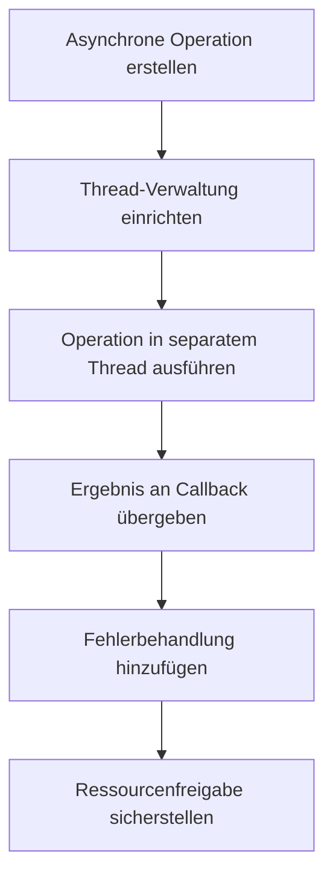

## Implementierungsbeispiele

### Beispiel 1: Einfaches Callback (Objektadapter)

Dieses Diagramm zeigt den Datenfluss bei der Ausführung eines einfachen asynchronen Callbacks:

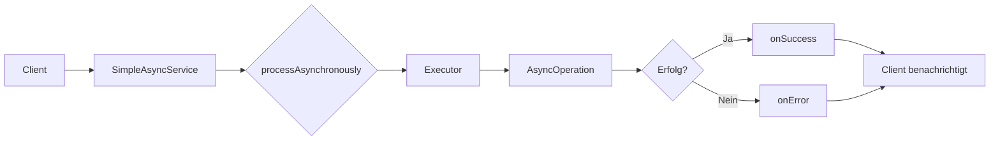

### Beispiel 2: Polling-basiertes Callback

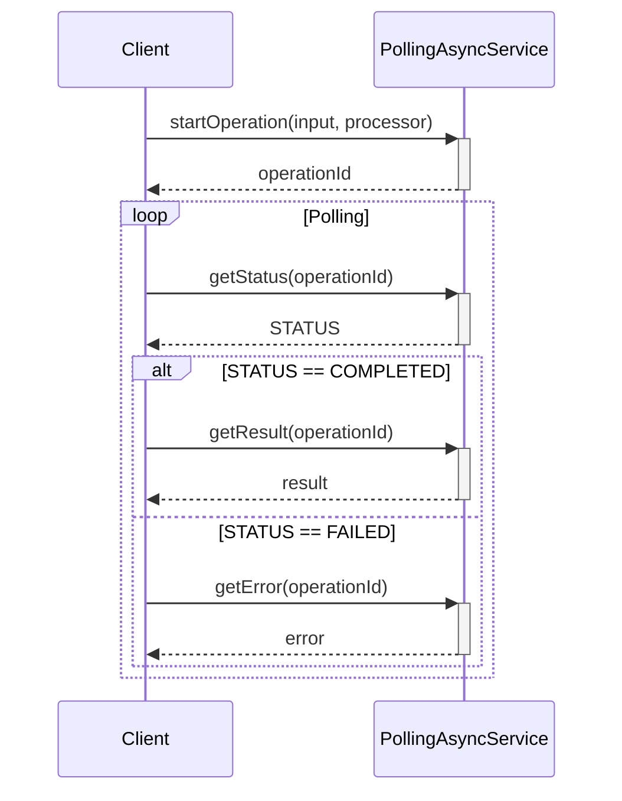

## Best Practices

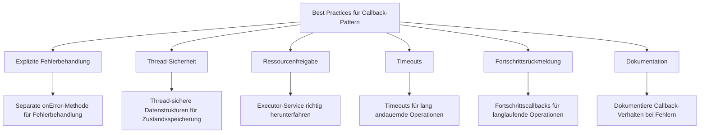

## Häufige Fehler

Die folgenden Fehler sollten bei der Implementierung des Callback-Patterns vermieden werden:

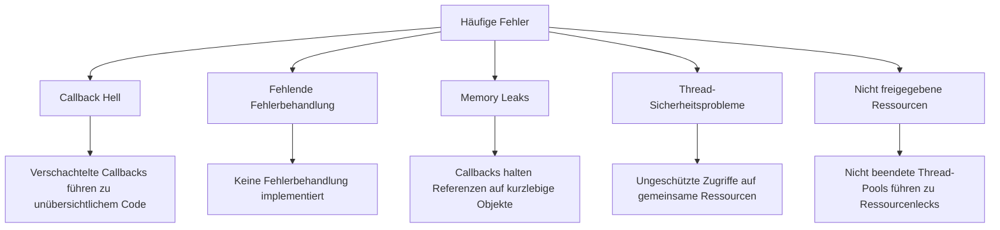

## Performanceüberlegungen

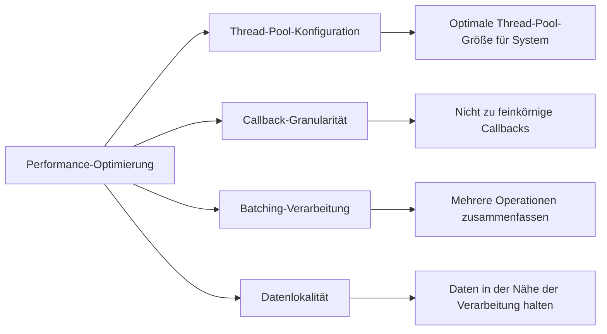

## Varianten des Callback-Patterns

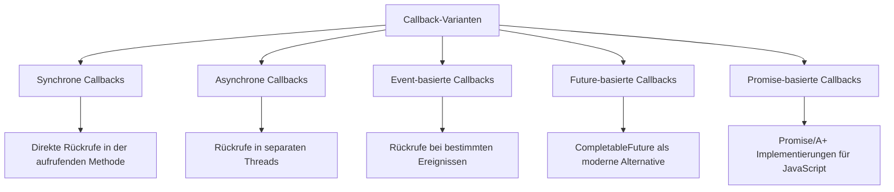

## Herausforderungen in verteilten Systemen

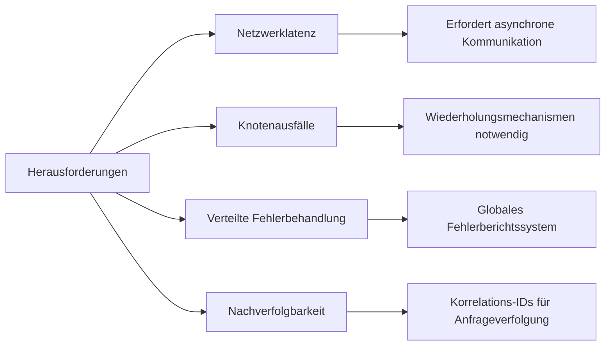

## Moderne Alternativen zum Callback-Pattern

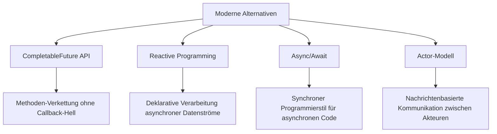
