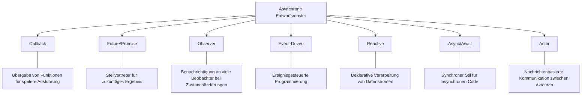
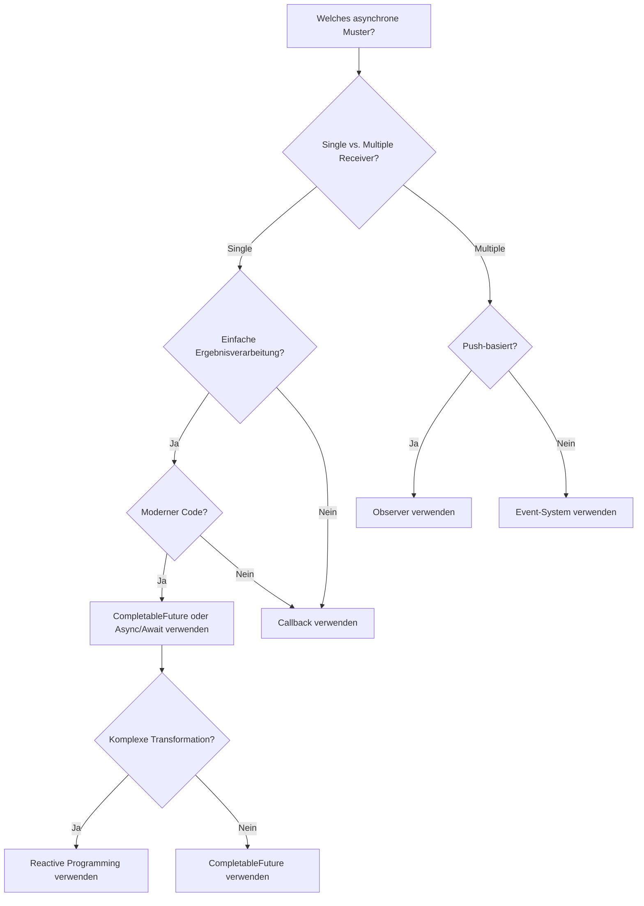
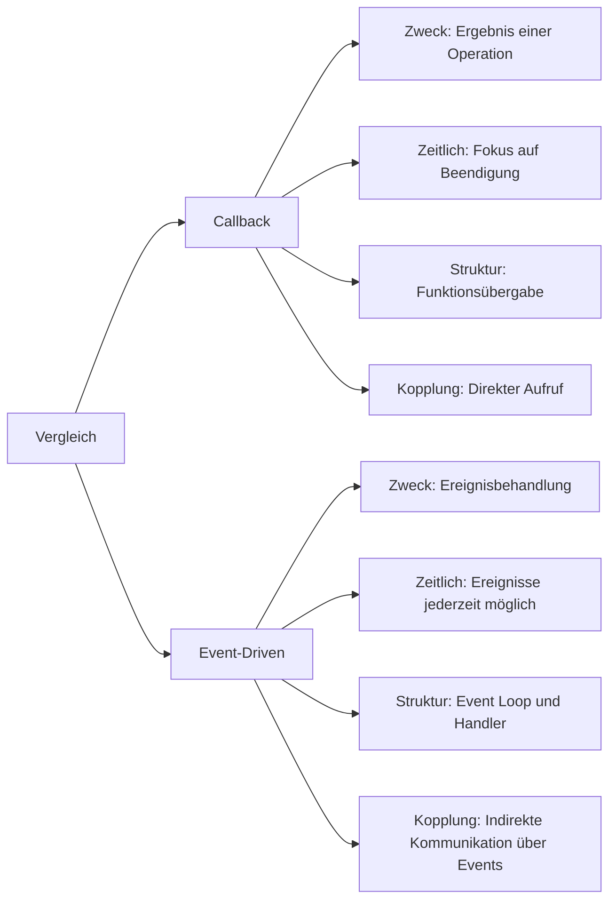
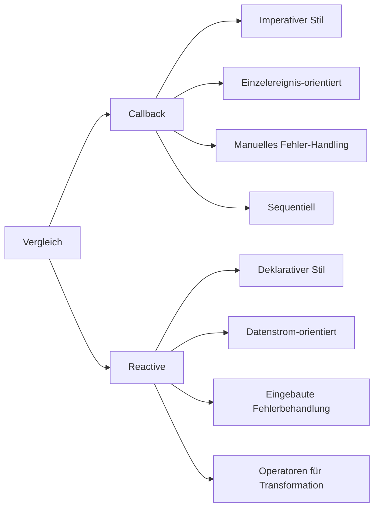
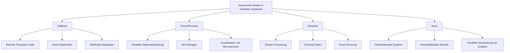
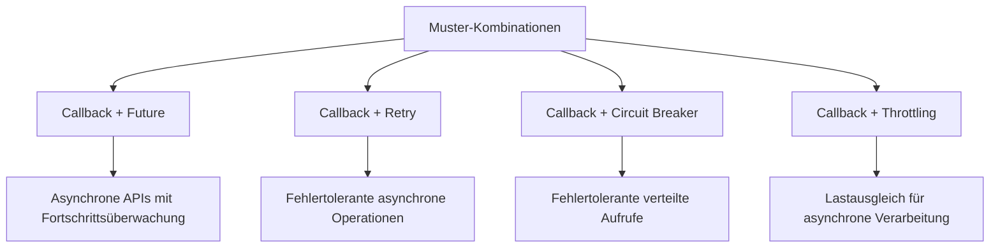
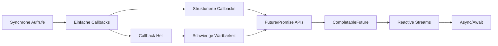
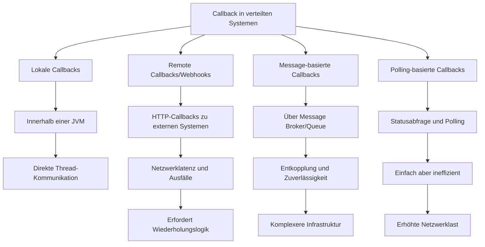
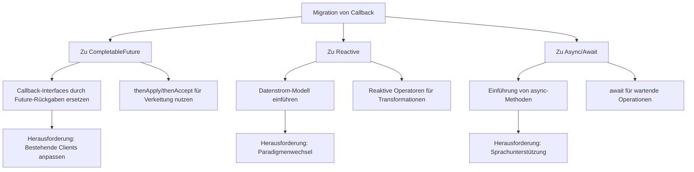

# Vergleich des Callback-Patterns mit anderen asynchronen Mustern

Dieses Dokument vergleicht das Callback-Pattern mit anderen asynchronen Entwurfsmustern und hilft bei der Entscheidung, welches Muster in verschiedenen Situationen am besten geeignet ist.

## Callback vs. andere asynchrone Muster



## Entscheidungshilfe: Welches Muster wann?



## Detaillierter Vergleich: Callback vs. andere Muster

### Callback vs. Future/Promise

```mermaid
graph LR
    A[Vergleich] --> B[Callback]
    A --> C[Future/Promise]
    
    B --> B1[Zweck: Benachrichtigung über Ergebnis/Fehler]
    B --> B2[Fokus: Prozedurales Paradigma]
    B --> B3[Problem: "Callback Hell" bei Verschachtelung]
    B --> B4[Struktur: Funktionen werden übergeben]
    
    C --> C1[Zweck: Stellvertreter für ausstehende Ergebnisse]
    C --> C2[Fokus: Funktionales Paradigma]
    C --> C3[Vorteil: Methoden-Verkettung vermeidet "Callback Hell"]
    C --> C4[Struktur: Rückgabe eines Future-Objekts]
```

### Callback vs. Observer

```mermaid
graph LR
    A[Vergleich] --> B[Callback]
    A --> C[Observer]
    
    B --> B1[Typischerweise 1:1-Beziehung]
    B --> B2[Unmittelbare Benachrichtigung]
    B --> B3[Einmaliger Aufruf]
    B --> B4[Eng gekoppelt: kennt den Empfänger]
    
    C --> C1[1:n-Beziehung (viele Beobachter)]
    C --> C2[Kann verzögert benachrichtigen]
    C --> C3[Mehrere Aufrufe möglich]
    C --> C4[Lose gekoppelt: kennt Beobachter nicht direkt]
```

### Callback vs. Event-Driven



### Callback vs. Reactive



## Anwendungsfälle verschiedener Muster in Verteilten Systemen



## Kombination von Mustern



## Evolutionspfad für asynchrone Muster



## Retry Callback-Sequenzdiagramm

```mermaid
sequenceDiagram
    participant Client
    participant Retry as RetryCallback
    participant Op as Operation
    participant Original as OriginalCallback
    
    Client->>+Retry: execute()
    Retry->>+Retry: Retry.decorateCallable()
    
    loop Retry attempts
        Retry->>+Op: execute operation
        
        alt Success
            Op-->>-Retry: result
            Retry->>+Original: onSuccess(result)
            Original-->>-Retry: return
            Retry-->>-Client: return
        else Error
            Op-->>-Retry: exception
            
            alt Retry limit not reached
                Note over Retry: Wait backoff time
                Retry->>Retry: retry attempt
            else Max retries reached
                Retry->>+Original: onError(exception)
                Original-->>-Retry: return
                Retry-->>-Client: return
            end
        end
    end
```

## Vergleichsmatrix: Vor- und Nachteile

| Muster | Stärken | Schwächen | Ideale Anwendungsfälle |
|--------|---------|-----------|------------------------|
| Callback | Einfach zu implementieren, weit verbreitet | Callback Hell, schwer zu verketten | Einfache asynchrone Operationen, Event Handler |
| Future/Promise | Methoden-Verkettung, bessere Lesbarkeit | Erhöht Komplexität | Parallele Datenverarbeitung, Orchestrierung mehrerer asynchroner Operationen |
| Observer | Lose Kopplung, 1:n-Benachrichtigung | Schwieriges Debugging, Reihenfolge nicht garantiert | GUI-Events, Zustandsänderungsnotifikationen |
| Reactive | Leistungsfähige Operatoren, Backpressure | Steile Lernkurve | Streaming-Daten, komplexe Ereignisketten, hohe Nebenläufigkeit |
| Async/Await | Lesbarkeit wie synchroner Code | Nicht in allen Sprachen verfügbar | Vereinfachung komplexer asynchroner Logik |
| Actor | Stark isolierte Komponenten | Komplexes Modell, Overhead | Hochskalierbare Systeme, Fehlertoleranz |

## Adaption von Callback-Pattern in verteilten Umgebungen



## Migration von Callback zu modernen Alternativen


