# Callback-Pattern Dokumentation

Diese Dokumentation enthält verschiedene Diagramme zur Veranschaulichung des Callback-Patterns und der konkreten Implementierung in diesem Projekt.

## Inhalt

- [Komponentendiagramm](#komponentendiagramm)
- [Klassendiagramme](#klassendiagramme)
- [Sequenzdiagramme](#sequenzdiagramme)
- [Zustandsdiagramme](#zustandsdiagramme)
- [Aktivitätsdiagramme](#aktivitätsdiagramme)

## Komponentendiagramm

Das folgende Diagramm zeigt die Hauptkomponenten des Projekts und ihre Beziehungen zueinander:

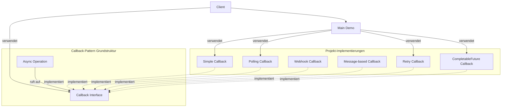
##
## Klassendiagramme

### Allgemeines Callback-Klassendiagramm

Das folgende Diagramm zeigt die allgemeine Struktur des Callback-Patterns:

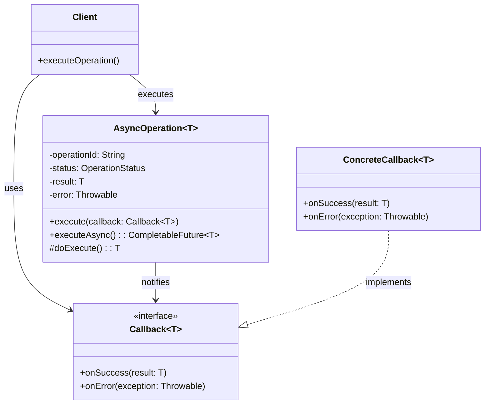

### Simple Callback-Klassendiagramm

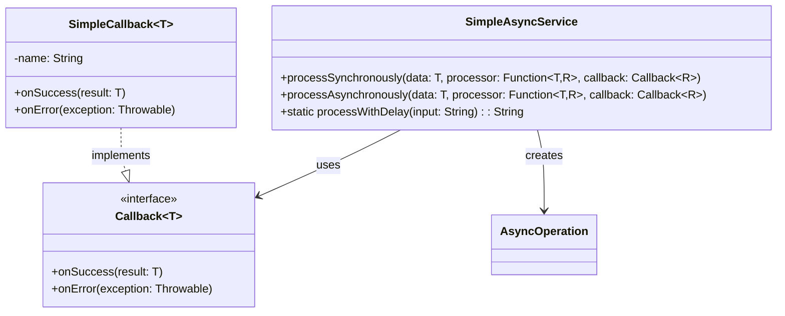

### Polling Callback-Klassendiagramm

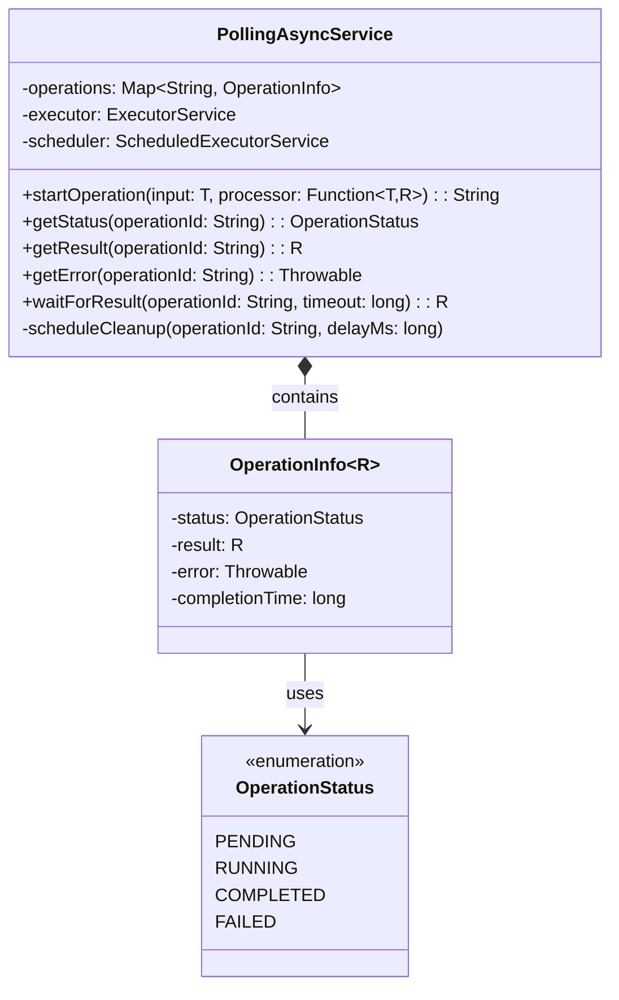

### Retry Callback-Klassendiagramm

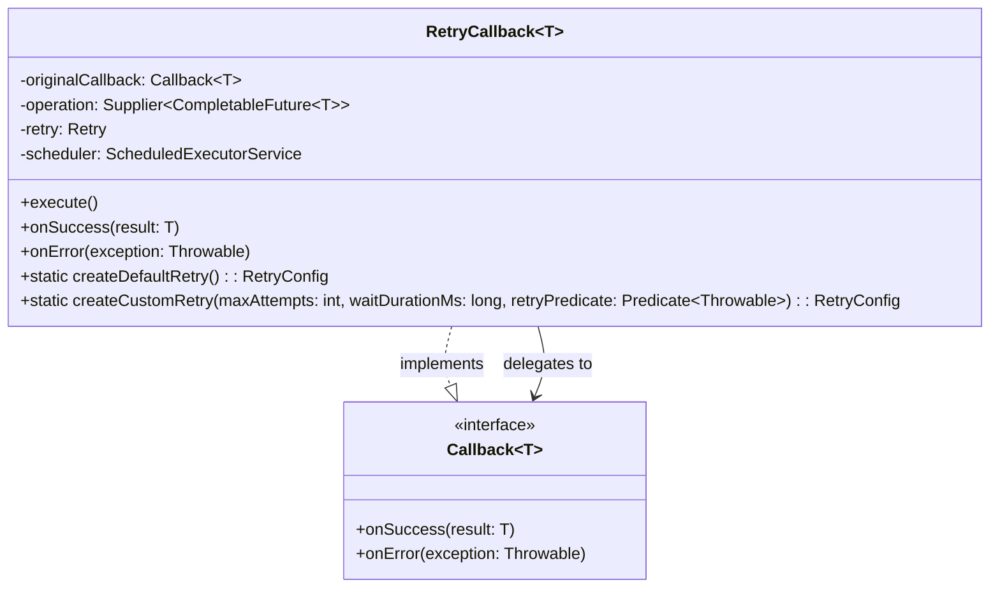

### CompletableFuture Callback-Klassendiagramm

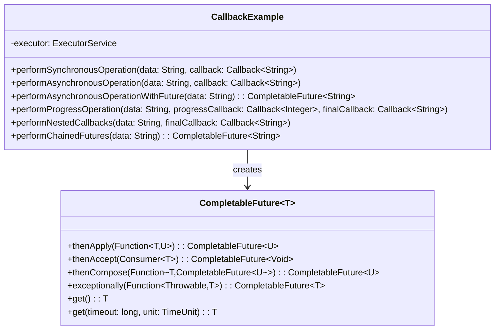

## Sequenzdiagramme

### Simple Callback-Sequenzdiagramm

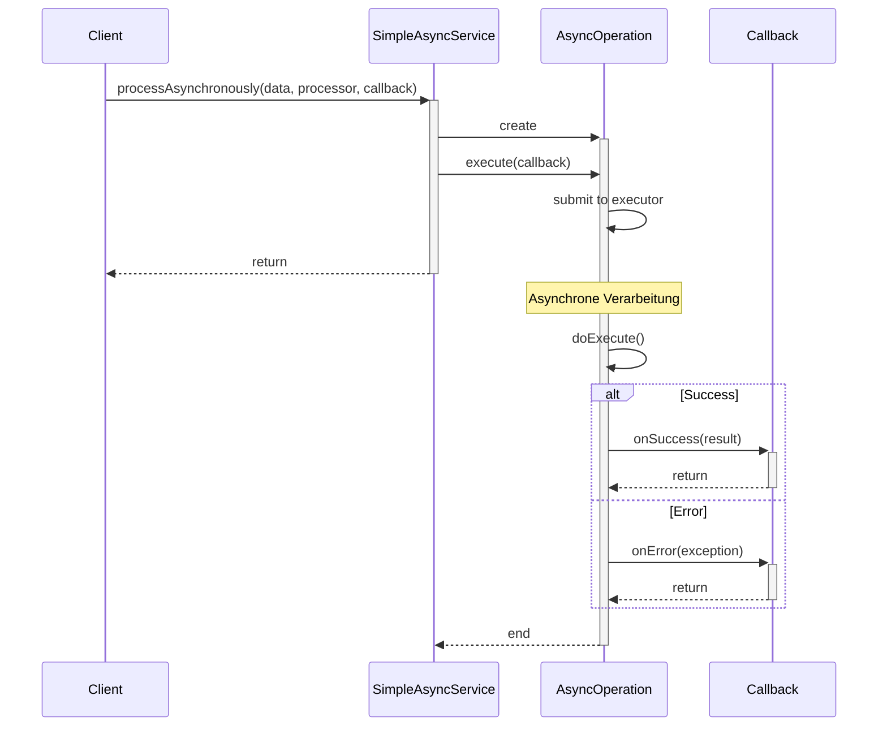

### Polling Callback-Sequenzdiagramm

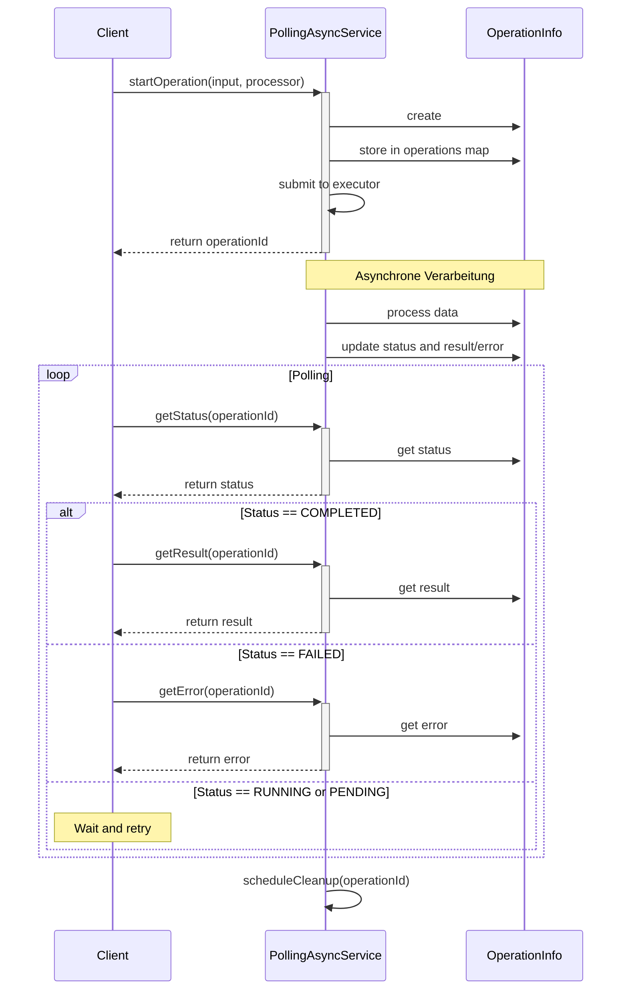

### Retry Callback-Sequenzdiagramm

```mermaid
sequenceDiagram
    participant Client
    participant Retry as RetryCallback
    participant Op as Operation
    participant Original as OriginalCallback

    Client->>+Retry: execute()
    Retry->>+Retry: Retry.decorateCallable()

    loop Retry attempts
        Retry->>+Op: execute operation

        alt Success
            Op-->>-Retry: result
            Retry-->>+Original: onSuccess(result) 
            Original-->>-Retry: return
            Retry-->>-Client: return
        else Error
            Op-->>-Retry: exception
            
            alt Retry limit not reached
                Note over Retry: Wait backoff time
                Retry->>+Retry: retry attempt
            else Max retries reached
                Retry-->>+Original: onError(exception)
                Original-->>-Retry: return
                Retry-->>-Client: return
            end
        end
    end
```

### CompletableFuture Callback-Sequenzdiagramm 

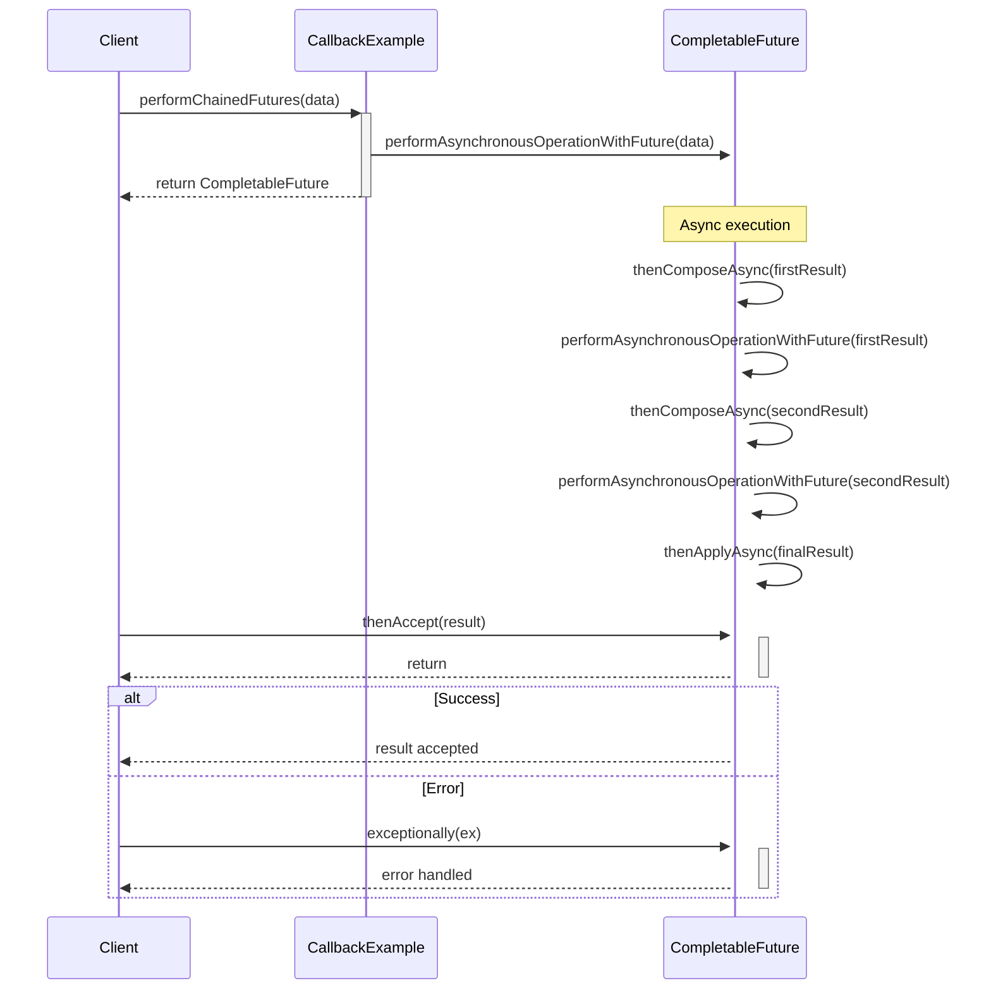

## Zustandsdiagramme

### Callback Operationszustandsdiagramm

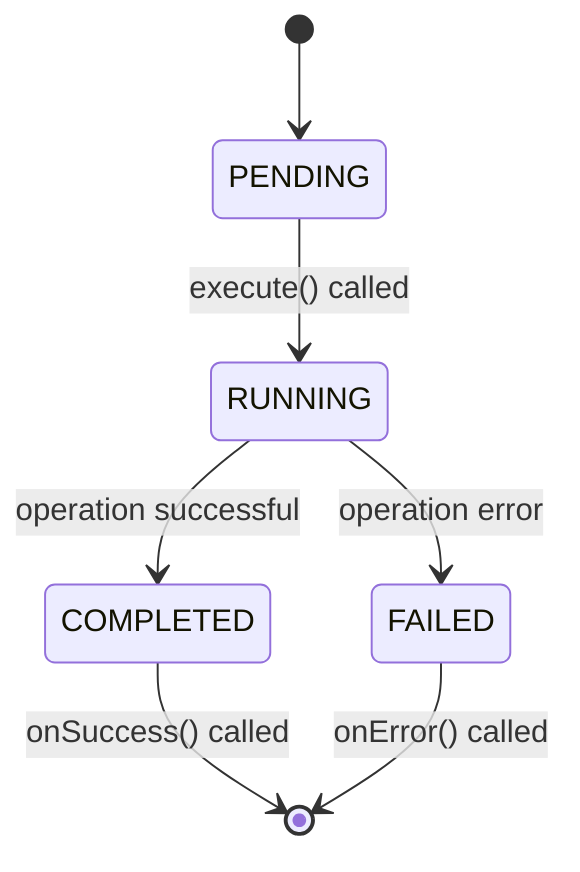

### Retry Callback-Zustandsdiagramm

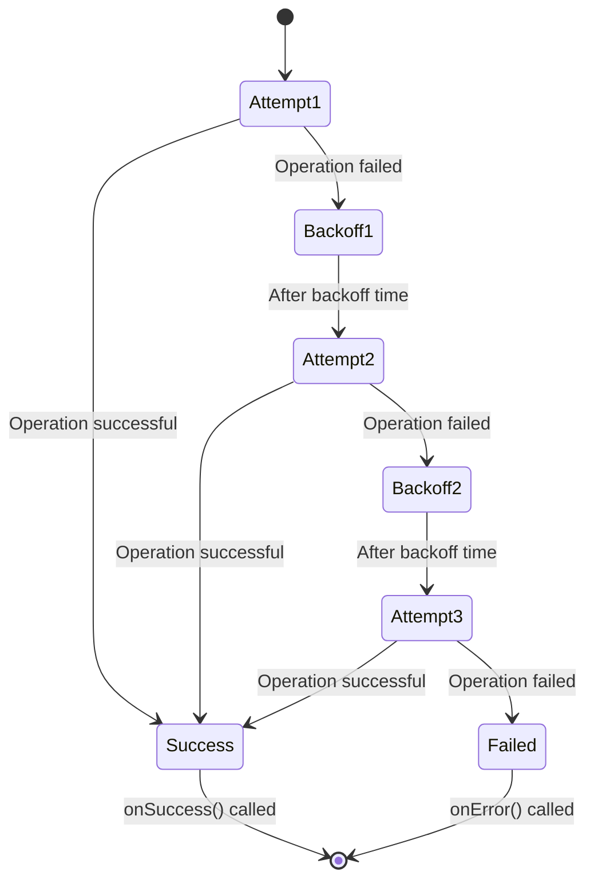

## Aktivitätsdiagramme

### Grundlegendes Callback-Aktivitätsdiagramm

```mermaid
graph TD
    A[Start] --> B{Asynchron?}
    B -->|Nein| C[Führe Operation synchron aus]
    B -->|Ja| D[Erstelle Task im Thread-Pool] 

    C --> E{Erfolgreich?}
    D --> F[Operation wird asynchron ausgeführt]
    F --> E

    E -->|Ja| G[Rufe onSuccess() auf]
    E -->|Nein| H[Rufe onError() auf]

    G --> I[Ende]
    H --> I
```

### Polling Callback-Aktivitätsdiagramm

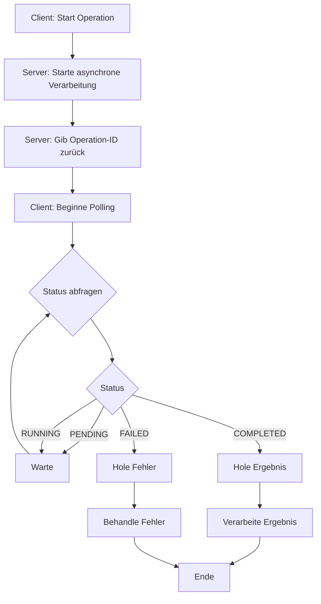

### Moderne CompletableFuture-Aktivitätsdiagramm

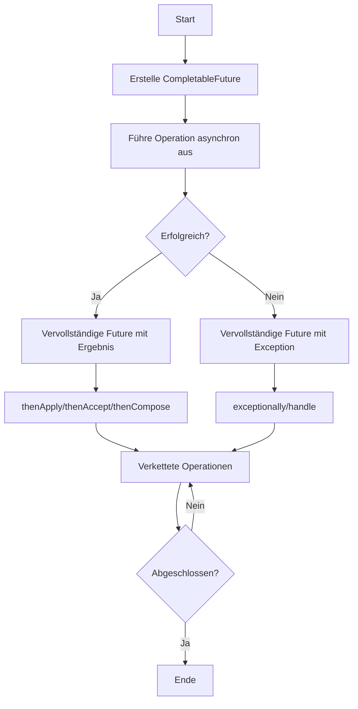
