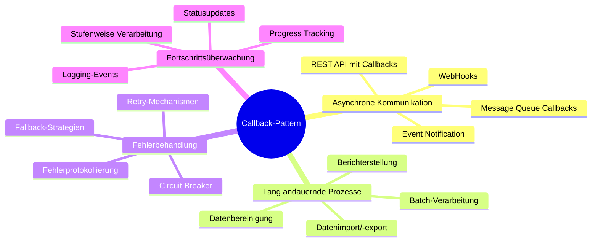
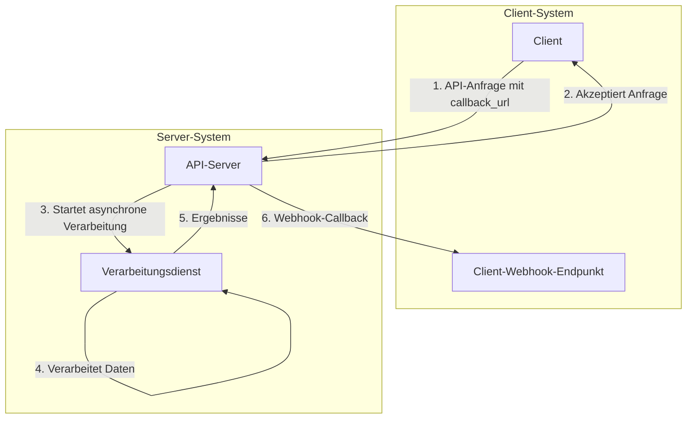
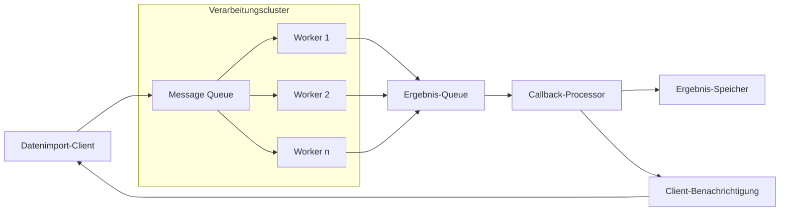
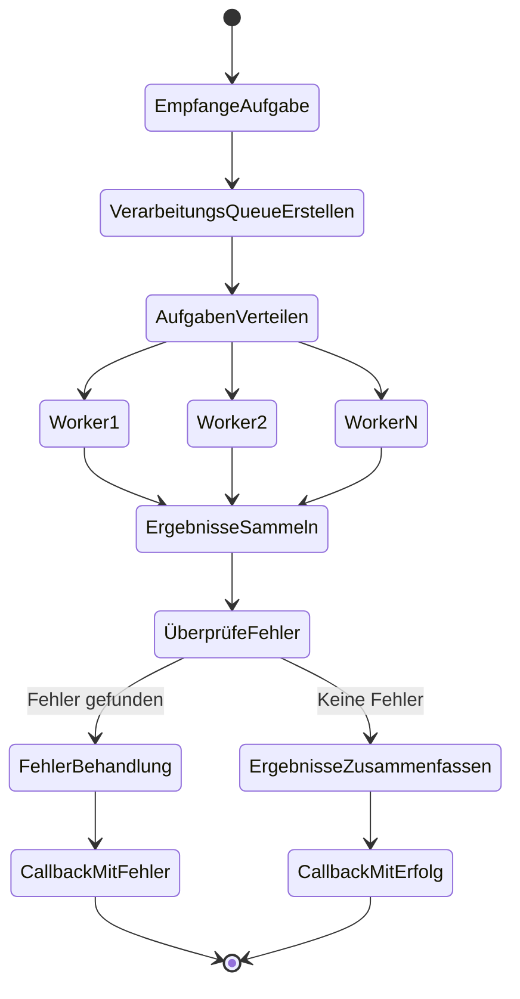
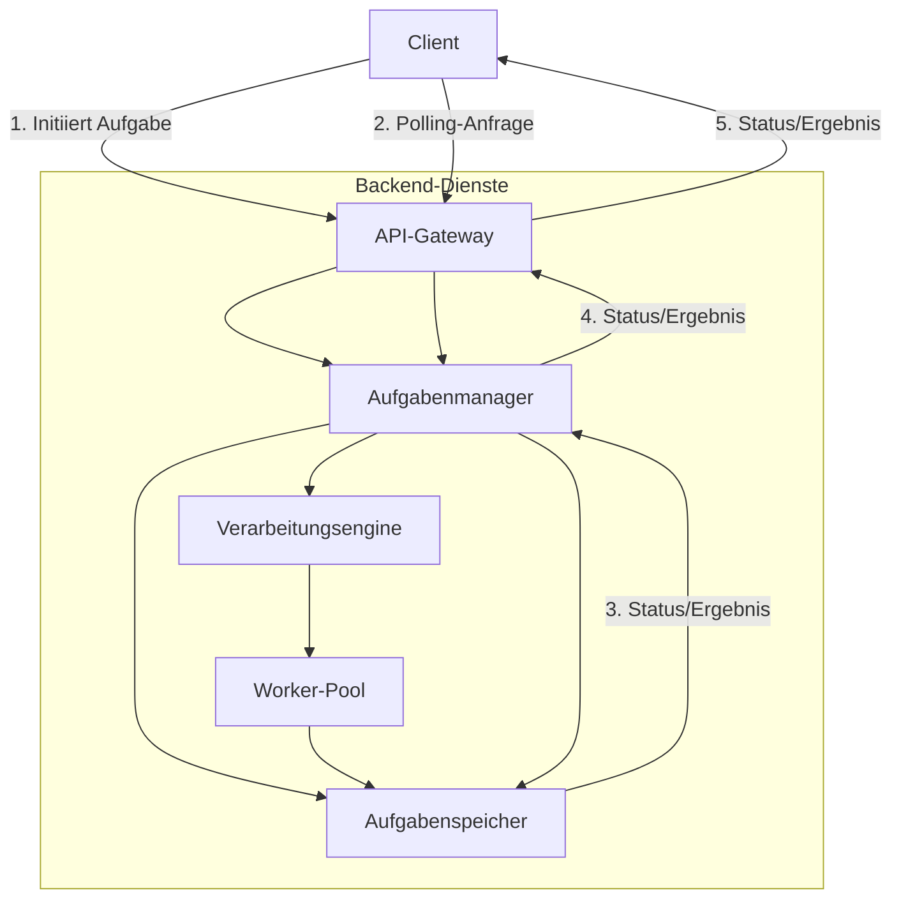
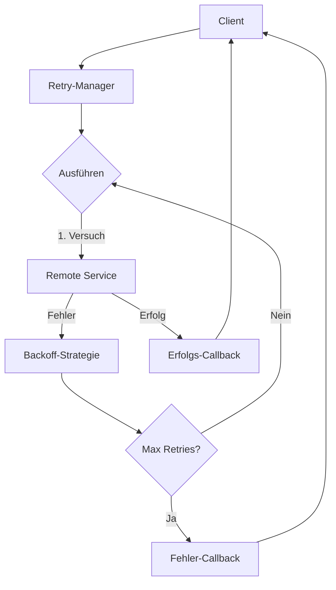
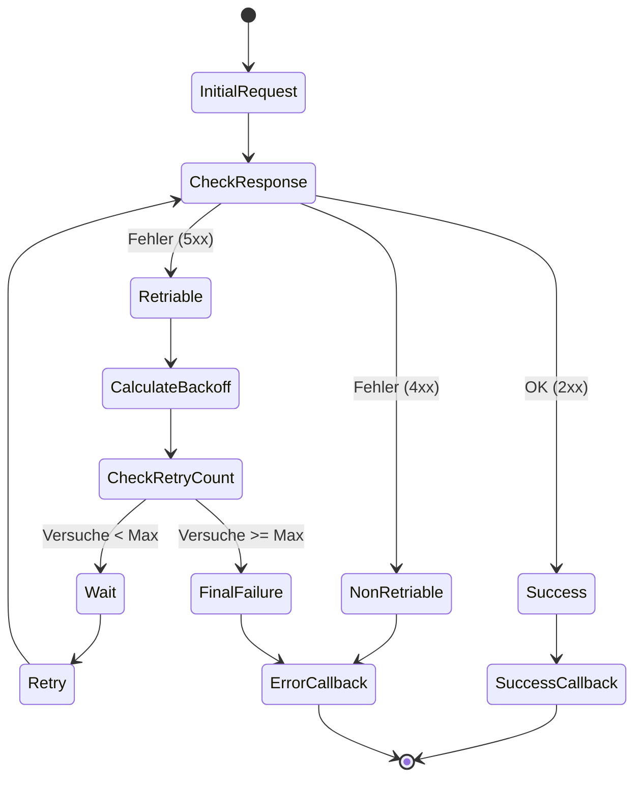
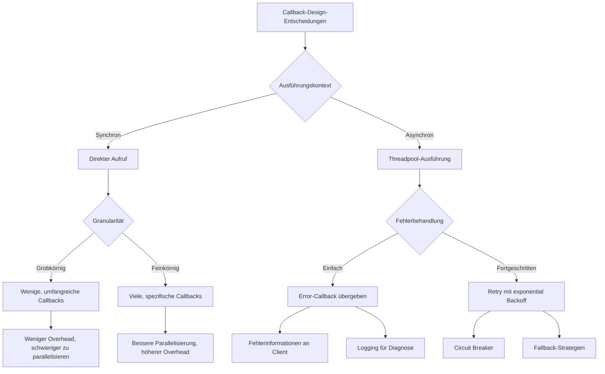
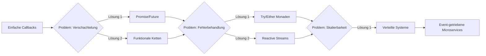

# Anwendungsbeispiele des Callback-Patterns in verteilten Systemen

Dieses Dokument stellt reale Anwendungsfälle des Callback-Patterns in verteilten Systemen vor und analysiert deren Implementierungsdetails.

## Übersicht der Anwendungsfälle



## Detaillierte Anwendungsfälle

### 1. Asynchrone API-Integrationen mit Webhooks



#### Webhook-Integration: Sequenzdiagramm für Zahlungsverarbeitung

```mermaid
sequenceDiagram
    participant Client
    participant PaymentAPI as Zahlungs-API
    participant Processing as Verarbeitungsdienst
    participant Webhook as Client-Webhook
    
    Client->>+PaymentAPI: POST /payments {amount: 100, callback_url: "https://client.com/webhook"}
    PaymentAPI-->>-Client: HTTP 202 {payment_id: "12345", status: "pending"}
    
    PaymentAPI->>+Processing: Zahlungsanfrage-Event
    Processing->>Processing: Verarbeite Zahlung
    Processing->>Processing: Autorisiere bei Zahlungsanbieter
    
    alt Erfolgreiche Verarbeitung
        Processing-->>-PaymentAPI: Erfolg: Zahlung autorisiert
        PaymentAPI->>+Webhook: POST /webhook {payment_id: "12345", status: "completed"}
        Webhook-->>-PaymentAPI: HTTP 200 OK
    else Fehlgeschlagene Verarbeitung
        Processing-->>-PaymentAPI: Fehler: Unzureichendes Guthaben
        PaymentAPI->>+Webhook: POST /webhook {payment_id: "12345", status: "failed", reason: "insufficient_funds"}
        Webhook-->>-PaymentAPI: HTTP 200 OK
    end
```

### 2. Message-Queue-basierte Callbacks für Verarbeitung großer Datenmengen



#### Aktivitätsdiagramm für Message-Queue Callbacks



### 3. Polling-basierte Callbacks für öffentliche Cloud-APIs

```mermaid
graph TD
    A[Client] -->|1. Starte Dataflow-Job| B[Cloud API]
    B -->|2. Erstelle Job| C[Verarbeitungsdienst]
    B -->|3. Liefere Job-ID| A
    
    A -->|4. Polling: GET /jobs/{job_id}| B
    B -->|5. Status: RUNNING| A
    
    C -->|6. Verarbeitet Daten| C
    C -->|7. Aktualisiert Status| B
    
    A -->|8. Polling: GET /jobs/{job_id}| B
    B -->|9. Status: COMPLETED, Ergebnisse| A
    
    subgraph "Client-System"
        A
    end
    
    subgraph "Cloud-Plattform"
        B
        C
    end
```

#### Komponentendiagramm für ein Polling-System



### 4. Retry-Callbacks für zuverlässige Systemintegration



#### Aktivitätsdiagramm eines Retry-Callbacks



## Design-Entscheidungen beim Callback-Einsatz



## Evolutionspfad für Callback-Pattern



## Praktische Umsetzungsbeispiele

### Beispiel 1: Implementierung eines Webhook-Callbacks in Java

```java
// Server-Seite
public class WebhookService {
    
    private final HttpClient httpClient = HttpClient.newBuilder()
            .version(HttpClient.Version.HTTP_2)
            .build();
    
    public void processOrderAsync(Order order, String callbackUrl) {
        CompletableFuture.runAsync(() -> {
            try {
                // Lang andauernde Verarbeitung simulieren
                Thread.sleep(3000);
                
                // Ergebnis vorbereiten
                OrderResult result = new OrderResult(order.getId(), "COMPLETED");
                String json = new ObjectMapper().writeValueAsString(result);
                
                // Webhook aufrufen
                HttpRequest request = HttpRequest.newBuilder()
                        .uri(URI.create(callbackUrl))
                        .header("Content-Type", "application/json")
                        .POST(HttpRequest.BodyPublishers.ofString(json))
                        .build();
                
                HttpResponse<String> response = httpClient.send(
                        request, HttpResponse.BodyHandlers.ofString());
                
                // Antwort loggen
                System.out.println("Webhook Antwort: " + response.statusCode() + 
                        " - " + response.body());
                
            } catch (Exception e) {
                // Fehlerbehandlung und Wiederholungslogik
                System.err.println("Webhook-Fehler: " + e.getMessage());
            }
        });
    }
}

// Client-Seite
@RestController
public class WebhookController {
    
    @PostMapping("/webhook")
    public ResponseEntity<String> handleWebhook(@RequestBody OrderResult orderResult) {
        // Ergebnis verarbeiten
        System.out.println("Webhook empfangen: Order " + orderResult.getOrderId() + 
                " ist jetzt " + orderResult.getStatus());
        
        // Erfolgreiche Verarbeitung bestätigen
        return ResponseEntity.ok("Webhook empfangen");
    }
}
```

### Beispiel 2: Retry-Callback mit Resilience4j

```java
public class RetryCallbackExample {
    
    private final RetryRegistry retryRegistry;
    
    public RetryCallbackExample() {
        // Retry-Konfiguration erstellen
        RetryConfig retryConfig = RetryConfig.custom()
                .maxAttempts(3)
                .waitDuration(Duration.ofSeconds(1))
                .retryExceptions(IOException.class, TimeoutException.class)
                .ignoreExceptions(IllegalArgumentException.class)
                .build();
        
        // Retry-Registry erstellen
        retryRegistry = RetryRegistry.of(retryConfig);
    }
    
    public void executeWithRetry(Runnable operation, Consumer<Throwable> errorCallback) {
        Retry retry = retryRegistry.retry("operation");
        
        Runnable retryableOperation = Retry.decorateRunnable(retry, operation);
        
        try {
            retryableOperation.run();
        } catch (Exception e) {
            errorCallback.accept(e);
        }
    }
}
```

### Beispiel 3: Polling-Callback mit CompletableFuture

```java
public class PollingCallbackExample {
    
    private final ScheduledExecutorService scheduler = Executors.newScheduledThreadPool(1);
    private final Map<String, JobStatus> jobStatuses = new ConcurrentHashMap<>();
    
    public CompletableFuture<String> startJobWithPolling(String jobId, long timeoutMs) {
        CompletableFuture<String> resultFuture = new CompletableFuture<>();
        
        // Starte den Job asynchron
        jobStatuses.put(jobId, JobStatus.RUNNING);
        
        // Simuliere Jobverarbeitung
        scheduler.schedule(() -> {
            jobStatuses.put(jobId, JobStatus.COMPLETED);
        }, 5, TimeUnit.SECONDS);
        
        // Polling starten
        AtomicInteger attempts = new AtomicInteger(0);
        AtomicLong delay = new AtomicLong(100);
        
        Runnable pollTask = new Runnable() {
            @Override
            public void run() {
                if (resultFuture.isDone()) {
                    return;
                }
                
                JobStatus status = jobStatuses.get(jobId);
                System.out.println("Polling Versuch " + attempts.incrementAndGet() + 
                        ": Status = " + status);
                
                if (status == JobStatus.COMPLETED) {
                    resultFuture.complete("Job " + jobId + " erfolgreich abgeschlossen");
                } else if (status == JobStatus.FAILED) {
                    resultFuture.completeExceptionally(
                            new RuntimeException("Job " + jobId + " fehlgeschlagen"));
                } else if (System.currentTimeMillis() > timeoutMs) {
                    resultFuture.completeExceptionally(
                            new TimeoutException("Timeout beim Warten auf Job " + jobId));
                } else {
                    // Exponential Backoff für das nächste Polling
                    long nextDelay = Math.min(delay.get() * 2, 1000);
                    delay.set(nextDelay);
                    
                    // Nächster Versuch
                    scheduler.schedule(this, nextDelay, TimeUnit.MILLISECONDS);
                }
            }
        };
        
        // Erstes Polling starten
        scheduler.schedule(pollTask, 100, TimeUnit.MILLISECONDS);
        
        return resultFuture;
    }
    
    private enum JobStatus {
        PENDING, RUNNING, COMPLETED, FAILED
    }
}
```
