# Implementierungsleitfaden für das Dependency Injection Pattern

Dieser Leitfaden beschreibt den Implementierungsprozess des Dependency Injection Patterns in verteilten Systemen anhand praktischer Beispiele aus diesem Projekt.

## Inhaltsverzeichnis

1. [Wann sollte das Dependency Injection Pattern verwendet werden?](#wann-sollte-das-dependency-injection-pattern-verwendet-werden)
2. [Schrittweise Implementierung](#schrittweise-implementierung)
3. [Implementierungsbeispiele](#implementierungsbeispiele)
4. [Best Practices](#best-practices)
5. [Häufige Fehler](#häufige-fehler)
6. [Performanceüberlegungen](#performanceüberlegungen)

## Wann sollte das Dependency Injection Pattern verwendet werden?

Das Dependency Injection Pattern ist in folgenden Situationen besonders nützlich:

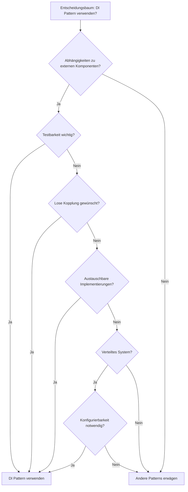

## Schrittweise Implementierung

### 1. Service-Schnittstelle definieren

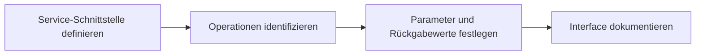

### 2. Service-Implementierungen erstellen

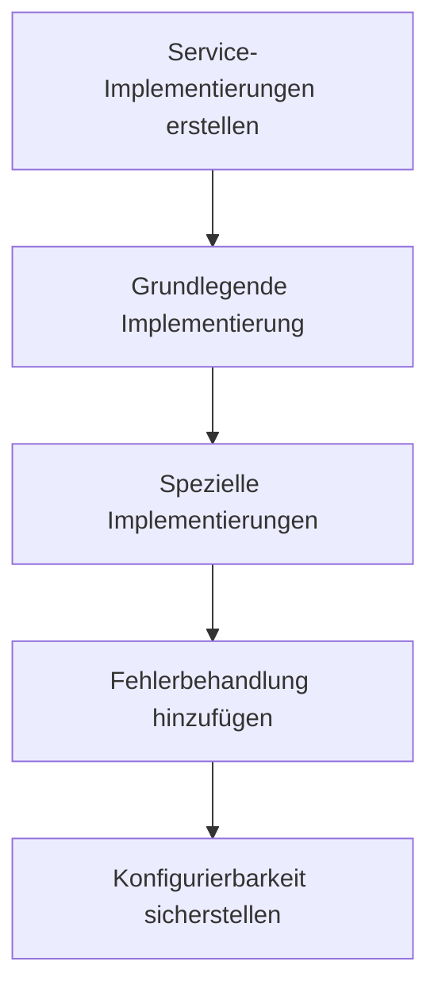

### 3. Abhängigkeiten konfigurieren

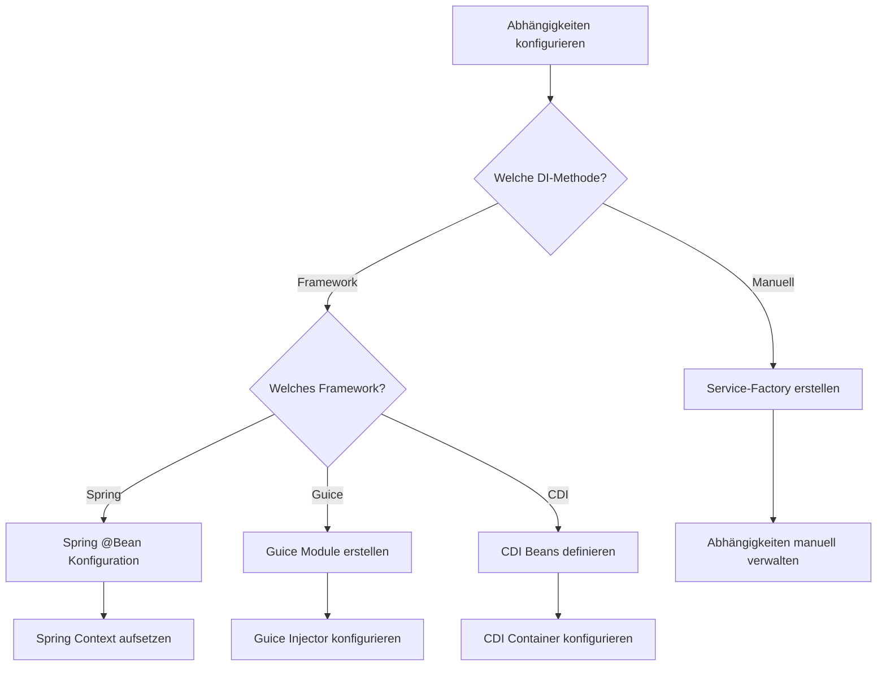

## Implementierungsbeispiele

### Beispiel 1: Manuelle Dependency Injection

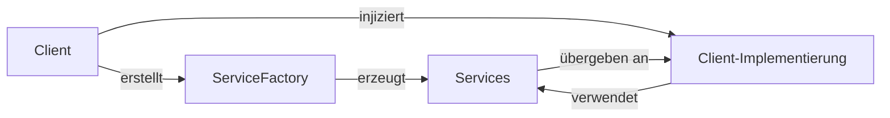

### Beispiel 2: Spring-basierte Dependency Injection

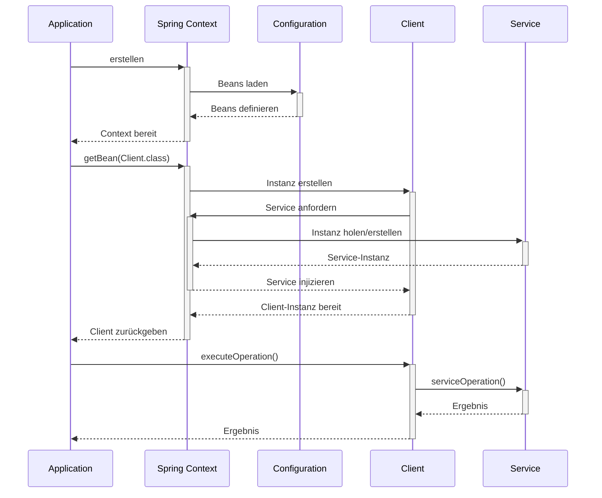

### Beispiel 3: Guice-basierte Dependency Injection

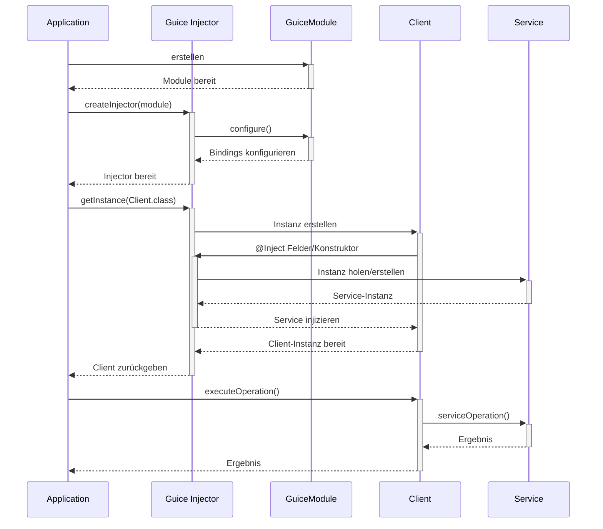

## Best Practices

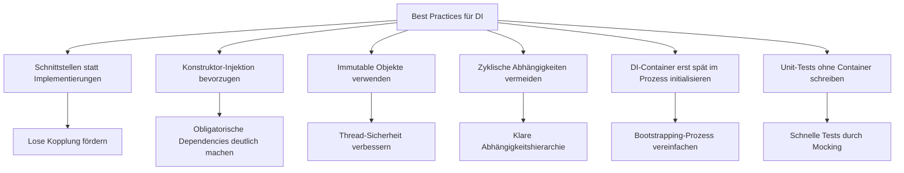

## Häufige Fehler

Die folgenden Fehler sollten bei der Implementierung des Dependency Injection Patterns vermieden werden:

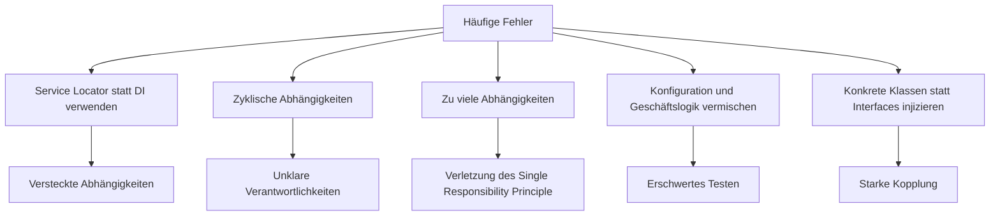

## Performanceüberlegungen

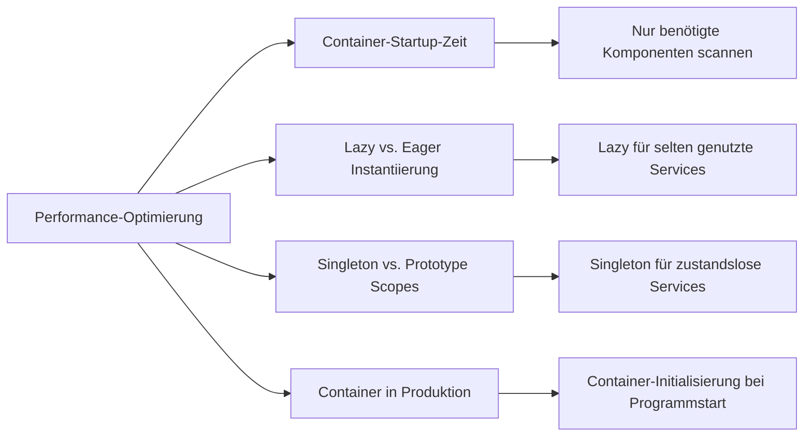

## Varianten des Dependency Injection Patterns

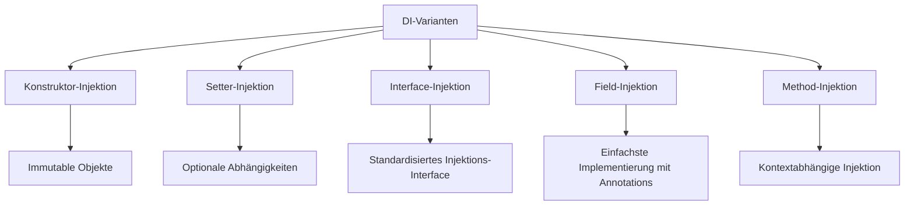

## Herausforderungen in verteilten Systemen

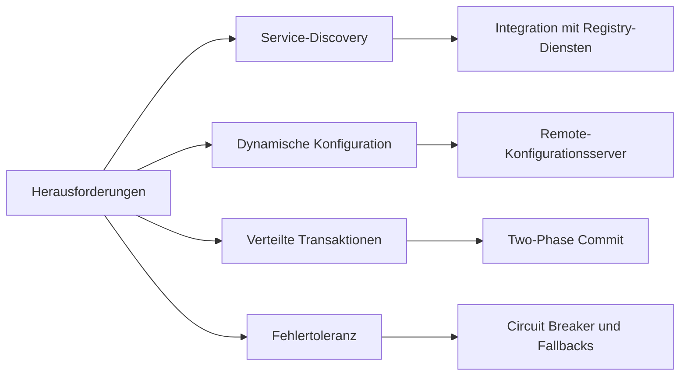

## Moderne Alternativen und Ergänzungen zu Dependency Injection

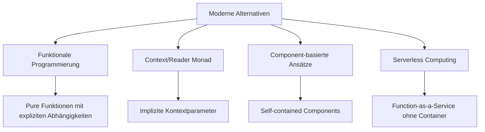