# Vergleich des Dependency Injection Patterns mit anderen Entwurfsmustern

Dieses Dokument vergleicht das Dependency Injection Pattern mit anderen verwandten Entwurfsmustern und hilft bei der Entscheidung, welches Muster in verschiedenen Situationen am besten geeignet ist.

## Dependency Injection vs. andere Entwurfsmuster

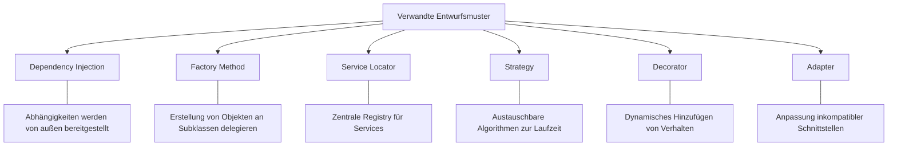

## Entscheidungshilfe: Welches Muster wann?

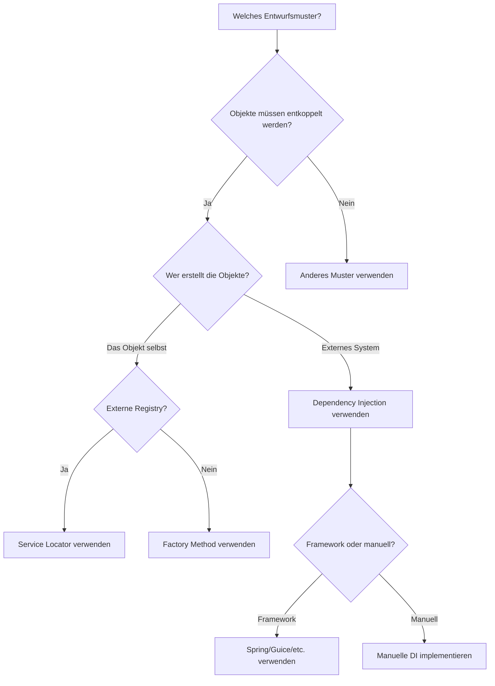

## Detaillierter Vergleich: Dependency Injection vs. andere Muster

### Dependency Injection vs. Service Locator

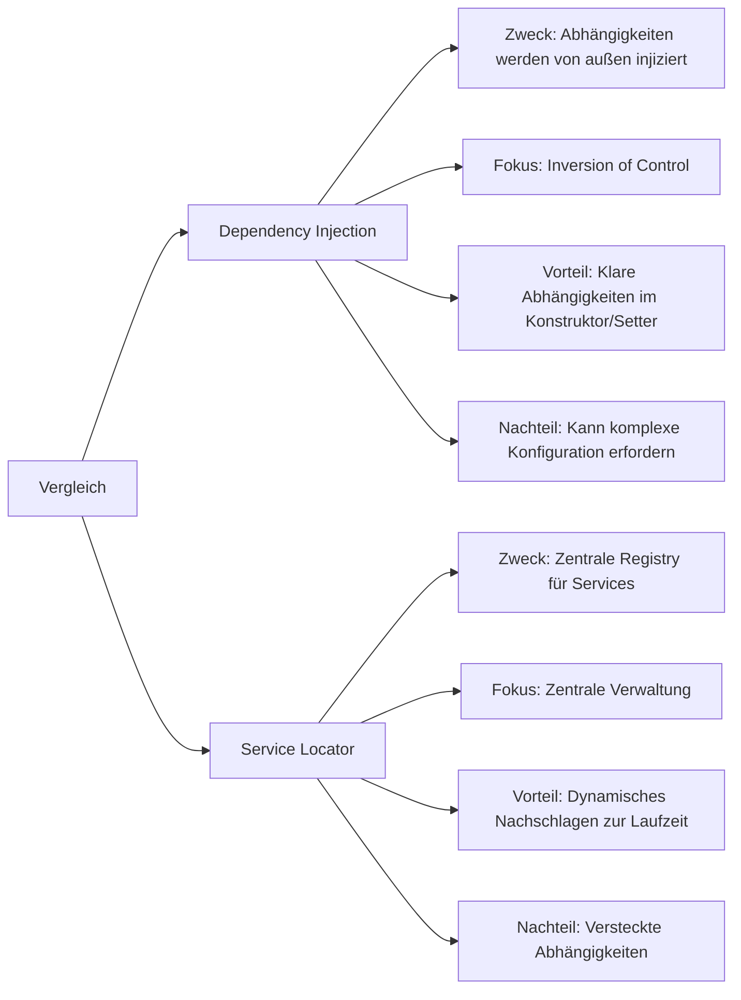

### Dependency Injection vs. Factory Method

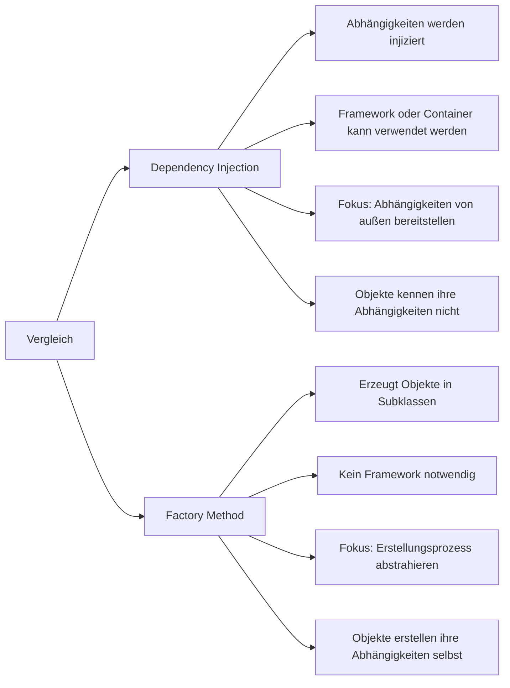

### Dependency Injection vs. Strategy

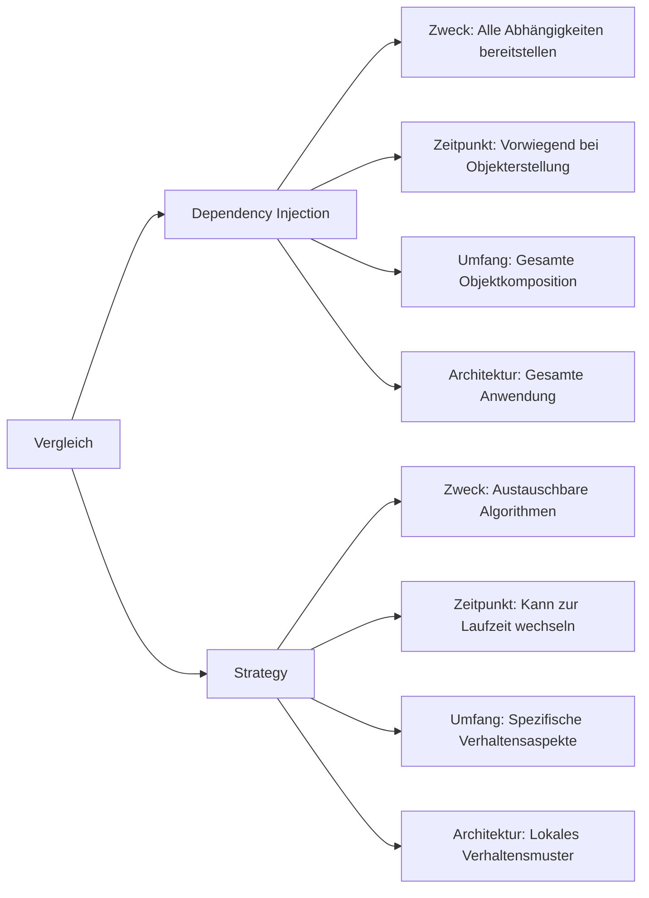

## Anwendungsfälle verschiedener Muster in Verteilten Systemen

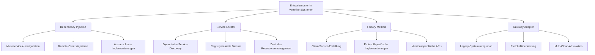

## Kombination von Mustern

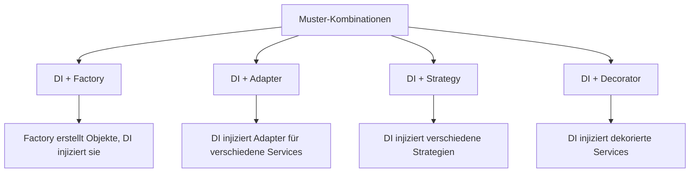

## Evolutionspfad für Dependency Injection

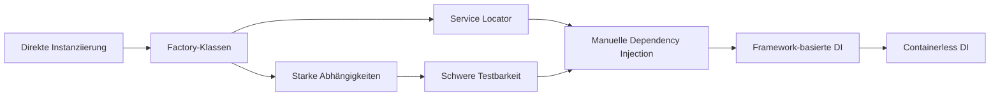

## Dependency Injection in Spring

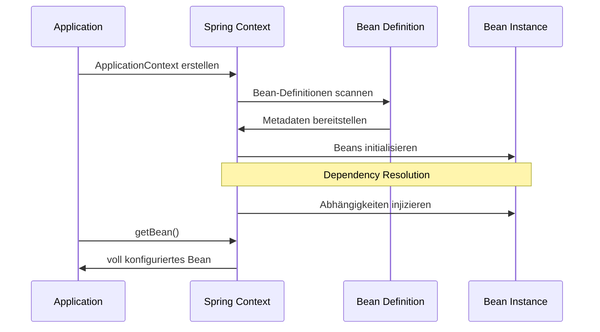

## Dependency Injection in Guice

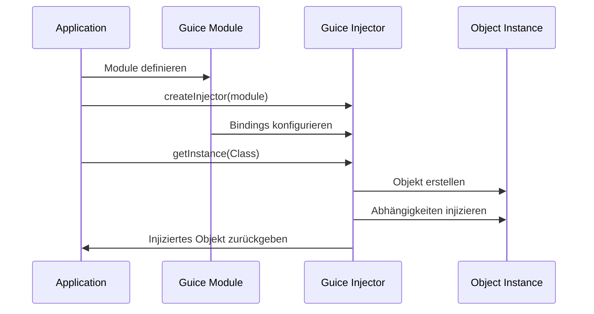

## Vergleichsmatrix: Vor- und Nachteile

| Muster | Stärken | Schwächen | Ideale Anwendungsfälle |
|--------|---------|-----------|------------------------|
| Dependency Injection | Lose Kopplung, gute Testbarkeit, Konfigurierbarkeit | Kann komplex werden, Lernkurve für Frameworks | Große Anwendungen, Testgetriebene Entwicklung, Microservices |
| Service Locator | Einfachere Implementierung, zentrale Verwaltung | Versteckte Abhängigkeiten, schwerere Testbarkeit | Kleinere Anwendungen, Legacy-Code-Integration |
| Factory Method | Keine Framework-Abhängigkeit, genaue Kontrolle | Objekte kennen ihre Abhängigkeiten, stärkere Kopplung | Wenn spezifische Erstellungslogik benötigt wird |
| Strategy | Leichtgewichtig, Verhaltensänderung zur Laufzeit | Begrenzt auf spezifisches Verhalten | Wenn nur ein bestimmter Algorithmus austauschbar sein soll |
| Adapter | Integration heterogener Systeme | Zusätzliche Abstraktionsschicht | Integration vorhandener Systeme, API-Vereinheitlichung |

## Spring vs. Guice vs. Dagger vs. Manuelle DI

```mermaid
graph TD
    A[DI-Framework-Vergleich] --> B[Spring]
    A --> C[Guice]
    A --> D[Dagger]
    A --> E[Manuelle DI]
    
    B --> B1[Umfangreiches Framework]
    B --> B2[XML/Annotation/Java-Konfiguration]
    B --> B3[Viele integrierte Features]
    B --> B4[Hoher Overhead für kleine Anwendungen]
    
    C --> C1[Leichtgewichtiges Framework]
    C --> C2[Java-basierte Konfiguration]
    C --> C3[Fokus auf DI-Kernfunktionalität]
    C --> C4[Geringer Overhead]
    
    D --> D1[Code-Generierung zur Compile-Zeit]
    D --> D2[Keine Reflection]
    D --> D3[Hohe Performance]
    D --> D4[Ideal für Android/Resource-constrained]
    
    E --> E1[Keine Framework-Abhängigkeit]
    E --> E2[Vollständige Kontrolle]
    E --> E3[Keine Magie]
    E --> E4[Mehr Boilerplate-Code]
```

## Migration von direkter Instanziierung zu DI

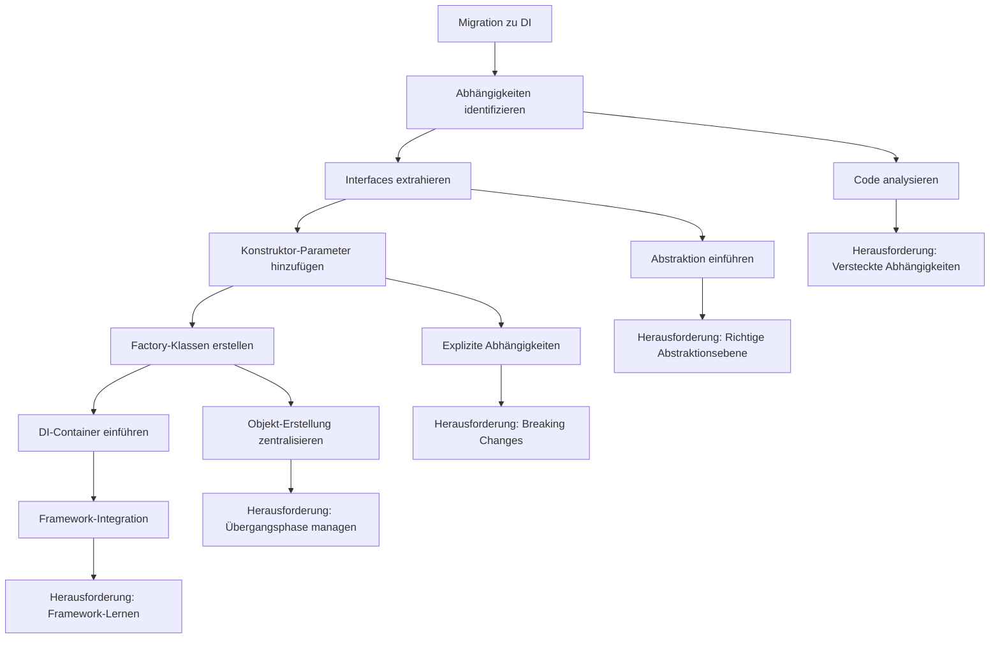