# Dependency Injection Pattern Dokumentation

Diese Dokumentation enthält verschiedene Diagramme zur Veranschaulichung des Dependency Injection Patterns und der konkreten Implementierung in diesem Projekt.

## Inhalt

- [Komponentendiagramm](#komponentendiagramm)
- [Klassendiagramme](#klassendiagramme)
- [Sequenzdiagramme](#sequenzdiagramme)
- [Aktivitätsdiagramme](#aktivitätsdiagramme)

## Komponentendiagramm

Das folgende Diagramm zeigt die Hauptkomponenten des Projekts und ihre Beziehungen zueinander:

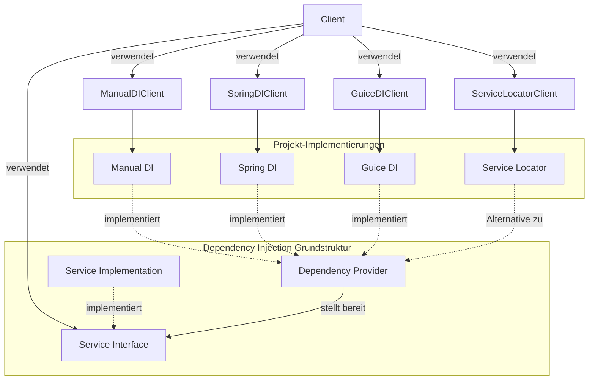

## Klassendiagramme

### Allgemeines Dependency Injection Klassendiagramm

Das folgende Diagramm zeigt die allgemeine Struktur des Dependency Injection Patterns:

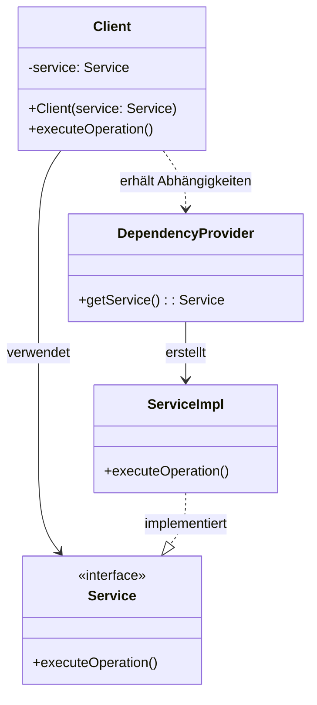

### Manual Dependency Injection Klassendiagramm

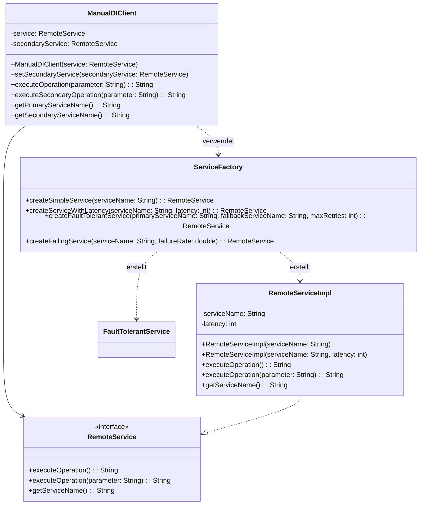

### Spring Dependency Injection Klassendiagramm

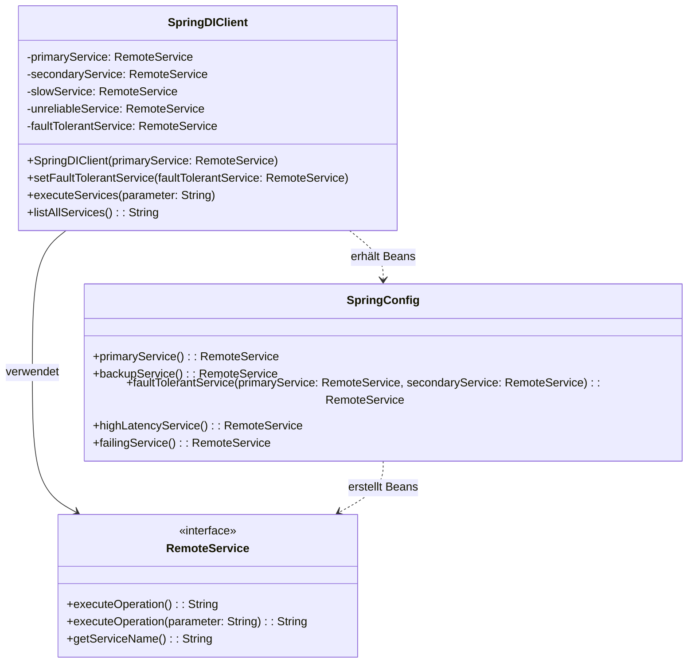

### Guice Dependency Injection Klassendiagramm

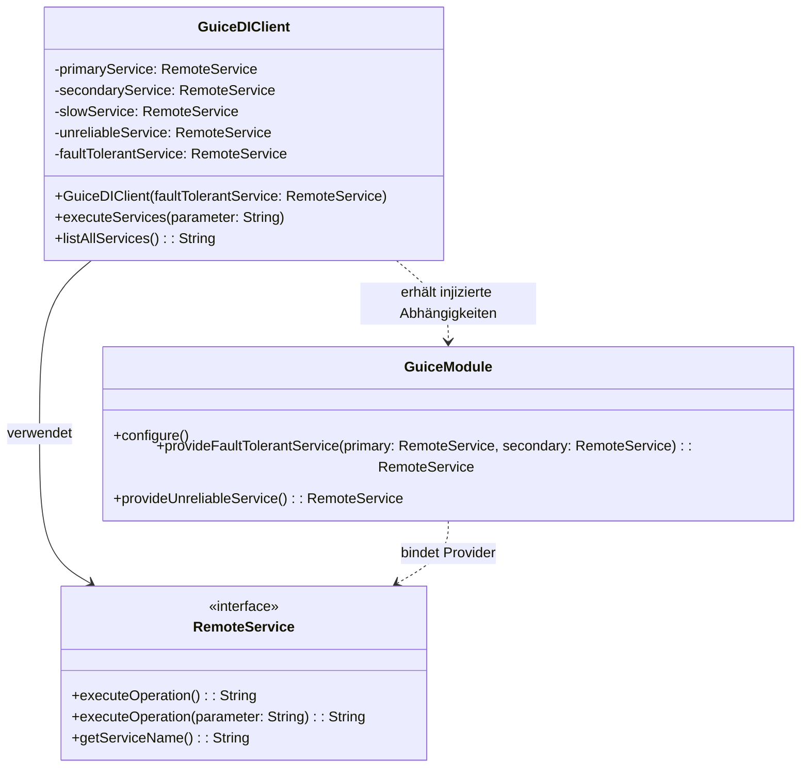

### Service Locator Klassendiagramm

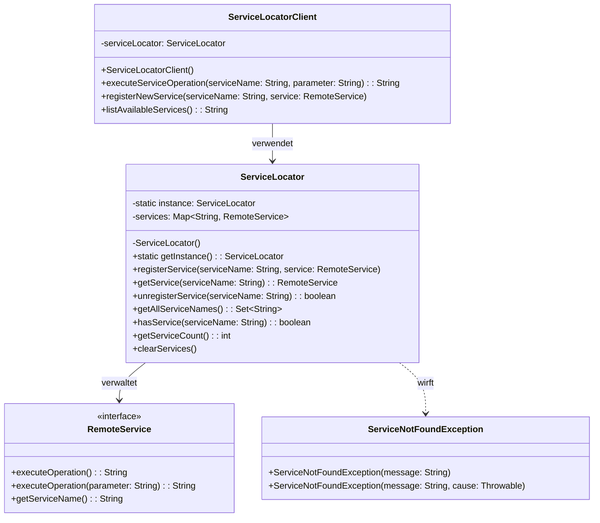

## Sequenzdiagramme

### Manual Dependency Injection Sequenzdiagramm

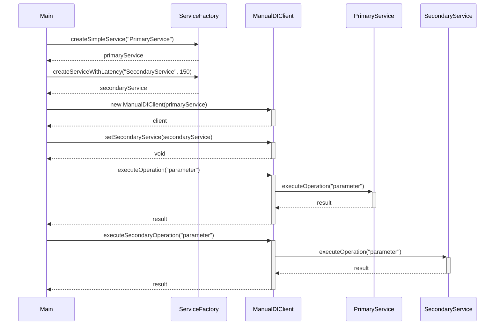

### Spring Dependency Injection Sequenzdiagramm

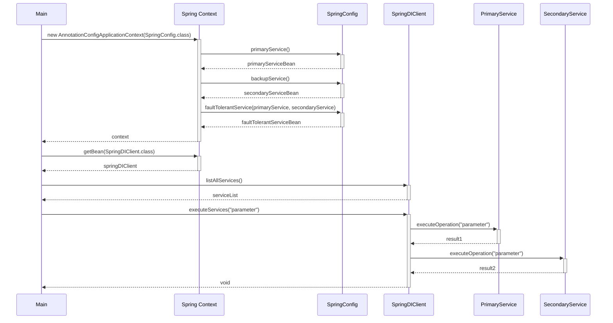

### Guice Dependency Injection Sequenzdiagramm

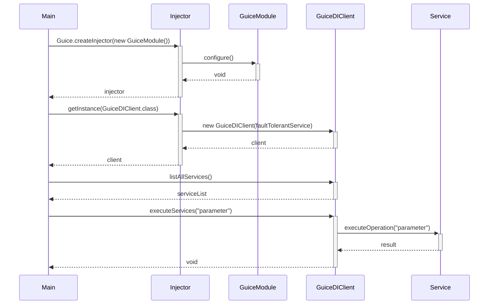

### Service Locator Sequenzdiagramm

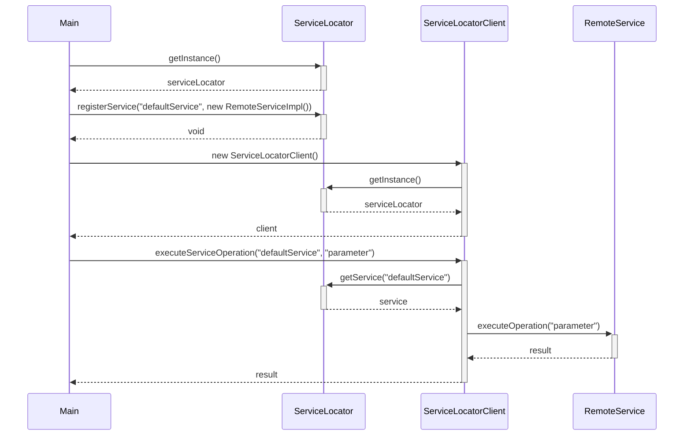

## Aktivitätsdiagramme

### Grundlegendes Dependency Injection Aktivitätsdiagramm

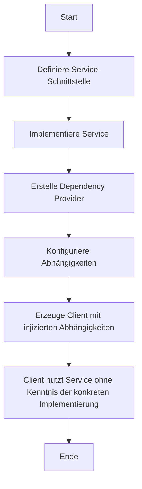

### Spring Dependency Injection Aktivitätsdiagramm

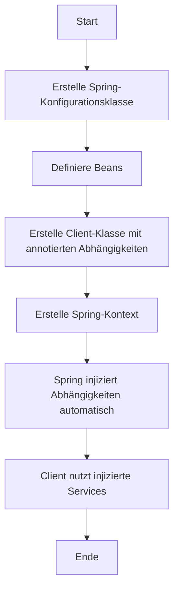

### Guice Dependency Injection Aktivitätsdiagramm

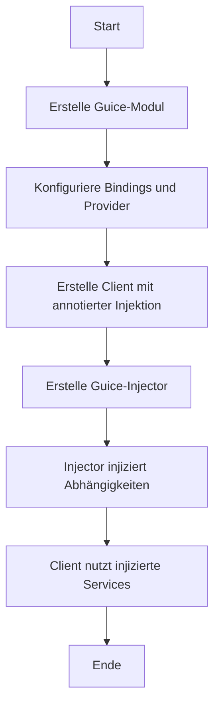

### Service Locator Aktivitätsdiagramm

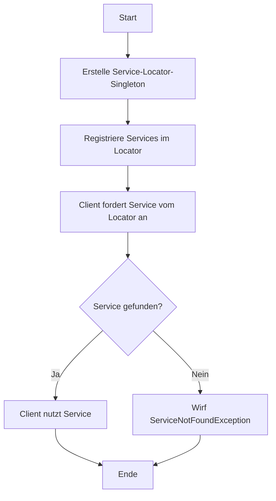