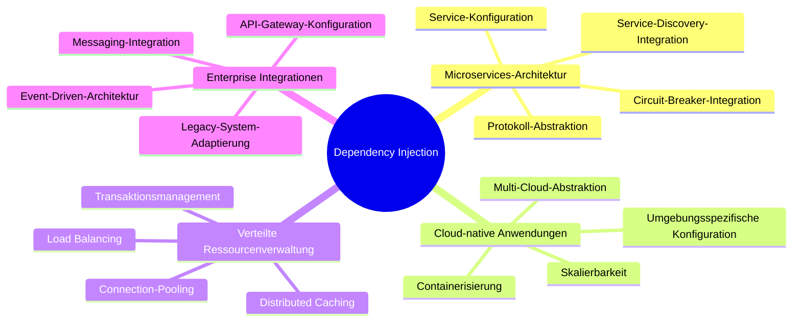
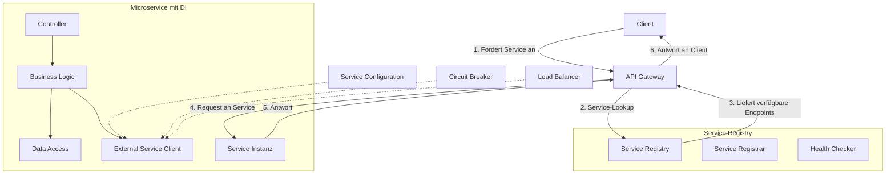
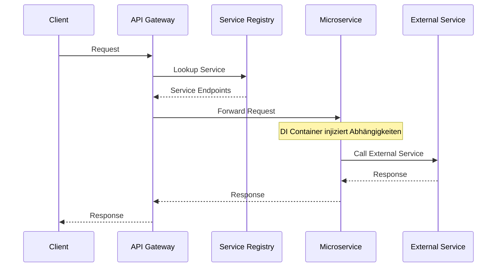
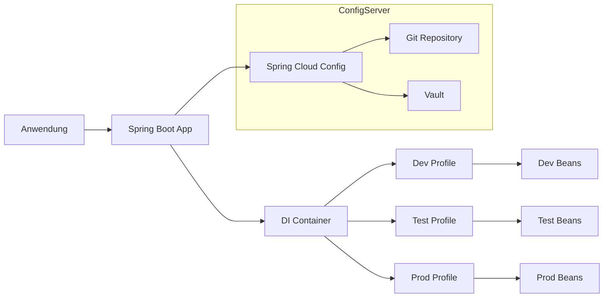
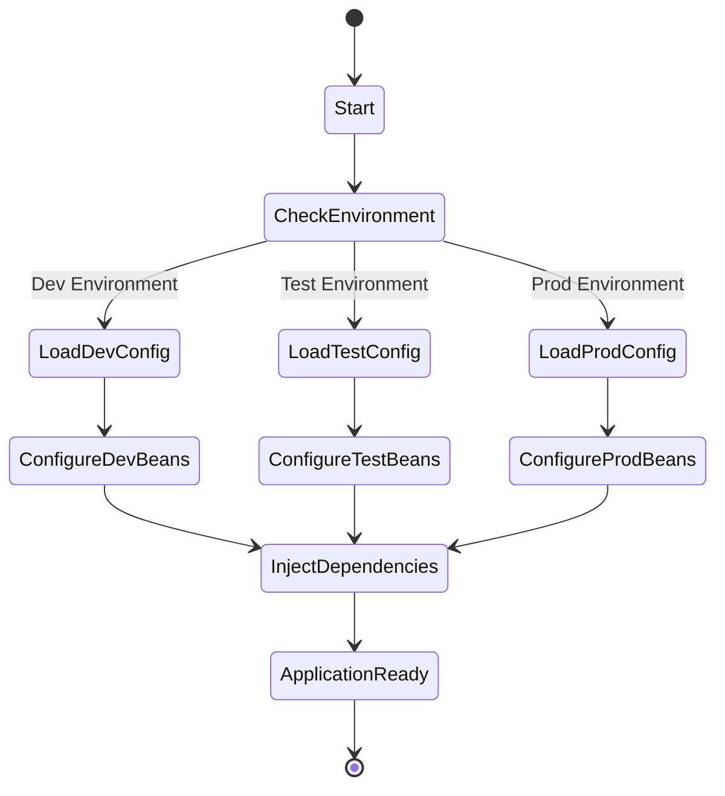
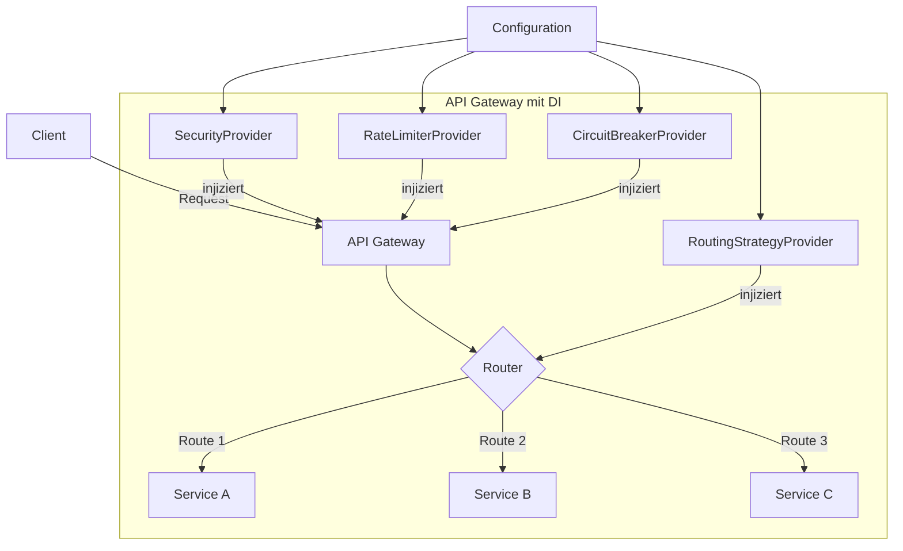
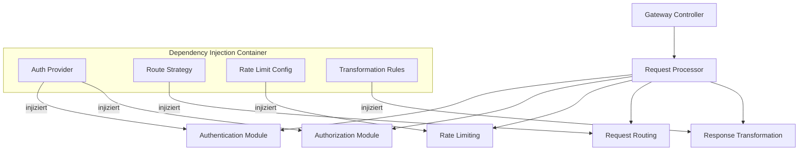
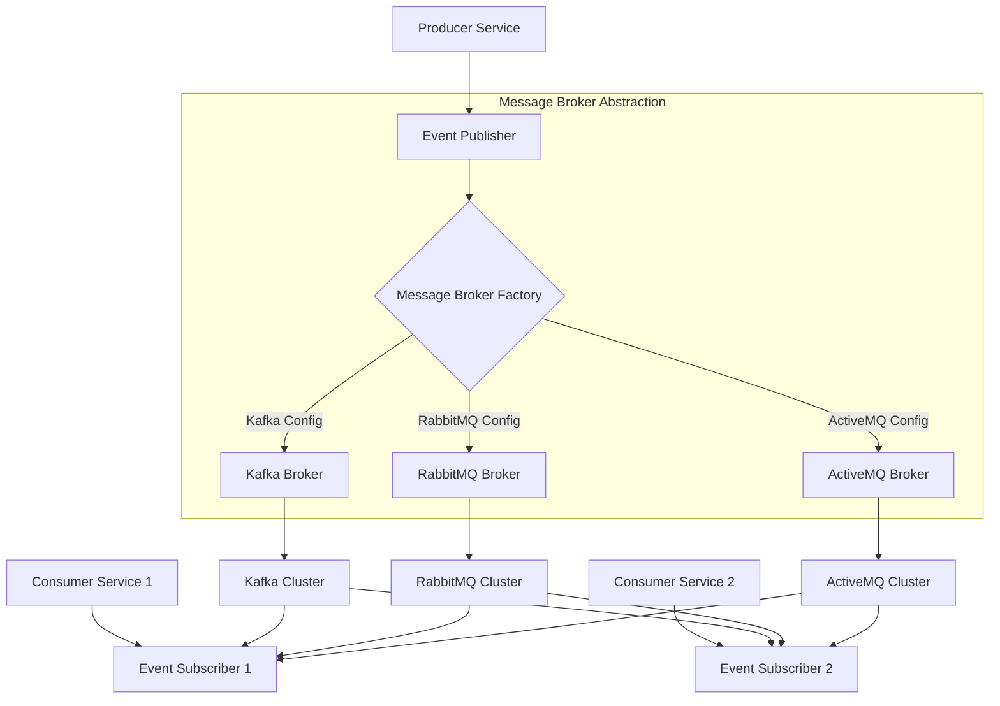
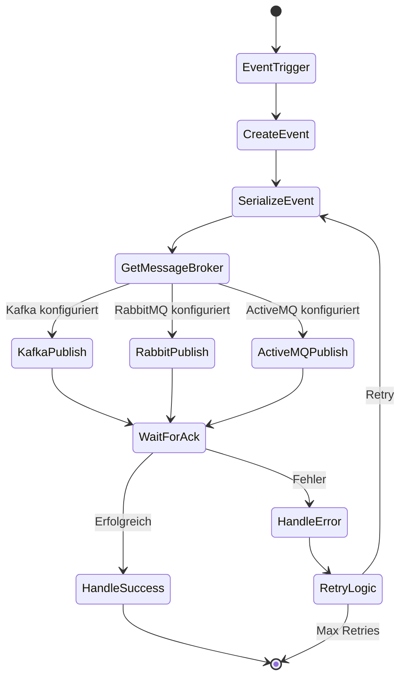
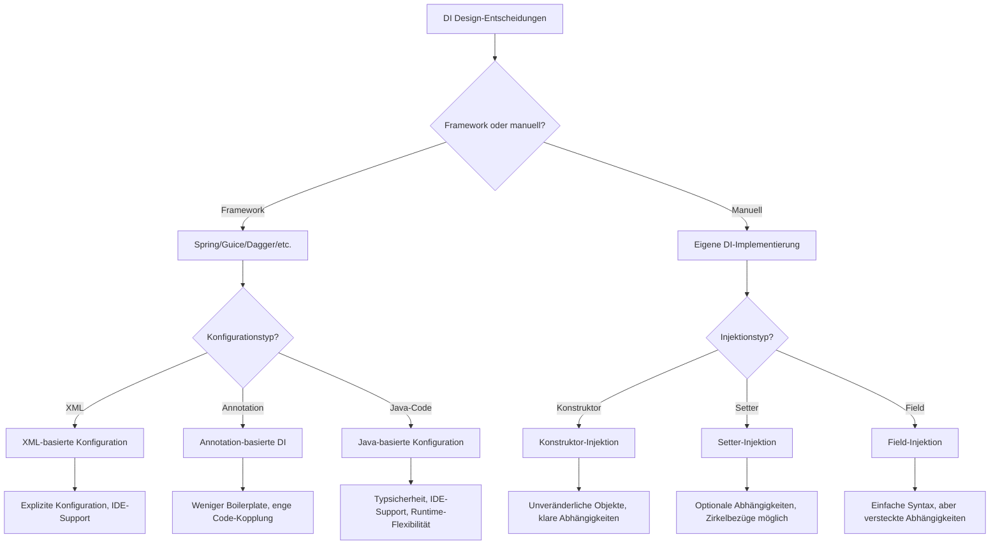

# Anwendungsbeispiele des Dependency Injection Patterns in verteilten Systemen

Dieses Dokument stellt reale Anwendungsfälle des Dependency Injection Patterns in verteilten Systemen vor und analysiert deren Implementierungsdetails.

## Übersicht der Anwendungsfälle



## Detaillierte Anwendungsfälle

### 1. Microservices mit Dynamischer Service-Discovery



#### Sequenzdiagramm für Microservice mit Dependency Injection



### 2. Cloud-native Anwendungen mit Umgebungsspezifischer Konfiguration



#### Aktivitätsdiagramm für Umgebungsspezifische DI-Konfiguration



### 3. API-Gateway mit Pluggable Routing-Strategien



#### Komponentendiagramm für ein API-Gateway-System



### 4. Event-Driven-Architektur mit austauschbaren Message Brokern



#### Aktivitätsdiagramm eines Event-Prozesses mit DI



## Design-Entscheidungen bei Dependency Injection



## Implementierungsbeispiele

### Beispiel 1: Spring Cloud für Microservices

```java
@Configuration
@EnableDiscoveryClient
public class MicroserviceConfig {
    
    @Bean
    @ConditionalOnProperty(name = "service.mode", havingValue = "local")
    public RemoteServiceClient localServiceClient() {
        return new LocalServiceClient();
    }
    
    @Bean
    @ConditionalOnProperty(name = "service.mode", havingValue = "remote", matchIfMissing = true)
    public RemoteServiceClient remoteServiceClient(
            @Value("${service.timeout:1000}") int timeout,
            @Value("${service.retry.maxAttempts:3}") int maxRetries) {
        
        return new RemoteServiceClientImpl(timeout, maxRetries);
    }
    
    @Bean
    public CircuitBreaker circuitBreaker() {
        return CircuitBreaker.builder()
                .failureThreshold(3)
                .resetTimeout(Duration.ofSeconds(30))
                .build();
    }
    
    @Bean
    public LoadBalancerClient loadBalancerClient(DiscoveryClient discoveryClient) {
        return new RoundRobinLoadBalancer(discoveryClient);
    }
}
```

### Beispiel 2: Guice für austauschbare Implementierungen

```java
public class MessagingModule extends AbstractModule {
    
    private final Config config;
    
    public MessagingModule(Config config) {
        this.config = config;
    }
    
    @Override
    protected void configure() {
        // Bind allgemeine Schnittstellen an konkrete Implementierungen
        bind(MessagePublisher.class).to(getPublisherImplementation());
        bind(MessageConsumer.class).to(getConsumerImplementation());
        
        // Named Bindings für spezifische Verwendungszwecke
        bind(MessagePublisher.class)
            .annotatedWith(Names.named("audit"))
            .to(AuditMessagePublisher.class);
        
        // Provider-Methode für komplexe Erstellung
        bind(MessageSerializer.class)
            .toProvider(SerializerProvider.class)
            .in(Singleton.class);
    }
    
    private Class<? extends MessagePublisher> getPublisherImplementation() {
        String type = config.getString("messaging.type", "kafka");
        switch (type) {
            case "kafka":
                return KafkaMessagePublisher.class;
            case "rabbitmq":
                return RabbitMQMessagePublisher.class;
            case "activemq":
                return ActiveMQMessagePublisher.class;
            default:
                throw new IllegalArgumentException("Unsupported messaging type: " + type);
        }
    }
    
    private Class<? extends MessageConsumer> getConsumerImplementation() {
        String type = config.getString("messaging.type", "kafka");
        switch (type) {
            case "kafka":
                return KafkaMessageConsumer.class;
            case "rabbitmq":
                return RabbitMQMessageConsumer.class;
            case "activemq":
                return ActiveMQMessageConsumer.class;
            default:
                throw new IllegalArgumentException("Unsupported messaging type: " + type);
        }
    }
    
    @Provides
    @Singleton
    public ConnectionFactory provideConnectionFactory() {
        String type = config.getString("messaging.type", "kafka");
        String host = config.getString("messaging.host", "localhost");
        int port = config.getInt("messaging.port", getDefaultPort(type));
        
        return ConnectionFactoryBuilder.newBuilder()
                .type(type)
                .host(host)
                .port(port)
                .credentials(
                    config.getString("messaging.username", ""),
                    config.getString("messaging.password", ""))
                .build();
    }
    
    private int getDefaultPort(String type) {
        switch (type) {
            case "kafka": return 9092;
            case "rabbitmq": return 5672;
            case "activemq": return 61616;
            default: return 0;
        }
    }
}
```

### Beispiel 3: Spring Boot mit Profilen für Multi-Cloud-Deployment

```java
@Configuration
public class CloudConfig {
    
    @Bean
    @Profile("aws")
    public StorageClient awsStorageClient(
            @Value("${aws.access-key}") String accessKey,
            @Value("${aws.secret-key}") String secretKey,
            @Value("${aws.region}") String region) {
        
        return new S3StorageClient(accessKey, secretKey, region);
    }
    
    @Bean
    @Profile("azure")
    public StorageClient azureStorageClient(
            @Value("${azure.account-name}") String accountName,
            @Value("${azure.account-key}") String accountKey) {
        
        return new AzureBlobStorageClient(accountName, accountKey);
    }
    
    @Bean
    @Profile("gcp")
    public StorageClient gcpStorageClient(
            @Value("${gcp.project-id}") String projectId,
            @Value("${gcp.credentials-file}") String credentialsFile) {
        
        return new GcpStorageClient(projectId, credentialsFile);
    }
    
    @Bean
    @Profile("local")
    public StorageClient localStorageClient(
            @Value("${local.storage-path}") String storagePath) {
        
        return new FileSystemStorageClient(storagePath);
    }
    
    @Bean
    public StorageService storageService(StorageClient storageClient,
                                        @Value("${storage.bucket-name}") String bucketName) {
        return new StorageServiceImpl(storageClient, bucketName);
    }
}
```