# Implementierungsleitfaden für das Facade-Pattern

Dieser Leitfaden beschreibt den Implementierungsprozess des Facade-Patterns in verteilten Systemen anhand praktischer Beispiele aus diesem Projekt.

## Inhaltsverzeichnis

1. [Wann sollte das Facade-Pattern verwendet werden?](#wann-sollte-das-facade-pattern-verwendet-werden)
2. [Schrittweise Implementierung](#schrittweise-implementierung)
3. [Implementierungsbeispiele](#implementierungsbeispiele)
4. [Best Practices](#best-practices)
5. [Häufige Fehler](#häufige-fehler)
6. [Performanceüberlegungen](#performanceüberlegungen)

## Wann sollte das Facade-Pattern verwendet werden?

Das Facade-Pattern ist in folgenden Situationen besonders nützlich:

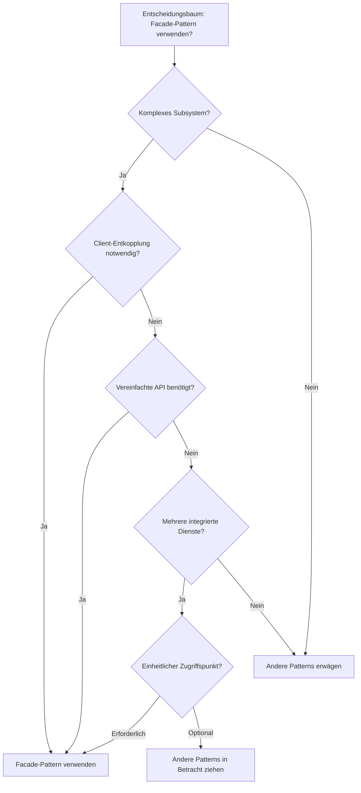

## Schrittweise Implementierung

### 1. Subsystem-Komponenten identifizieren

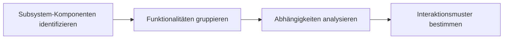

### 2. Facade-Schnittstelle definieren

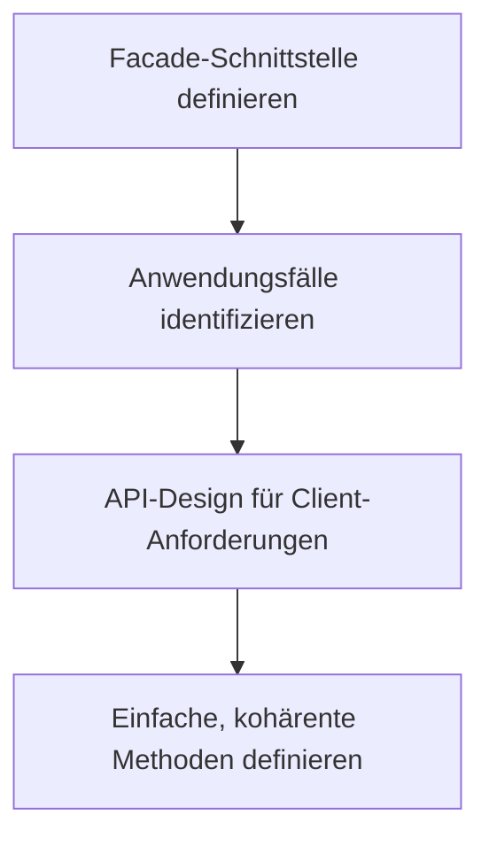

## Implementierungsbeispiele

### Beispiel 1: Einfache Facade (Objektkomposition)

Dieses Diagramm zeigt den Datenfluss bei der Verwendung einer einfachen Facade:

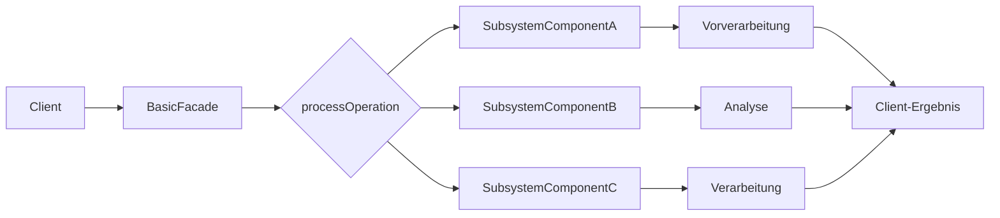

### Beispiel 2: Remote Service Facade

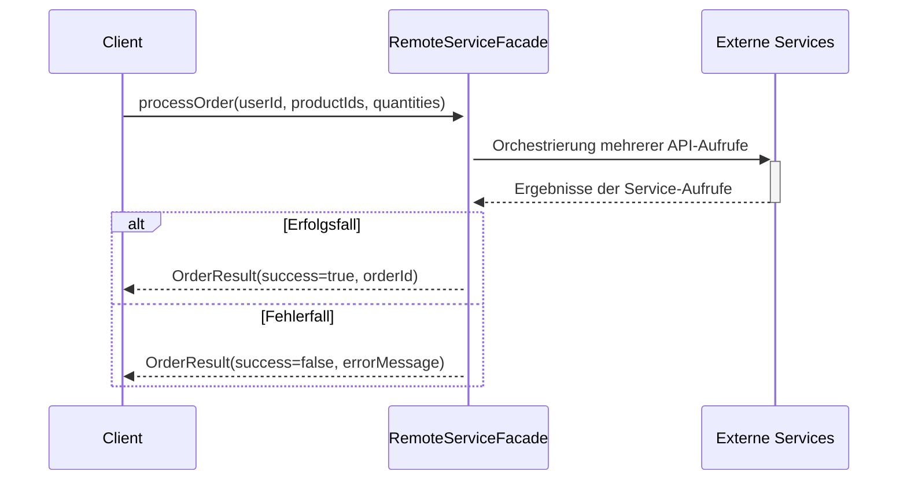

## Best Practices

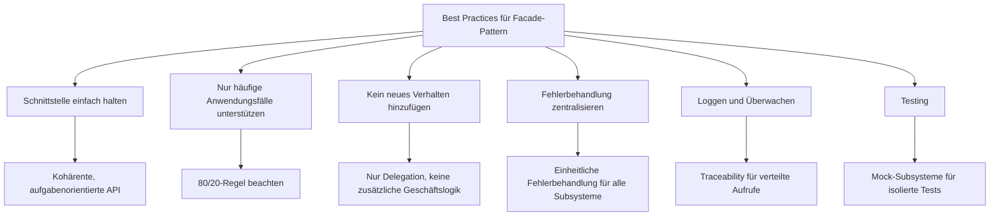

## Häufige Fehler

Die folgenden Fehler sollten bei der Implementierung des Facade-Patterns vermieden werden:

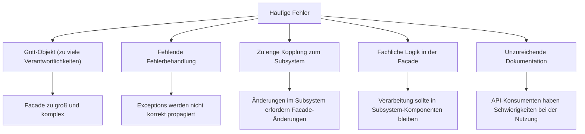

## Performanceüberlegungen

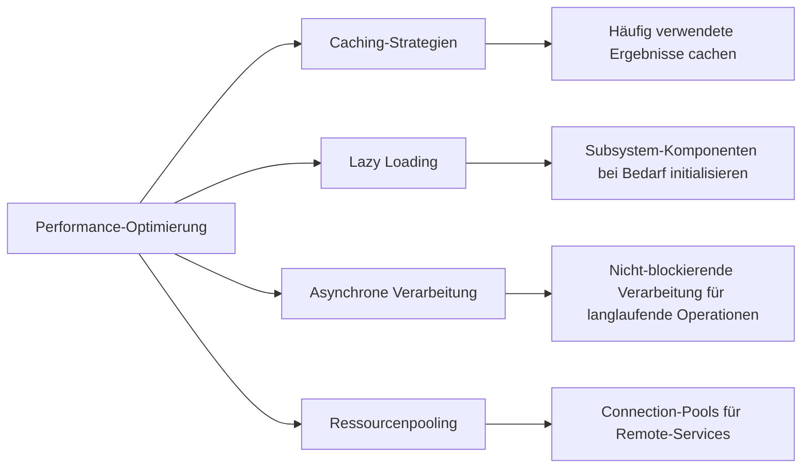

## Varianten des Facade-Patterns

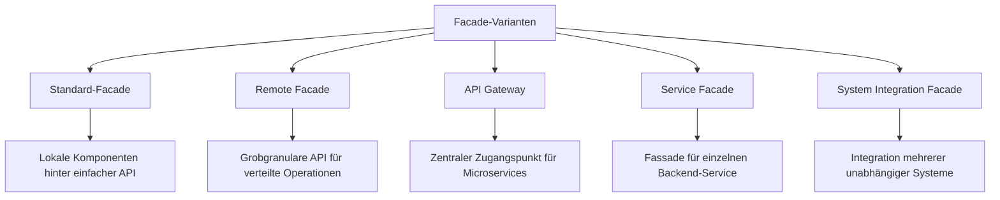

## Herausforderungen in verteilten Systemen

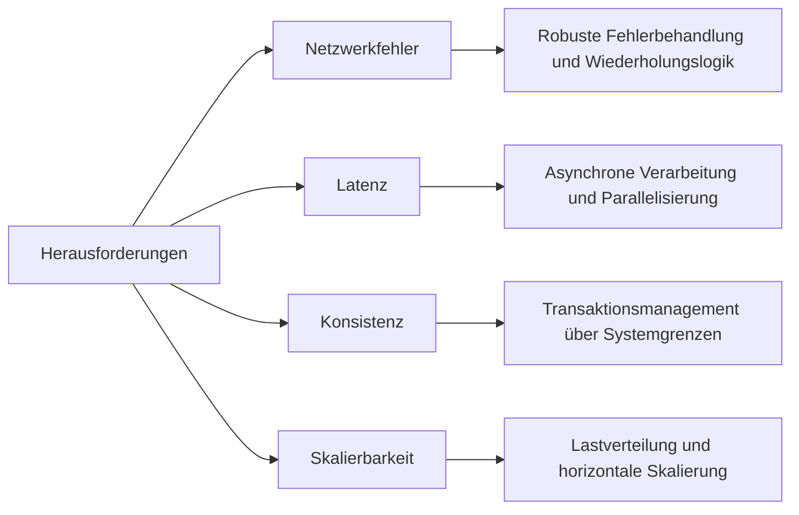

## Integration mit anderen Patterns

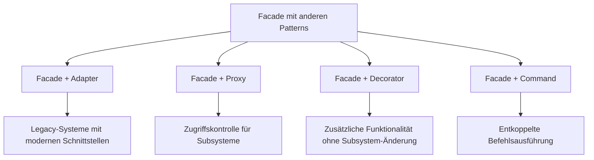

## Evolutionspfad für Facade-Pattern

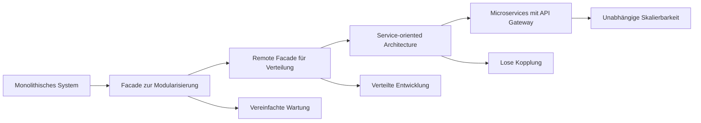