# Vergleich des Facade-Patterns mit anderen strukturellen Mustern

Dieses Dokument vergleicht das Facade-Pattern mit anderen strukturellen Entwurfsmustern und hilft bei der Entscheidung, welches Muster in verschiedenen Situationen am besten geeignet ist.

## Facade vs. andere strukturelle Muster

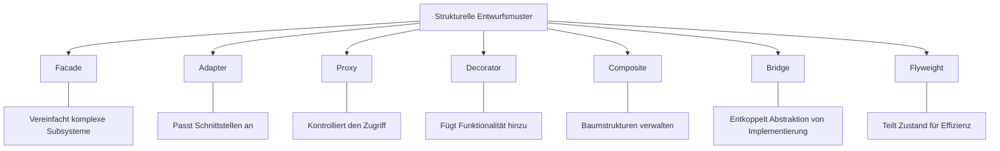

## Entscheidungshilfe: Welches Muster wann?

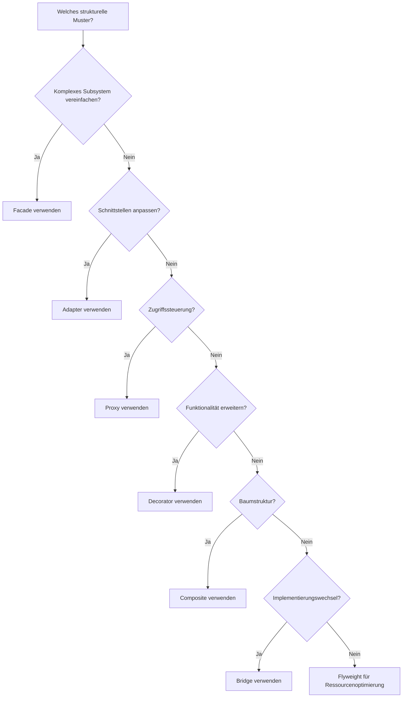

## Detaillierter Vergleich: Facade vs. andere Muster

### Facade vs. Adapter

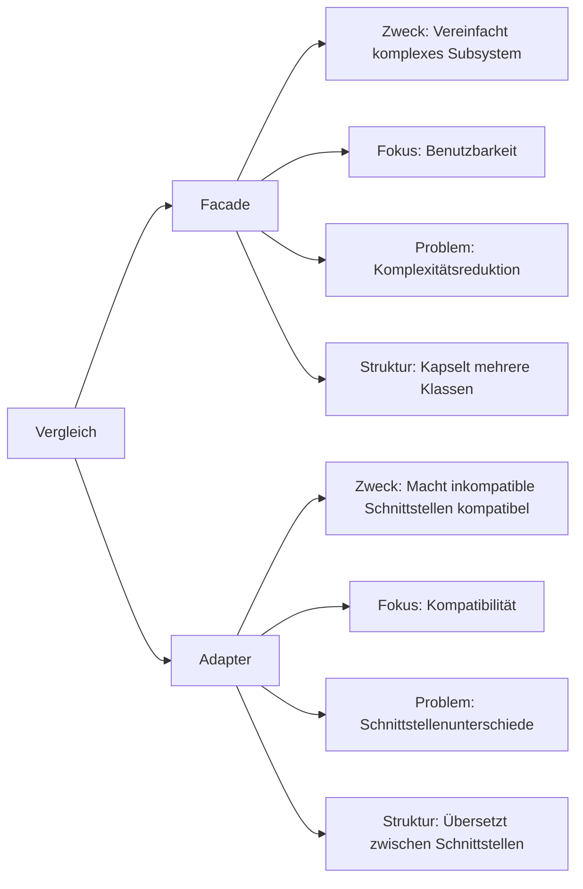

### Facade vs. Proxy

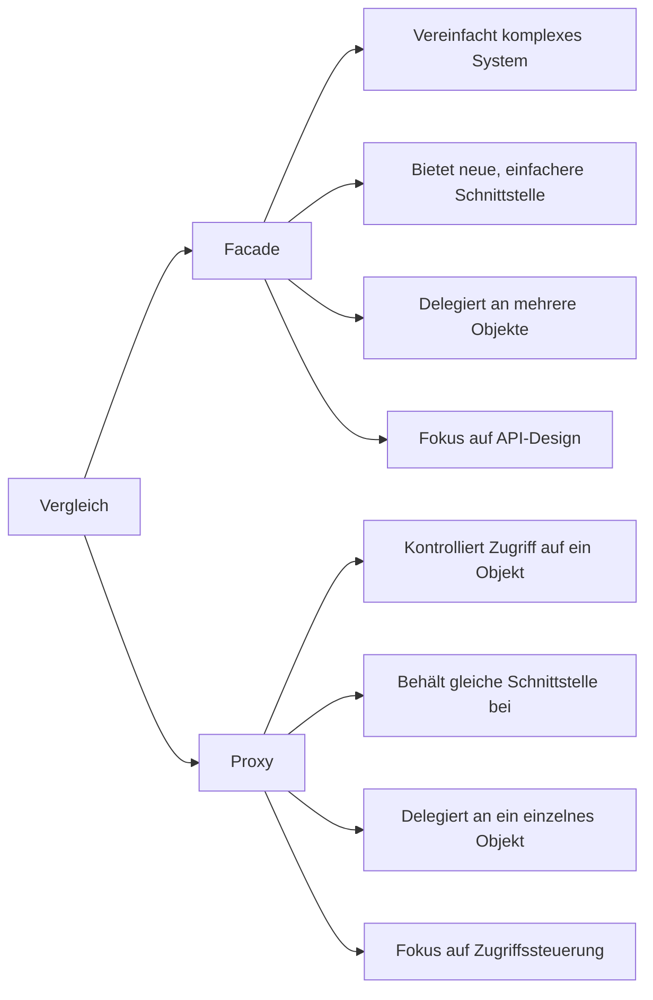

### Facade vs. Decorator

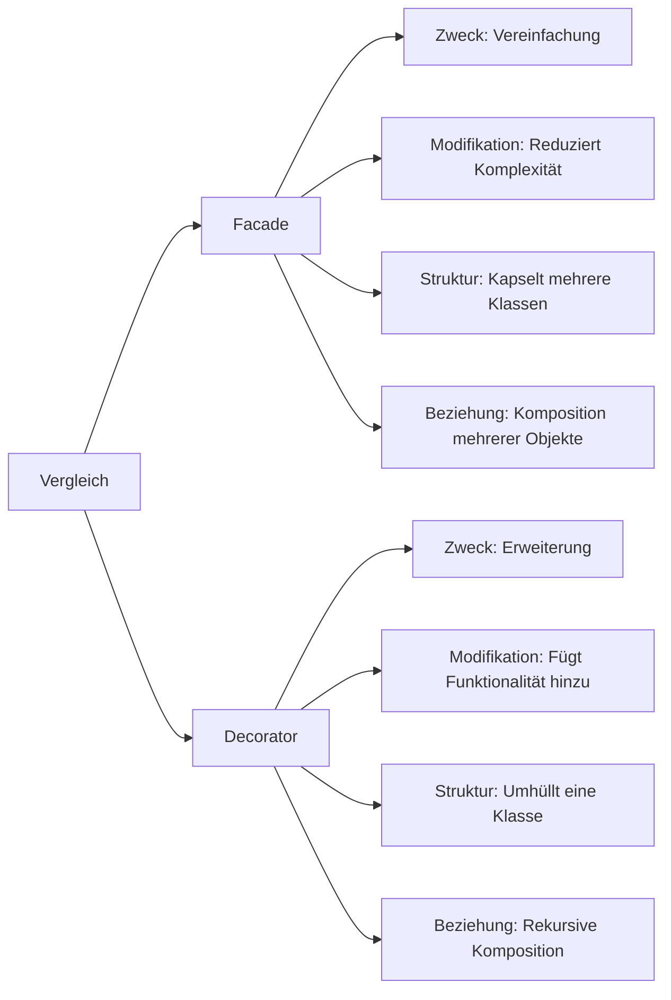

### Facade vs. Composite

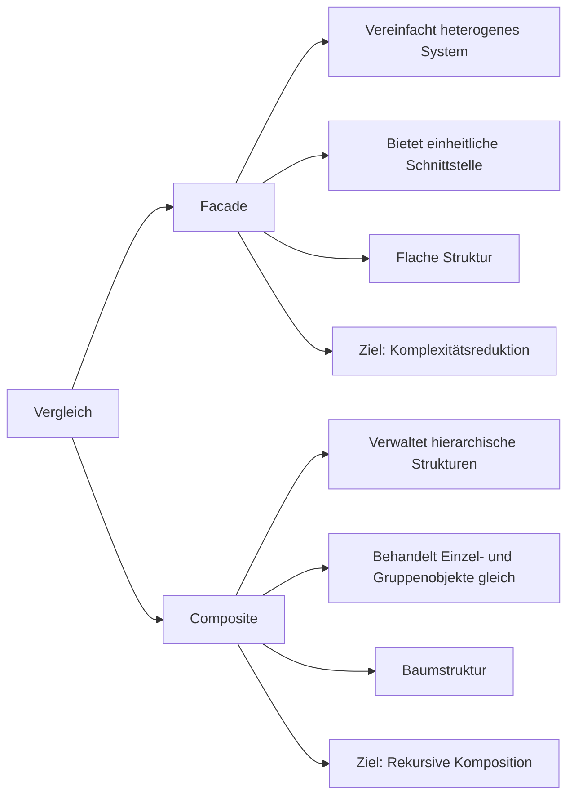

## Anwendungsfälle verschiedener Muster in Verteilten Systemen

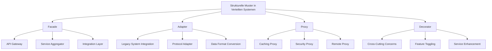

## Kombination von Mustern

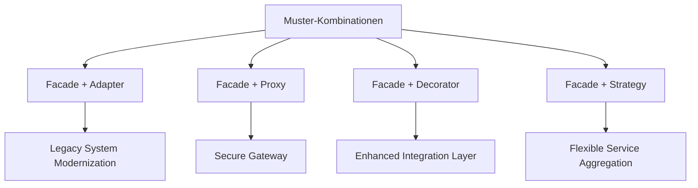

## Evolutionspfad für strukturelle Muster

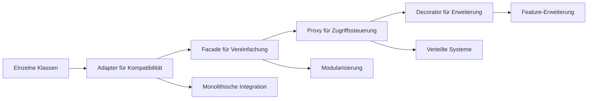

## Remote Facade-Sequenzdiagramm

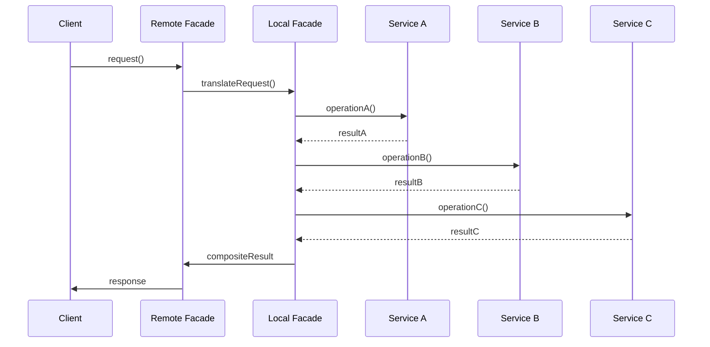

## API Gateway-Sequenzdiagramm

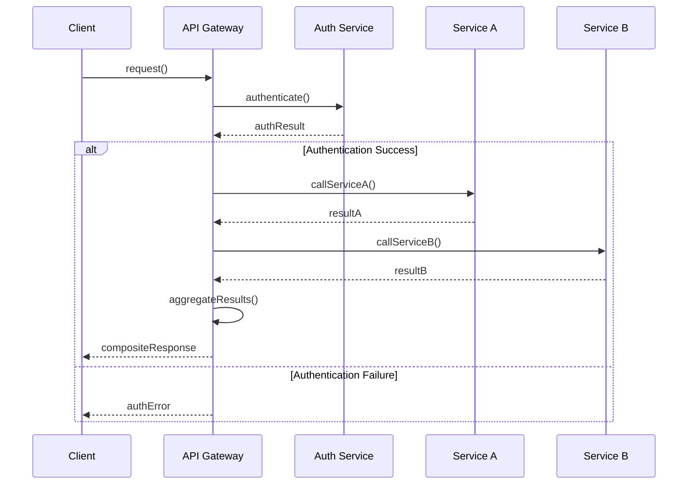

## Vergleichsmatrix: Vor- und Nachteile

| Muster | Stärken | Schwächen | Ideale Anwendungsfälle |
|--------|---------|-----------|------------------------|
| Facade | Vereinfacht komplexe Systeme, Reduziert Kopplung | Kann zu "God Object" werden, Zusätzliche Abstraktionsebene | Systemintegration, API-Design, Komplexitätsreduktion |
| Adapter | Macht inkompatible Schnittstellen nutzbar | Zusätzliche Übersetzungsschicht | Legacy-System-Integration, Bibliotheksanpassung |
| Proxy | Kontrollierter Zugriff auf Ressourcen | Keine Vereinfachung, Zusätzliche Indirektion | Zugriffskontrolle, Lazy Loading, Caching |
| Decorator | Dynamische Erweiterung von Funktionalität | Viele kleine Klassen, Komplexe Objekthierarchie | Funktionale Erweiterung zur Laufzeit, Cross-Cutting Concerns |

## Adaption von Facade-Pattern in verteilten Umgebungen

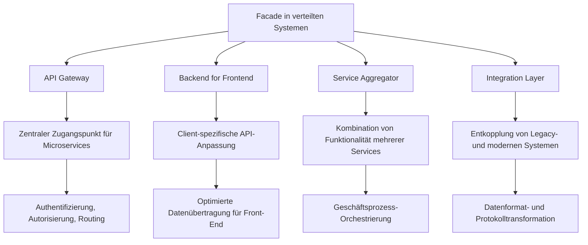

## Migration von komplexen Systemen mit Facade

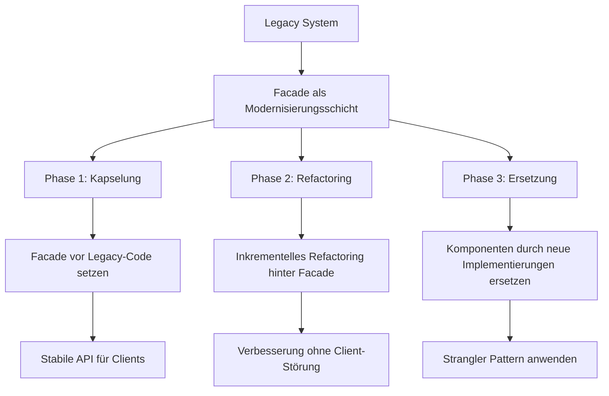