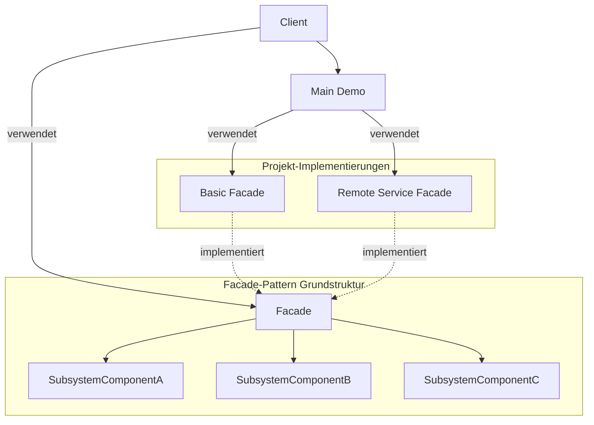
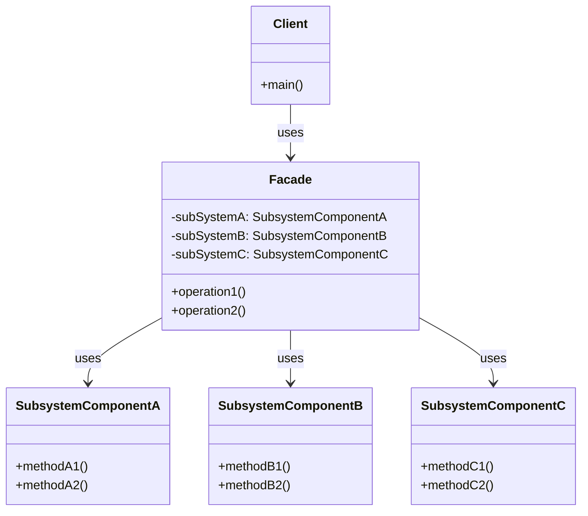
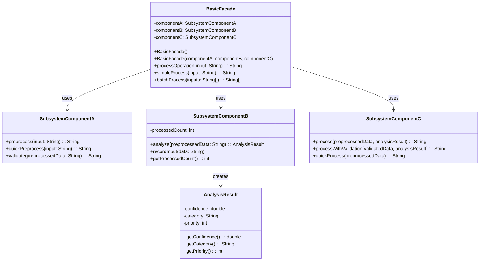
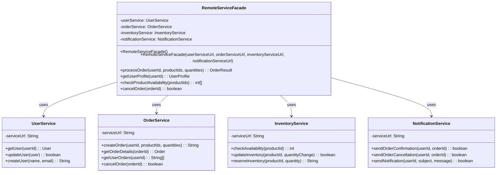
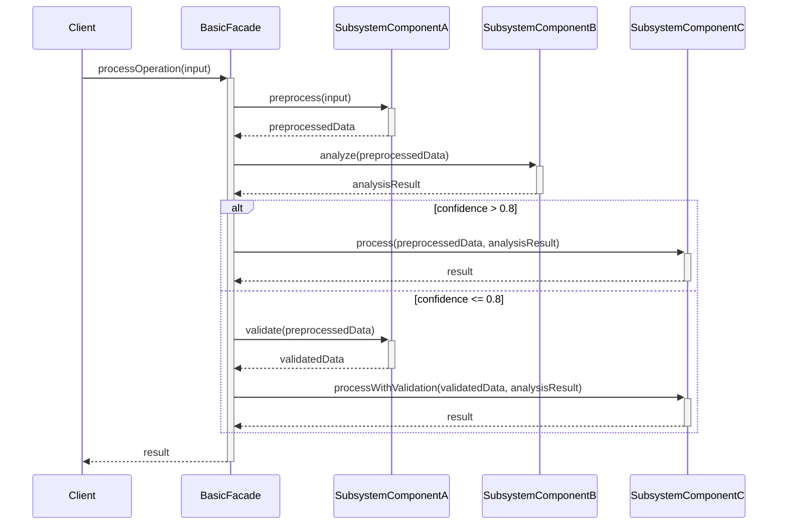
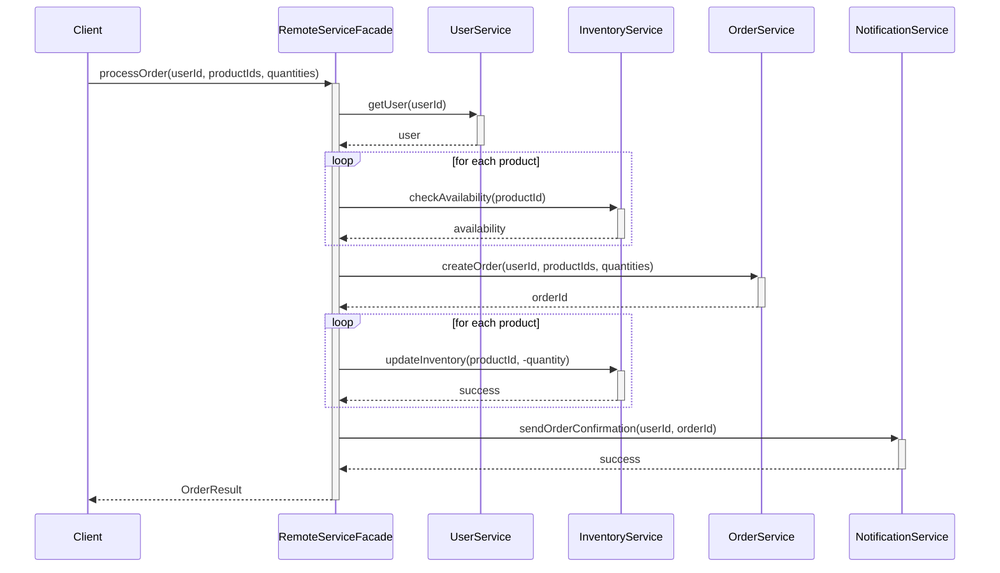
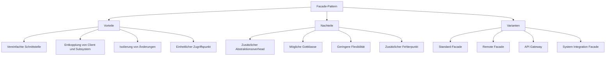
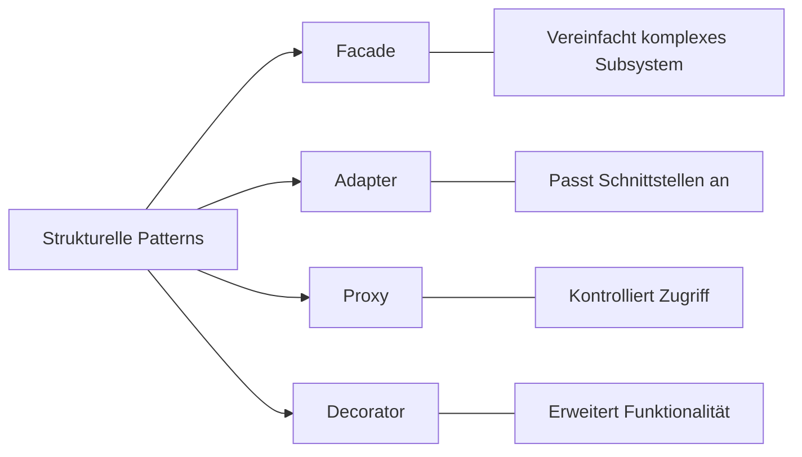
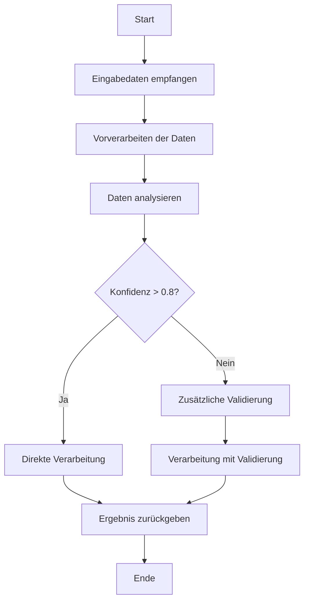
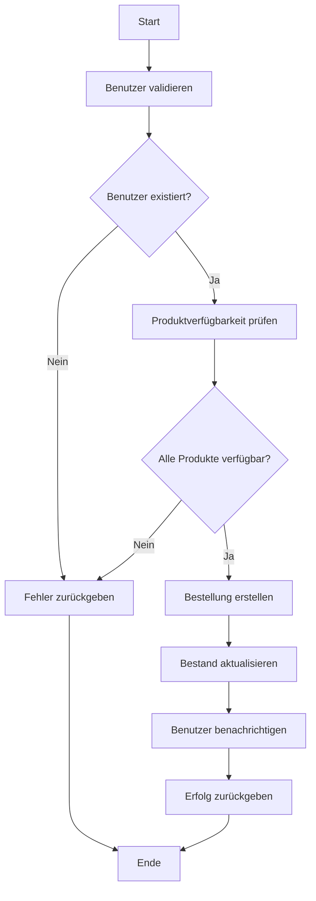

# Facade-Pattern Dokumentation

Diese Dokumentation enthält verschiedene Diagramme zur Veranschaulichung des Facade-Patterns und der konkreten Implementierung in diesem Projekt.

## Inhalt

- [Komponentendiagramm](#komponentendiagramm)
- [Klassendiagramme](#klassendiagramme)
- [Sequenzdiagramme](#sequenzdiagramme)
- [Strukturdiagramme](#strukturdiagramme)
- [Aktivitätsdiagramme](#aktivitätsdiagramme)

## Komponentendiagramm

Das folgende Diagramm zeigt die Hauptkomponenten des Projekts und ihre Beziehungen zueinander:

## Klassendiagramme

### Allgemeines Facade-Klassendiagramm

Das folgende Diagramm zeigt die allgemeine Struktur des Facade-Patterns:

### Basic Facade-Klassendiagramm

### Remote Service Facade-Klassendiagramm

## Sequenzdiagramme

### Basic Facade-Sequenzdiagramm

### Remote Service Facade-Sequenzdiagramm

## Strukturdiagramme

### Facade-Pattern Strukturdiagramm

### Facade vs. Alternative Patterns

## Aktivitätsdiagramme

### Basic Facade-Aktivitätsdiagramm

### Remote Service Facade-Aktivitätsdiagramm

