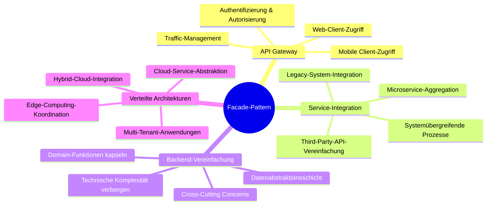
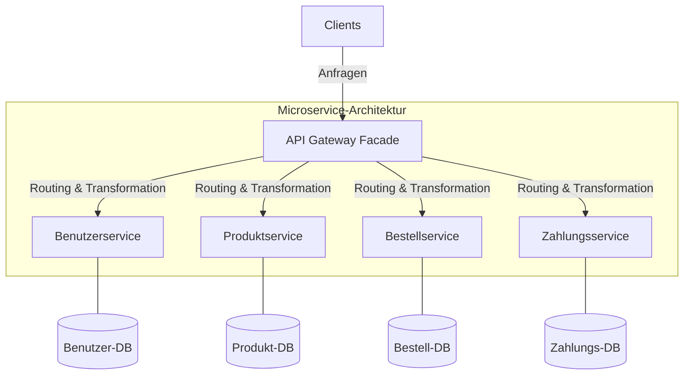
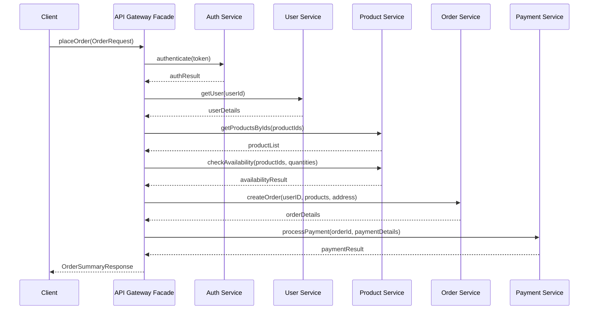
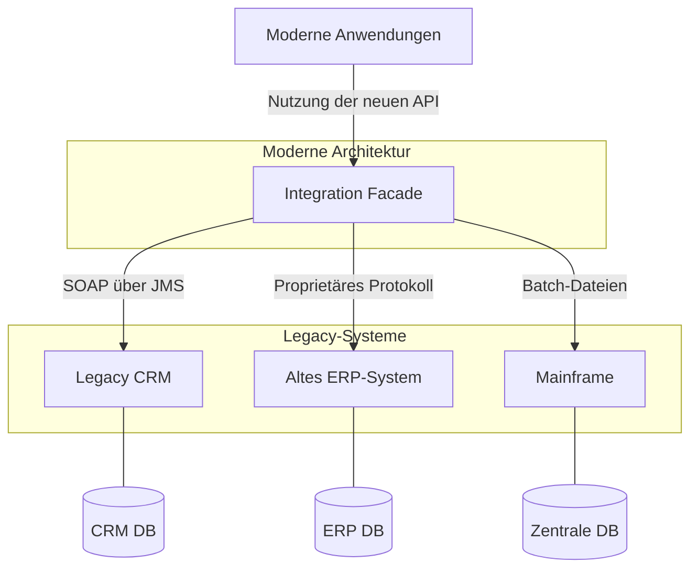
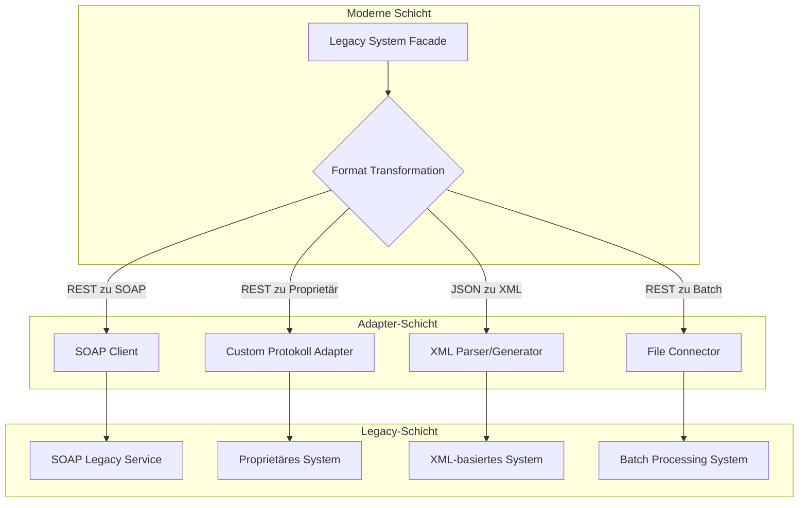
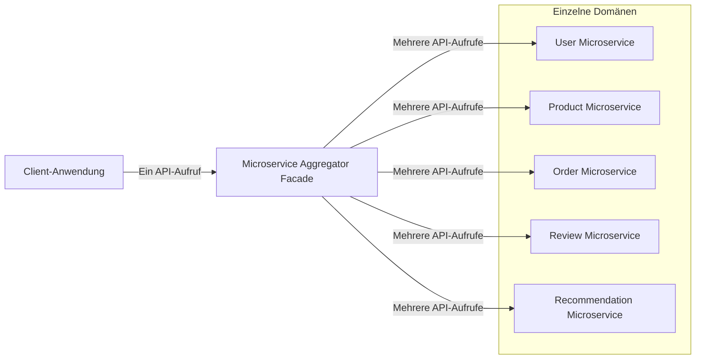
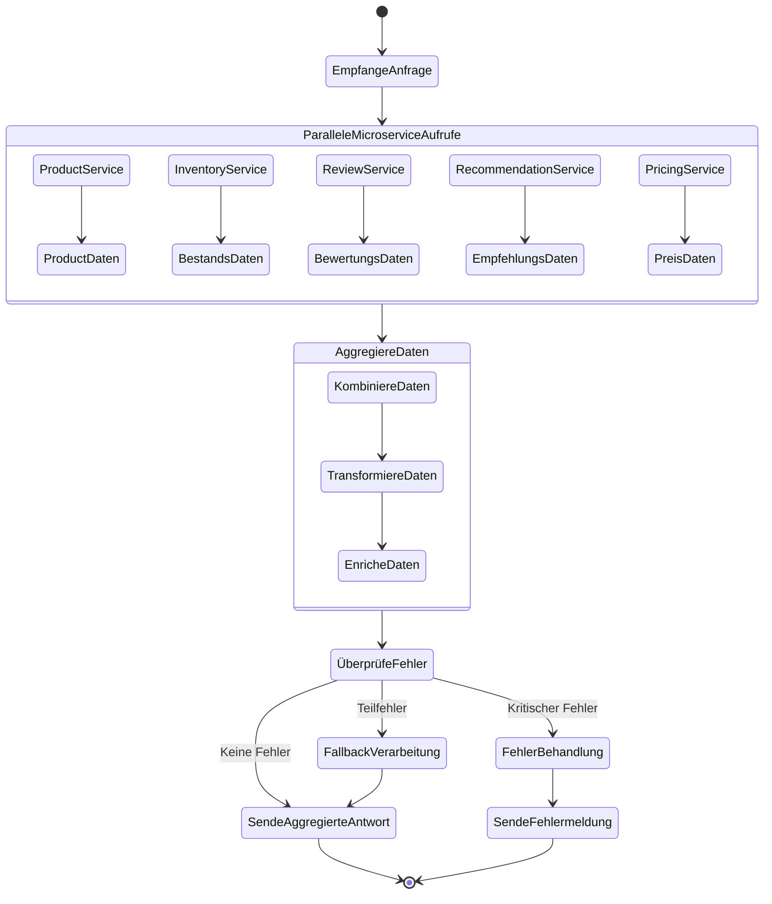
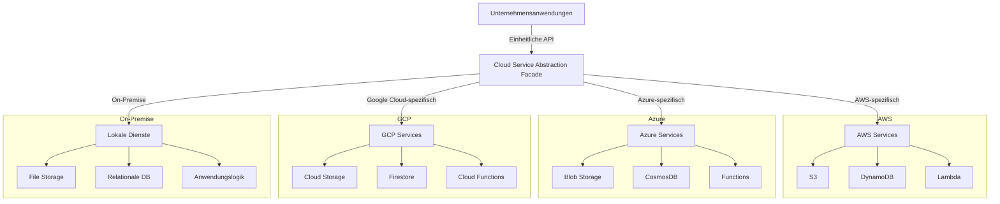

# Anwendungsbeispiele des Facade-Patterns in verteilten Systemen

Dieses Dokument stellt reale Anwendungsfälle des Facade-Patterns in verteilten Systemen vor und analysiert deren Implementierungsdetails.

## Übersicht der Anwendungsfälle



## Detaillierte Anwendungsfälle

### 1. API Gateway als Facade für Microservices



#### API Gateway-Implementierungsbeispiel

```java
public class ApiGatewayFacade {
    private final AuthService authService;
    private final UserService userService;
    private final ProductService productService;
    private final OrderService orderService;
    private final PaymentService paymentService;
    
    // Konstruktor und Dependency Injection

    public OrderSummaryResponse placeOrder(OrderRequest request) {
        // Authentifizierung prüfen
        AuthResult authResult = authService.authenticate(request.getAuthToken());
        if (!authResult.isAuthenticated()) {
            throw new UnauthorizedException("Nicht authentifiziert");
        }
        
        // Benutzer abrufen
        User user = userService.getUser(authResult.getUserId());
        
        // Produktverfügbarkeit prüfen
        List<Product> products = productService.getProductsByIds(request.getProductIds());
        boolean allAvailable = productService.checkAvailability(request.getProductIds(), request.getQuantities());
        if (!allAvailable) {
            throw new BusinessException("Nicht alle Produkte verfügbar");
        }
        
        // Bestellung erstellen
        Order order = orderService.createOrder(user.getId(), request.getProductIds(), 
                                             request.getQuantities(), request.getShippingAddress());
        
        // Zahlung verarbeiten
        Payment payment = paymentService.processPayment(order.getId(), request.getPaymentDetails());
        
        // Antwort zusammenstellen
        return new OrderSummaryResponse(order.getId(), order.getTotalAmount(), 
                                       payment.getTransactionId(), order.getExpectedDeliveryDate());
    }
    
    // Weitere API-Gateway-Methoden...
}
```

#### Sequenzdiagramm für Bestellprozess



### 2. Legacy-System-Integration mit Facade



#### Legacy-Integration-Beispiel

```java
public class LegacySystemFacade {
    private final LegacyCrmClient crmClient;
    private final ErpSystemAdapter erpAdapter;
    private final MainframeConnector mainframeConnector;
    private final DataTransformer dataTransformer;
    
    // Konstruktor mit Dependency Injection
    
    public CustomerProfile getCustomerProfile(String customerId) {
        // Daten aus Legacy-CRM abrufen (SOAP über JMS)
        CrmCustomerData crmData = crmClient.getCustomerData(customerId);
        
        // Daten aus ERP-System abrufen (proprietäres Protokoll)
        ErpCustomerData erpData = erpAdapter.retrieveCustomerById(customerId);
        
        // Transaktionsdaten vom Mainframe (Batch-Prozess)
        MainframeTransactionData transactionData = mainframeConnector.queryTransactions(customerId);
        
        // Transformation in modernes Format
        return dataTransformer.createCustomerProfile(crmData, erpData, transactionData);
    }
    
    public OrderHistory getOrderHistory(String customerId) {
        // Ähnliche Integration verschiedener Legacy-Systeme
        // ...
    }
    
    // Weitere Integrationsmethoden
}
```

#### Komponentendiagramm einer Legacy-Integration



### 3. Microservice-Aggregator als Facade



#### Microservice-Aggregator-Beispiel

```java
public class ProductDetailAggregatorFacade {
    private final ProductService productService;
    private final InventoryService inventoryService;
    private final ReviewService reviewService;
    private final RecommendationService recommendationService;
    private final PricingService pricingService;
    
    @CircuitBreaker(name = "productDetail")
    @Timeout(value = 2, unit = ChronoUnit.SECONDS)
    public ProductDetailResponse getProductDetails(String productId, String userId) {
        // Parallel-Ausführung für bessere Performance
        CompletableFuture<ProductData> productFuture = 
            CompletableFuture.supplyAsync(() -> productService.getProduct(productId));
            
        CompletableFuture<InventoryData> inventoryFuture = 
            CompletableFuture.supplyAsync(() -> inventoryService.checkAvailability(productId));
            
        CompletableFuture<List<Review>> reviewsFuture = 
            CompletableFuture.supplyAsync(() -> reviewService.getReviewsForProduct(productId));
            
        CompletableFuture<List<Product>> recommendationsFuture = 
            CompletableFuture.supplyAsync(() -> recommendationService.getRecommendations(productId, userId));
            
        CompletableFuture<PriceData> priceFuture = 
            CompletableFuture.supplyAsync(() -> pricingService.getProductPrice(productId, userId));
        
        // Warte auf alle Ergebnisse
        try {
            ProductData product = productFuture.get();
            InventoryData inventory = inventoryFuture.get();
            List<Review> reviews = reviewsFuture.get();
            List<Product> recommendations = recommendationsFuture.get();
            PriceData price = priceFuture.get();
            
            // Aggregiere Daten in eine zusammengesetzte Antwort
            return new ProductDetailResponse(product, inventory, reviews, recommendations, price);
            
        } catch (Exception e) {
            throw new ServiceAggregationException("Fehler beim Aggregieren der Produktdetails", e);
        }
    }
}
```

#### Aktivitätsdiagramm eines Microservice-Aggregators



### 4. Cloud-Service-Abstraktions-Facade



#### Cloud-Service-Abstraktions-Beispiel

```java
public class CloudStorageFacade {
    private final CloudProvider currentProvider;
    private final AwsStorageAdapter awsAdapter;
    private final AzureStorageAdapter azureAdapter;
    private final GcpStorageAdapter gcpAdapter;
    private final OnPremiseStorageAdapter onPremiseAdapter;
    
    // Konstruktor mit Provider-Auswahl
    
    public String storeFile(String bucketName, String fileName, byte[] fileContent) {
        switch (currentProvider) {
            case AWS:
                return awsAdapter.putObject(bucketName, fileName, fileContent);
            case AZURE:
                return azureAdapter.uploadBlob(bucketName, fileName, fileContent);
            case GCP:
                return gcpAdapter.uploadObject(bucketName, fileName, fileContent);
            case ON_PREMISE:
                return onPremiseAdapter.saveFile(bucketName, fileName, fileContent);
            default:
                throw new UnsupportedOperationException("Cloud-Provider nicht unterstützt");
        }
    }
    
    public byte[] retrieveFile(String bucketName, String fileName) {
        switch (currentProvider) {
            case AWS:
                return awsAdapter.getObject(bucketName, fileName);
            case AZURE:
                return azureAdapter.downloadBlob(bucketName, fileName);
            case GCP:
                return gcpAdapter.downloadObject(bucketName, fileName);
            case ON_PREMISE:
                return onPremiseAdapter.readFile(bucketName, fileName);
            default:
                throw new UnsupportedOperationException("Cloud-Provider nicht unterstützt");
        }
    }
    
    // Weitere Methoden für andere Storage-Operationen
}
```

## Praktische Umsetzungsbeispiele

### Beispiel 1: E-Commerce API Gateway mit Spring Cloud Gateway

```java
@Configuration
public class ApiGatewayConfig {
    
    @Bean
    public RouteLocator gatewayRoutes(RouteLocatorBuilder builder) {
        return builder.routes()
            // Produktsuche und -details API
            .route("product-service", r -> r.path("/api/products/**")
                .filters(f -> f.rewritePath("/api/products/(?<path>.*)", "/${path}")
                    .addRequestHeader("X-Source", "gateway")
                    .circuitBreaker(c -> c.setName("productServiceCircuitBreaker")
                        .setFallbackUri("forward:/fallback/products")))
                .uri("lb://product-service"))
                
            // Bestellungs-API
            .route("order-service", r -> r.path("/api/orders/**")
                .filters(f -> f.rewritePath("/api/orders/(?<path>.*)", "/${path}")
                    .addRequestHeader("X-Source", "gateway")
                    .circuitBreaker(c -> c.setName("orderServiceCircuitBreaker")
                        .setFallbackUri("forward:/fallback/orders")))
                .uri("lb://order-service"))
                
            // Kundenservice-API
            .route("customer-service", r -> r.path("/api/customers/**")
                .filters(f -> f.rewritePath("/api/customers/(?<path>.*)", "/${path}")
                    .addRequestHeader("X-Source", "gateway")
                    .circuitBreaker(c -> c.setName("customerServiceCircuitBreaker")
                        .setFallbackUri("forward:/fallback/customers")))
                .uri("lb://customer-service"))
                
            // Zusammengesetzte API für Produktdetailseite
            .route("product-detail-facade", r -> r.path("/api/product-details/**")
                .filters(f -> f.rewritePath("/api/product-details/(?<path>.*)", "/${path}")
                    .addRequestHeader("X-Source", "gateway"))
                .uri("lb://product-detail-facade"))
                
            .build();
    }
    
    // Weitere Gateway-Konfiguration
}
```

### Beispiel 2: Legacy-Integration mit Spring Integration

```java
@Configuration
public class LegacyIntegrationConfig {
    
    @Bean
    public IntegrationFlow legacyCrmIntegrationFlow() {
        return IntegrationFlows
            .from(Http.inboundGateway("/api/customers/{customerId}")
                .requestMapping(m -> m.methods(HttpMethod.GET))
                .payloadExpression("#pathVariables.customerId"))
            .handle(legacyCrmAdapter(), "getCustomerData")
            .transform(this::enrichCustomerData)
            .handle(userDataRepository(), "saveUserDataFromLegacy")
            .get();
    }
    
    @Bean
    public IntegrationFlow legacyOrderIntegrationFlow() {
        return IntegrationFlows
            .from(Jms.messageDrivenChannelAdapter(orderQueueConnectionFactory)
                .destination("LEGACY_ORDER_QUEUE"))
            .transform(legacyOrderTransformer())
            .split()
            .handle(Http.outboundGateway("http://modern-order-service/api/orders")
                .httpMethod(HttpMethod.POST)
                .expectedResponseType(String.class))
            .aggregate()
            .channel("processedOrdersChannel")
            .get();
    }
    
    // Weitere Integrationsflüsse und Komponenten
}
```

### Beispiel 3: Backend für Frontend (BFF) als Facade

```java
@RestController
@RequestMapping("/api/mobile")
public class MobileBffFacade {
    private final UserProfileService userProfileService;
    private final OrderHistoryService orderHistoryService;
    private final ProductService productService;
    private final NotificationService notificationService;
    
    // Konstruktor mit Dependency Injection
    
    @GetMapping("/dashboard")
    public MobileDashboardResponse getDashboard(@RequestHeader("Authorization") String authToken) {
        // Authentifizierung und Benutzeridentifizierung
        String userId = jwtProcessor.extractUserId(authToken);
        
        // Parallelverarbeitung für bessere Performance
        CompletableFuture<UserProfile> profileFuture = 
            CompletableFuture.supplyAsync(() -> userProfileService.getProfile(userId));
            
        CompletableFuture<List<OrderSummary>> recentOrdersFuture = 
            CompletableFuture.supplyAsync(() -> orderHistoryService.getRecentOrders(userId, 5));
            
        CompletableFuture<List<ProductRecommendation>> recommendationsFuture = 
            CompletableFuture.supplyAsync(() -> productService.getPersonalizedRecommendations(userId, 10));
            
        CompletableFuture<List<Notification>> notificationsFuture = 
            CompletableFuture.supplyAsync(() -> notificationService.getPendingNotifications(userId));
        
        try {
            // Optimierte mobile Antwort mit minimal notwendigen Daten für schnelles Laden
            return new MobileDashboardResponse(
                profileFuture.get().getUserDetails(),
                recentOrdersFuture.get(),
                recommendationsFuture.get(),
                notificationsFuture.get(),
                deviceInfoResolver.getDeviceCapabilities(request)
            );
        } catch (Exception e) {
            log.error("Error assembling mobile dashboard for user {}", userId, e);
            throw new ServiceException("Could not load dashboard data", e);
        }
    }
    
    // Weitere BFF-Endpunkte
}
```

### Beispiel 4: Database Access Facade für Multi-Tenancy

```java
@Component
public class MultiTenantDatabaseFacade {
    private final Map<String, DataSource> tenantDataSources;
    private final TenantResolver tenantResolver;
    private final QueryBuilder queryBuilder;
    
    @Transactional
    public <T> List<T> executeQuery(String query, Map<String, Object> parameters, Class<T> resultType) {
        String tenantId = tenantResolver.getCurrentTenant();
        DataSource dataSource = tenantDataSources.get(tenantId);
        
        if (dataSource == null) {
            throw new TenantNotFoundException("Keine Datenquelle für Tenant: " + tenantId);
        }
        
        // Füge Tenant-spezifische Filterung hinzu
        String tenantFilteredQuery = queryBuilder.addTenantFilter(query, tenantId);
        
        try (Connection conn = dataSource.getConnection();
             PreparedStatement stmt = prepareStatement(conn, tenantFilteredQuery, parameters)) {
            
            ResultSet rs = stmt.executeQuery();
            return mapResultSetToObjects(rs, resultType);
            
        } catch (SQLException e) {
            throw new DatabaseException("Fehler bei Datenbankabfrage für Tenant " + tenantId, e);
        }
    }
    
    @Transactional
    public <T> void executeUpdate(String entity, T data) {
        String tenantId = tenantResolver.getCurrentTenant();
        DataSource dataSource = tenantDataSources.get(tenantId);
        
        if (dataSource == null) {
            throw new TenantNotFoundException("Keine Datenquelle für Tenant: " + tenantId);
        }
        
        // Markiere Daten mit Tenant-ID
        JsonNode jsonData = objectMapper.valueToTree(data);
        ((ObjectNode) jsonData).put("tenantId", tenantId);
        
        // Führe Update in der entsprechenden Tenant-Datenbank aus
        try (Connection conn = dataSource.getConnection()) {
            String sql = queryBuilder.buildUpsertQuery(entity, jsonData);
            try (PreparedStatement stmt = conn.prepareStatement(sql)) {
                bindJsonToStatement(stmt, jsonData);
                stmt.executeUpdate();
            }
        } catch (SQLException e) {
            throw new DatabaseException("Fehler beim Datenbank-Update für Tenant " + tenantId, e);
        }
    }
    
    // Weitere Datenbankoperationen mit Tenant-Isolation
}
```

### Beispiel 5: Ereignisbasierte Microservice-Facade

```java
@Service
public class OrderProcessingFacade {
    private final EventPublisher eventPublisher;
    private final OrderRepository orderRepository;
    private final OrderValidator orderValidator;
    
    @Transactional
    public OrderResponse createOrder(OrderRequest request) {
        // Geschäftsregeln überprüfen
        ValidationResult validation = orderValidator.validate(request);
        if (!validation.isValid()) {
            throw new ValidationException(validation.getErrors());
        }
        
        // Bestellung in lokalem Service speichern
        Order order = mapRequestToOrder(request);
        order.setStatus(OrderStatus.PENDING);
        orderRepository.save(order);
        
        // Ereignisse für andere Microservices publizieren
        eventPublisher.publish(new OrderCreatedEvent(
            order.getId(),
            order.getCustomerId(),
            order.getItems(),
            order.getShippingAddress(),
            order.getOrderDate()
        ));
        
        // Zahlungsprozess starten
        eventPublisher.publish(new PaymentRequestedEvent(
            order.getId(),
            order.getCustomerId(),
            order.getTotalAmount(),
            request.getPaymentMethod()
        ));
        
        // Antwort mit Bestellreferenz zurückgeben
        return new OrderResponse(
            order.getId(),
            order.getStatus(),
            "Bestellung erfolgreich erstellt, Zahlungsabwicklung wird eingeleitet"
        );
    }
    
    // Event-Handler für Zahlungsereignisse
    @EventListener
    public void handlePaymentProcessed(PaymentProcessedEvent event) {
        Order order = orderRepository.findById(event.getOrderId())
            .orElseThrow(() -> new OrderNotFoundException(event.getOrderId()));
        
        if (event.isSuccessful()) {
            order.setStatus(OrderStatus.PAID);
            orderRepository.save(order);
            
            // Versand-Event auslösen
            eventPublisher.publish(new OrderReadyForShipmentEvent(
                order.getId(),
                order.getItems(),
                order.getShippingAddress()
            ));
        } else {
            order.setStatus(OrderStatus.PAYMENT_FAILED);
            order.setStatusMessage(event.getFailureReason());
            orderRepository.save(order);
            
            // Kunde benachrichtigen
            eventPublisher.publish(new CustomerNotificationEvent(
                order.getCustomerId(),
                "Zahlungsproblem",
                "Bei Ihrer Bestellung " + order.getId() + " ist ein Zahlungsproblem aufgetreten: " 
                    + event.getFailureReason()
            ));
        }
    }
    
    // Weitere Event-Handler und Facade-Methoden
}
```