# Implementierungsleitfaden für das Interceptor-Pattern

Dieser Leitfaden beschreibt den Implementierungsprozess des Interceptor-Patterns in verteilten Systemen anhand praktischer Beispiele aus diesem Projekt.

## Inhaltsverzeichnis

1. [Wann sollte das Interceptor-Pattern verwendet werden?](#wann-sollte-das-interceptor-pattern-verwendet-werden)
2. [Schrittweise Implementierung](#schrittweise-implementierung)
3. [Implementierungsbeispiele](#implementierungsbeispiele)
4. [Best Practices](#best-practices)
5. [Häufige Fehler](#häufige-fehler)
6. [Performanceüberlegungen](#performanceüberlegungen)

## Wann sollte das Interceptor-Pattern verwendet werden?

Das Interceptor-Pattern ist in folgenden Situationen besonders nützlich:

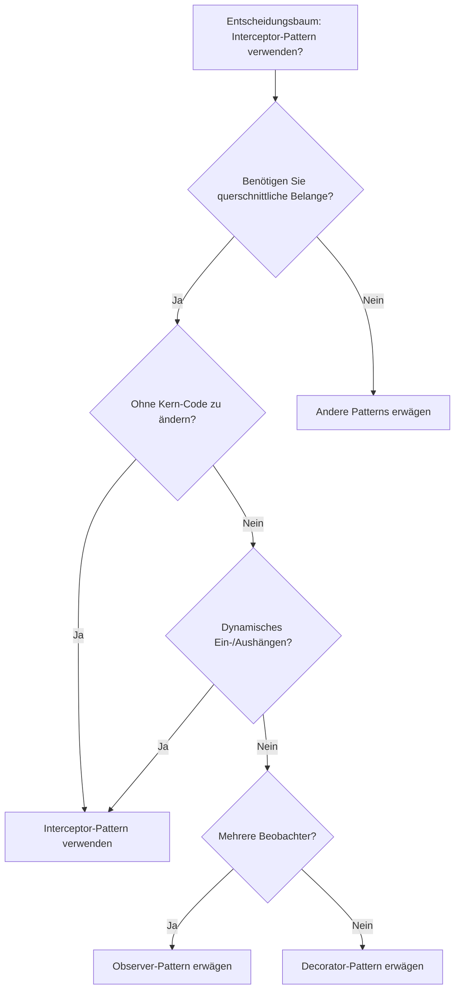

## Schrittweise Implementierung

### 1. Interceptor-Schnittstelle definieren

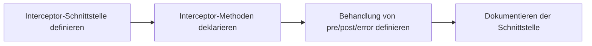

### 2. Core-Komponenten implementieren

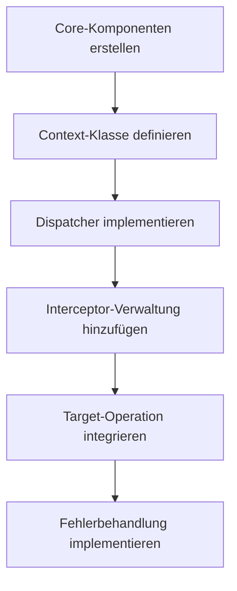

## Implementierungsbeispiele

### Beispiel 1: Einfaches Interceptor (Logging)

Dieses Diagramm zeigt den Datenfluss bei der Ausführung eines Logging-Interceptors:

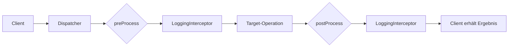

### Beispiel 2: Fehlerbehandlung mit Interceptor

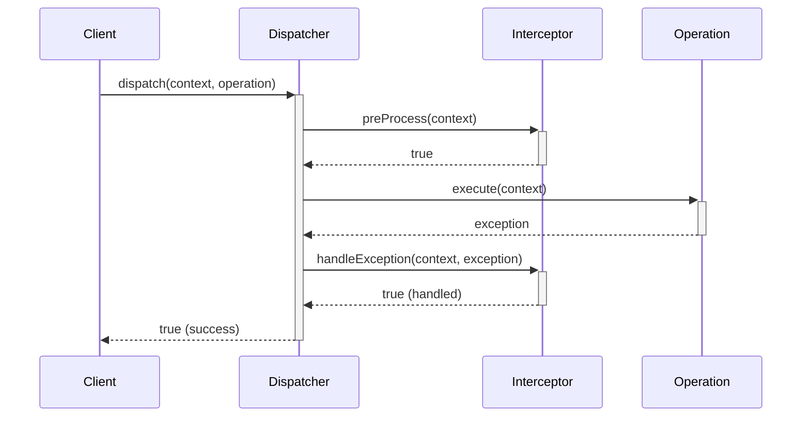

## Best Practices

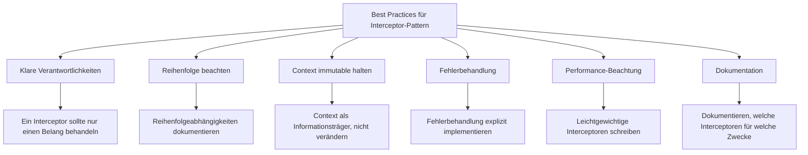

## Häufige Fehler

Die folgenden Fehler sollten bei der Implementierung des Interceptor-Patterns vermieden werden:

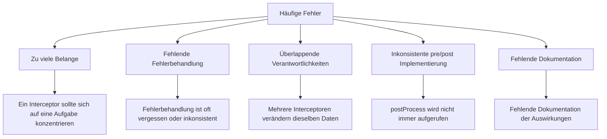

## Performanceüberlegungen

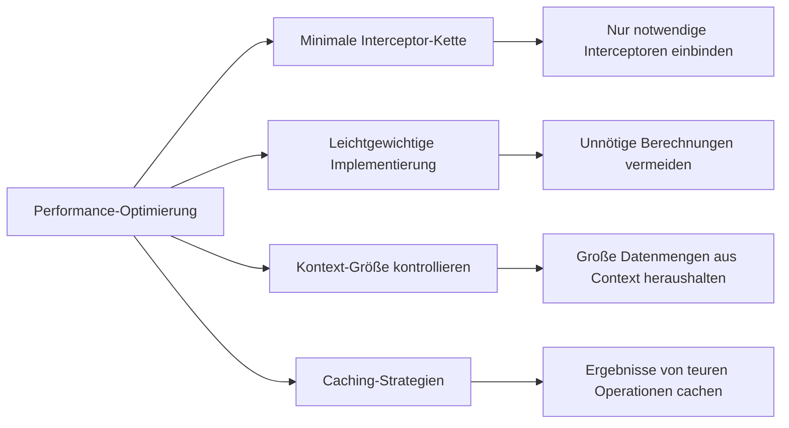

## Varianten des Interceptor-Patterns

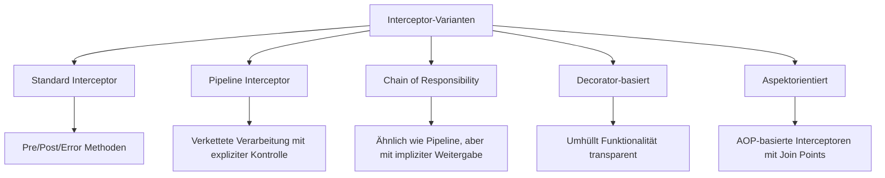

## Herausforderungen in verteilten Systemen

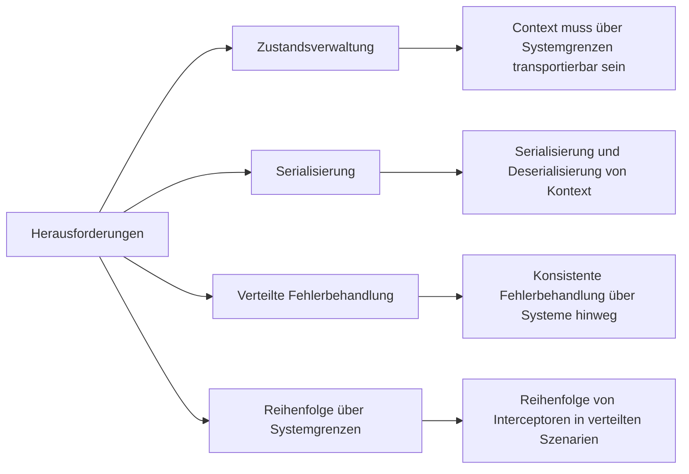

## Alternative Patterns zum Interceptor-Pattern

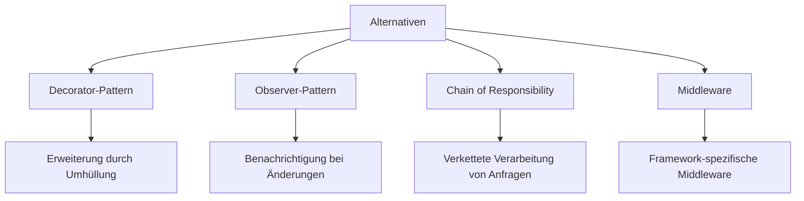