# Vergleich des Interceptor-Patterns mit anderen Entwurfsmustern

Dieses Dokument vergleicht das Interceptor-Pattern mit anderen verwandten Entwurfsmustern und hilft bei der Entscheidung, welches Muster in verschiedenen Situationen am besten geeignet ist.

## Interceptor vs. andere Entwurfsmuster

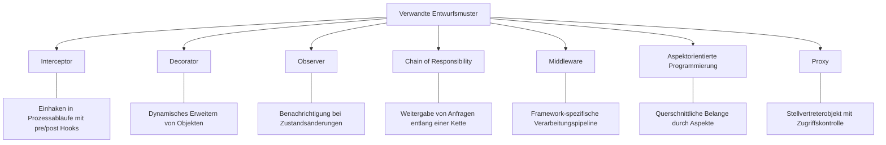

## Entscheidungshilfe: Welches Muster wann?

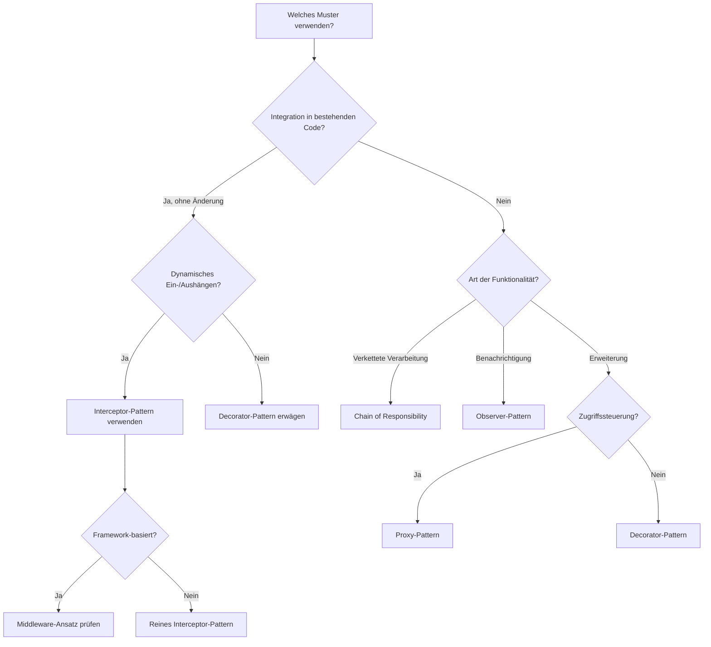

## Detaillierter Vergleich: Interceptor vs. andere Muster

### Interceptor vs. Decorator

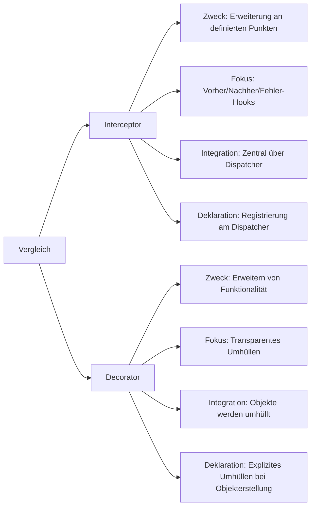

### Interceptor vs. Chain of Responsibility

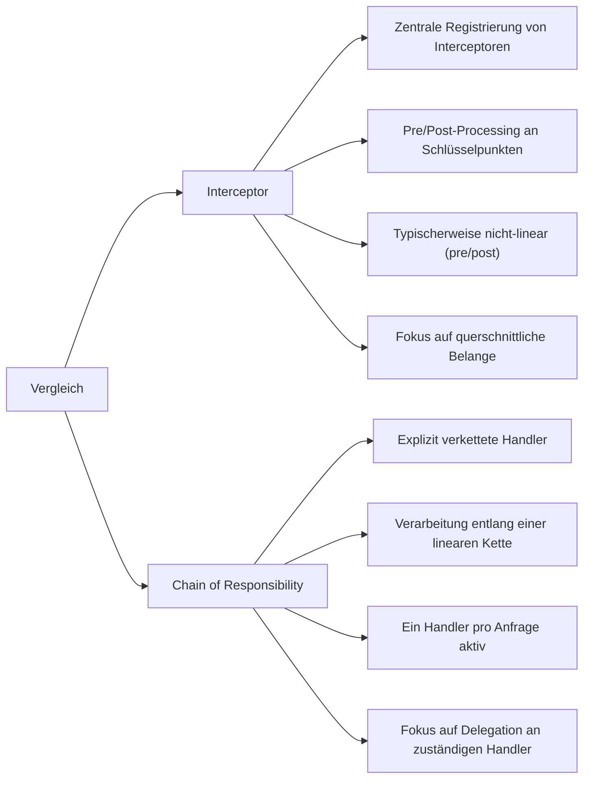

### Interceptor vs. Observer

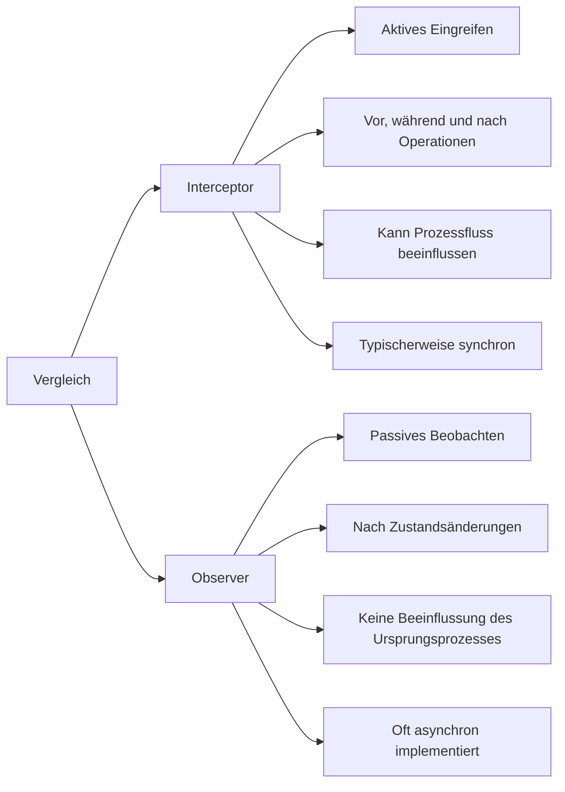

### Interceptor vs. Proxy

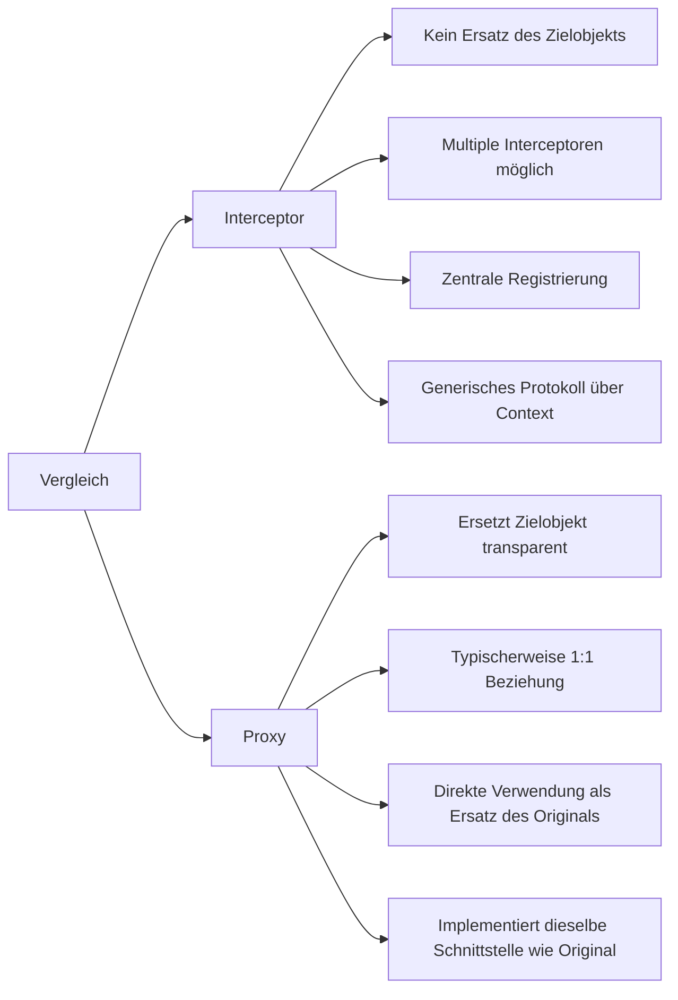

## Anwendungsfälle verschiedener Muster in Verteilten Systemen

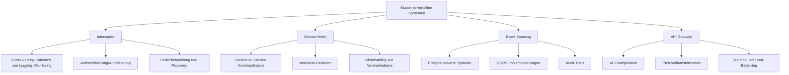

## Kombination von Mustern

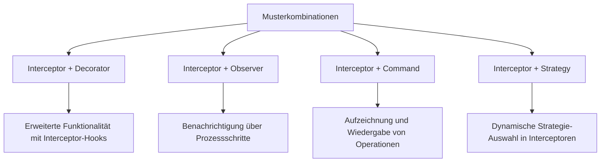

## Evolutionspfad für Interceptor-Pattern

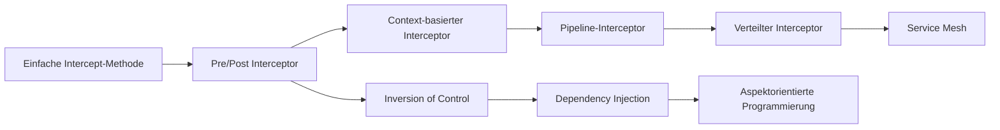

## Verteiltes Pipeline-Interceptor-Sequenzdiagramm

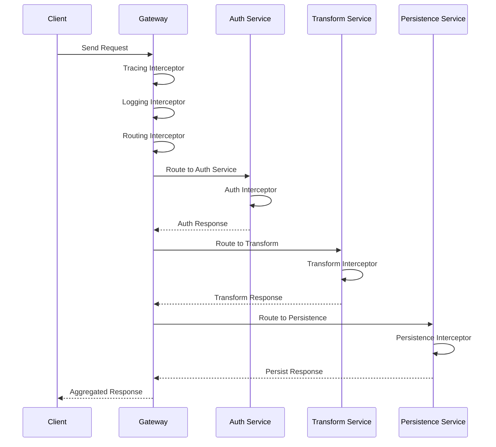

## Vergleichsmatrix: Vor- und Nachteile

| Muster | Stärken | Schwächen | Ideale Anwendungsfälle |
|--------|---------|-----------|------------------------|
| Interceptor | Zentrale Registrierung, Transparente Erweiterung, Pre/Post Hooks | Potenzielle Performance-Einbußen, Komplexität bei vielen Interceptoren | Logging, Monitoring, Security, Caching |
| Decorator | Dynamische Erweiterung, Kombination von Verhalten, Offenes/Geschlossenes Prinzip | Viele kleine Klassen, Komplexe Objektstrukturen | GUI-Komponenten, I/O-Streams, Dynamische Funktionserweiterung |
| Chain of Responsibility | Entkopplung, Flexible Befehlsverkettung, Responsibility-Isolation | Garantie der Verarbeitung, Overhead bei langen Ketten | Request-Handling, Event-Systeme, Filter-Ketten |
| Observer | Loose Coupling, Event-Driven Design, 1:n Benachrichtigung | Unerwartete Updates, Memory Leaks, Reihenfolge-Probleme | GUI-Events, Message-Systeme, Publish/Subscribe |
| Proxy | Zugangskontrolle, Lazy Loading, Remote Proxying | Erhöhte Komplexität, Potenzielle Performance-Einbußen | Zugriffsschutz, Virtuelle Proxies, Remote-Zugriff |

## Implementierungsvarianten des Interceptor-Patterns in verteilten Umgebungen

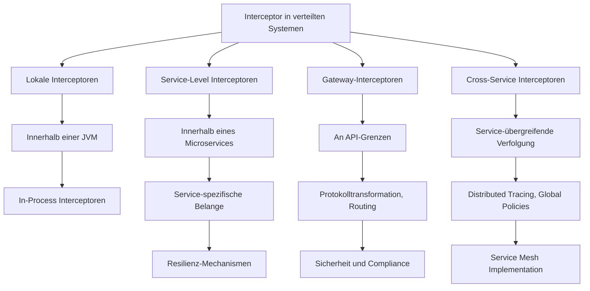

## Migration zu modernen Interceptor-Implementierungen

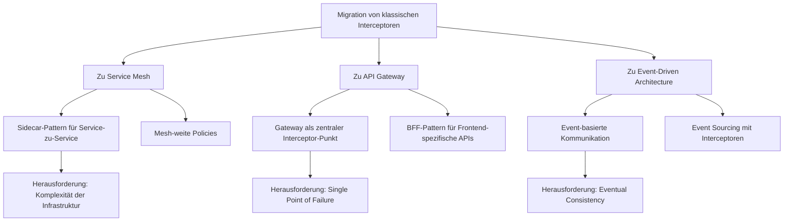