# Interceptor-Pattern Dokumentation

Diese Dokumentation enthält verschiedene Diagramme zur Veranschaulichung des Interceptor-Patterns und der konkreten Implementierung in diesem Projekt.

## Inhalt

- [Komponentendiagramm](#komponentendiagramm)
- [Klassendiagramme](#klassendiagramme)
- [Sequenzdiagramme](#sequenzdiagramme)
- [Zustandsdiagramme](#zustandsdiagramme)
- [Aktivitätsdiagramme](#aktivitätsdiagramme)

## Komponentendiagramm

Das folgende Diagramm zeigt die Hauptkomponenten des Projekts und ihre Beziehungen zueinander:

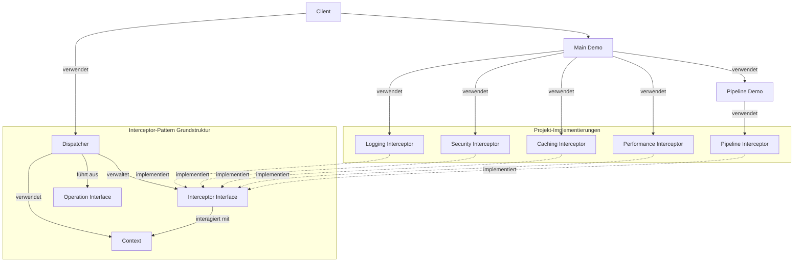

## Klassendiagramme

### Allgemeines Interceptor-Klassendiagramm

Das folgende Diagramm zeigt die allgemeine Struktur des Interceptor-Patterns:

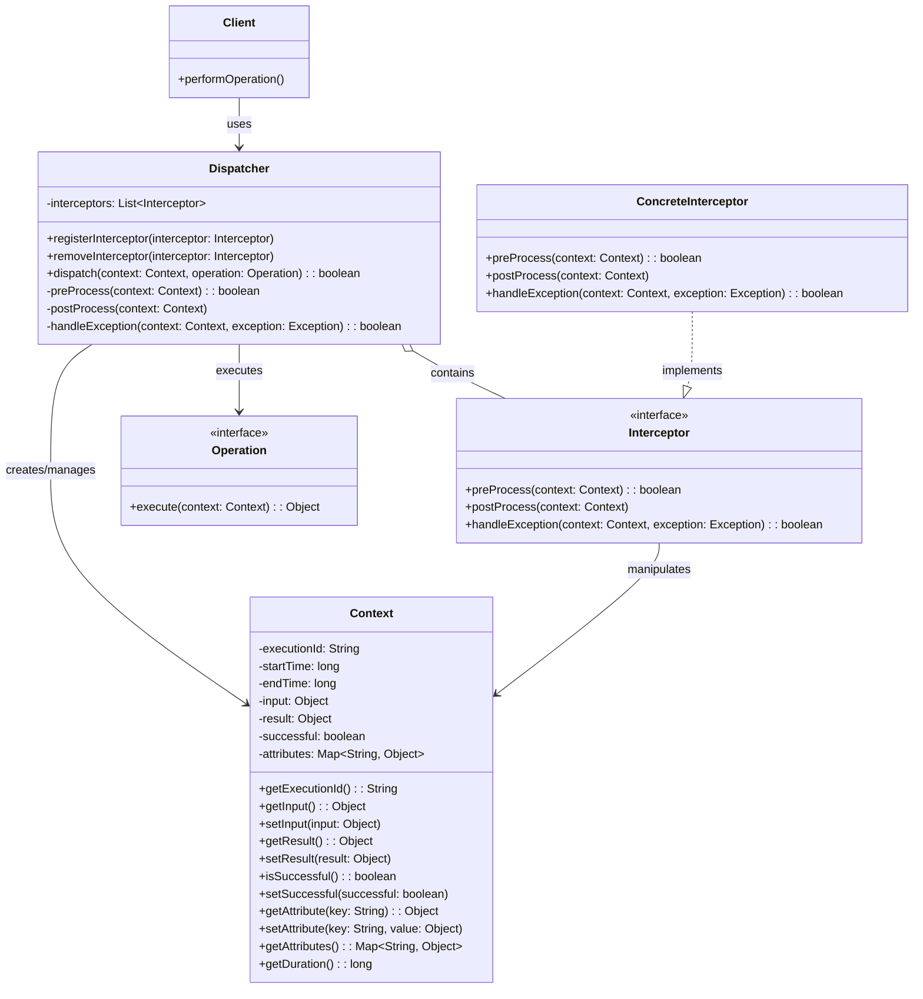

### Logging-Interceptor Klassendiagramm

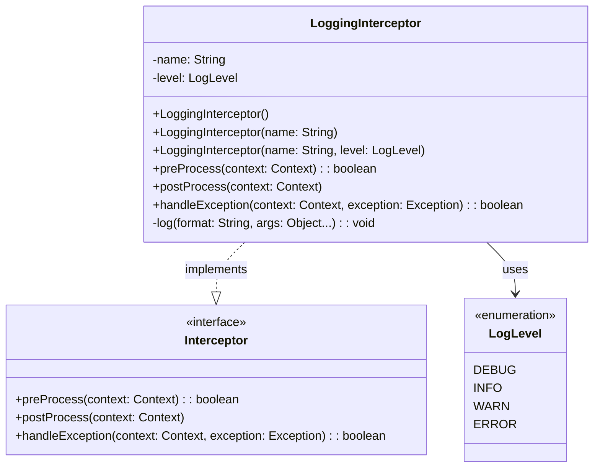

### Caching-Interceptor Klassendiagramm

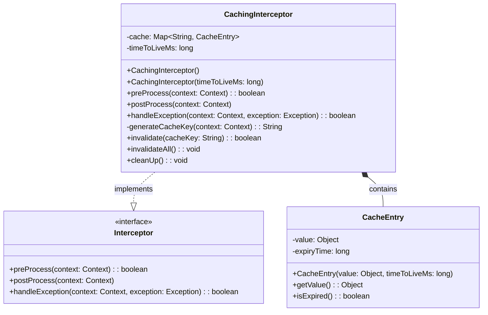

### Pipeline-Interceptor Klassendiagramm

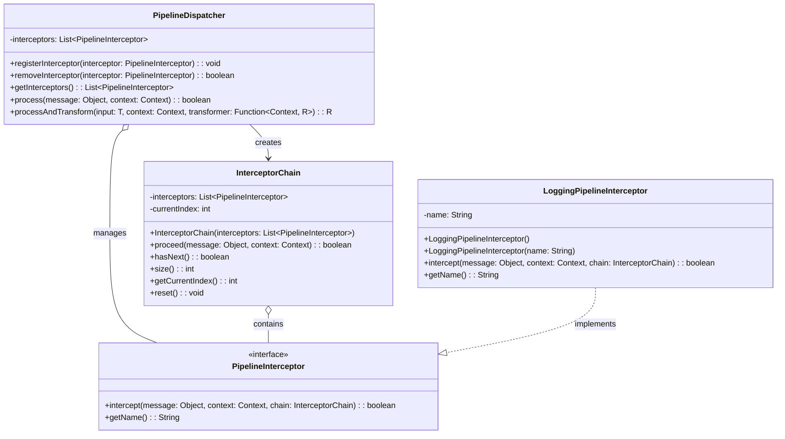

## Sequenzdiagramme

### Grundlegendes Interceptor-Sequenzdiagramm

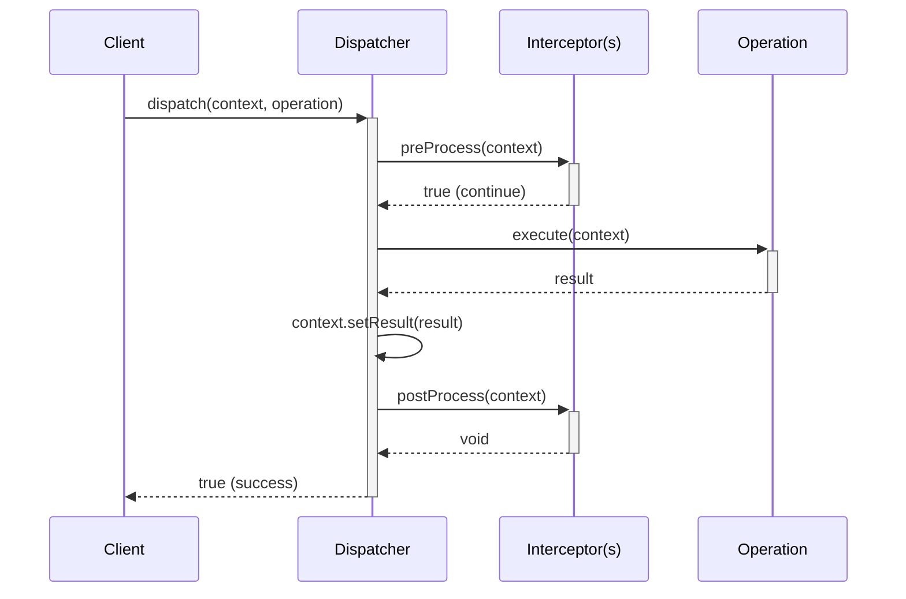

### Fehlerbehandlungs-Sequenzdiagramm

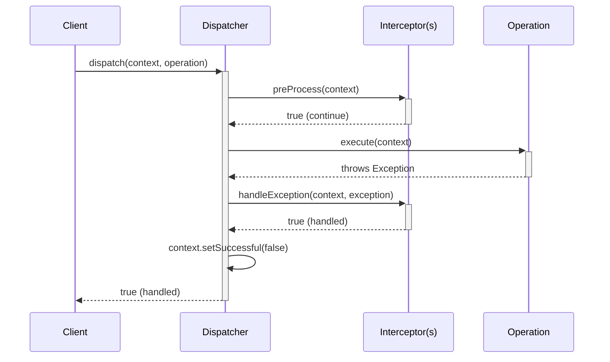

### Pipeline-Interceptor-Sequenzdiagramm

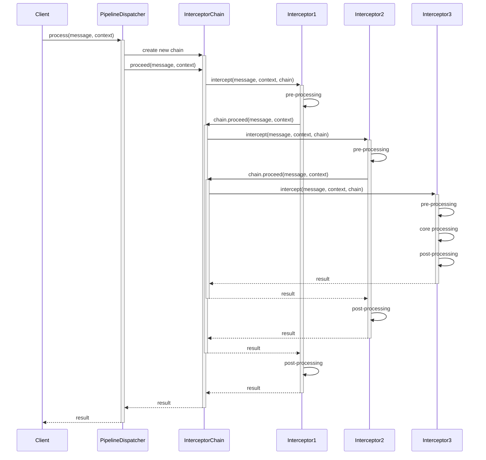

### Verteiltes Tracing-Sequenzdiagramm

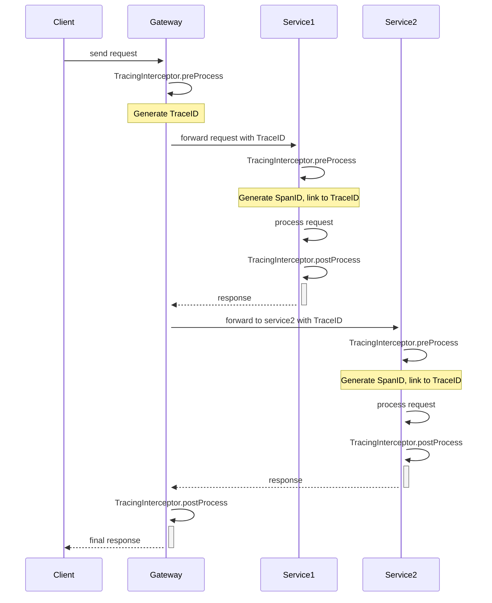

## Zustandsdiagramme

### Interceptor-Ausführungszustandsdiagramm

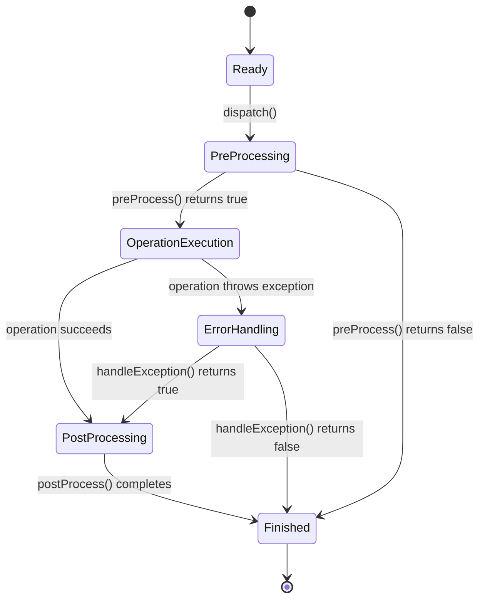

### Caching-Interceptor Zustandsdiagramm

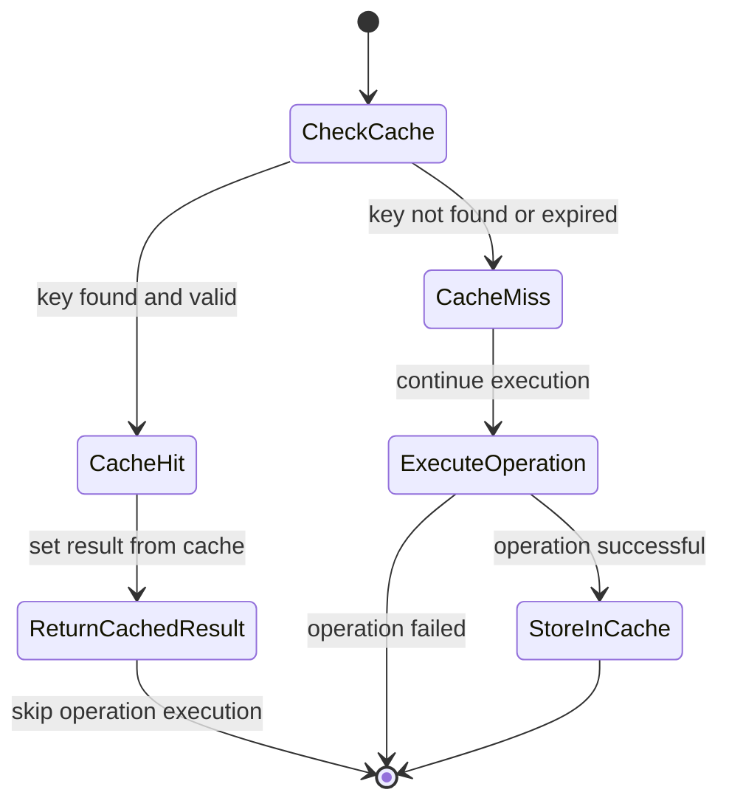

## Aktivitätsdiagramme

### Grundlegendes Interceptor-Aktivitätsdiagramm

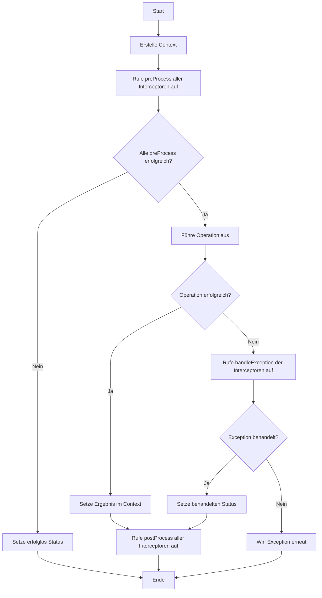

### Pipeline-Interceptor Aktivitätsdiagramm

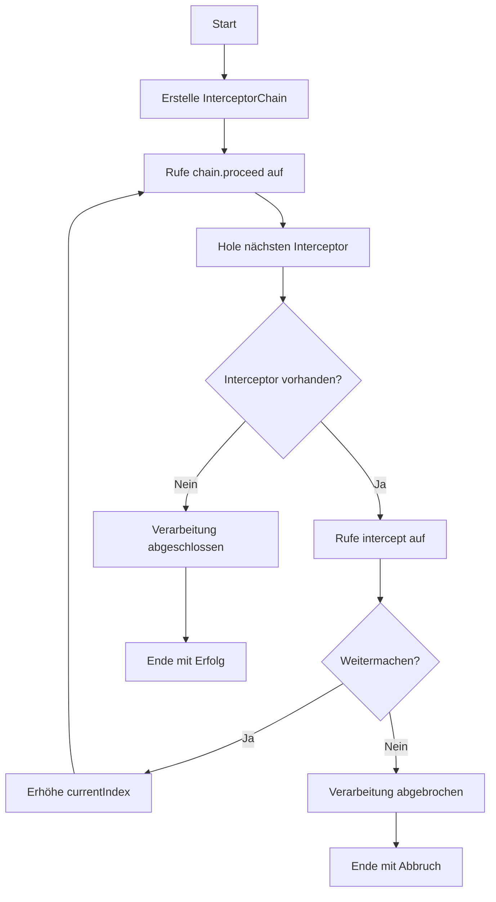

### HTTP-Interceptor Aktivitätsdiagramm

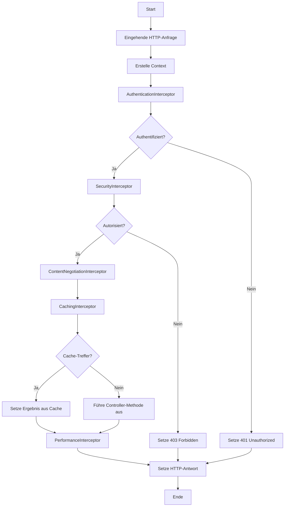

### Fehlerbehandlungs-Aktivitätsdiagramm

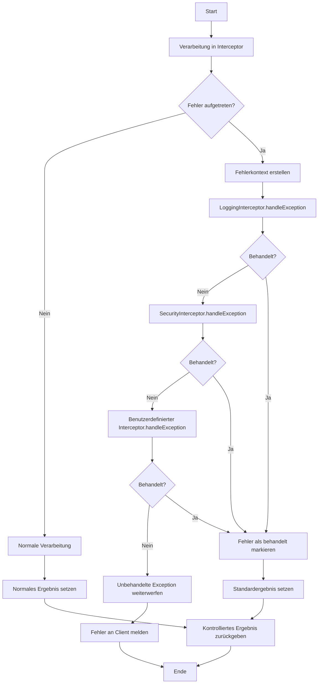