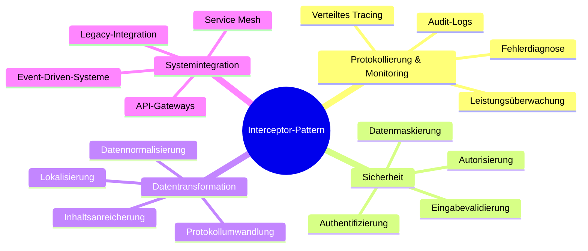
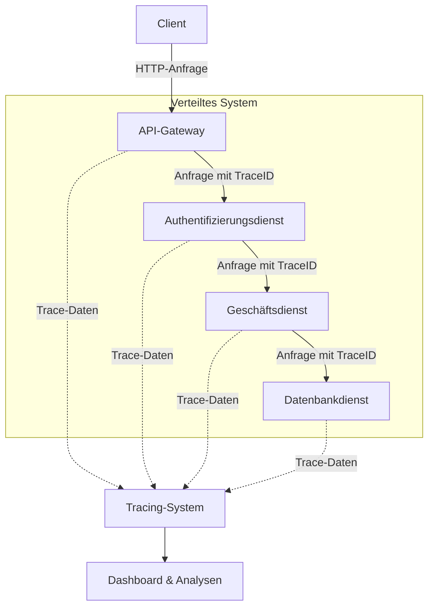
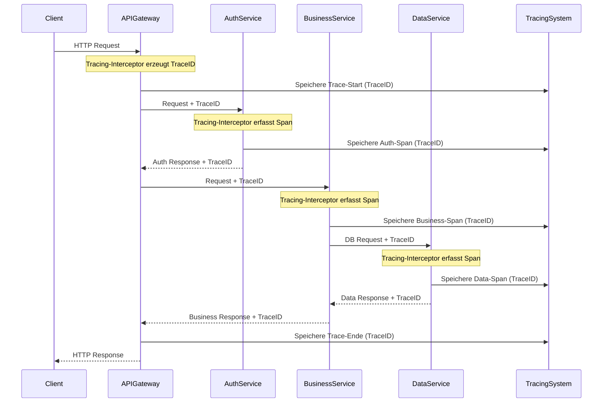
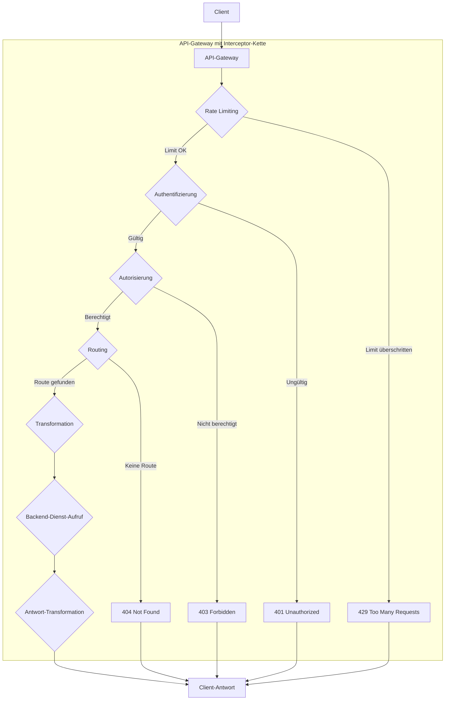
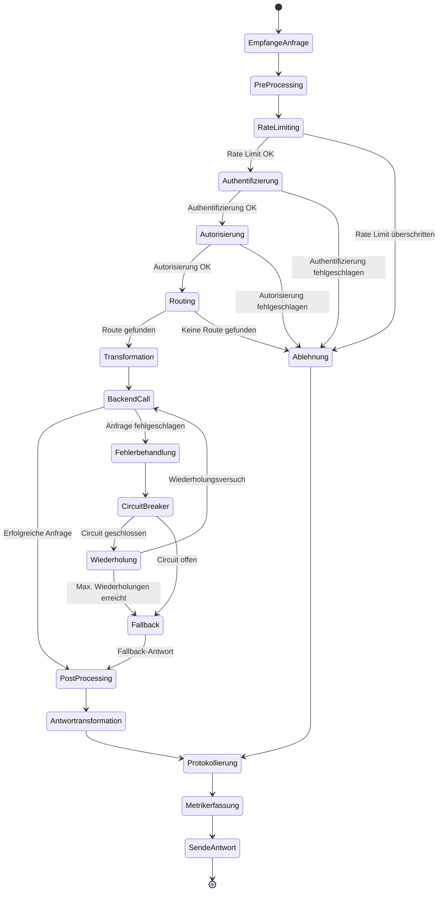
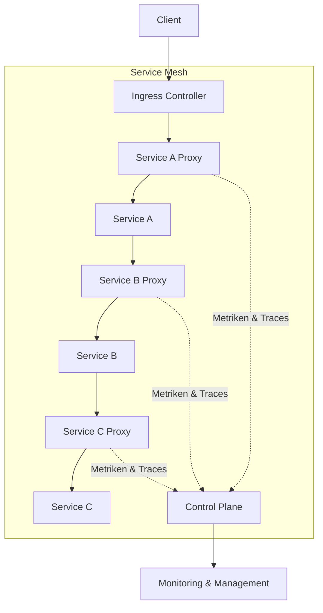
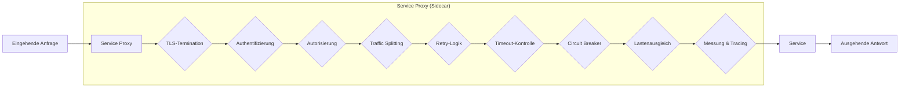
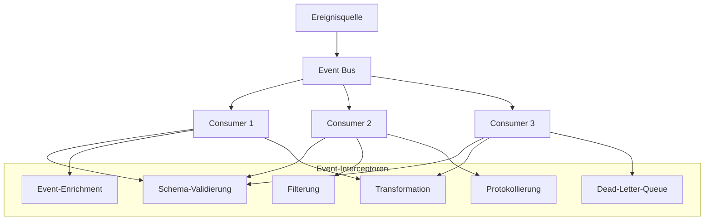
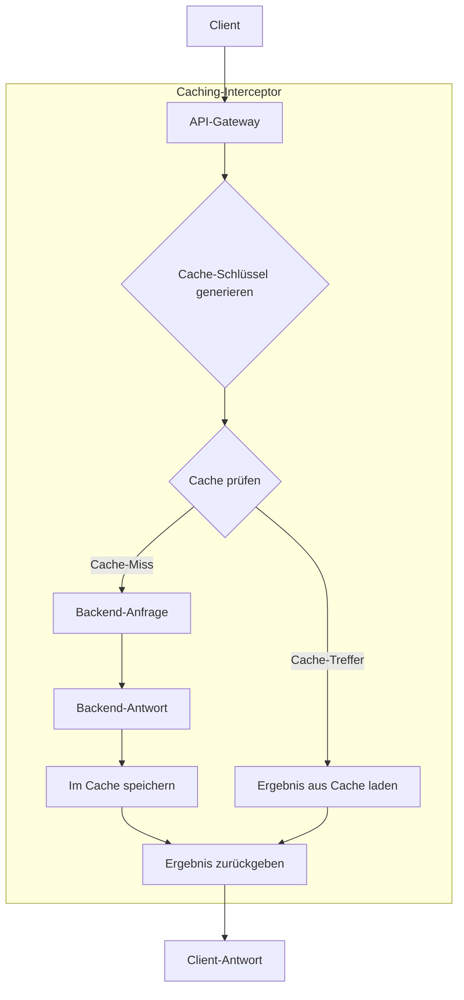

# Anwendungsbeispiele des Interceptor-Patterns in verteilten Systemen

Dieses Dokument stellt reale Anwendungsfälle des Interceptor-Patterns in verteilten Systemen vor und analysiert deren Implementierungsdetails.

## Übersicht der Anwendungsfälle



## Detaillierte Anwendungsfälle

### 1. Verteiltes Tracing in Mikroservice-Architekturen



#### Sequenzdiagramm für verteiltes Tracing



### 2. API-Gateway Implementierung mit mehreren Interceptoren



#### Aktivitätsdiagramm eines API-Gateway-Interceptors



### 3. Service Mesh Implementierung mit Sidecar-Interceptoren



#### Komponentendiagramm eines Service Mesh Proxys



### 4. Event-Driven Architektur mit Interceptoren für Ereignisverarbeitung



### 5. Caching-Implementierung in einem API-Gateway



## Praktische Umsetzungsbeispiele

### Beispiel 1: Spring Framework WebMVC HandlerInterceptor

```java
public class PerformanceInterceptor implements HandlerInterceptor {
    
    private static final Logger logger = LoggerFactory.getLogger(PerformanceInterceptor.class);
    private ThreadLocal<Long> startTimeHolder = new ThreadLocal<>();
    
    @Override
    public boolean preHandle(HttpServletRequest request, HttpServletResponse response, Object handler) {
        long startTime = System.currentTimeMillis();
        startTimeHolder.set(startTime);
        
        // Füge TraceID oder RequestID zum MDC für strukturiertes Logging hinzu
        String requestId = UUID.randomUUID().toString();
        MDC.put("requestId", requestId);
        request.setAttribute("requestId", requestId);
        
        logger.info("Request {} started for path: {}", requestId, request.getRequestURI());
        return true;
    }
    
    @Override
    public void postHandle(HttpServletRequest request, HttpServletResponse response, Object handler, ModelAndView modelAndView) {
        // Postprocess wird vor der Antwortgenerierung aufgerufen
        if (modelAndView != null) {
            modelAndView.addObject("requestId", request.getAttribute("requestId"));
        }
    }
    
    @Override
    public void afterCompletion(HttpServletRequest request, HttpServletResponse response, Object handler, Exception ex) {
        Long startTime = startTimeHolder.get();
        long endTime = System.currentTimeMillis();
        long executionTime = endTime - startTime;
        
        String requestId = (String) request.getAttribute("requestId");
        if (ex != null) {
            logger.error("Request {} completed with error in {} ms: {}", requestId, executionTime, ex.getMessage());
        } else {
            logger.info("Request {} completed successfully in {} ms", requestId, executionTime);
            
            // Metrik für Monitoring-Systeme aufzeichnen
            recordMetric("request.time", executionTime);
            recordMetric("request.status." + response.getStatus(), 1);
        }
        
        startTimeHolder.remove();
        MDC.remove("requestId");
    }
    
    private void recordMetric(String name, long value) {
        // Integration mit Metriksystem wie Prometheus, Micrometer, etc.
    }
}
```

### Beispiel 2: Aspektorientierte Programmierung (AOP) in Java

```java
@Aspect
@Component
public class LoggingAspect {
    
    private static final Logger logger = LoggerFactory.getLogger(LoggingAspect.class);
    
    @Around("@annotation(LogExecutionTime)")
    public Object logExecutionTime(ProceedingJoinPoint joinPoint) throws Throwable {
        long startTime = System.currentTimeMillis();
        
        String methodName = joinPoint.getSignature().getName();
        String className = joinPoint.getSignature().getDeclaringTypeName();
        
        try {
            // Vor der Ausführung (pre-processing)
            logger.info("Starting execution of {}.{}", className, methodName);
            
            // Führe die Methode aus
            Object result = joinPoint.proceed();
            
            // Nach der Ausführung (post-processing)
            long executionTime = System.currentTimeMillis() - startTime;
            logger.info("Execution of {}.{} completed in {} ms", className, methodName, executionTime);
            
            return result;
        } catch (Throwable ex) {
            // Fehlerbehandlung
            long executionTime = System.currentTimeMillis() - startTime;
            logger.error("Execution of {}.{} failed after {} ms with error: {}", 
                    className, methodName, executionTime, ex.getMessage());
            throw ex;
        }
    }
}
```

### Beispiel 3: gRPC Interceptor für verteiltes Tracing

```java
public class TracingInterceptor implements ServerInterceptor {
    
    private final Tracer tracer;
    
    public TracingInterceptor(Tracer tracer) {
        this.tracer = tracer;
    }
    
    @Override
    public <ReqT, RespT> ServerCall.Listener<ReqT> interceptCall(
            ServerCall<ReqT, RespT> call, 
            Metadata headers, 
            ServerCallHandler<ReqT, RespT> next) {
        
        // Extract tracing context from headers
        Context context = Context.current();
        SpanContext parentSpanContext = extractSpanContext(headers);
        
        // Create a new span for this RPC
        Span span = tracer.buildSpan(call.getMethodDescriptor().getFullMethodName())
                .asChildOf(parentSpanContext)
                .withTag("rpc.service", call.getMethodDescriptor().getServiceName())
                .withTag("rpc.method", call.getMethodDescriptor().getBareMethodName())
                .start();
        
        // Store the span in the current context
        context = context.withValue(ACTIVE_SPAN_KEY, span);
        
        try {
            // Proceed with the call using the new context
            return Contexts.interceptCall(context, new TracingServerCall<>(call, span), headers, next);
        } catch (Exception e) {
            span.setTag("error", true);
            span.log(Map.of("event", "error", "error.object", e));
            span.finish();
            throw e;
        }
    }
    
    private SpanContext extractSpanContext(Metadata headers) {
        String traceId = headers.get(TRACE_ID_KEY);
        if (traceId != null) {
            return tracer.extract(Format.Builtin.TEXT_MAP, new TextMapAdapter(headers));
        }
        return null;
    }
    
    private class TracingServerCall<ReqT, RespT> extends ForwardingServerCall.SimpleForwardingServerCall<ReqT, RespT> {
        private final Span span;
        
        TracingServerCall(ServerCall<ReqT, RespT> delegate, Span span) {
            super(delegate);
            this.span = span;
        }
        
        @Override
        public void close(Status status, Metadata trailers) {
            try {
                // Record the status in the span
                span.setTag("rpc.status_code", status.getCode().name());
                if (!status.isOk()) {
                    span.setTag("error", true);
                    span.log(Map.of(
                            "event", "error", 
                            "error.kind", status.getCode().name(),
                            "message", status.getDescription() != null ? status.getDescription() : ""));
                }
                
                // Add tracing information to response trailers
                tracer.inject(span.context(), Format.Builtin.TEXT_MAP, new TextMapAdapter(trailers));
                
                // Finish the span
                span.finish();
            } finally {
                super.close(status, trailers);
            }
        }
    }
}
```

### Beispiel 4: Caching-Interceptor für GraphQL-Anfragen

```java
public class GraphQLCachingInterceptor implements WebGraphQlInterceptor {
    
    private final CacheManager cacheManager;
    private final Cache cache;
    
    public GraphQLCachingInterceptor(CacheManager cacheManager) {
        this.cacheManager = cacheManager;
        this.cache = cacheManager.getCache("graphql-responses");
    }
    
    @Override
    public Mono<WebGraphQlResponse> intercept(WebGraphQlRequest request, Chain chain) {
        // Prüfe, ob die Anfrage cacheable ist
        if (!isCacheable(request)) {
            return chain.next(request);
        }
        
        // Generiere einen Cache-Key für die Anfrage
        String cacheKey = generateCacheKey(request);
        
        // Prüfe, ob die Antwort im Cache ist
        WebGraphQlResponse cachedResponse = cache.get(cacheKey, WebGraphQlResponse.class);
        if (cachedResponse != null) {
            return Mono.just(cachedResponse);
        }
        
        // Wenn nicht im Cache, führe die Anfrage aus und speichere das Ergebnis
        return chain.next(request)
                .doOnNext(response -> {
                    if (isCacheableResponse(response)) {
                        cache.put(cacheKey, response);
                    }
                });
    }
    
    private boolean isCacheable(WebGraphQlRequest request) {
        // Nur Abfragen cachen, keine Mutationen
        Map<String, Object> variables = request.getVariables();
        String operationType = request.getOperationName();
        
        // Prüfe, ob die Abfrage ein @cacheControl-Direktive hat
        // Hier könnten weitere Bedingungen geprüft werden
        return "query".equals(operationType) && !variables.isEmpty();
    }
    
    private boolean isCacheableResponse(WebGraphQlResponse response) {
        // Nur erfolgreiche Antworten ohne Fehler cachen
        return !response.isValid() || response.getErrors().isEmpty();
    }
    
    private String generateCacheKey(WebGraphQlRequest request) {
        StringBuilder keyBuilder = new StringBuilder();
        keyBuilder.append(request.getDocument());
        keyBuilder.append(";");
        keyBuilder.append(request.getOperationName());
        keyBuilder.append(";");
        keyBuilder.append(request.getVariables().toString());
        
        return DigestUtils.md5DigestAsHex(keyBuilder.toString().getBytes());
    }
}
```

### Beispiel 5: Security-Interceptor für JWT-Validierung in einem API-Gateway

```java
public class JwtSecurityInterceptor implements GatewayFilter, Ordered {
    
    private final JwtTokenValidator tokenValidator;
    private final String authHeader;
    
    public JwtSecurityInterceptor(JwtTokenValidator tokenValidator, String authHeader) {
        this.tokenValidator = tokenValidator;
        this.authHeader = authHeader;
    }
    
    @Override
    public Mono<Void> filter(ServerWebExchange exchange, GatewayFilterChain chain) {
        ServerHttpRequest request = exchange.getRequest();
        
        // JWT-Token aus dem Header extrahieren
        List<String> authHeaders = request.getHeaders().get(authHeader);
        if (authHeaders == null || authHeaders.isEmpty()) {
            return onError(exchange, "Authorization header is missing", HttpStatus.UNAUTHORIZED);
        }
        
        String authHeader = request.getHeaders().getFirst(this.authHeader);
        String token = extractToken(authHeader);
        if (token == null) {
            return onError(exchange, "Invalid Authorization header format", HttpStatus.UNAUTHORIZED);
        }
        
        try {
            // Token validieren
            Claims claims = tokenValidator.validateToken(token);
            
            // Extrahierte Informationen an die Request anhängen
            ServerHttpRequest modifiedRequest = exchange.getRequest().mutate()
                    .header("X-User-Id", claims.getSubject())
                    .header("X-User-Roles", claims.get("roles", String.class))
                    .build();
            
            // Weiter mit der modifizierten Request
            return chain.filter(exchange.mutate().request(modifiedRequest).build());
            
        } catch (JwtException e) {
            return onError(exchange, "Invalid JWT token: " + e.getMessage(), HttpStatus.UNAUTHORIZED);
        }
    }
    
    private String extractToken(String authHeader) {
        if (authHeader != null && authHeader.startsWith("Bearer ")) {
            return authHeader.substring(7);
        }
        return null;
    }
    
    private Mono<Void> onError(ServerWebExchange exchange, String message, HttpStatus status) {
        ServerHttpResponse response = exchange.getResponse();
        response.setStatusCode(status);
        
        byte[] bytes = message.getBytes(StandardCharsets.UTF_8);
        DataBuffer buffer = exchange.getResponse().bufferFactory().wrap(bytes);
        
        response.getHeaders().add("Content-Type", "application/json");
        return response.writeWith(Mono.just(buffer));
    }
    
    @Override
    public int getOrder() {
        return Ordered.HIGHEST_PRECEDENCE;
    }
}
```