# Implementierungsleitfaden für das Observer-Pattern

Dieser Leitfaden beschreibt den Implementierungsprozess des Observer-Patterns in verteilten Systemen anhand praktischer Beispiele aus diesem Projekt.

## Inhaltsverzeichnis

1. [Wann sollte das Observer-Pattern verwendet werden?](#wann-sollte-das-observer-pattern-verwendet-werden)
2. [Schrittweise Implementierung](#schrittweise-implementierung)
3. [Implementierungsbeispiele](#implementierungsbeispiele)
4. [Best Practices](#best-practices)
5. [Häufige Fehler](#häufige-fehler)
6. [Performanceüberlegungen](#performanceüberlegungen)

## Wann sollte das Observer-Pattern verwendet werden?

Das Observer-Pattern ist in folgenden Situationen besonders nützlich:

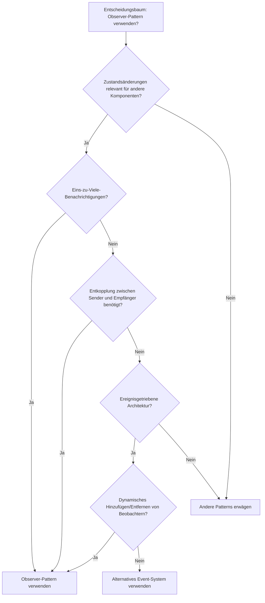

## Schrittweise Implementierung

### 1. Observer-Schnittstelle definieren

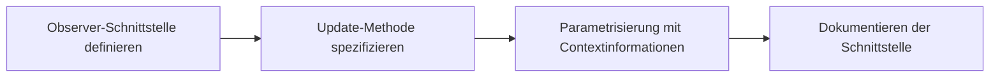

### 2. Subject-Schnittstelle definieren

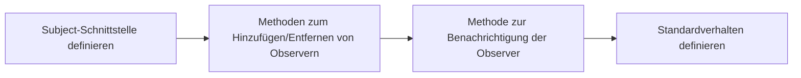

### 3. Konkrete Klassen implementieren

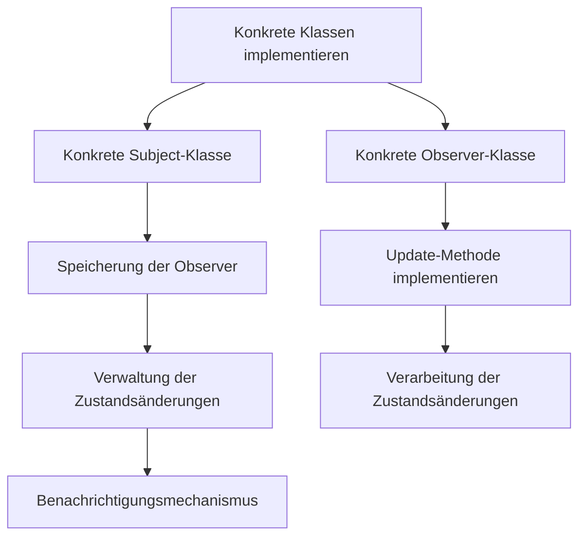

## Implementierungsbeispiele

### Beispiel 1: Einfaches Observer-Pattern

Dieses Diagramm zeigt die Struktur und den Datenfluss im einfachen Observer-Pattern:

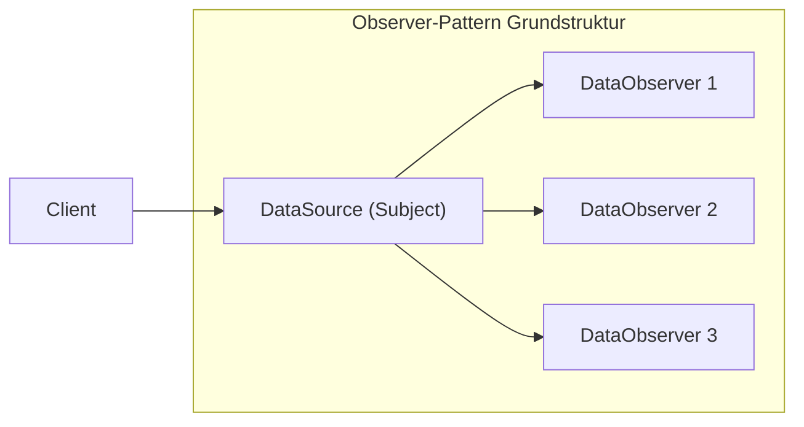

### Beispiel 2: Verteiltes Observer-Pattern (Publish-Subscribe)

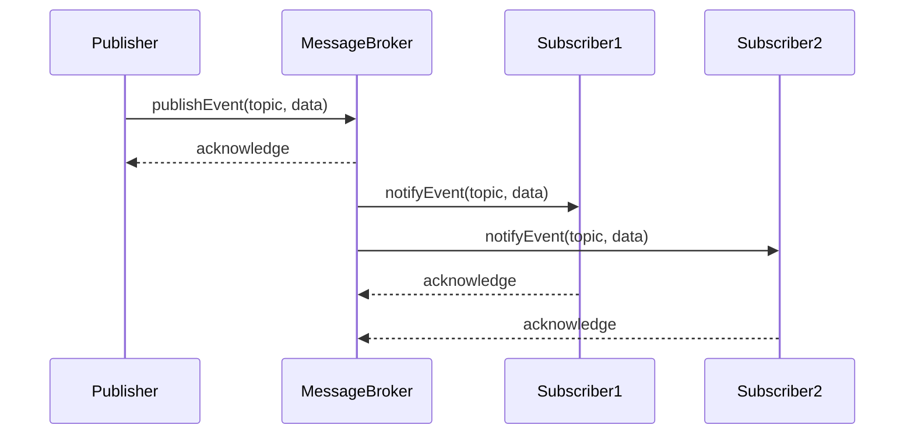

## Best Practices

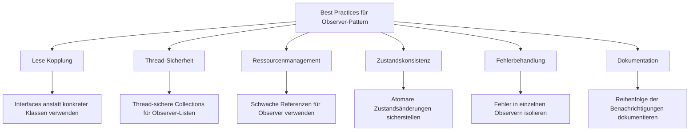

## Häufige Fehler

Die folgenden Fehler sollten bei der Implementierung des Observer-Patterns vermieden werden:

```mermaid
graph TD
    A[Häufige Fehler] --> B[Memory Leaks]
    A --> C[Rekursive Benachrichtigungen]
    A --> D[Inkonsistenter Zustand]
    A --> E[Ineffiziente Benachrichtigungen]
    A --> F[Reihenfolgeabhängigkeit]
    
    B --> B1[Observer nicht deregistrieren führt zu Memory Leaks]
    C --> C1[Zustandsänderungen in update() lösen weitere Benachrichtigungen aus]
    D --> D1[Observer erhalten inkonsistenten Zustand während Updates]
    E --> E1[Unnötige Benachrichtigungen bei ungänderten Zuständen]
    F --> F1[Abhängigkeit von der Reihenfolge der Observer-Benachrichtigungen]
```

## Performanceüberlegungen

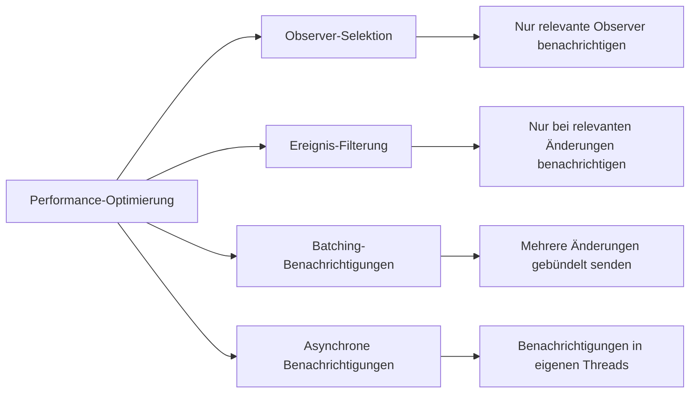

## Varianten des Observer-Patterns

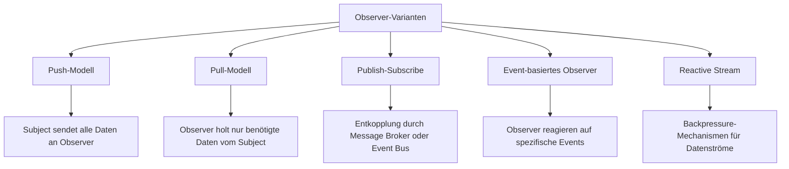

## Herausforderungen in verteilten Systemen

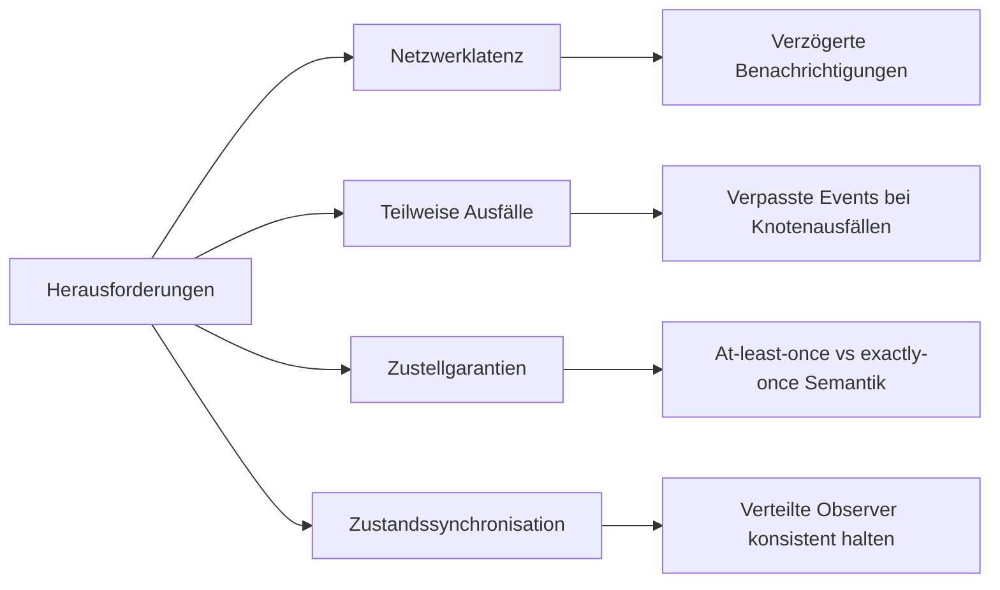

## Moderne Alternativen zum Observer-Pattern

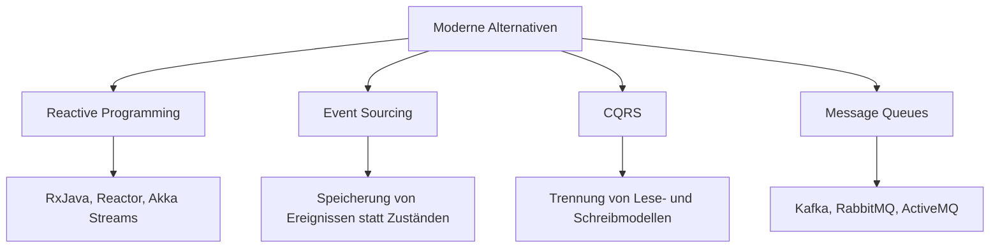
