# Vergleich des Observer-Patterns mit anderen Entwurfsmustern

Dieses Dokument vergleicht das Observer-Pattern mit anderen verwandten Entwurfsmustern und hilft bei der Entscheidung, welches Muster in verschiedenen Situationen am besten geeignet ist.

## Observer vs. andere Entwurfsmuster

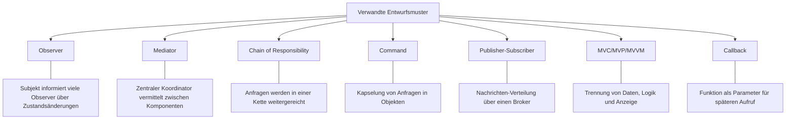

## Entscheidungshilfe: Welches Muster wann?

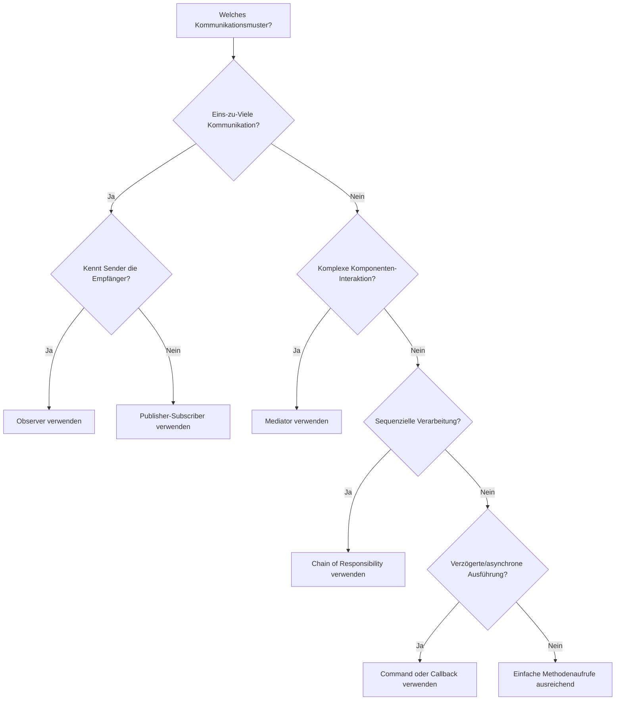

## Detaillierter Vergleich: Observer vs. andere Muster

### Observer vs. Publisher-Subscriber

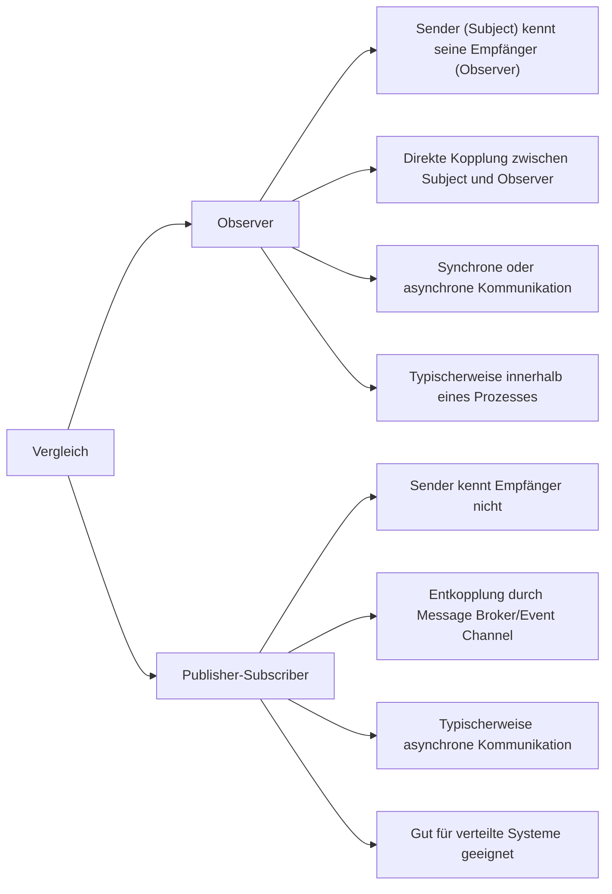

### Observer vs. Mediator

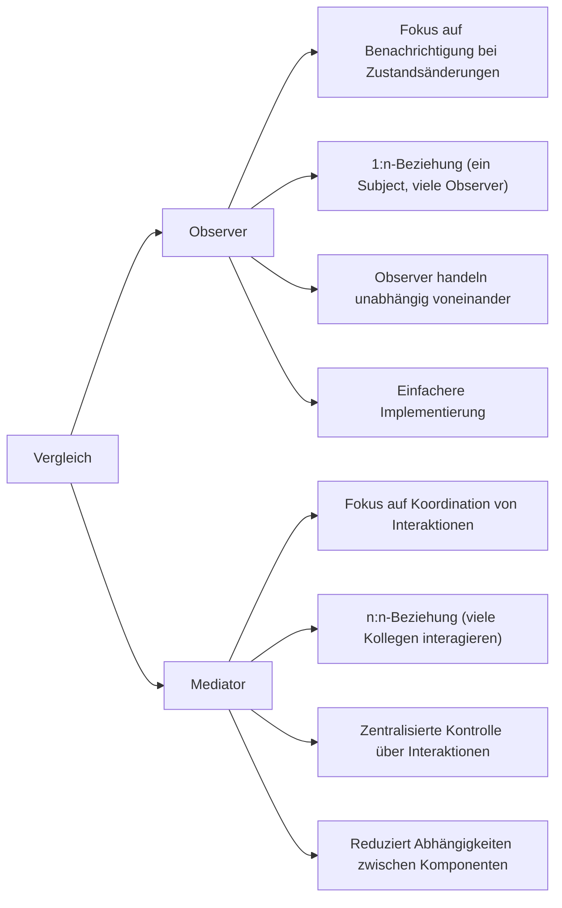

### Observer vs. Callback

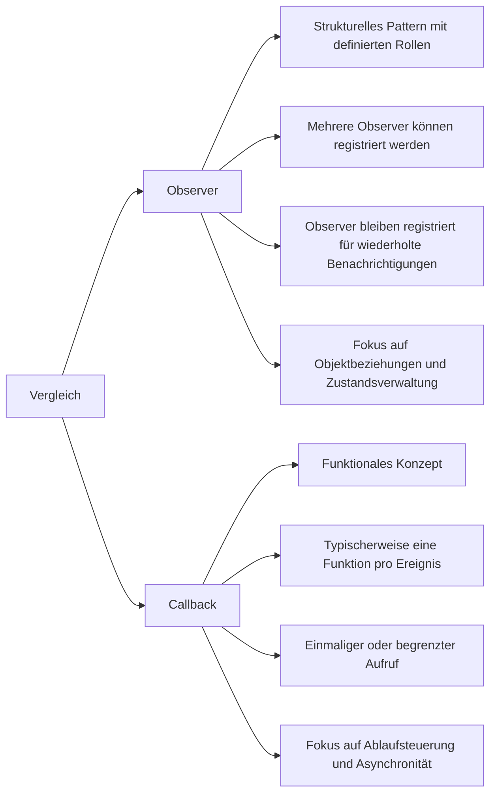

### Observer vs. Event-Listener

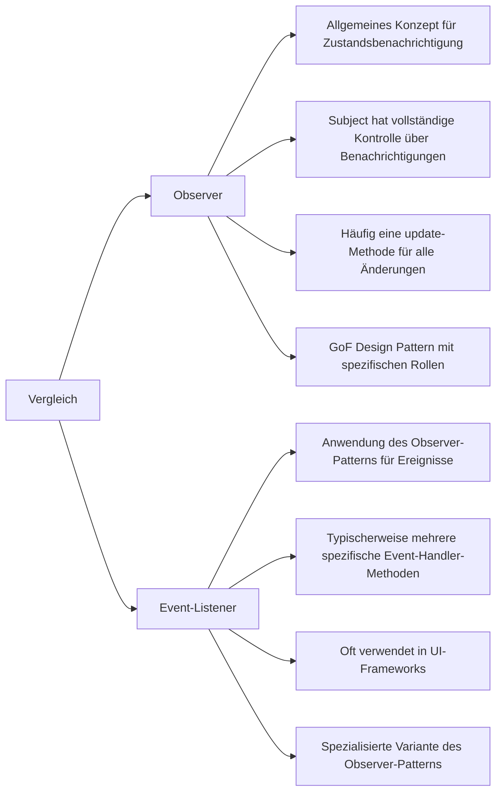

### Observer vs. Reactive Streams

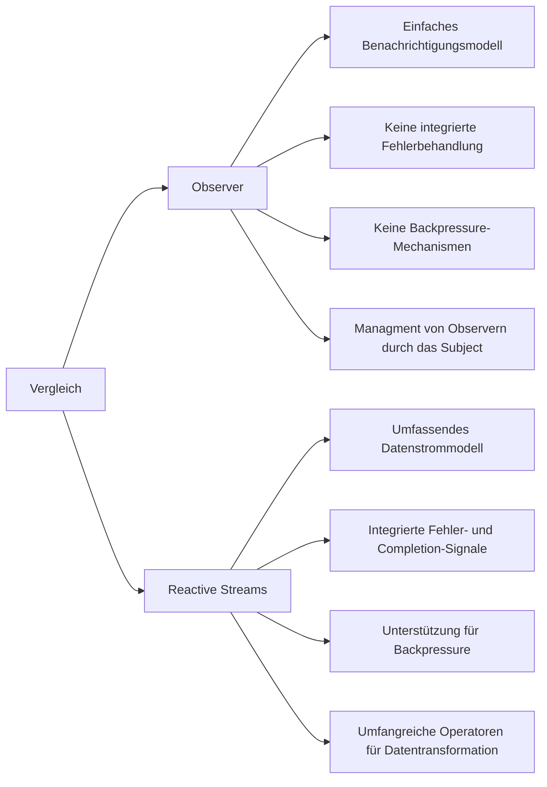

## Anwendungsfälle verschiedener Muster in der Praxis

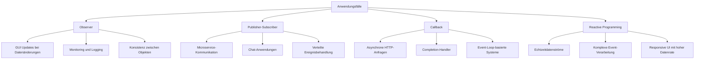

## Kombination von Mustern

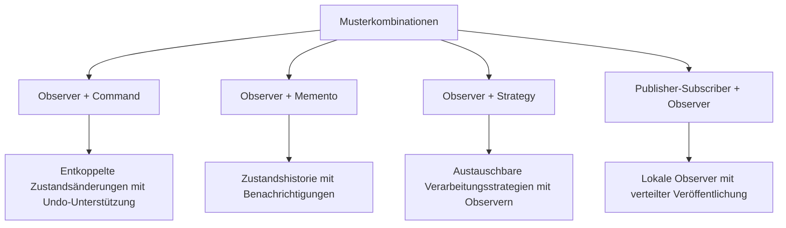

## Evolutionspfad verteilter Beobachtermuster

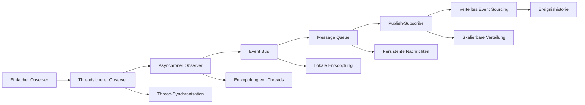

## Observer in MVC-Architekturen

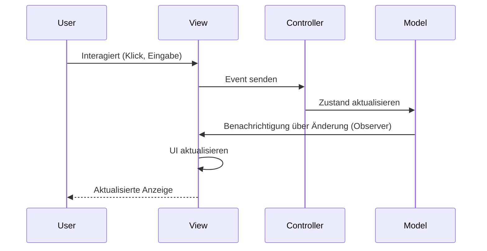

## Vergleichsmatrix: Vor- und Nachteile

| Muster | Stärken | Schwächen | Ideale Anwendungsfälle |
|--------|---------|-----------|------------------------|
| Observer | Lose Kopplung, einfach zu implementieren | Potenzielle Memory Leaks, Reihenfolgeabhängigkeit | GUI-Updates, Dokumentenänderungen, lokale Ereignisbehandlung |
| Publisher-Subscriber | Vollständige Entkopplung, gut für verteilte Systeme | Höhere Komplexität, schwieriger zu debuggen | Microservices, verteilte Systeme, Message-basierte Architekturen |
| Mediator | Zentralisierte Kontrolle, reduzierte Abhängigkeiten | Mediator kann komplex werden, potenzieller Single Point of Failure | Komplexe UI-Komponenten, Flugsicherungssysteme, Chat-Räume |
| Callback | Einfach, funktional, direkt | Callback Hell, schwer zu verketten | Asynchrone Operationen, Event-Handler, HTTP-Anfragen |
| Reactive Streams | Umfassende Datenverarbeitung, Backpressure | Steile Lernkurve, Overhead für einfache Anwendungsfälle | Echtzeit-Datenströme, komplexe Event-Verarbeitungsketten, hochperformante UIs |

## Moderne Implementierungen des Observer-Patterns

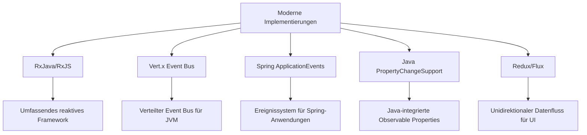

## Migration von Observer zu modernen Alternativen

```mermaid
graph TD
    A[Migration vom Observer] --> B[Zu Reactive Streams]
    A --> C[Zu Event Bus]
    A --> D[Zu CQRS/Event Sourcing]
    
    B --> B1[Observer durch Observables ersetzen]
    B --> B2[update() durch onNext(), onError(), onComplete() ersetzen]
    
    C --> C1[EventBus als Vermittler einführen]
    C --> C2[Topics anstelle direkter Observer-Registrierung]
    
    D --> D1[Befehle und Ereignisse modellieren]
    D --> D2[Ereignisverlauf speichern]
    
    B1 --> E[Unterstützung für Backpressure hinzufügen]
    C1 --> F[Lokale Tests mit In-Memory-Bus]
    D1 --> G[Write-Modell von Read-Modell trennen]
```