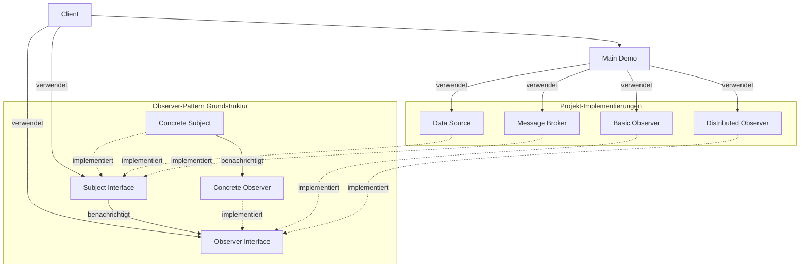
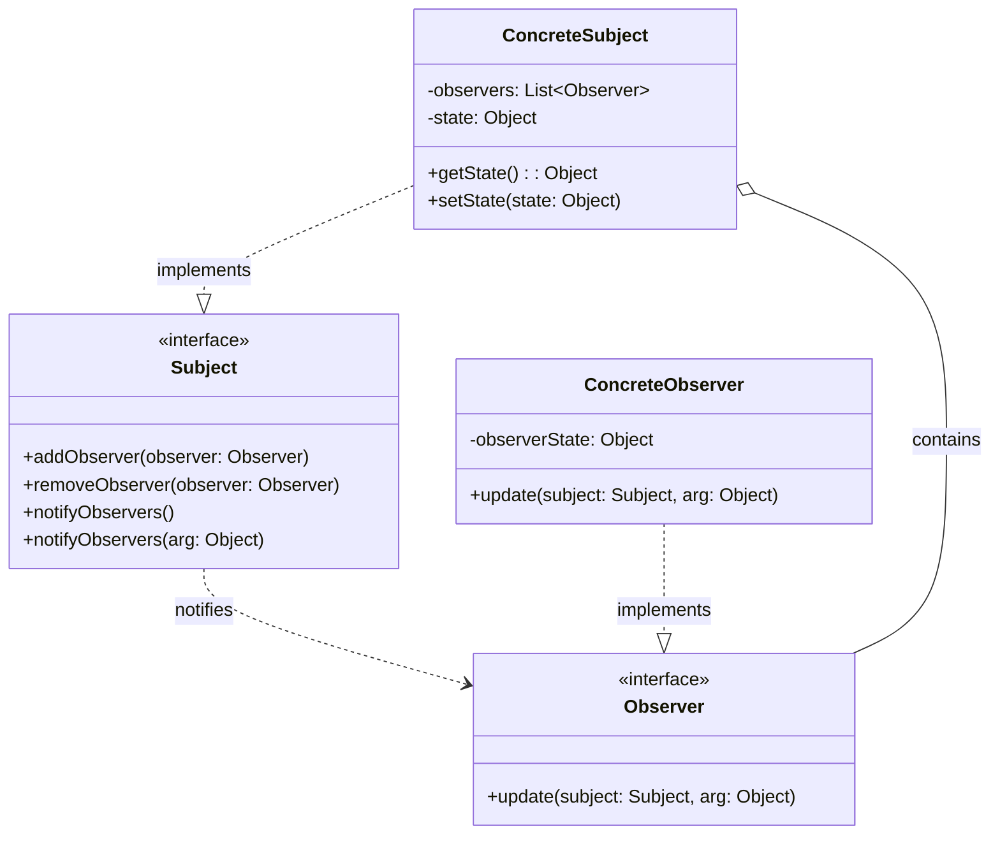
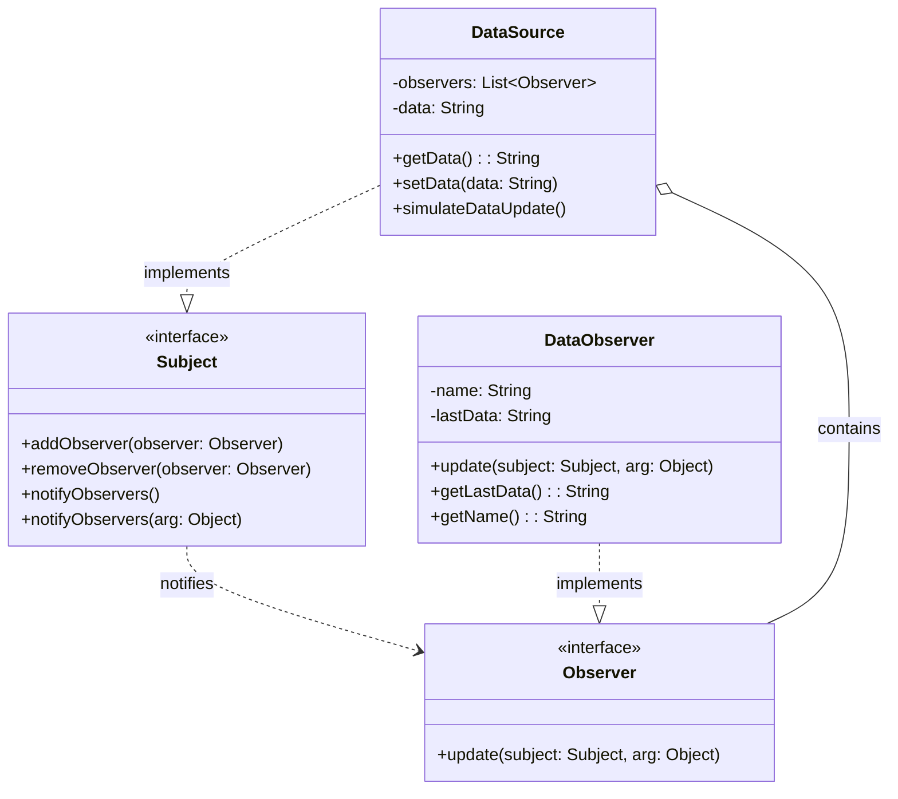
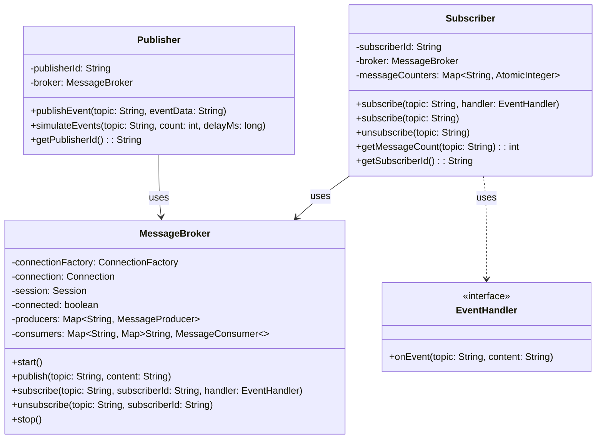
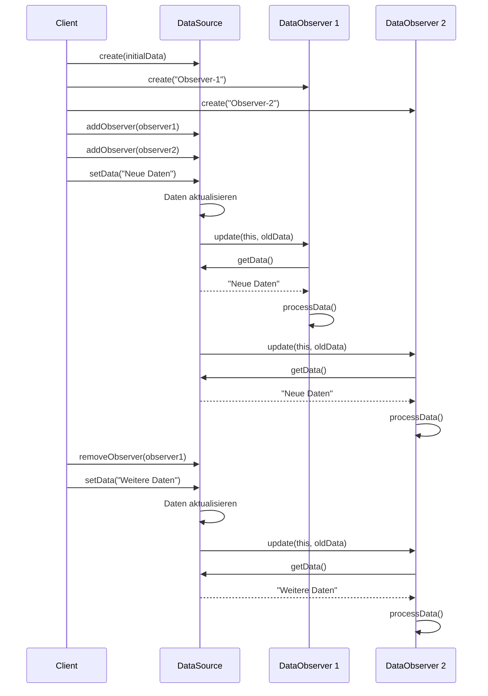
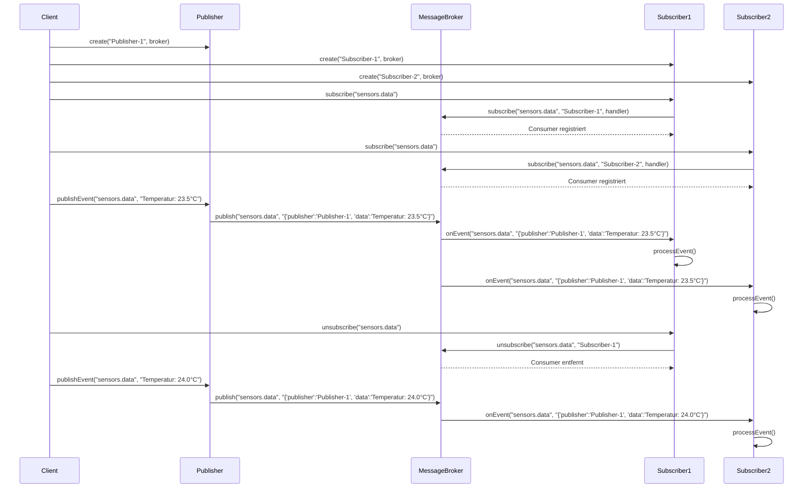
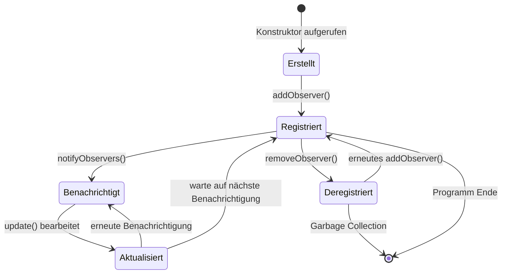
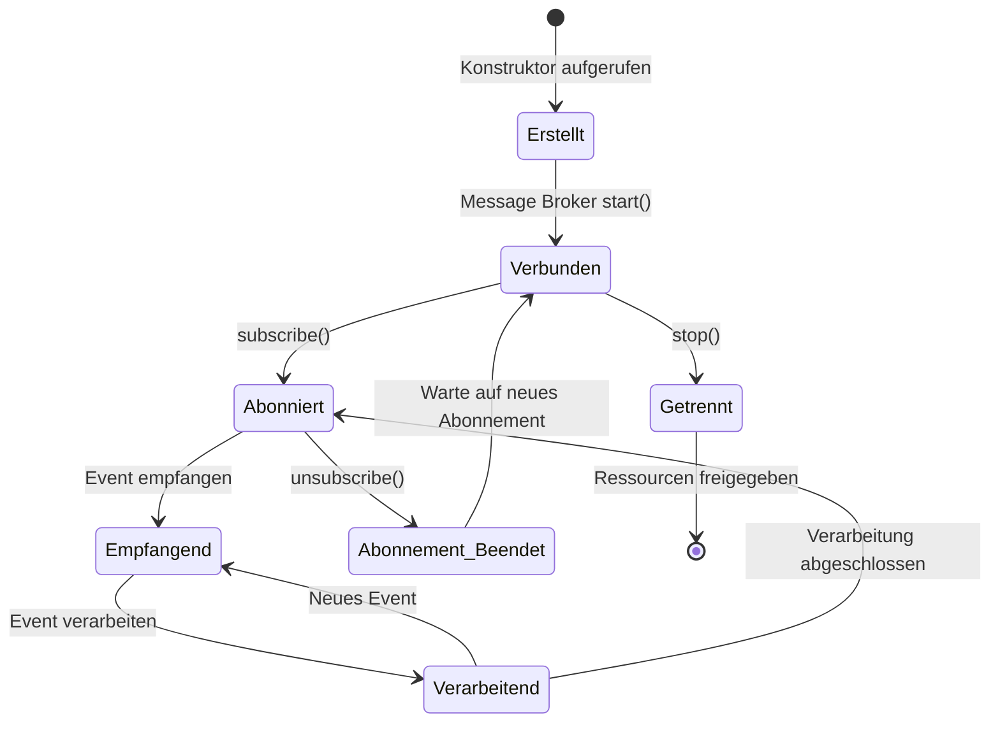
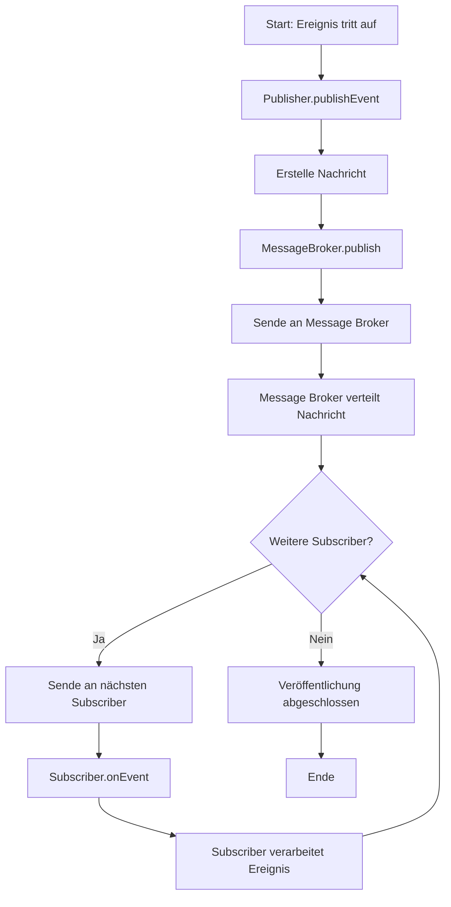

# Observer-Pattern Dokumentation

Diese Dokumentation enthält verschiedene Diagramme zur Veranschaulichung des Observer-Patterns und der konkreten Implementierung in diesem Projekt.

## Inhalt

- [Komponentendiagramm](#komponentendiagramm)
- [Klassendiagramme](#klassendiagramme)
- [Sequenzdiagramme](#sequenzdiagramme)
- [Zustandsdiagramme](#zustandsdiagramme)
- [Aktivitätsdiagramme](#aktivitätsdiagramme)

## Komponentendiagramm

Das folgende Diagramm zeigt die Hauptkomponenten des Projekts und ihre Beziehungen zueinander:



## Klassendiagramme

### Allgemeines Observer-Klassendiagramm

Das folgende Diagramm zeigt die allgemeine Struktur des Observer-Patterns:



### DataSource-Klassendiagramm



### Verteiltes Observer-Klassendiagramm



## Sequenzdiagramme

### Einfaches Observer-Sequenzdiagramm



### Verteiltes Observer-Sequenzdiagramm



## Zustandsdiagramme

### Observer-Lebenszyklus



### Verteilter Observer-Lebenszyklus



## Aktivitätsdiagramme

### Grundlegendes Observer-Aktivitätsdiagramm

```mermaid
flowchart TD
    A[Start: Zustandsänderung] --> B[Subject.setState()]
    B --> C[Speichere neuen Zustand]
    C --> D[notifyObservers aufrufen]
    D --> E[Kopie der Observer-Liste erstellen]
    E --> F{Weitere Observer?}
    
    F -->|Ja| G[Nächsten Observer auswählen]
    G --> H[Observer.update aufrufen]
    H --> I[Observer fragt Zustand ab]
    I --> J[Observer verarbeitet Zustand]
    J --> F
    
    F -->|Nein| K[Ende der Benachrichtigung]
    K --> L[Ende]
```

### Verteiltes Observer-Aktivitätsdiagramm


