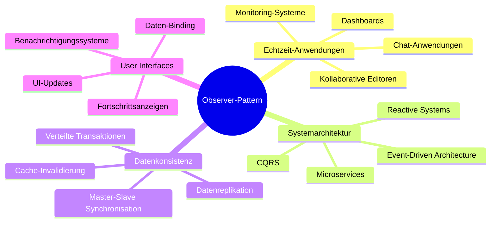
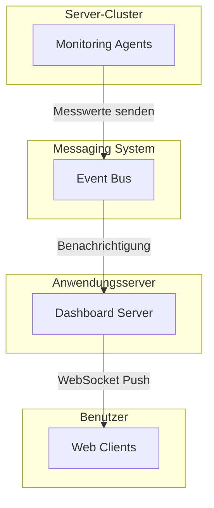
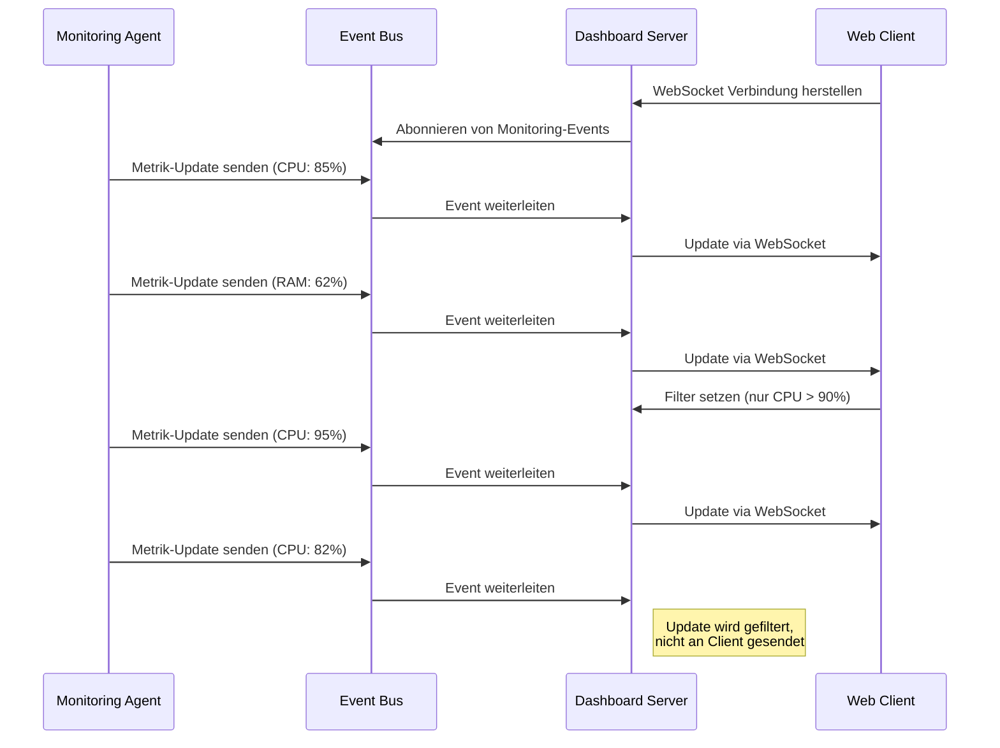
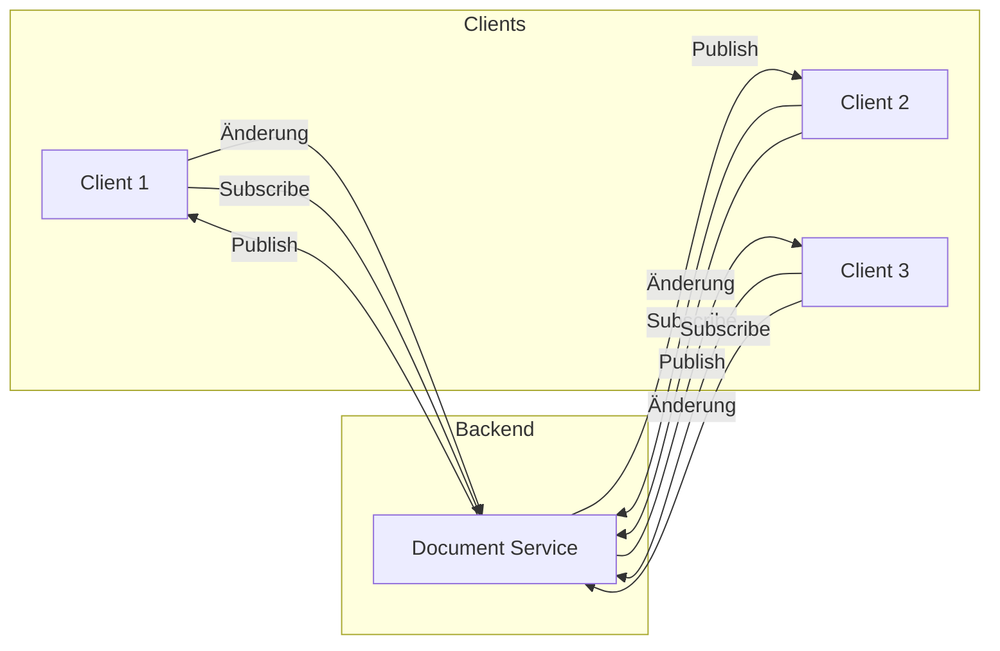
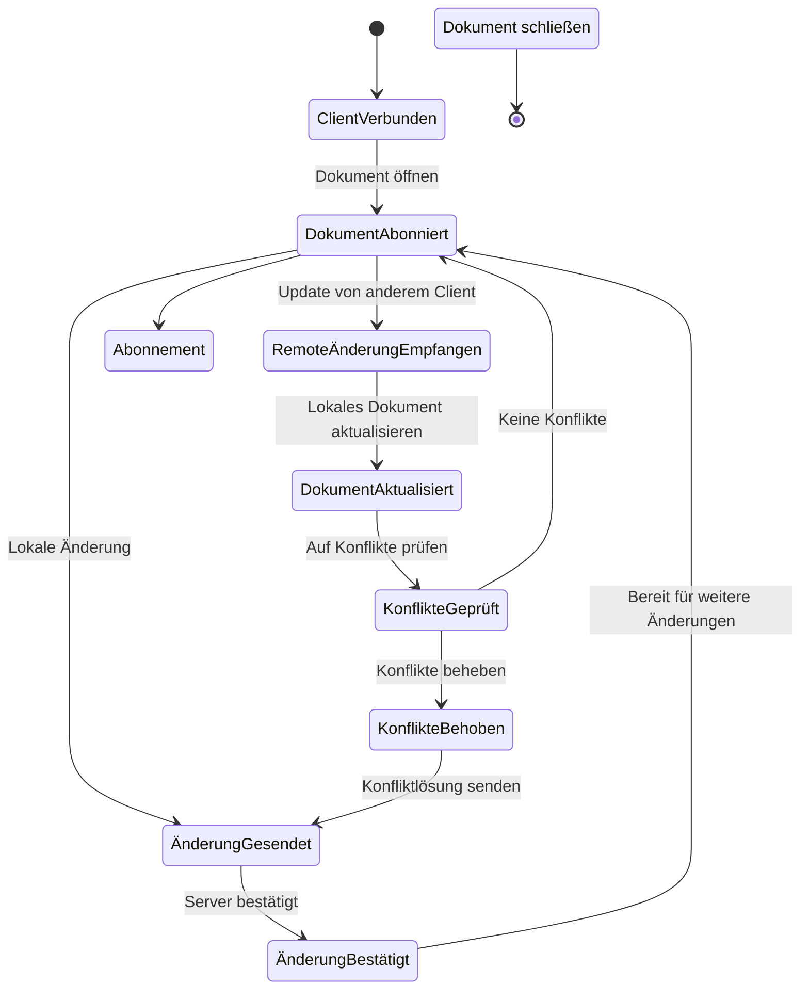
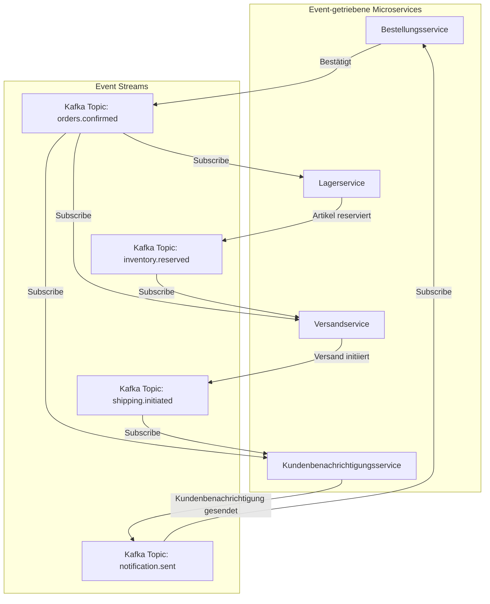
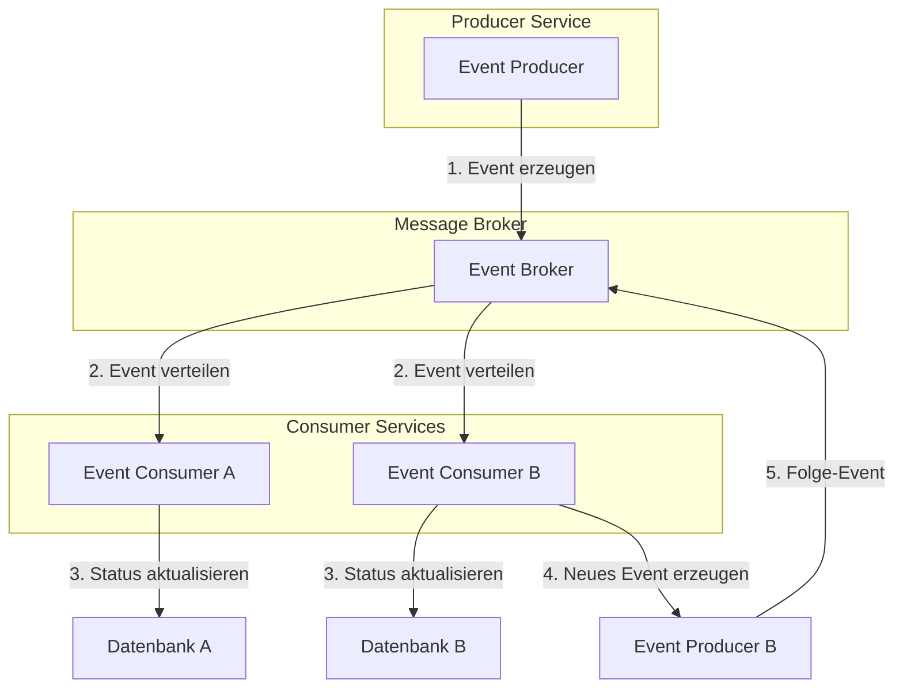
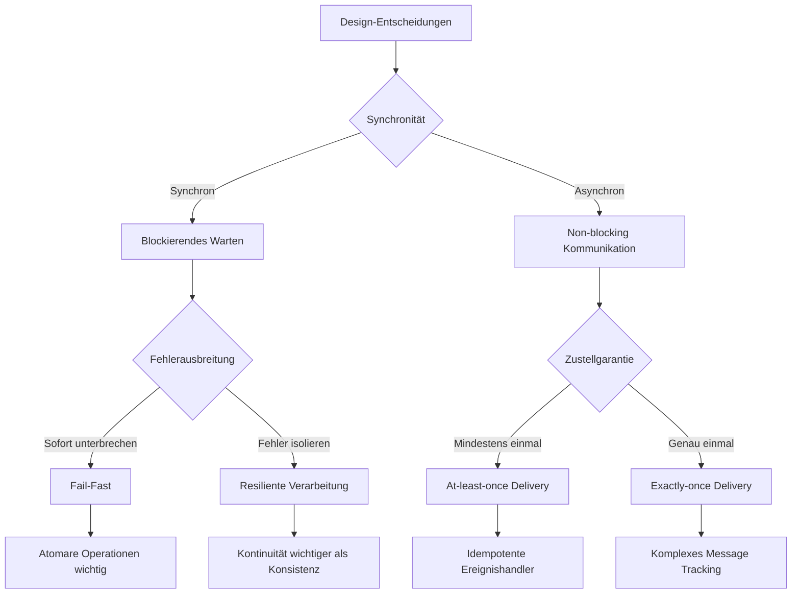
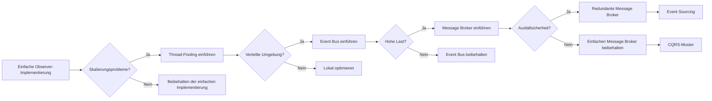

# Anwendungsbeispiele des Observer-Patterns in verteilten Systemen

Dieses Dokument stellt reale Anwendungsfälle des Observer-Patterns in verteilten Systemen vor und analysiert deren Implementierungsdetails.

## Übersicht der Anwendungsfälle



## Detaillierte Anwendungsfälle

### 1. Echtzeit-Dashboard für verteilte Systemüberwachung



#### Sequenzdiagramm eines Dashboard-Updates



### 2. Kollaborativer Dokumenteneditor



#### Aktivitätsdiagramm einer kollaborativen Bearbeitung



### 3. Microservice-Event-Benachrichtigungen



#### Komponentendiagramm einer Microservice-Architektur



## Design-Entscheidungen bei verteilten Observern



## Evolutionspfad für Observer-Implementierungen



## Praktische Umsetzungsbeispiele

### Beispiel 1: Implementierung eines verteilten Observer-Patterns mit JMS

```java
// Publisher-Seite
public class EventPublisher {
    private final ConnectionFactory connectionFactory;
    private final String topicName;
    
    public EventPublisher(ConnectionFactory connectionFactory, String topicName) {
        this.connectionFactory = connectionFactory;
        this.topicName = topicName;
    }
    
    public void publishEvent(String eventType, String eventData) throws JMSException {
        try (Connection connection = connectionFactory.createConnection();
             Session session = connection.createSession(false, Session.AUTO_ACKNOWLEDGE)) {
            
            Topic topic = session.createTopic(topicName);
            MessageProducer producer = session.createProducer(topic);
            
            // Event als JSON serialisieren
            String jsonEvent = String.format("{'eventType':'%s','data':'%s'}", 
                    eventType, eventData);
            
            TextMessage message = session.createTextMessage(jsonEvent);
            producer.send(message);
            
            System.out.println("Event veröffentlicht: " + jsonEvent);
        }
    }
}

// Subscriber-Seite
public class EventSubscriber implements MessageListener {
    private final ConnectionFactory connectionFactory;
    private final String topicName;
    private final String subscriberId;
    private Connection connection;
    
    public EventSubscriber(ConnectionFactory connectionFactory, 
                           String topicName, 
                           String subscriberId) {
        this.connectionFactory = connectionFactory;
        this.topicName = topicName;
        this.subscriberId = subscriberId;
    }
    
    public void subscribe() throws JMSException {
        connection = connectionFactory.createConnection();
        Session session = connection.createSession(false, Session.AUTO_ACKNOWLEDGE);
        
        Topic topic = session.createTopic(topicName);
        MessageConsumer consumer = session.createConsumer(topic);
        
        consumer.setMessageListener(this);
        connection.start();
        
        System.out.println("Subscriber " + subscriberId + " hat Topic " + 
                topicName + " abonniert");
    }
    
    @Override
    public void onMessage(Message message) {
        try {
            if (message instanceof TextMessage) {
                TextMessage textMessage = (TextMessage) message;
                String text = textMessage.getText();
                
                System.out.println("Subscriber " + subscriberId + 
                        " hat Nachricht empfangen: " + text);
                
                // Event verarbeiten...
                processEvent(text);
            }
        } catch (JMSException e) {
            System.err.println("Fehler beim Verarbeiten der Nachricht: " + e.getMessage());
        }
    }
    
    private void processEvent(String eventJson) {
        // Event-Verarbeitung implementieren
        System.out.println("Verarbeite Event: " + eventJson);
    }
    
    public void unsubscribe() {
        try {
            if (connection != null) {
                connection.close();
                System.out.println("Subscriber " + subscriberId + 
                        " hat Abonnement beendet");
            }
        } catch (JMSException e) {
            System.err.println("Fehler beim Beenden des Abonnements: " + e.getMessage());
        }
    }
}
```

### Beispiel 2: Verteiltes Observer-Pattern mit Redis Pub/Sub

```java
public class RedisPubSubExample {
    private static final String CHANNEL = "events";
    
    // Publisher-Seite
    public static class EventPublisher {
        private final Jedis jedis;
        
        public EventPublisher(String redisHost, int redisPort) {
            this.jedis = new Jedis(redisHost, redisPort);
        }
        
        public void publishEvent(String eventType, String eventData) {
            // Event als JSON serialisieren
            String jsonEvent = String.format("{'eventType':'%s','data':'%s'}", 
                    eventType, eventData);
            
            // Veröffentlichen über Redis Pub/Sub
            long receiverCount = jedis.publish(CHANNEL, jsonEvent);
            
            System.out.println("Event an " + receiverCount + 
                    " Empfänger veröffentlicht: " + jsonEvent);
        }
        
        public void close() {
            if (jedis != null) {
                jedis.close();
            }
        }
    }
    
    // Subscriber-Seite
    public static class EventSubscriber {
        private final Jedis jedis;
        private final String subscriberId;
        private final JedisPubSub jedisPubSub;
        
        public EventSubscriber(String redisHost, int redisPort, String subscriberId) {
            this.jedis = new Jedis(redisHost, redisPort);
            this.subscriberId = subscriberId;
            
            // PubSub-Handler erstellen
            this.jedisPubSub = new JedisPubSub() {
                @Override
                public void onMessage(String channel, String message) {
                    System.out.println("Subscriber " + subscriberId + 
                            " hat Nachricht auf Kanal " + channel + 
                            " empfangen: " + message);
                    
                    // Event verarbeiten
                    processEvent(message);
                }
                
                @Override
                public void onSubscribe(String channel, int subscribedChannels) {
                    System.out.println("Subscriber " + subscriberId + 
                            " hat Kanal " + channel + " abonniert");
                }
                
                @Override
                public void onUnsubscribe(String channel, int subscribedChannels) {
                    System.out.println("Subscriber " + subscriberId + 
                            " hat Abonnement für Kanal " + channel + " beendet");
                }
            };
        }
        
        public void subscribe() {
            // Starte Subscription in separatem Thread
            new Thread(() -> {
                System.out.println("Subscriber " + subscriberId + 
                        " startet Abonnement für Kanal " + CHANNEL);
                jedis.subscribe(jedisPubSub, CHANNEL);
            }).start();
        }
        
        public void unsubscribe() {
            if (jedisPubSub != null) {
                jedisPubSub.unsubscribe();
            }
            
            if (jedis != null) {
                jedis.close();
            }
        }
        
        private void processEvent(String eventJson) {
            // Event-Verarbeitung implementieren
            System.out.println("Verarbeite Event: " + eventJson);
        }
    }
}
```

### Beispiel 3: Verteiltes Observer-Pattern mit Spring Cloud Stream

```java
// Config-Klasse
@Configuration
@EnableBinding(EventChannels.class)
public class EventStreamConfig {
    // Konfiguration für Cloud Stream
}

// Kanaldefinitionen
public interface EventChannels {
    String INPUT_CHANNEL = "event-input";
    String OUTPUT_CHANNEL = "event-output";
    
    @Input(INPUT_CHANNEL)
    SubscribableChannel input();
    
    @Output(OUTPUT_CHANNEL)
    MessageChannel output();
}

// Event-Publisher
@Service
public class EventPublisher {
    private final EventChannels channels;
    
    @Autowired
    public EventPublisher(EventChannels channels) {
        this.channels = channels;
    }
    
    public void publishEvent(String eventType, Object eventData) {
        Event event = new Event(eventType, eventData);
        Message<Event> message = MessageBuilder.withPayload(event).build();
        
        boolean sent = channels.output().send(message);
        if (sent) {
            System.out.println("Event erfolgreich veröffentlicht: " + event);
        } else {
            System.err.println("Fehler beim Veröffentlichen des Events: " + event);
        }
    }
}

// Event-Consumer (Observer)
@Service
public class EventConsumer {
    
    @StreamListener(EventChannels.INPUT_CHANNEL)
    public void handleEvent(Event event) {
        System.out.println("Event empfangen: " + event);
        
        // Event basierend auf Typ verarbeiten
        switch(event.getType()) {
            case "USER_CREATED":
                handleUserCreated(event);
                break;
            case "ORDER_PLACED":
                handleOrderPlaced(event);
                break;
            default:
                System.out.println("Unbekannter Event-Typ: " + event.getType());
        }
    }
    
    private void handleUserCreated(Event event) {
        System.out.println("Verarbeite USER_CREATED Event: " + event.getData());
        // Implementierung...
    }
    
    private void handleOrderPlaced(Event event) {
        System.out.println("Verarbeite ORDER_PLACED Event: " + event.getData());
        // Implementierung...
    }
}

// Event-Klasse
public class Event {
    private String type;
    private Object data;
    private long timestamp;
    
    public Event() {
        this.timestamp = System.currentTimeMillis();
    }
    
    public Event(String type, Object data) {
        this();
        this.type = type;
        this.data = data;
    }
    
    // Getter und Setter...
}
```
