# Implementierungsleitfaden für das Pipeline-Pattern

Dieser Leitfaden beschreibt den Implementierungsprozess des Pipeline-Patterns in verteilten Systemen anhand praktischer Beispiele aus diesem Projekt.

## Inhaltsverzeichnis

1. [Wann sollte das Pipeline-Pattern verwendet werden?](#wann-sollte-das-pipeline-pattern-verwendet-werden)
2. [Schrittweise Implementierung](#schrittweise-implementierung)
3. [Implementierungsbeispiele](#implementierungsbeispiele)
4. [Best Practices](#best-practices)
5. [Häufige Fehler](#häufige-fehler)
6. [Performanceüberlegungen](#performanceüberlegungen)

## Wann sollte das Pipeline-Pattern verwendet werden?

Das Pipeline-Pattern ist in folgenden Situationen besonders nützlich:

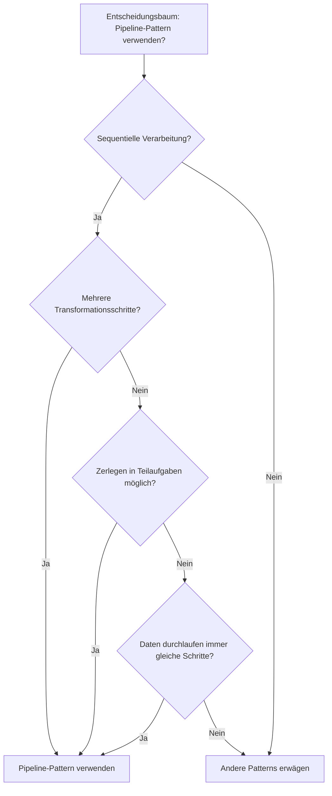

## Schrittweise Implementierung

### 1. Pipeline-Schnittstellen definieren

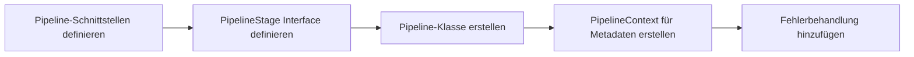

### 2. Pipeline-Stages implementieren

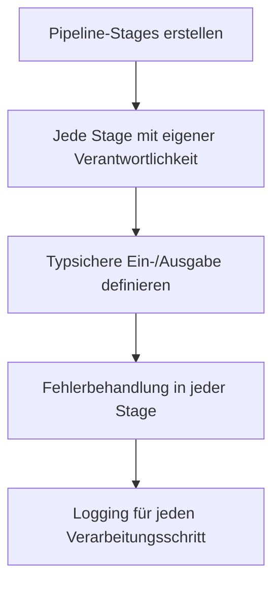

## Implementierungsbeispiele

### Beispiel 1: Sequentielle Pipeline

Dieses Diagramm zeigt den Datenfluss bei der Ausführung einer sequentiellen Pipeline:

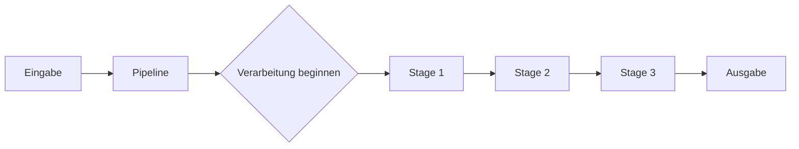

### Beispiel 2: Asynchrone Pipeline

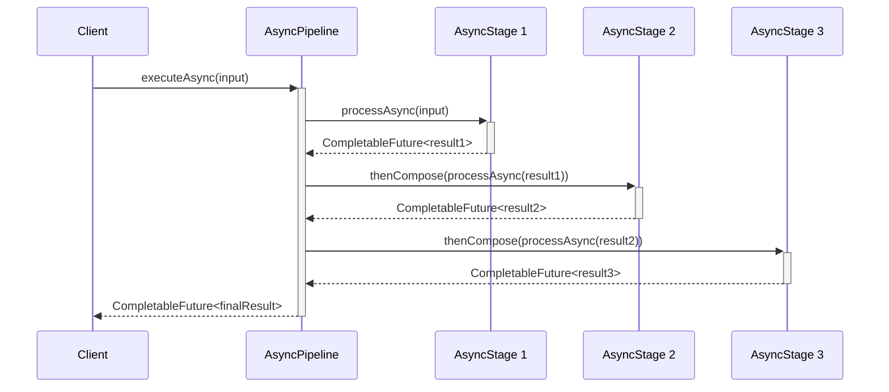

## Best Practices

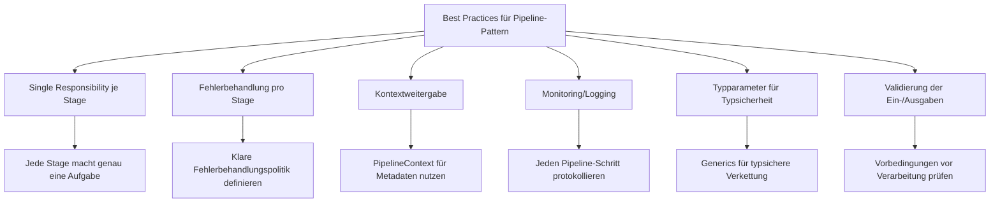

## Häufige Fehler

Die folgenden Fehler sollten bei der Implementierung des Pipeline-Patterns vermieden werden:

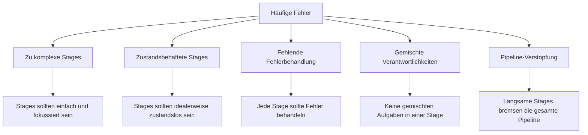

## Performanceüberlegungen

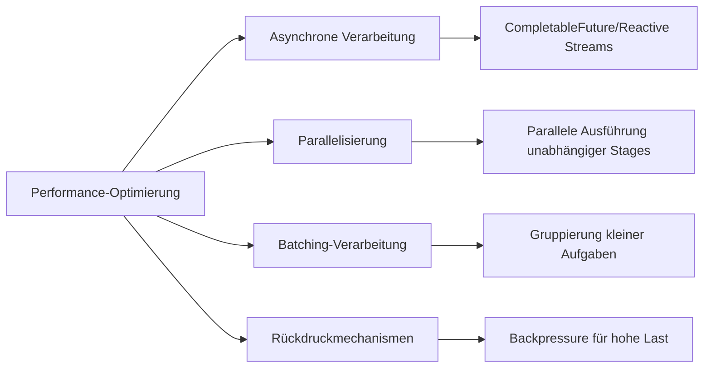

## Varianten des Pipeline-Patterns

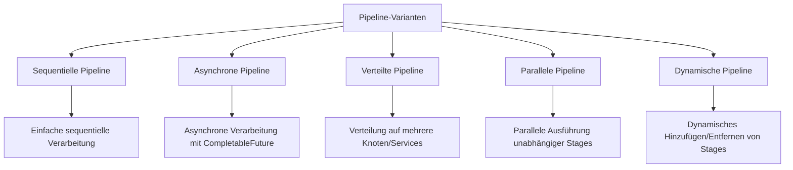

## Herausforderungen in verteilten Systemen

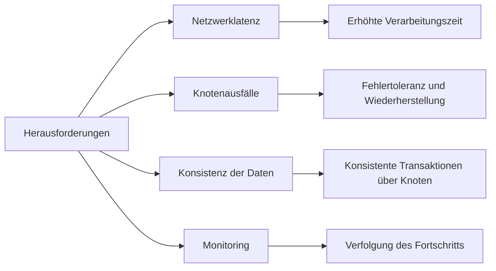

## Moderne Erweiterungen des Pipeline-Patterns

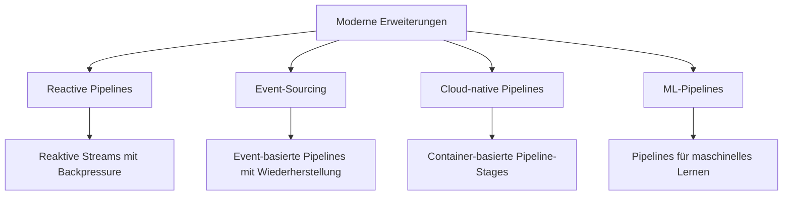
