# Implementierungsleitfaden für das Pipeline-Pattern

Dieser Leitfaden beschreibt den Implementierungsprozess des Pipeline-Patterns in verteilten Systemen anhand praktischer Beispiele aus diesem Projekt.

## Inhaltsverzeichnis

1. [Wann sollte das Pipeline-Pattern verwendet werden?](#wann-sollte-das-pipeline-pattern-verwendet-werden)
2. [Schrittweise Implementierung](#schrittweise-implementierung)
3. [Implementierungsbeispiele](#implementierungsbeispiele)
4. [Best Practices](#best-practices)
5. [Häufige Fehler](#häufige-fehler)
6. [Performanceüberlegungen](#performanceüberlegungen)

## Wann sollte das Pipeline-Pattern verwendet werden?

Das Pipeline-Pattern ist in folgenden Situationen besonders nützlich:

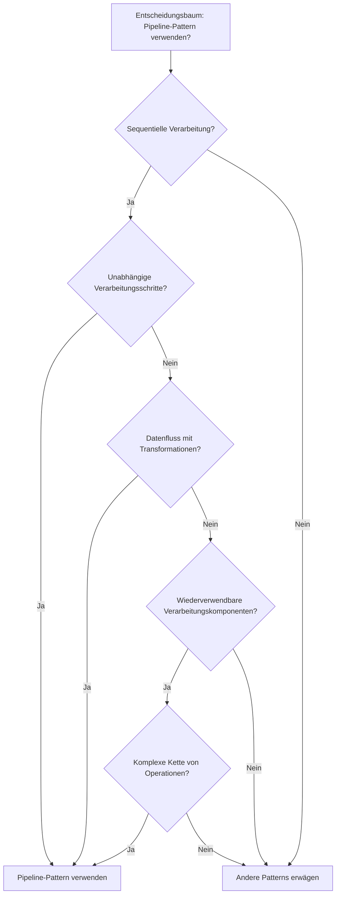

## Schrittweise Implementierung

### 1. Grundkomponenten definieren

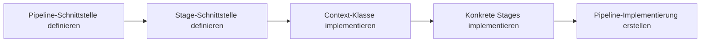

### 2. Sequentielle Pipeline implementieren

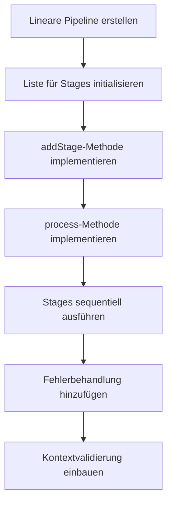

## Implementierungsbeispiele

### Beispiel 1: Einfache lineare Pipeline

Dieses Diagramm zeigt den Datenfluss bei der Ausführung einer linearen Pipeline:

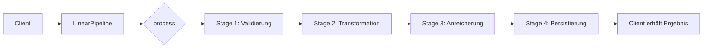

### Beispiel 2: Parallele Pipeline

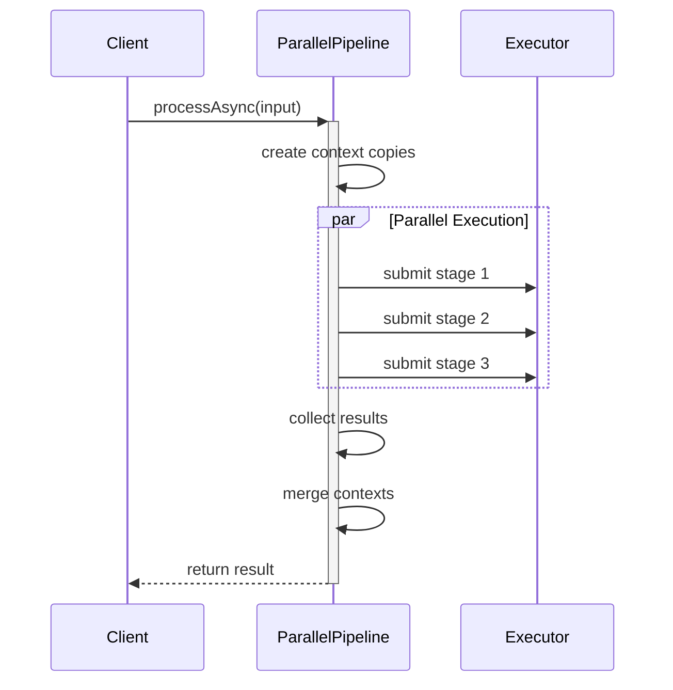

### Beispiel 3: Bedingte Pipeline

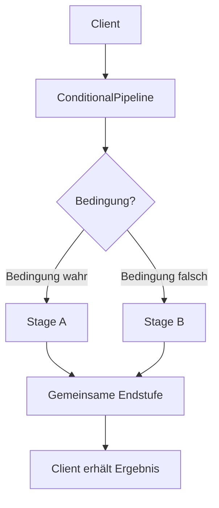

## Best Practices

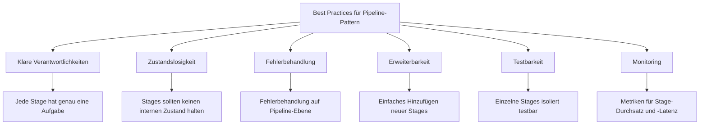

## Häufige Fehler

Die folgenden Fehler sollten bei der Implementierung des Pipeline-Patterns vermieden werden:

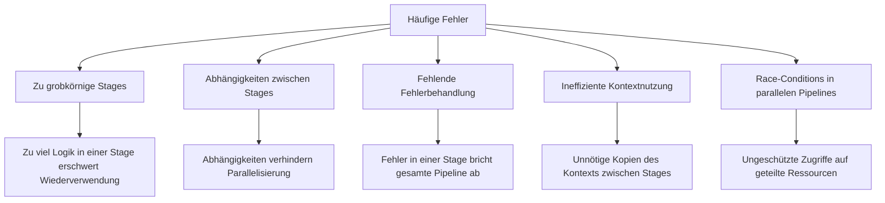

## Performanceüberlegungen

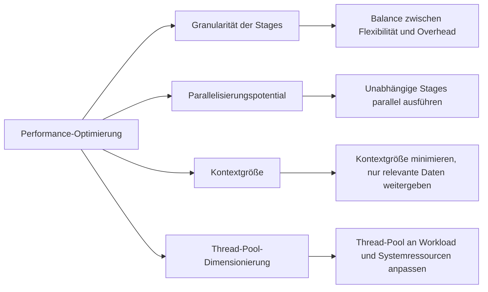

## Varianten des Pipeline-Patterns

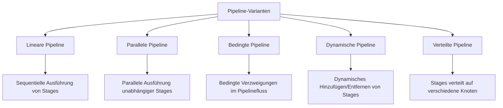

## Herausforderungen in verteilten Systemen

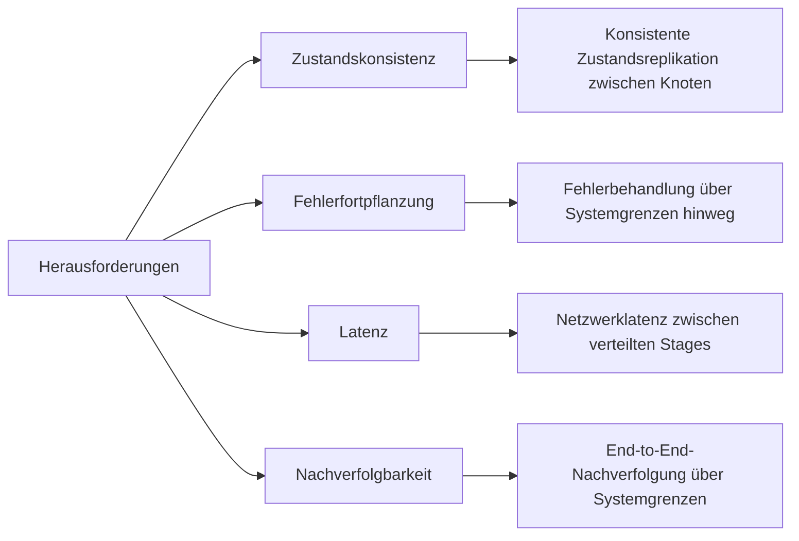

## Skalierung von Pipelines

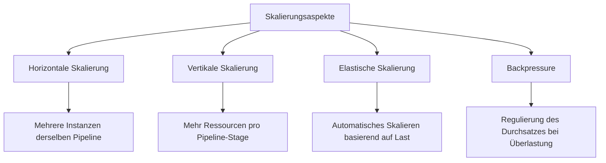

## Moderne Implementierung mit CompletableFuture

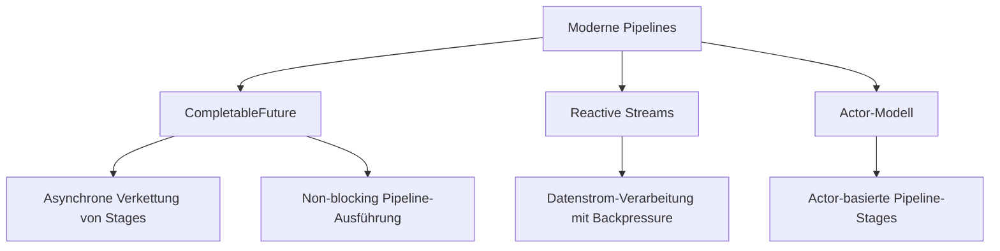