# Vergleich des Pipeline-Patterns mit anderen Verarbeitungsmustern

Dieses Dokument vergleicht das Pipeline-Pattern mit anderen Verarbeitungsmustern und hilft bei der Entscheidung, welches Muster in verschiedenen Situationen am besten geeignet ist.

## Pipeline vs. andere Verarbeitungsmuster

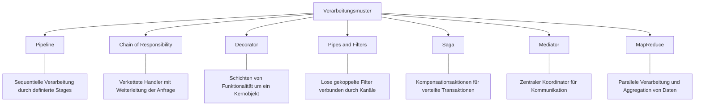

## Entscheidungshilfe: Welches Muster wann?

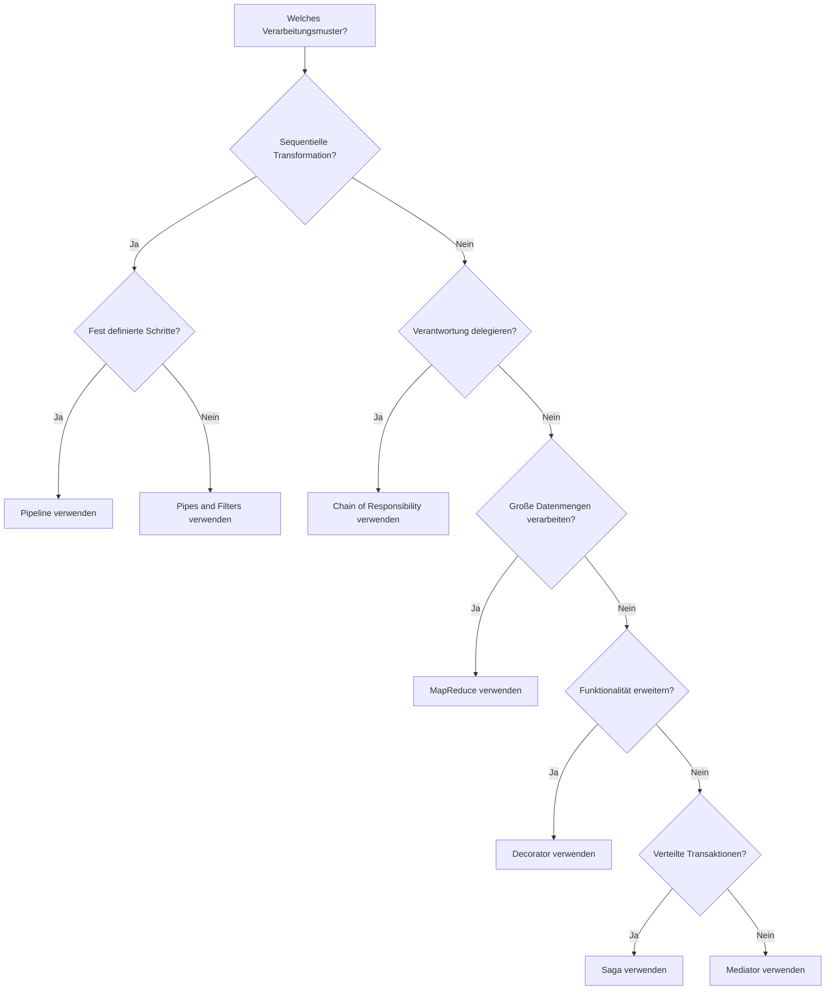

## Detaillierter Vergleich: Pipeline vs. andere Muster

### Pipeline vs. Chain of Responsibility

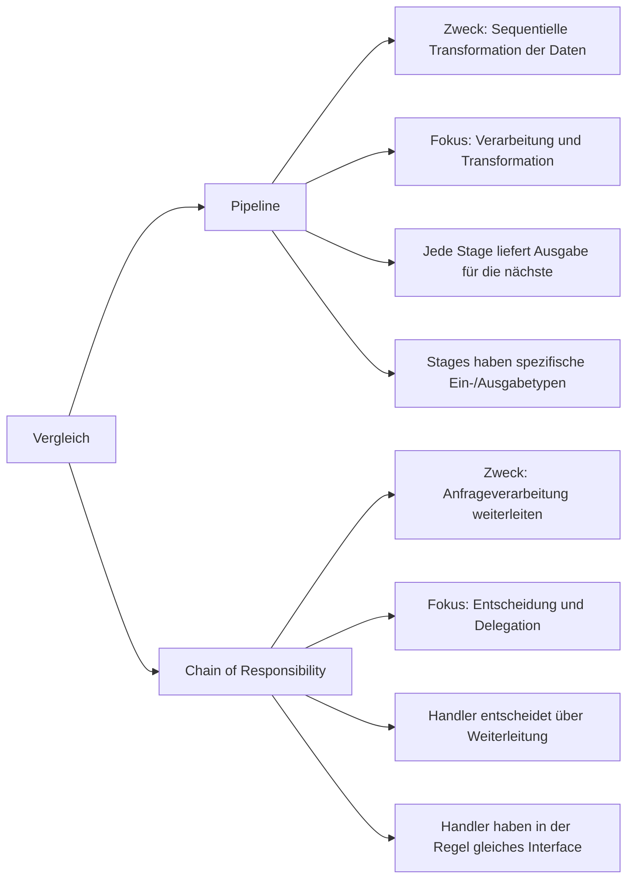

### Pipeline vs. Decorator

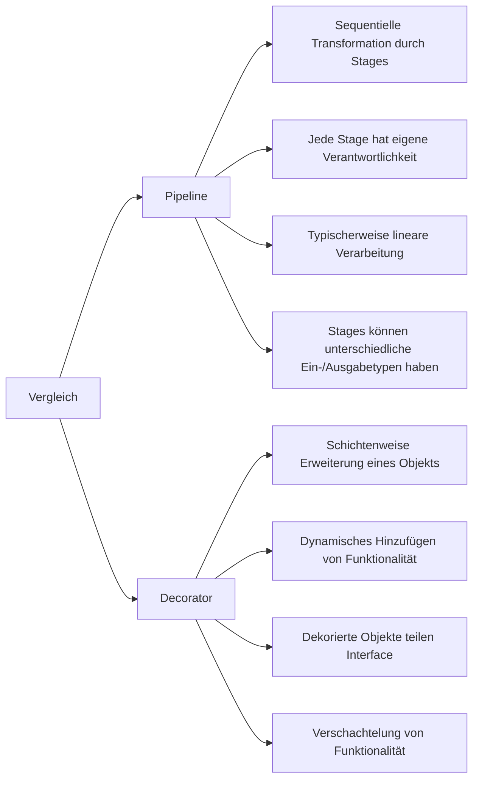

### Pipeline vs. Pipes and Filters

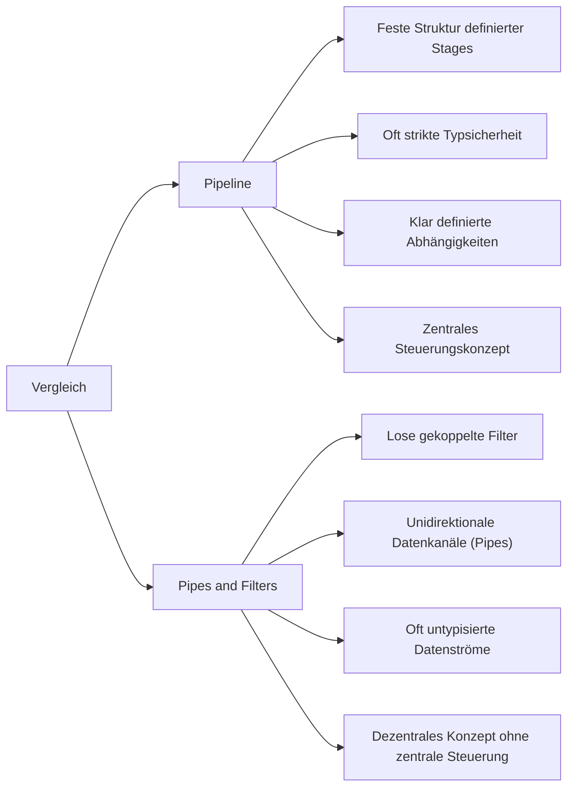

### Pipeline vs. MapReduce

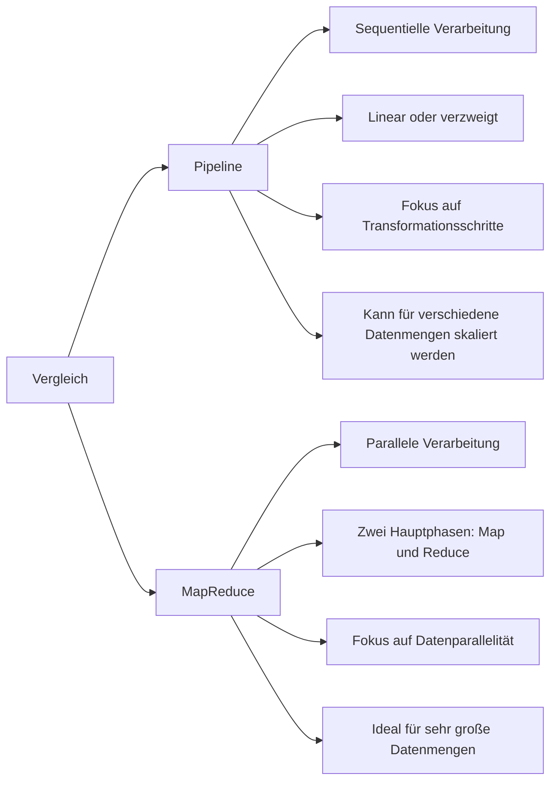

## Anwendungsfälle verschiedener Muster

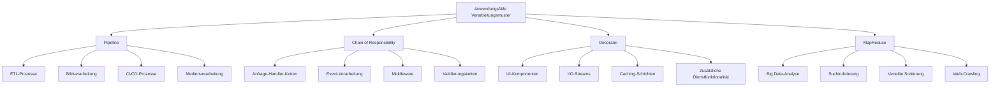

## Kombination von Mustern

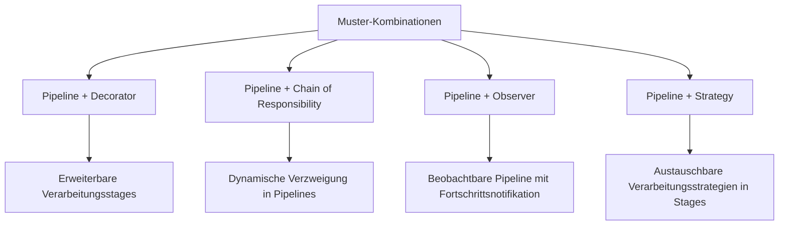

## Evolutionspfad für Verarbeitungsmuster

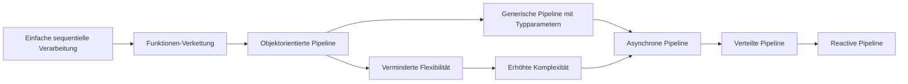

## Pipeline für mehrere Eingaben

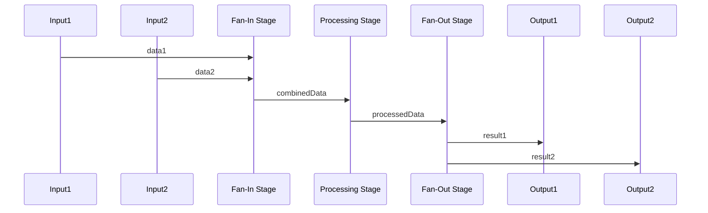

## Vergleichsmatrix: Vor- und Nachteile

| Muster | Stärken | Schwächen | Ideale Anwendungsfälle |
|--------|---------|-----------|------------------------|
| Pipeline | Klare Trennung von Verantwortlichkeiten, gute Testbarkeit | Sequentieller Ablauf kann Performance einschränken | ETL-Prozesse, medienverarbeitung, sequentielle Datenverarbeitung |
| Chain of Responsibility | Flexible Anfragebehandlung, lose Kopplung | Kein garantierter Handler, mögliche Leistungseinbußen | Anfrage-Handling, Filterung, Validierung |
| Decorator | Dynamische Erweiterbarkeit, Open/Closed-Prinzip | Viele kleine Klassen, komplexe Objektstruktur | Dynamische Funktionalitätserweiterung, I/O-Streams |
| Pipes and Filters | Lose Kopplung, hohe Wiederverwendbarkeit | Fehlende Kontextinformationen, beschränkte Typprüfung | Streaming-Verarbeitung, Shell-Scripts, Unix-Pipes |
| MapReduce | Skalierbarkeit, parallele Verarbeitung | Komplexe Implementierung, Overhead | Massendatenverarbeitung, Big Data-Analyse |
| Saga | Koordination verteilter Transaktionen | Komplexe Fehlerbehandlung und Wiederherstellung | Verteilte Geschäftsprozesse, Microservices |

## Pipeline-Umsetzung in verschiedenen Paradigmen

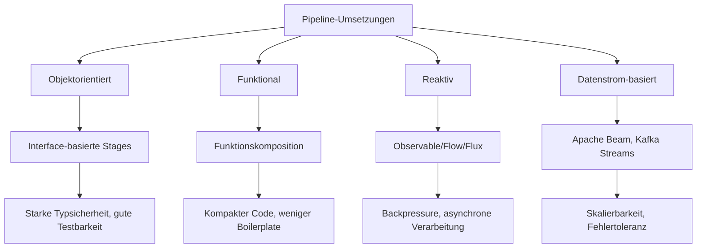

## Migration von monolithischer Verarbeitung zu Pipeline

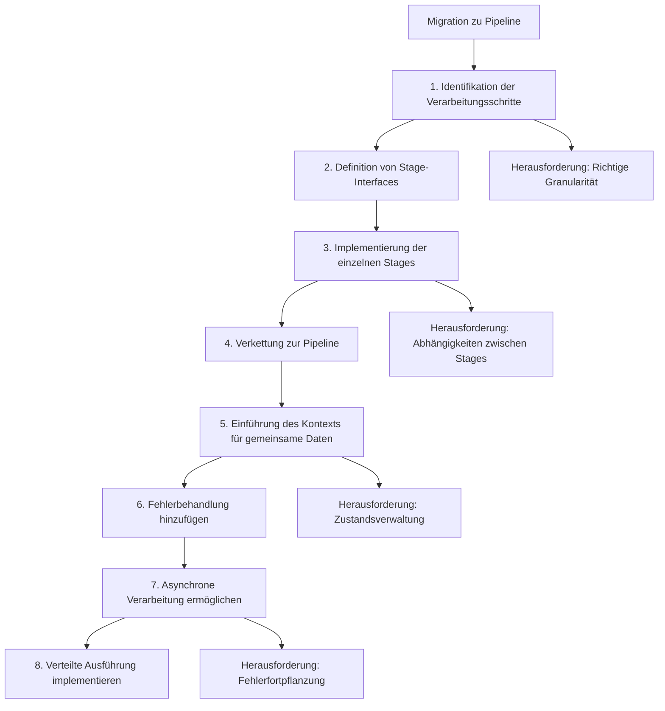
