# Vergleich des Pipeline-Patterns mit anderen Architekturmustern

Dieses Dokument vergleicht das Pipeline-Pattern mit anderen Entwurfsmustern und hilft bei der Entscheidung, welches Muster in verschiedenen Situationen am besten geeignet ist.

## Pipeline vs. andere Architekturmuster

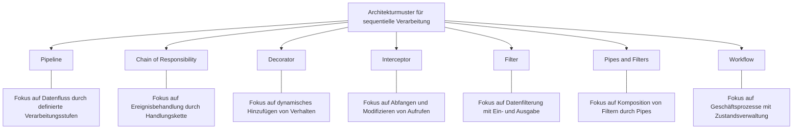

## Entscheidungshilfe: Welches Muster wann?

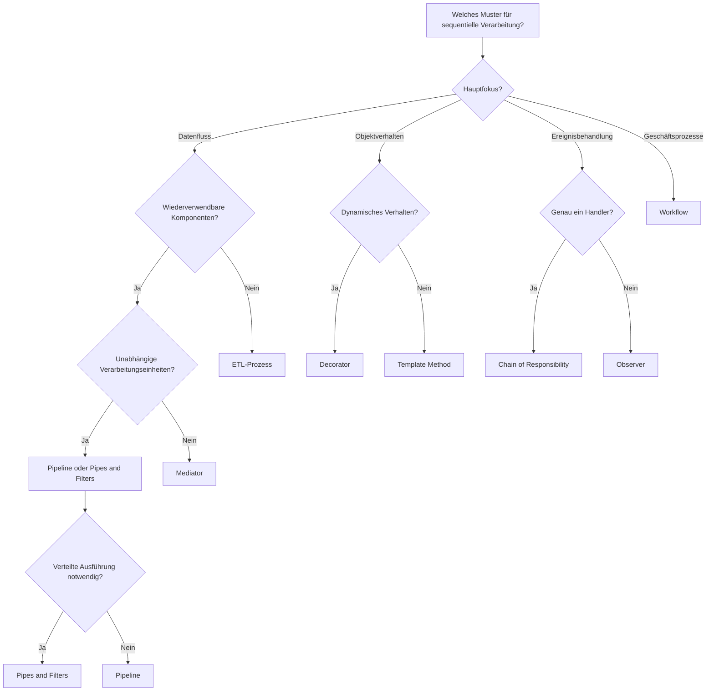

## Detaillierter Vergleich: Pipeline vs. andere Muster

### Pipeline vs. Chain of Responsibility

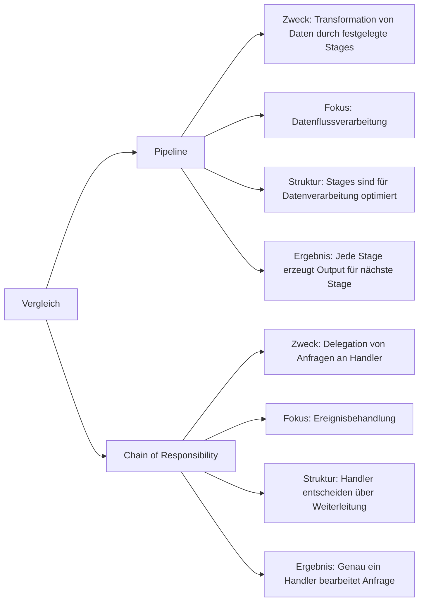

### Pipeline vs. Decorator

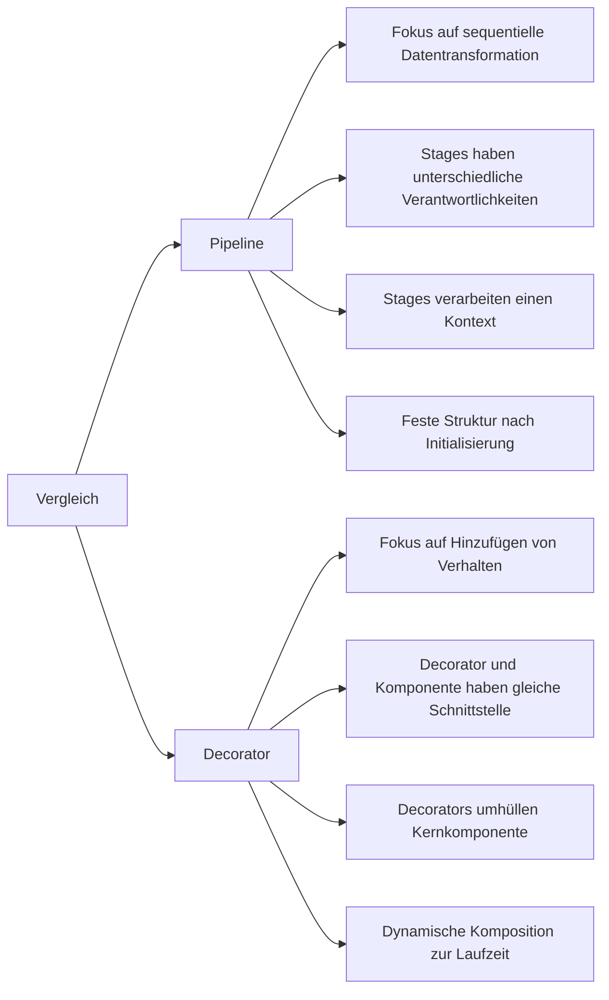

### Pipeline vs. Pipes and Filters

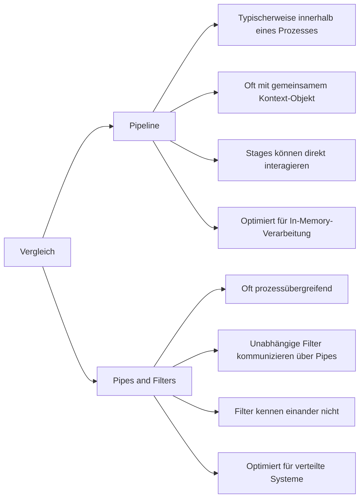

### Pipeline vs. Workflow

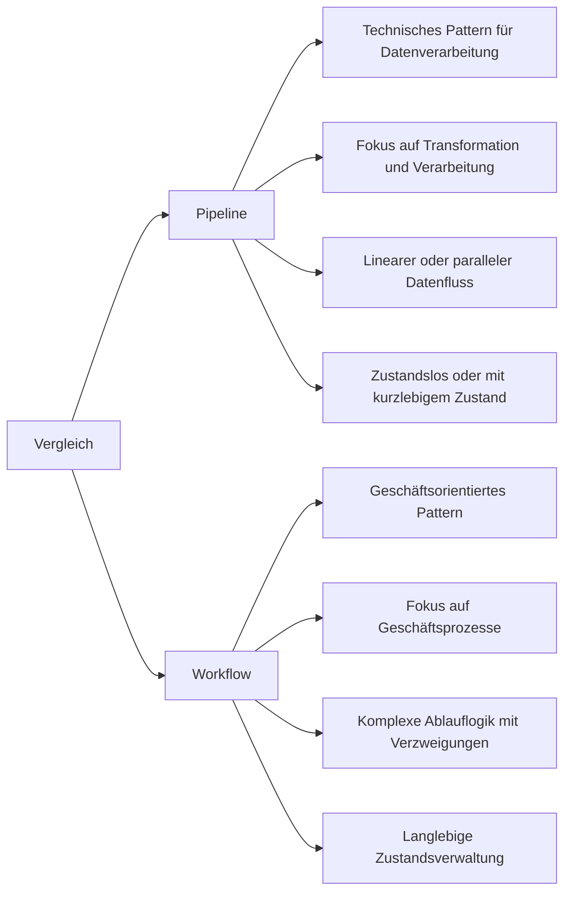

## Anwendungsfälle verschiedener Muster

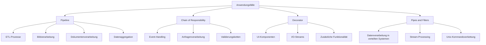

## Kombination von Mustern

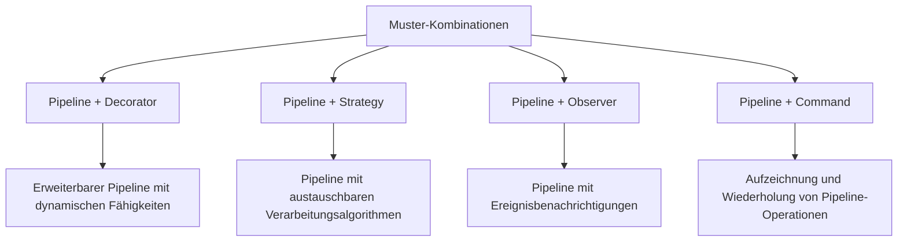

## Evolutionspfad für Datentransformations-Muster

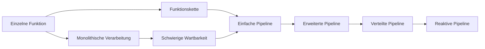

## Pipeline in verschiedenen Programmierparadigmen

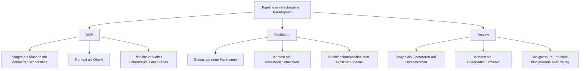

## Vergleichsmatrix: Vor- und Nachteile

| Muster | Stärken | Schwächen | Ideale Anwendungsfälle |
|--------|---------|-----------|------------------------|
| Pipeline | Klare Trennung von Verarbeitungsschritten, Wiederverwendbarkeit von Stages | Kann unflexibel sein, wenn die Pipelinestruktur sich oft ändert | Datentransformationsprozesse, ETL, Bildverarbeitung, sequentielle Verarbeitung mit klaren Schritten |
| Chain of Responsibility | Flexibel bei der Handhabung von Anfragen, gute Trennung von Belangen | Kein garantiertes Handling, möglicherweise ineffiziente Suche | Ereignisbehandlung, Middlewares, Anfrageverarbeitung mit verschiedenen Handlern |
| Decorator | Dynamisches Hinzufügen von Verhalten, offenes/geschlossenes Prinzip | Viele kleine Klassen, komplexe Objektstruktur | UI-Komponenten, I/O-Streams, dynamische Erweiterung von Funktionalität |
| Pipes and Filters | Hohe Modularität, gut für verteilte Systeme | Kommunikationsoverhead, potenziell ineffizient bei kleinen Datenmengen | Stream-Processing, Datenverarbeitung in verteilten Systemen, Unix-Kommandoverkettung |
| Workflow | Komplexe Geschäftsprozesse mit Zustandsverwaltung | Overhead für einfache Transformationen, komplex zu implementieren | Langlebige Geschäftsprozesse, BPM-Systeme, Prozesse mit menschlicher Interaktion |

## Adaption des Pipeline-Patterns in verteilten Umgebungen

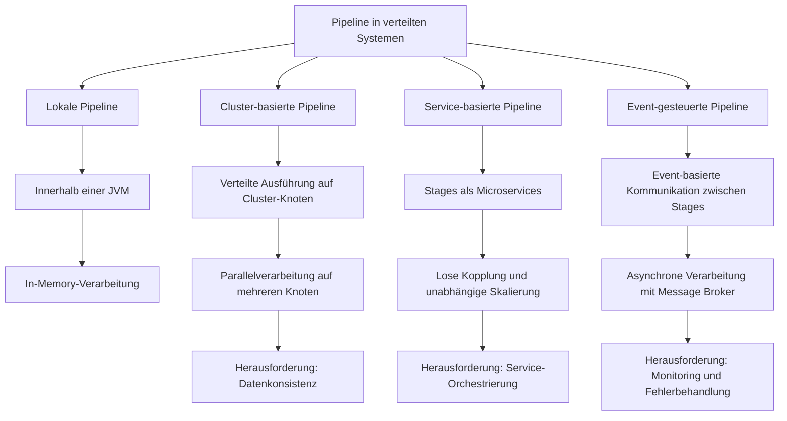

## Migration zu modernen Pipeline-Implementierungen

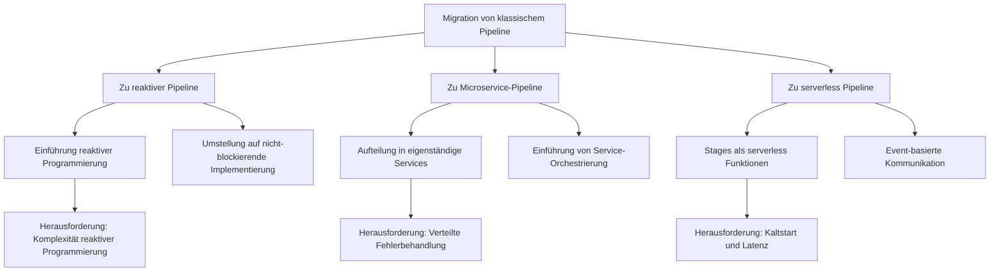

## Parallele Pipeline-Implementierungen im Vergleich

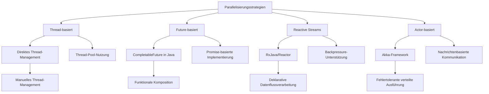