# Pipeline-Pattern Dokumentation

Diese Dokumentation enthält verschiedene Diagramme zur Veranschaulichung des Pipeline-Patterns und der konkreten Implementierung in diesem Projekt.

## Inhalt

- [Komponentendiagramm](#komponentendiagramm)
- [Klassendiagramme](#klassendiagramme)
- [Sequenzdiagramme](#sequenzdiagramme)
- [Zustandsdiagramme](#zustandsdiagramme)
- [Aktivitätsdiagramme](#aktivitätsdiagramme)

## Komponentendiagramm

Das folgende Diagramm zeigt die Hauptkomponenten des Projekts und ihre Beziehungen zueinander:

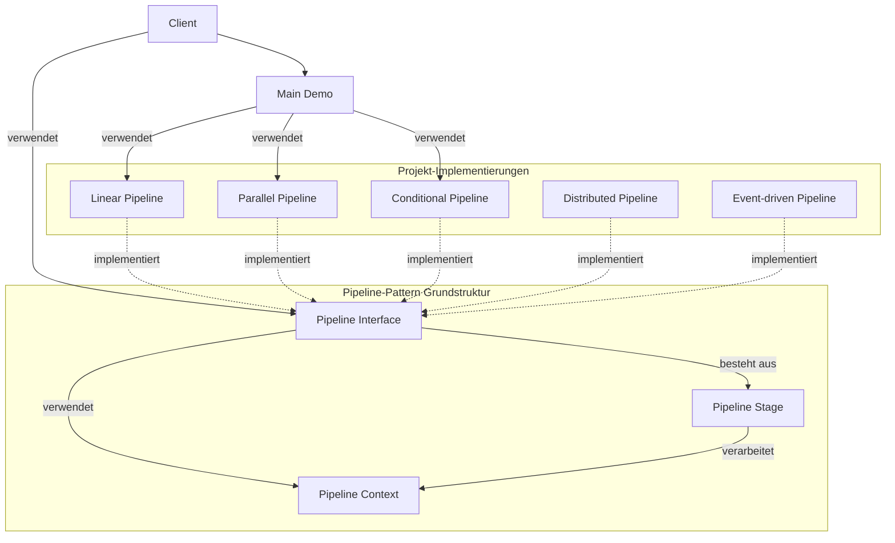

## Klassendiagramme

### Allgemeines Pipeline-Klassendiagramm

Das folgende Diagramm zeigt die allgemeine Struktur des Pipeline-Patterns:

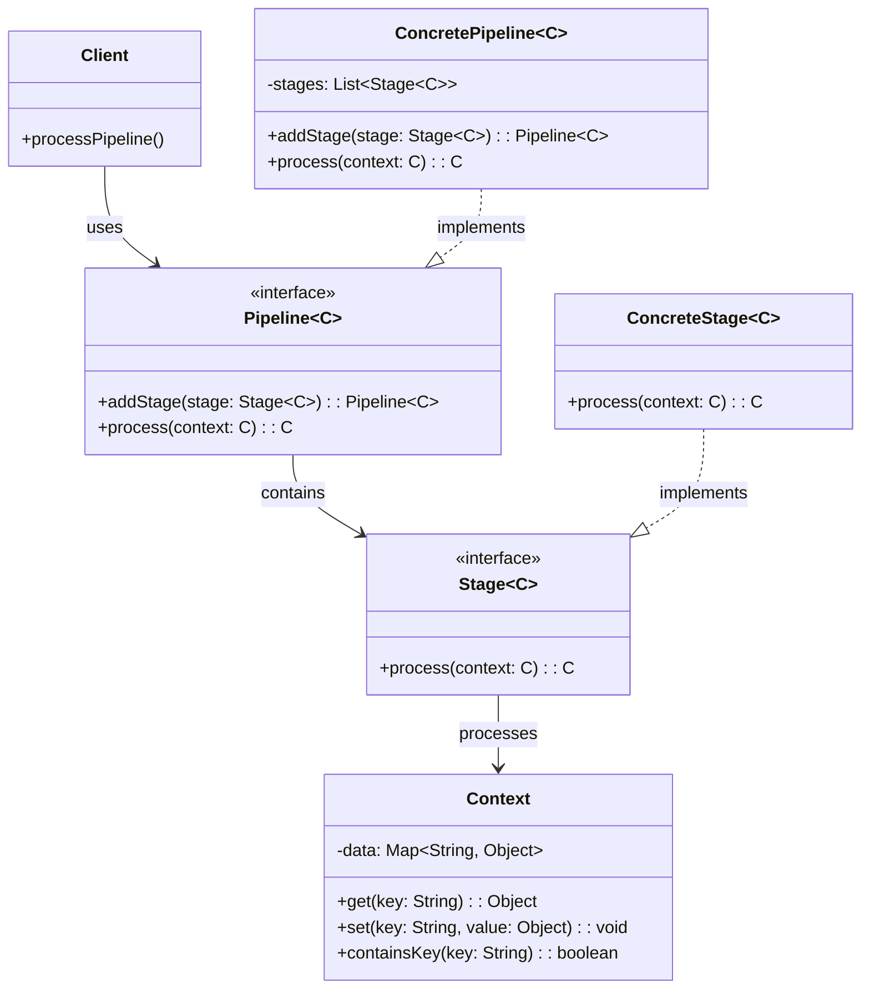

### Lineare Pipeline-Klassendiagramm

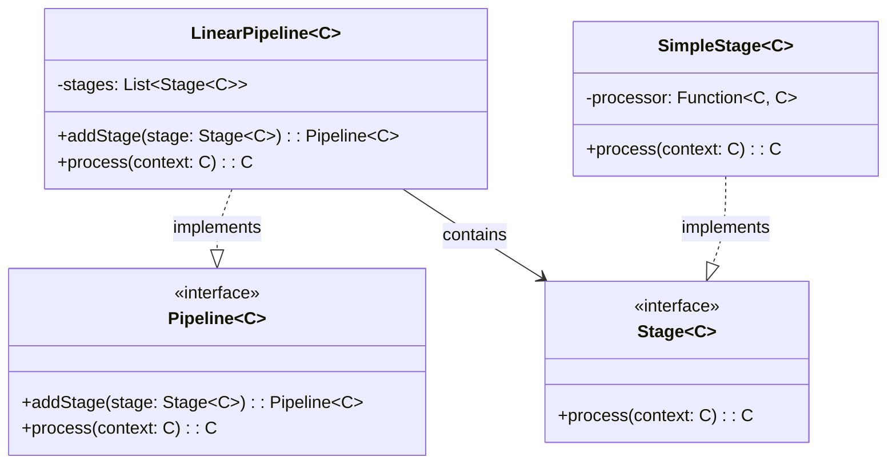

### Parallele Pipeline-Klassendiagramm

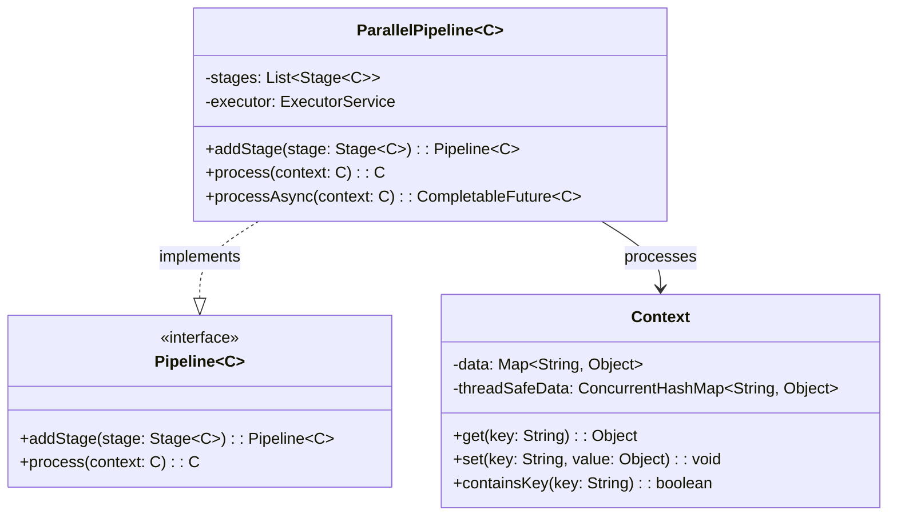

### Conditional Pipeline-Klassendiagramm

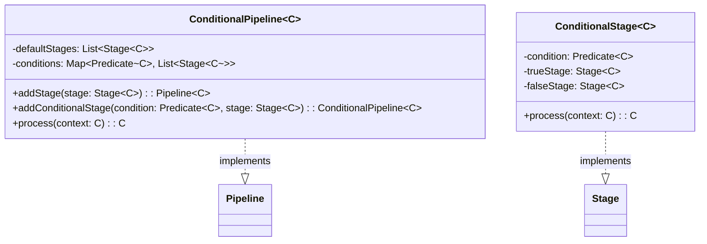

## Sequenzdiagramme

### Lineare Pipeline-Sequenzdiagramm

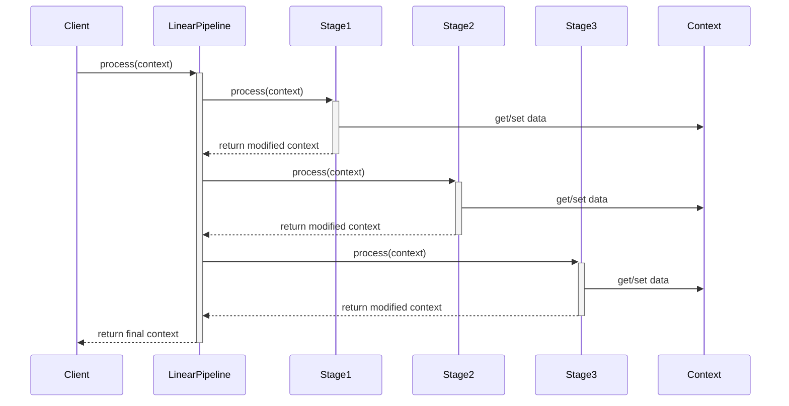

### Parallele Pipeline-Sequenzdiagramm

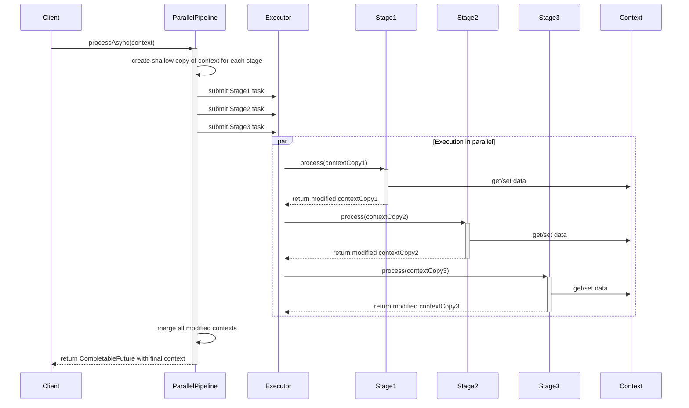

## Zustandsdiagramme

### Pipeline-Verarbeitungszustandsdiagramm

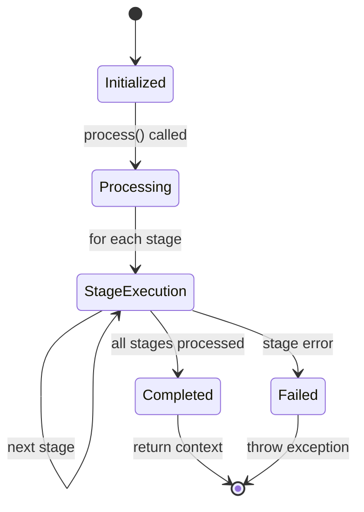

### Parallele Pipeline-Zustandsdiagramm

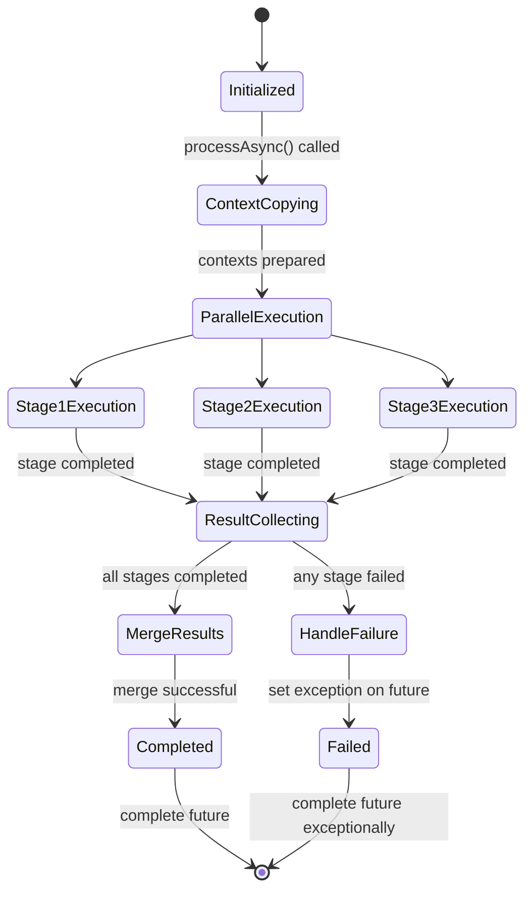

## Aktivitätsdiagramme

### Grundlegendes Pipeline-Aktivitätsdiagramm

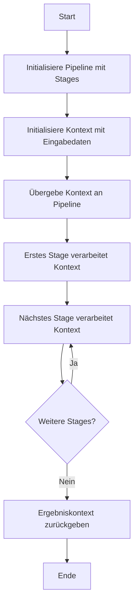

### Verzweigte Pipeline-Aktivitätsdiagramm

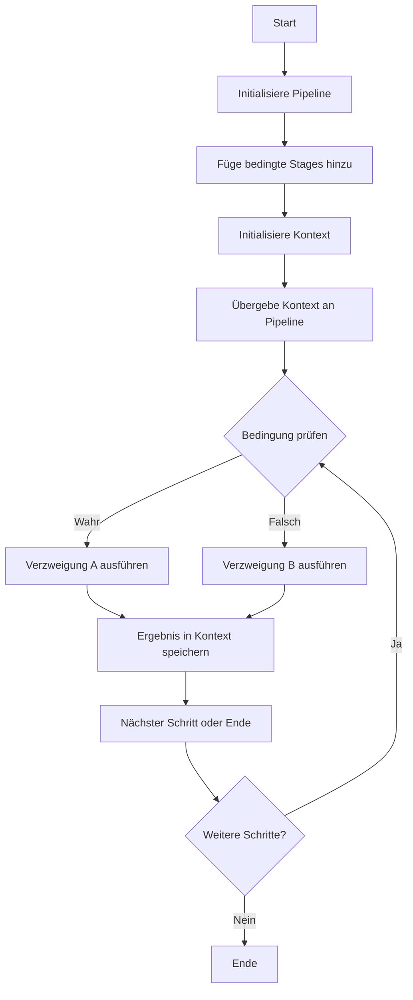