# Pipeline-Pattern Dokumentation

Diese Dokumentation enthält verschiedene Diagramme zur Veranschaulichung des Pipeline-Patterns und der konkreten Implementierung in diesem Projekt.

## Inhalt

- [Komponentendiagramm](#komponentendiagramm)
- [Klassendiagramme](#klassendiagramme)
- [Sequenzdiagramme](#sequenzdiagramme)
- [Zustandsdiagramme](#zustandsdiagramme)
- [Aktivitätsdiagramme](#aktivitätsdiagramme)

## Komponentendiagramm

Das folgende Diagramm zeigt die Hauptkomponenten des Projekts und ihre Beziehungen zueinander:

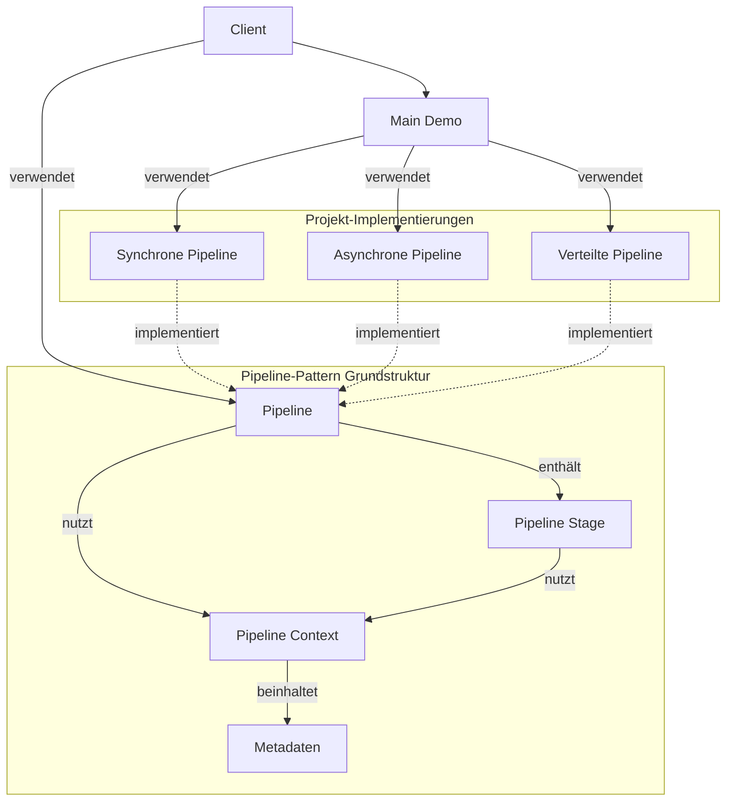

## Klassendiagramme

### Allgemeines Pipeline-Klassendiagramm

Das folgende Diagramm zeigt die allgemeine Struktur des Pipeline-Patterns:

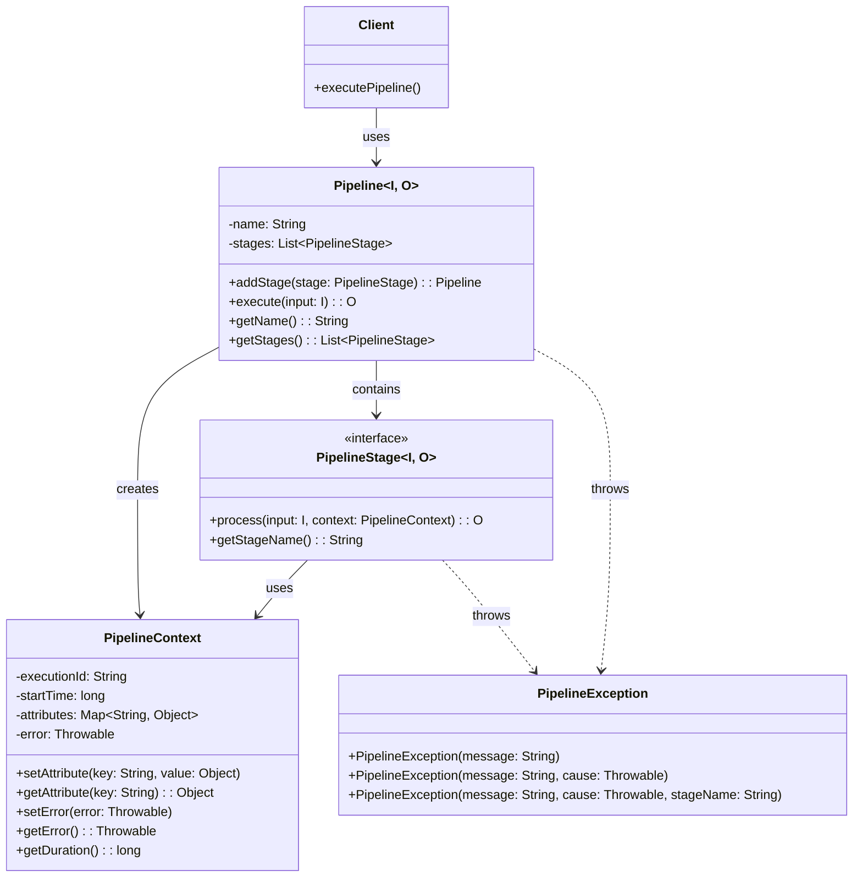

### Sequential Pipeline-Klassendiagramm

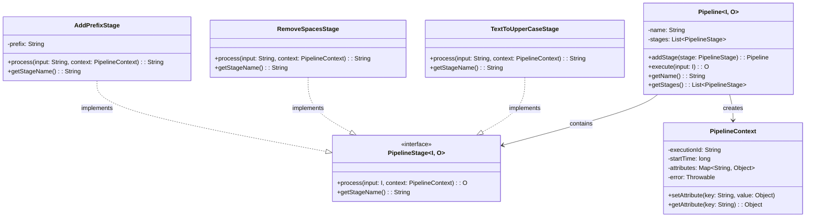

### Asynchrone Pipeline-Klassendiagramm

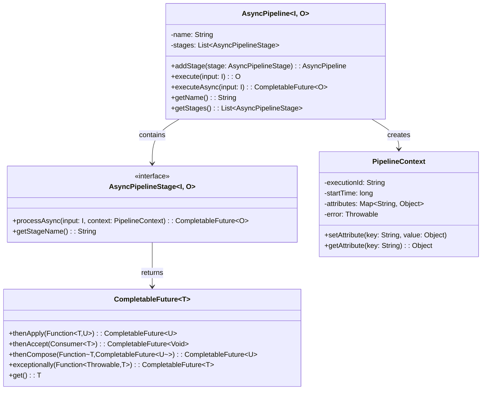

### Verteilte Pipeline-Klassendiagramm

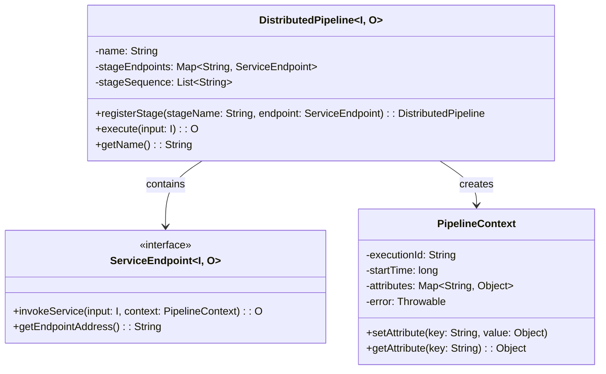

## Sequenzdiagramme

### Sequentielle Pipeline-Sequenzdiagramm

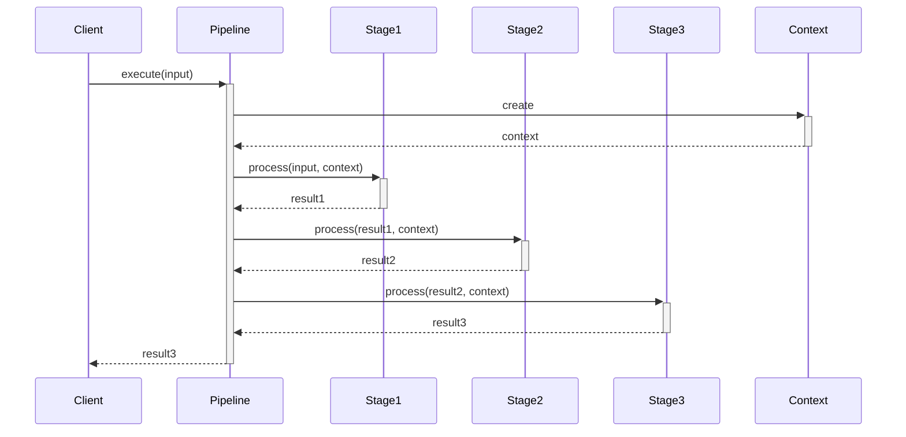

### Asynchrone Pipeline-Sequenzdiagramm

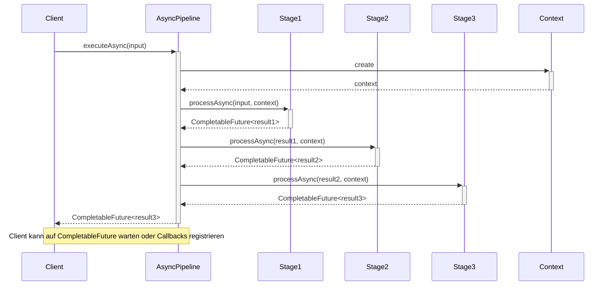

### Verteilte Pipeline-Sequenzdiagramm 

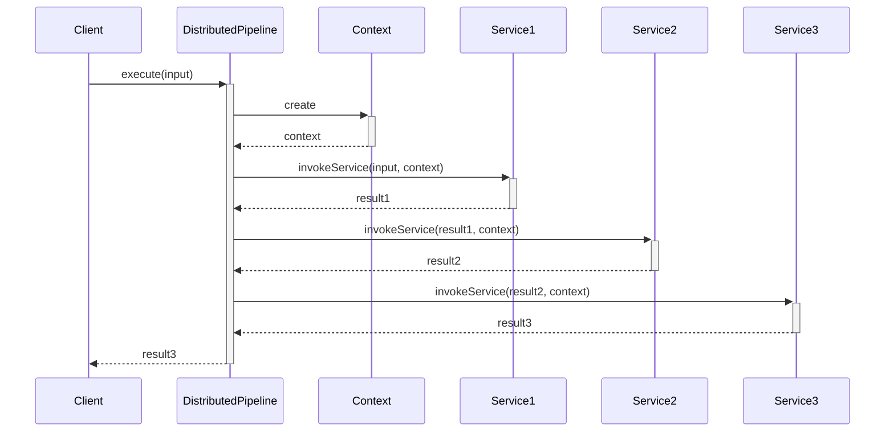

## Zustandsdiagramme

### Pipeline-Ausführungszustandsdiagramm

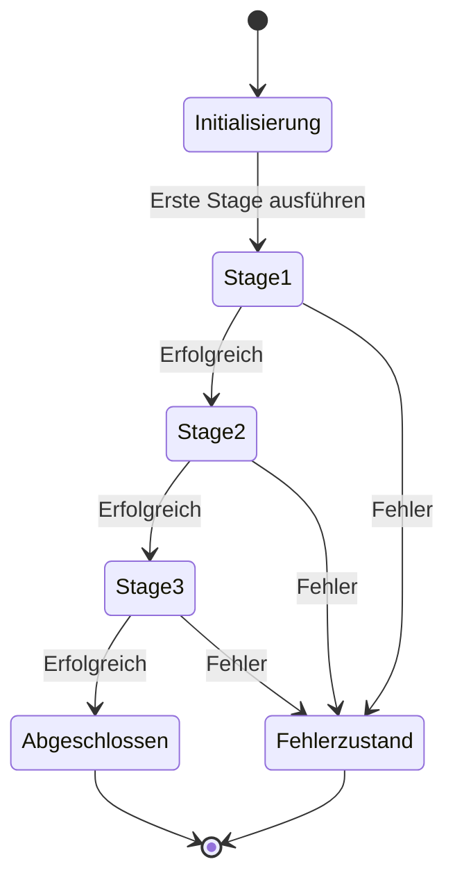

### Asynchrone Pipeline-Zustandsdiagramm

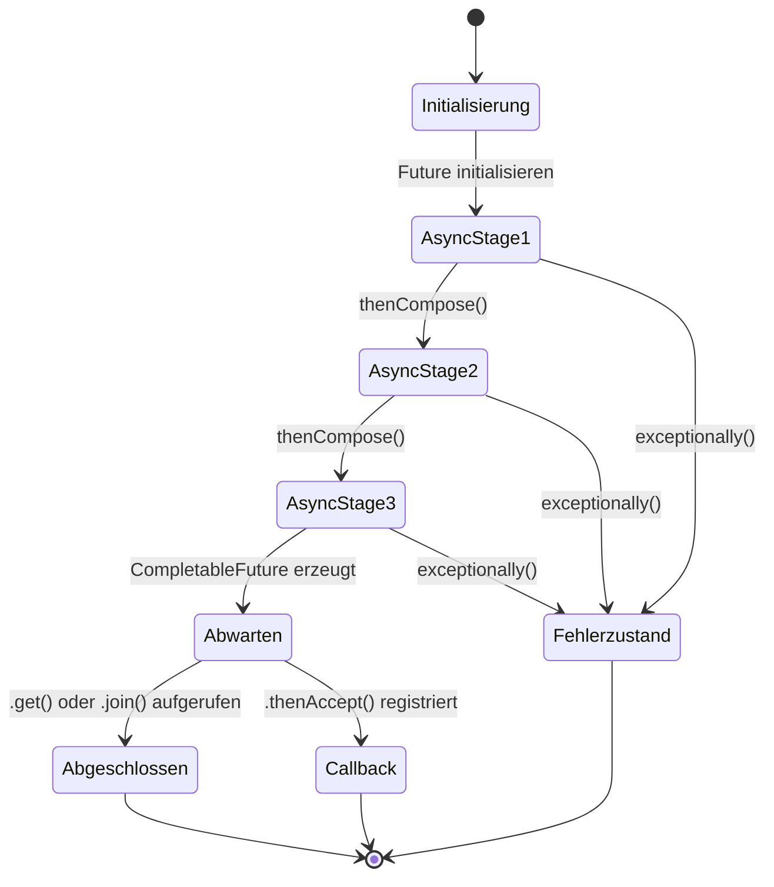

## Aktivitätsdiagramme

### Grundlegendes Pipeline-Aktivitätsdiagramm

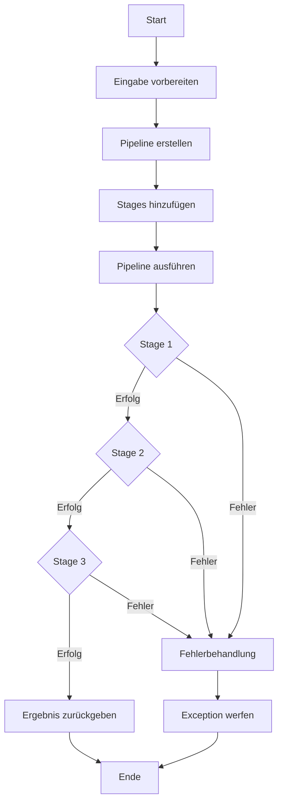

### Asynchrone Pipeline-Aktivitätsdiagramm

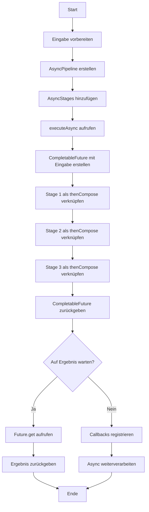

### Verteilte Pipeline-Aktivitätsdiagramm

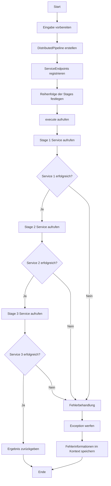

### Fehlerbehandlung in der Pipeline

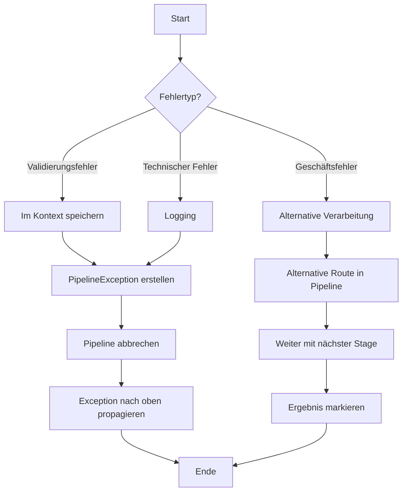
