# Anwendungsbeispiele des Pipeline-Patterns in verteilten Systemen

Dieses Dokument stellt reale Anwendungsfälle des Pipeline-Patterns in verteilten Systemen vor und analysiert deren Implementierungsdetails.

## Übersicht der Anwendungsfälle

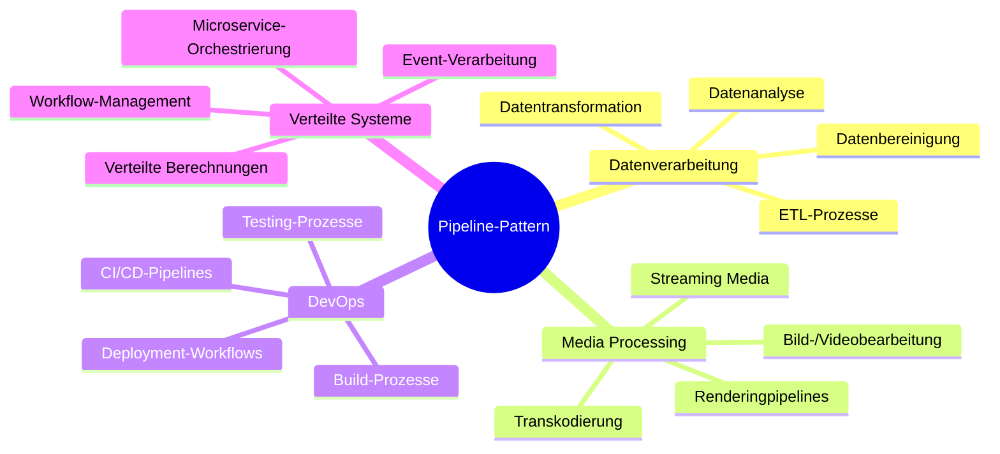

## Detaillierte Anwendungsfälle

### 1. ETL-Pipeline in Datenanalysesystemen

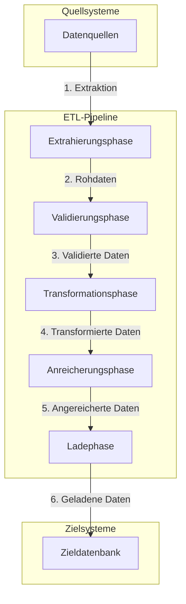

#### ETL-Pipeline: Sequenzdiagramm für Datenverarbeitung

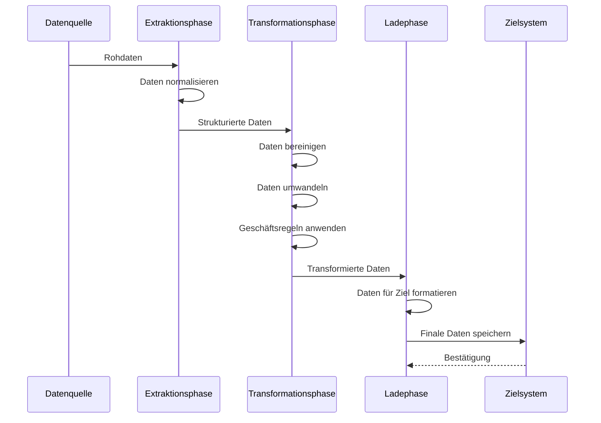

### 2. CI/CD-Pipeline für DevOps

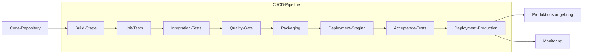

#### Aktivitätsdiagramm für CI/CD-Pipeline

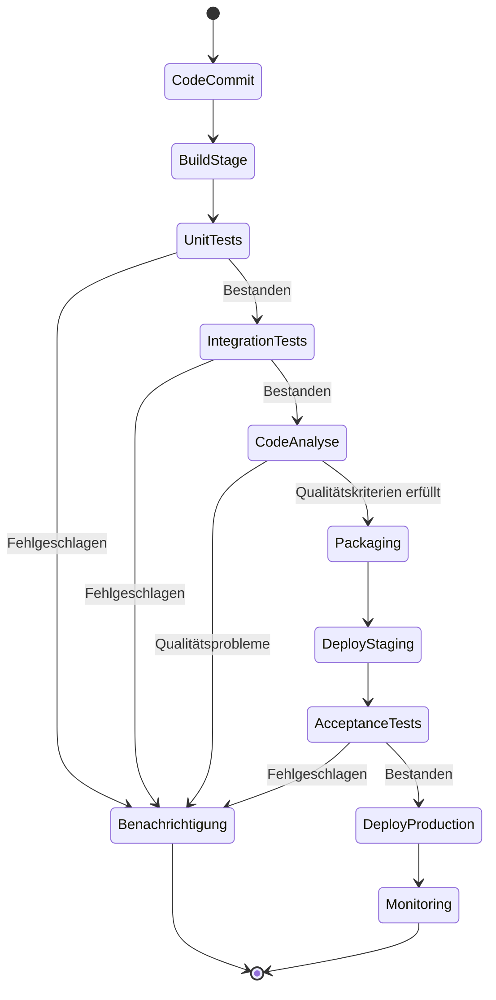

### 3. Streaming-Medienpipeline für Videobearbeitung

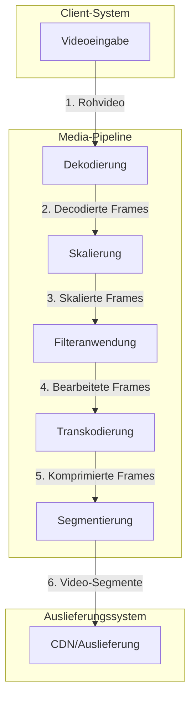

#### Komponentendiagramm für eine Medienpipeline

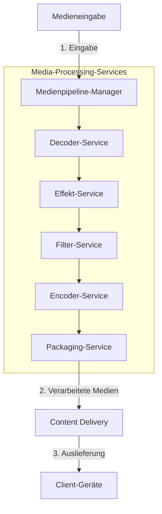

### 4. Verteilte Datenverarbeitungspipeline mit Microservices

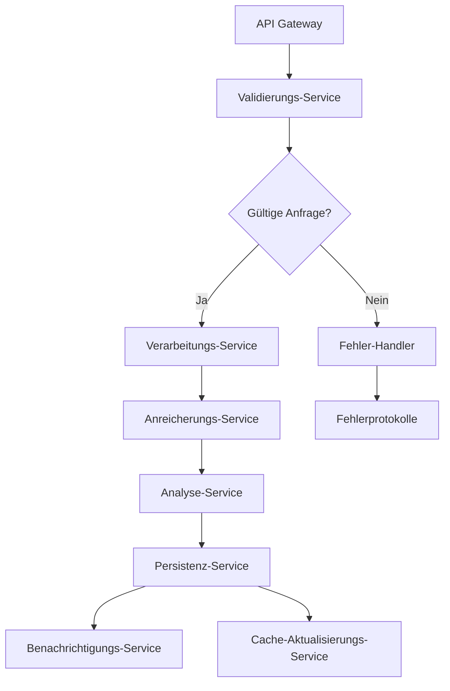

#### Aktivitätsdiagramm einer Microservice-Pipeline

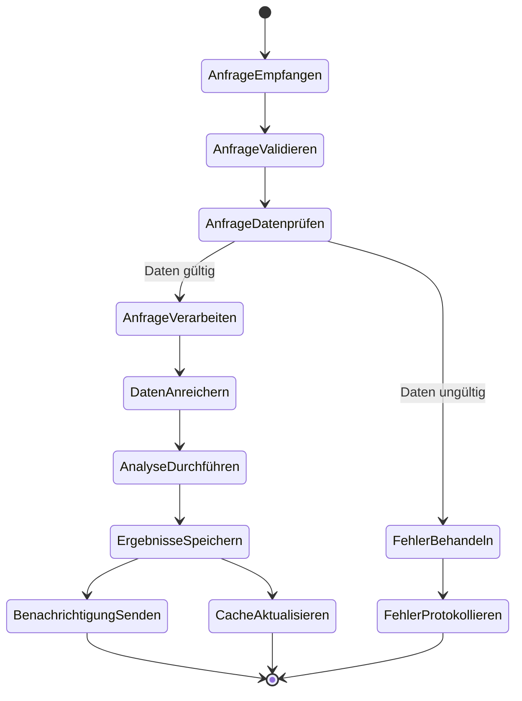

## Design-Entscheidungen bei der Pipeline-Implementierung

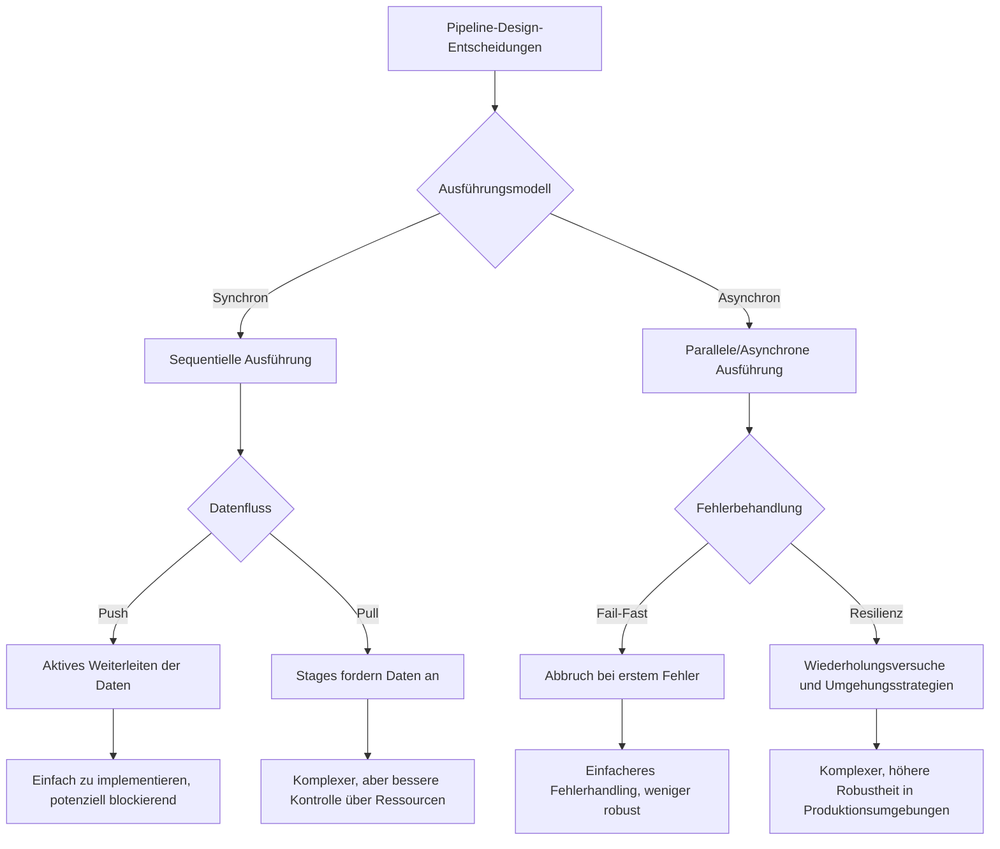

## Evolutionspfad für Pipelines

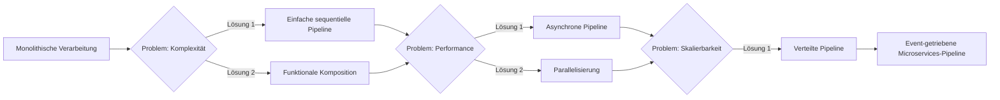

## Praktische Umsetzungsbeispiele

### Beispiel 1: Implementierung einer asynchronen Bildverarbeitungspipeline in Java

```java
// Pipeline-Definition
public class ImageProcessingPipeline {
    
    public CompletableFuture<ProcessedImage> processAsync(SourceImage source) {
        return CompletableFuture
            .supplyAsync(() -> loadImage(source))
            .thenApply(this::resize)
            .thenApply(this::applyFilters)
            .thenApply(this::optimize)
            .thenApply(this::save);
    }
    
    private ImageData loadImage(SourceImage source) {
        logger.info("Lade Bild: {}", source.getName());
        // Implementierung des Ladens
        return new ImageData(source);
    }
    
    private ImageData resize(ImageData image) {
        logger.info("Skaliere Bild auf Zielgröße");
        // Implementierung der Skalierung
        return image;
    }
    
    private ImageData applyFilters(ImageData image) {
        logger.info("Wende Filter an");
        // Implementierung der Filteranwendung
        return image;
    }
    
    private ImageData optimize(ImageData image) {
        logger.info("Optimiere Bild");
        // Implementierung der Optimierung
        return image;
    }
    
    private ProcessedImage save(ImageData image) {
        logger.info("Speichere verarbeitetes Bild");
        // Implementierung der Speicherung
        return new ProcessedImage(image);
    }
}
```

### Beispiel 2: Verteilte Datenpipeline mit Apache Kafka

```java
// Definition der Kafka-Streams-Pipeline
public class KafkaStreamsPipeline {
    
    public Topology createTopology() {
        StreamsBuilder builder = new StreamsBuilder();
        
        // Daten aus dem Eingangs-Topic lesen
        KStream<String, Order> orders = builder.stream(
            "incoming-orders", 
            Consumed.with(Serdes.String(), OrderSerdes.instance())
        );
        
        // Validierungsphase
        KStream<String, ValidatedOrder> validatedOrders = orders
            .filter((key, order) -> order != null && order.isValid())
            .mapValues(order -> new ValidatedOrder(order));
        
        // Anreicherungsphase
        KStream<String, EnrichedOrder> enrichedOrders = validatedOrders
            .mapValues(order -> enrichOrder(order));
        
        // Verarbeitungsphase
        KStream<String, ProcessedOrder> processedOrders = enrichedOrders
            .mapValues(order -> processOrder(order));
        
        // Aufteilen in erfolgreiche und fehlgeschlagene Verarbeitungen
        KStream<String, ProcessedOrder>[] branches = processedOrders
            .branch(
                (key, order) -> order.isSuccessful(),
                (key, order) -> !order.isSuccessful()
            );
        
        // Erfolgreiche Bestellungen in Erfolgs-Topic schreiben
        branches[0].to(
            "successful-orders", 
            Produced.with(Serdes.String(), ProcessedOrderSerdes.instance())
        );
        
        // Fehlgeschlagene Bestellungen in Fehler-Topic schreiben
        branches[1].to(
            "failed-orders", 
            Produced.with(Serdes.String(), ProcessedOrderSerdes.instance())
        );
        
        return builder.build();
    }
    
    private EnrichedOrder enrichOrder(ValidatedOrder order) {
        // Implementierung der Anreicherung
        return new EnrichedOrder(order);
    }
    
    private ProcessedOrder processOrder(EnrichedOrder order) {
        // Implementierung der Verarbeitung
        return new ProcessedOrder(order);
    }
}
```

### Beispiel 3: CI/CD-Pipeline mit Jenkins

```groovy
// Jenkinsfile für eine Pipeline
pipeline {
    agent any
    
    stages {
        stage('Checkout') {
            steps {
                checkout scm
            }
        }
        
        stage('Build') {
            steps {
                sh 'mvn clean compile'
            }
        }
        
        stage('Unit Tests') {
            steps {
                sh 'mvn test'
            }
            post {
                always {
                    junit '**/target/surefire-reports/*.xml'
                }
            }
        }
        
        stage('Code Analysis') {
            steps {
                sh 'mvn sonar:sonar'
            }
        }
        
        stage('Package') {
            steps {
                sh 'mvn package'
                archiveArtifacts artifacts: 'target/*.jar', fingerprint: true
            }
        }
        
        stage('Deploy to Staging') {
            steps {
                sh 'deploy-to-staging.sh'
            }
        }
        
        stage('Integration Tests') {
            steps {
                sh 'run-integration-tests.sh'
            }
        }
        
        stage('Approval') {
            steps {
                input message: 'Deploy to production?'
            }
        }
        
        stage('Deploy to Production') {
            steps {
                sh 'deploy-to-production.sh'
            }
        }
    }
    
    post {
        success {
            echo 'Pipeline erfolgreich abgeschlossen'
            notifySuccess()
        }
        failure {
            echo 'Pipeline fehlgeschlagen'
            notifyFailure()
        }
    }
}
```

### Beispiel 4: Parallele Datenpipeline mit RxJava

```java
public class ReactiveDataPipeline {
    
    public Observable<ProcessedData> processData(List<RawData> data) {
        return Observable.fromIterable(data)
            .flatMap(this::validateDataAsync)
            .groupBy(ValidatedData::getCategory)
            .flatMap(group -> group
                .observeOn(Schedulers.computation())
                .map(this::transformData)
            )
            .flatMap(this::enrichDataAsync)
            .observeOn(Schedulers.io())
            .map(this::saveData);
    }
    
    private Observable<ValidatedData> validateDataAsync(RawData data) {
        return Observable.fromCallable(() -> {
            logger.info("Validiere Daten: {}", data.getId());
            // Validierungslogik
            return new ValidatedData(data);
        }).subscribeOn(Schedulers.computation());
    }
    
    private TransformedData transformData(ValidatedData data) {
        logger.info("Transformiere Daten: {}", data.getId());
        // Transformationslogik
        return new TransformedData(data);
    }
    
    private Observable<EnrichedData> enrichDataAsync(TransformedData data) {
        return Observable.fromCallable(() -> {
            logger.info("Reichere Daten an: {}", data.getId());
            // Anreicherungslogik
            return new EnrichedData(data);
        }).subscribeOn(Schedulers.io());
    }
    
    private ProcessedData saveData(EnrichedData data) {
        logger.info("Speichere verarbeitete Daten: {}", data.getId());
        // Speicherlogik
        return new ProcessedData(data);
    }
}
```

## Performance-Optimierungstechniken für Pipelines

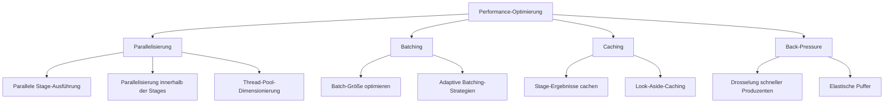

## Skalierungsmuster für Pipeline-Pattern

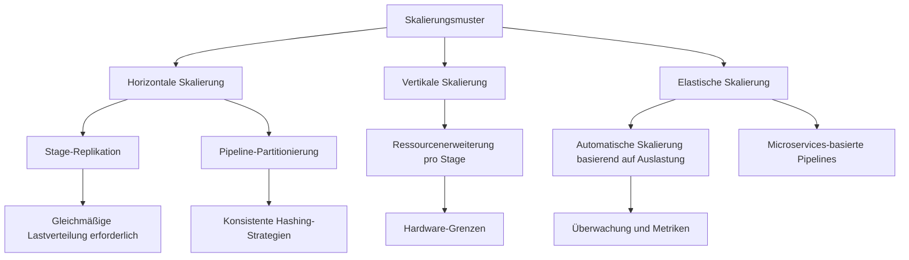

## Organisatorische Aspekte von Pipeline-Implementierungen

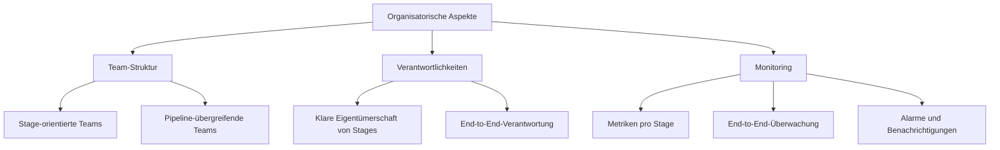
