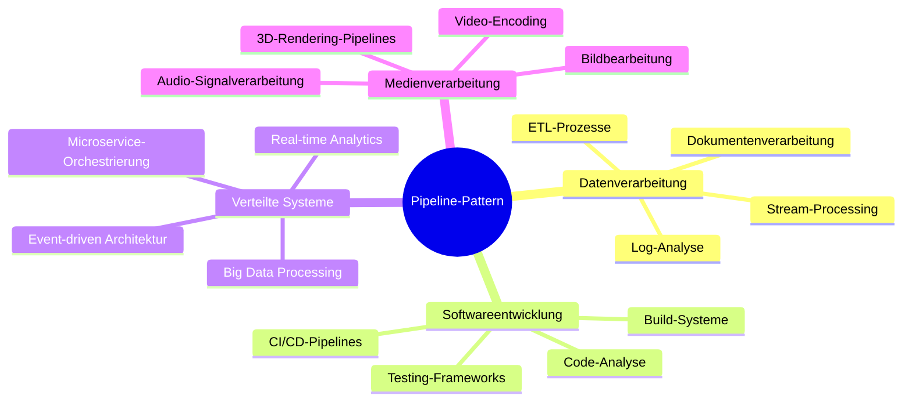
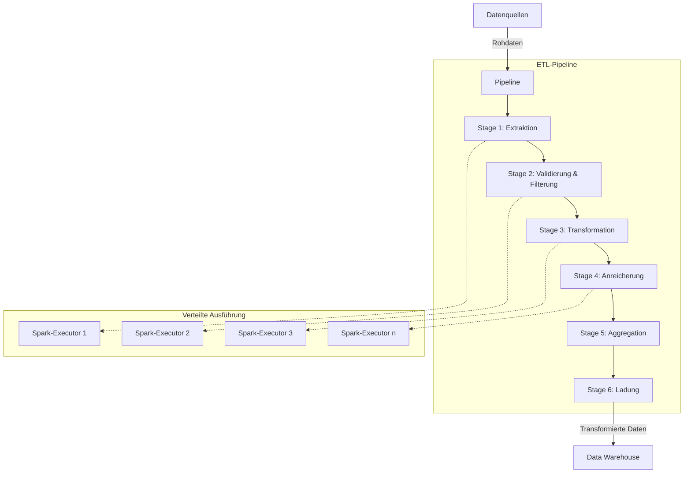
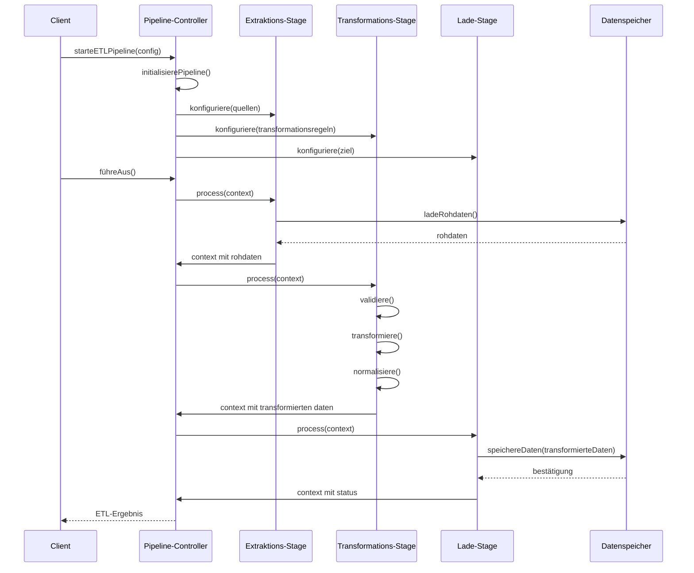
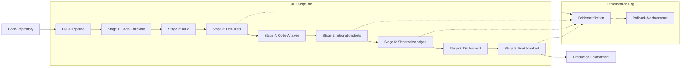
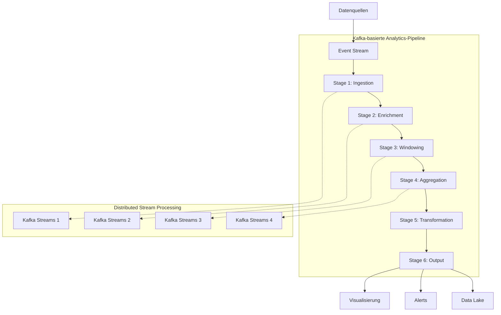
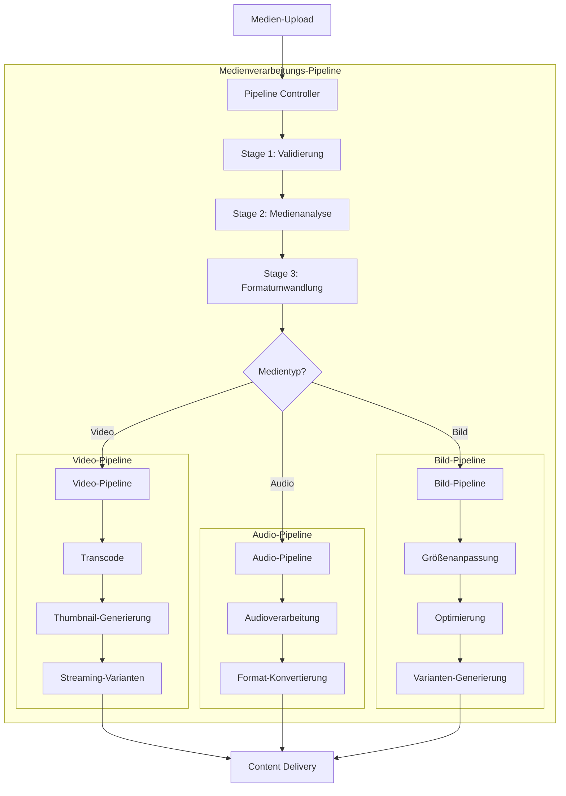
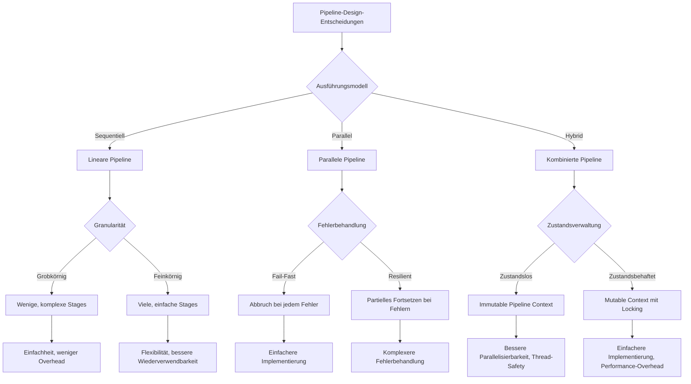

# Anwendungsbeispiele des Pipeline-Patterns in verteilten Systemen

Dieses Dokument stellt reale Anwendungsfälle des Pipeline-Patterns in verteilten Systemen vor und analysiert deren Implementierungsdetails.

## Übersicht der Anwendungsfälle



## Detaillierte Anwendungsfälle

### 1. ETL-Pipeline für Big Data



#### ETL-Pipeline: Sequenzdiagramm



### 2. CI/CD-Pipeline für Microservices



#### Jenkins Pipeline-Implementierung

```groovy
// Beispiel: Jenkins Pipeline für Microservice-Deployment
pipeline {
    agent any
    
    stages {
        stage('Checkout') {
            steps {
                checkout scm
            }
        }
        
        stage('Build') {
            steps {
                sh 'mvn clean compile'
            }
        }
        
        stage('Unit Tests') {
            steps {
                sh 'mvn test'
            }
            post {
                failure {
                    echo 'Unit Tests fehlgeschlagen!'
                    notifyTeam()
                }
            }
        }
        
        stage('Code Analysis') {
            parallel {
                stage('SonarQube') {
                    steps {
                        sh 'mvn sonar:sonar'
                    }
                }
                stage('Security Scan') {
                    steps {
                        sh 'owasp-dependency-check'
                    }
                }
            }
        }
        
        stage('Integration Tests') {
            steps {
                sh 'mvn verify'
            }
        }
        
        stage('Deploy to Staging') {
            steps {
                sh 'kubectl apply -f deployment.yaml --namespace=staging'
            }
        }
        
        stage('Functional Tests') {
            steps {
                sh 'newman run tests/api-tests.json -e staging.json'
            }
        }
        
        stage('Deploy to Production') {
            when {
                branch 'main'
            }
            steps {
                timeout(time: 15, unit: 'MINUTES') {
                    input message: 'Deploy to Production?'
                }
                sh 'kubectl apply -f deployment.yaml --namespace=production'
            }
        }
    }
    
    post {
        failure {
            rollback()
        }
        success {
            notifyDeploymentSuccess()
        }
    }
}
```

### 3. Real-time Analytics Pipeline



#### Kafka Streams Implementierung

```java
// Beispiel: Kafka Streams Topology für Analytics-Pipeline
public Topology createTopology() {
    StreamsBuilder builder = new StreamsBuilder();
    
    // Stage 1: Data Ingestion
    KStream<String, Event> events = builder.stream("input-events", 
            Consumed.with(Serdes.String(), eventSerde));
    
    // Stage 2: Data Enrichment
    KStream<String, EnrichedEvent> enrichedEvents = events
            .mapValues(event -> enrichmentService.enrich(event));
    
    // Stage 3: Windowing
    TimeWindowedKStream<String, EnrichedEvent> windowedEvents = enrichedEvents
            .groupByKey()
            .windowedBy(TimeWindows.of(Duration.ofMinutes(5)));
    
    // Stage 4: Aggregation
    KTable<Windowed<String>, AggregatedEvent> aggregatedEvents = windowedEvents
            .aggregate(
                AggregatedEvent::new,
                (key, event, aggregate) -> aggregate.addEvent(event),
                Materialized.with(Serdes.String(), aggregatedEventSerde)
            );
    
    // Stage 5: Transformation
    KStream<String, AnalyticsResult> results = aggregatedEvents
            .toStream()
            .map((windowedKey, aggregate) -> 
                KeyValue.pair(windowedKey.key(), transformer.transform(aggregate)));
    
    // Stage 6: Output
    results.to("analytics-results", 
            Produced.with(Serdes.String(), analyticsResultSerde));
    
    // Publish alerts for threshold violations
    results.filter((key, result) -> result.exceedsThreshold())
           .to("analytics-alerts");
    
    return builder.build();
}
```

### 4. Medienverarbeitungs-Pipeline



#### Medienverarbeitungs-Implementierung (Pseudocode)

```java
// Media Processing Pipeline mit Strategy Pattern
public class MediaProcessingPipeline implements Pipeline<MediaContext> {
    private final List<Stage<MediaContext>> commonStages = new ArrayList<>();
    private final Map<MediaType, List<Stage<MediaContext>>> typeSpecificStages = new HashMap<>();
    
    public MediaProcessingPipeline() {
        // Gemeinsame Stages für alle Medientypen
        commonStages.add(new ValidationStage());
        commonStages.add(new MediaAnalysisStage());
        commonStages.add(new FormatConversionStage());
        
        // Spezifische Stages für Videos
        List<Stage<MediaContext>> videoStages = new ArrayList<>();
        videoStages.add(new TranscodeStage());
        videoStages.add(new ThumbnailGenerationStage());
        videoStages.add(new StreamingVariantsStage());
        typeSpecificStages.put(MediaType.VIDEO, videoStages);
        
        // Spezifische Stages für Audio
        List<Stage<MediaContext>> audioStages = new ArrayList<>();
        audioStages.add(new AudioProcessingStage());
        audioStages.add(new AudioFormatConversionStage());
        typeSpecificStages.put(MediaType.AUDIO, audioStages);
        
        // Spezifische Stages für Bilder
        List<Stage<MediaContext>> imageStages = new ArrayList<>();
        imageStages.add(new ResizeStage());
        imageStages.add(new OptimizationStage());
        imageStages.add(new VariantGenerationStage());
        typeSpecificStages.put(MediaType.IMAGE, imageStages);
    }
    
    @Override
    public MediaContext process(MediaContext context) {
        // Führe gemeinsame Stages aus
        for (Stage<MediaContext> stage : commonStages) {
            context = stage.process(context);
            if (context.hasErrors()) {
                return context;
            }
        }
        
        // Bestimme Medientyp und führe die entsprechenden Stages aus
        MediaType mediaType = context.getMediaType();
        List<Stage<MediaContext>> specificStages = typeSpecificStages.get(mediaType);
        
        if (specificStages != null) {
            for (Stage<MediaContext> stage : specificStages) {
                context = stage.process(context);
                if (context.hasErrors()) {
                    return context;
                }
            }
        }
        
        return context;
    }
}
```

## Design-Entscheidungen beim Pipeline-Einsatz



## Evolutionspfad für Pipeline-Architekturen


## Praktische Umsetzungsbeispiele

### Beispiel 1: Linear Pipeline in Java

```java
public interface Stage<T> {
    T process(T input);
}

public class LinearPipeline<T> {
    private final List<Stage<T>> stages = new ArrayList<>();
    
    public LinearPipeline<T> addStage(Stage<T> stage) {
        stages.add(stage);
        return this;
    }
    
    public T execute(T input) {
        T current = input;
        for (Stage<T> stage : stages) {
            current = stage.process(current);
        }
        return current;
    }
}

// Beispiel-Implementierung für Dokumentenverarbeitung
public class DocumentContext {
    private Document document;
    private Map<String, Object> metadata = new HashMap<>();
    // Getter und Setter...
}

public class ValidationStage implements Stage<DocumentContext> {
    @Override
    public DocumentContext process(DocumentContext context) {
        Document doc = context.getDocument();
        // Validierungslogik...
        return context;
    }
}

public class TextExtractionStage implements Stage<DocumentContext> {
    @Override
    public DocumentContext process(DocumentContext context) {
        Document doc = context.getDocument();
        String extractedText = textExtractor.extract(doc);
        context.getMetadata().put("extractedText", extractedText);
        return context;
    }
}

public class ClassificationStage implements Stage<DocumentContext> {
    @Override
    public DocumentContext process(DocumentContext context) {
        String text = (String)context.getMetadata().get("extractedText");
        String category = classifier.classify(text);
        context.getMetadata().put("category", category);
        return context;
    }
}

// Beispiel-Nutzung
public class DocumentProcessor {
    public DocumentContext processDocument(Document document) {
        DocumentContext context = new DocumentContext();
        context.setDocument(document);
        
        LinearPipeline<DocumentContext> pipeline = new LinearPipeline<>();
        pipeline.addStage(new ValidationStage())
                .addStage(new TextExtractionStage())
                .addStage(new ClassificationStage());
        
        return pipeline.execute(context);
    }
}
```

### Beispiel 2: Parallele Pipeline mit CompletableFuture

```java
public class ParallelPipeline<T> {
    private final List<Stage<T>> stages = new ArrayList<>();
    private final ExecutorService executor;
    
    public ParallelPipeline(ExecutorService executor) {
        this.executor = executor;
    }
    
    public ParallelPipeline<T> addStage(Stage<T> stage) {
        stages.add(stage);
        return this;
    }
    
    public CompletableFuture<T> executeAsync(T input) {
        if (stages.isEmpty()) {
            return CompletableFuture.completedFuture(input);
        }
        
        List<CompletableFuture<T>> stageFutures = new ArrayList<>();
        
        // Erstelle ein Future für jede Stage mit einer Kopie des Input-Kontexts
        for (Stage<T> stage : stages) {
            stageFutures.add(CompletableFuture.supplyAsync(
                () -> stage.process(createContextCopy(input)), executor));
        }
        
        // Warte auf alle Futures und kombiniere die Ergebnisse
        return CompletableFuture.allOf(
                stageFutures.toArray(new CompletableFuture[0]))
            .thenApply(v -> {
                T result = createContextCopy(input);
                for (CompletableFuture<T> future : stageFutures) {
                    result = mergeResults(result, future.join());
                }
                return result;
            });
    }
    
    // Diese Methoden müssen für den konkreten Kontext-Typ implementiert werden
    protected abstract T createContextCopy(T original);
    protected abstract T mergeResults(T base, T toMerge);
}

// Beispiel für eine Pipeline zur parallelen Bildverarbeitung
public class ImageProcessingPipeline {
    public CompletableFuture<ProcessedImage> processImageAsync(BufferedImage originalImage) {
        ImageContext context = new ImageContext(originalImage);
        
        ExecutorService executor = Executors.newFixedThreadPool(
                Runtime.getRuntime().availableProcessors());
        
        ParallelPipeline<ImageContext> pipeline = new ImageParallelPipeline(executor);
        
        pipeline.addStage(new ResizeStage())
                .addStage(new FilterStage())
                .addStage(new CompressionStage());
        
        return pipeline.executeAsync(context)
                .thenApply(ImageContext::getProcessedImage)
                .whenComplete((result, error) -> executor.shutdown());
    }
}
```

### Beispiel 3: Verteilte Pipeline mit Apache Kafka

```java
// Beispiel für eine verteilte Pipeline mit Kafka
public class KafkaPipelineStage {
    private final String consumeTopic;
    private final String produceTopic;
    private final Properties kafkaProps;
    
    public KafkaPipelineStage(String consumeTopic, String produceTopic, 
                             Properties kafkaProps) {
        this.consumeTopic = consumeTopic;
        this.produceTopic = produceTopic;
        this.kafkaProps = kafkaProps;
    }
    
    public void start() {
        KafkaConsumer<String, String> consumer = new KafkaConsumer<>(kafkaProps);
        KafkaProducer<String, String> producer = new KafkaProducer<>(kafkaProps);
        
        consumer.subscribe(Collections.singletonList(consumeTopic));
        
        ExecutorService executor = Executors.newSingleThreadExecutor();
        executor.submit(() -> {
            try {
                while (true) {
                    ConsumerRecords<String, String> records = consumer.poll(Duration.ofMillis(100));
                    
                    for (ConsumerRecord<String, String> record : records) {
                        // Verarbeite die Eingabe
                        String processedValue = processData(record.value());
                        
                        // Sende das Ergebnis an die nächste Stage
                        ProducerRecord<String, String> outputRecord = 
                            new ProducerRecord<>(produceTopic, record.key(), processedValue);
                        
                        producer.send(outputRecord);
                    }
                }
            } catch (Exception e) {
                e.printStackTrace();
            } finally {
                consumer.close();
                producer.close();
                executor.shutdown();
            }
        });
    }
    
    private String processData(String data) {
        // Tatsächliche Datenverarbeitungslogik
        return transformedData;
    }
    
    // Beispiel: Einrichtung einer verteilten Pipeline
    public static void setupDistributedPipeline() {
        Properties props = new Properties();
        props.put("bootstrap.servers", "localhost:9092");
        props.put("group.id", "pipeline-group");
        props.put("key.serializer", "org.apache.kafka.common.serialization.StringSerializer");
        props.put("key.deserializer", "org.apache.kafka.common.serialization.StringDeserializer");
        props.put("value.serializer", "org.apache.kafka.common.serialization.StringSerializer");
        props.put("value.deserializer", "org.apache.kafka.common.serialization.StringDeserializer");
        
        // Stage 1: Datenextraktion
        KafkaPipelineStage extractionStage = 
            new KafkaPipelineStage("raw-data", "extracted-data", props);
        extractionStage.start();
        
        // Stage 2: Datenvalidierung
        KafkaPipelineStage validationStage = 
            new KafkaPipelineStage("extracted-data", "validated-data", props);
        validationStage.start();
        
        // Stage 3: Datentransformation
        KafkaPipelineStage transformationStage = 
            new KafkaPipelineStage("validated-data", "transformed-data", props);
        transformationStage.start();
        
        // Stage 4: Datenspeicherung
        KafkaPipelineStage storageStage = 
            new KafkaPipelineStage("transformed-data", "stored-data", props);
        storageStage.start();
    }
}
```

### Beispiel 4: Serverless Pipeline mit AWS Step Functions

```json
{
  "Comment": "ETL Pipeline mit AWS Step Functions",
  "StartAt": "Extract",
  "States": {
    "Extract": {
      "Type": "Task",
      "Resource": "arn:aws:lambda:REGION:ACCOUNT_ID:function:ExtractFunction",
      "Next": "Validate"
    },
    "Validate": {
      "Type": "Task",
      "Resource": "arn:aws:lambda:REGION:ACCOUNT_ID:function:ValidateFunction",
      "Next": "DataValidChoice"
    },
    "DataValidChoice": {
      "Type": "Choice",
      "Choices": [
        {
          "Variable": "$.isValid",
          "BooleanEquals": true,
          "Next": "Transform"
        }
      ],
      "Default": "HandleInvalidData"
    },
    "HandleInvalidData": {
      "Type": "Task",
      "Resource": "arn:aws:lambda:REGION:ACCOUNT_ID:function:HandleInvalidDataFunction",
      "End": true
    },
    "Transform": {
      "Type": "Task",
      "Resource": "arn:aws:lambda:REGION:ACCOUNT_ID:function:TransformFunction",
      "Next": "ParallelProcessing"
    },
    "ParallelProcessing": {
      "Type": "Parallel",
      "Branches": [
        {
          "StartAt": "EnrichData",
          "States": {
            "EnrichData": {
              "Type": "Task",
              "Resource": "arn:aws:lambda:REGION:ACCOUNT_ID:function:EnrichFunction",
              "End": true
            }
          }
        },
        {
          "StartAt": "AggregateData",
          "States": {
            "AggregateData": {
              "Type": "Task",
              "Resource": "arn:aws:lambda:REGION:ACCOUNT_ID:function:AggregateFunction",
              "End": true
            }
          }
        }
      ],
      "Next": "Load"
    },
    "Load": {
      "Type": "Task",
      "Resource": "arn:aws:lambda:REGION:ACCOUNT_ID:function:LoadFunction",
      "End": true
    }
  }
}
```

## Herausforderungen und Lösungen im verteilten Kontext

### 1. Fehlerbehandlung in verteilten Pipelines

**Problem**: In verteilten Pipelines kann ein Fehler in einer Stage zur Inkonsistenz im gesamten System führen.

**Lösungen**:
- Wiederholungsmechanismen mit exponentieller Backoff-Strategie
- Circuit-Breaker-Pattern für fehleranfällige Services
- Dead-Letter-Queues für fehlgeschlagene Verarbeitungen
- Transaktionssicherheit für zusammengehörige Operationen
- Idempotente Operationen für sichere Wiederholungen

### 2. Monitoring und Nachverfolgbarkeit

**Problem**: Nachverfolgen von Daten durch mehrere Stages in verteilten Systemen ist komplex.

**Lösungen**:
- Korrelations-IDs für end-to-end Nachverfolgung
- Verteiltes Tracing mit Jaeger oder Zipkin
- Metriken für jede Pipeline-Stage
- Zentralisiertes Logging mit Kontext-Informationen
- Dashboards mit Pipeline-Durchsatz und Latenz-Metriken

### 3. Skalierung und Performance

**Problem**: Unterschiedliche Stages können unterschiedliche Ressourcenanforderungen haben.

**Lösungen**:
- Unabhängige Skalierung jeder Pipeline-Stage
- Dynamische Parallelität basierend auf Last
- Caching zwischen Stages für häufig benötigte Daten
- Backpressure-Mechanismen für überlastete Stages
- Batch-Verarbeitung für effizienten Durchsatz

### 4. Pipeline-Orchestrierung

**Problem**: Koordination komplexer Pipelines mit bedingten Pfaden und Parallelität.

**Lösungen**:
- Workflow-Engines wie Apache Airflow
- Serverless Orchestrierungsdienste wie AWS Step Functions
- Event-basierte Koordination mit Message Brokern
- Declarative Pipeline-Definitionen
- Zentrale Pipeline-Registry mit Versionierung

## Zukunftstrends bei Pipeline-Architekturen

```mermaid
flowchart TD
    A[Zukunftstrends] --> B[AI-gesteuerte Pipelines]
    A --> C[Self-healing Pipelines]
    A --> D[Zero-Code Pipeline-Builder]
    A --> E[Cross-Cloud Pipelines]
    
    B --> B1[Dynamische Optimierung der Pipeline-Konfiguration]
    B --> B2[Automatische Generierung von Transformationsregeln]
    
    C --> C1[Automatische Fehlererkennung und -behebung]
    C --> C2[Autonome Skalierung und Ressourcenoptimierung]
    
    D --> D1[Visuelle Pipeline-Editoren]
    D --> D2[Marketplace für vorgefertigte Pipeline-Komponenten]
    
    E --> E1[Nahtlose Integration multipler Cloud-Anbieter]
    E --> E2[Föderation von Pipeline-Ressourcen]
