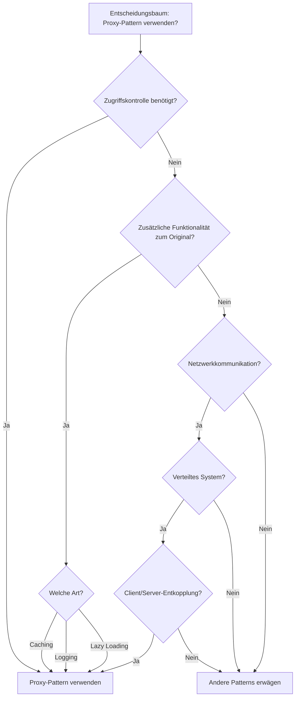
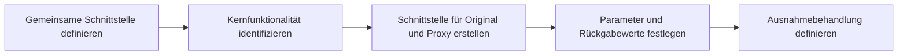
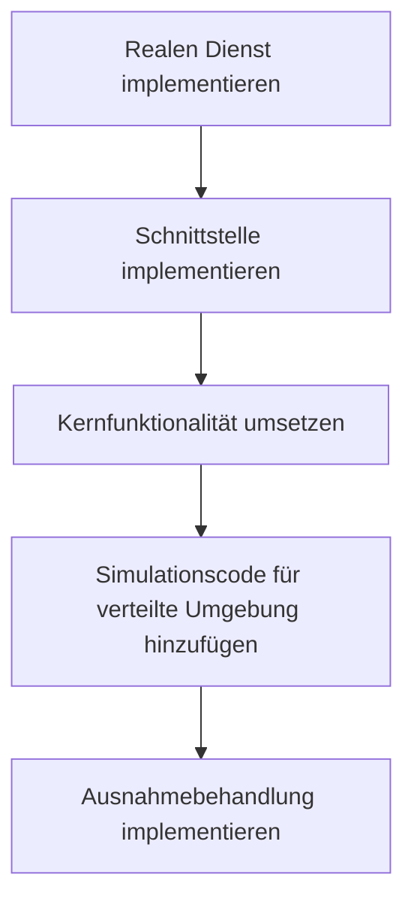
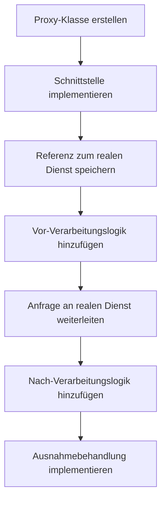
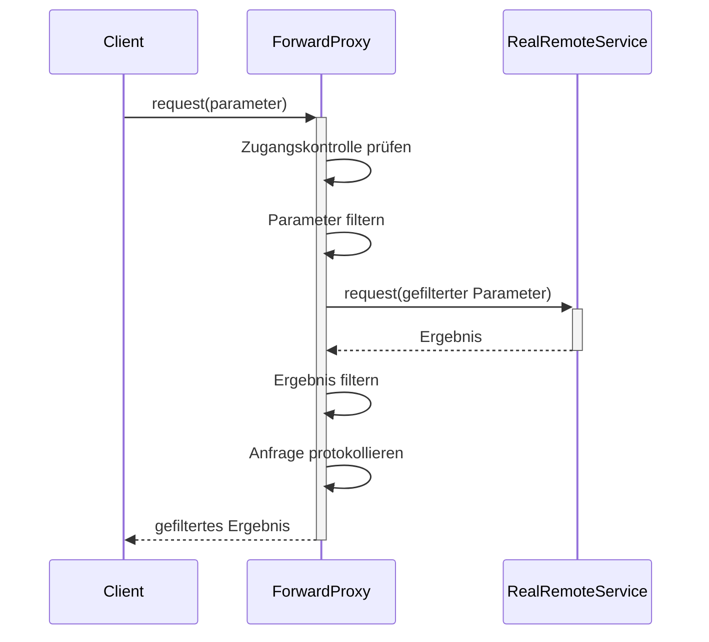
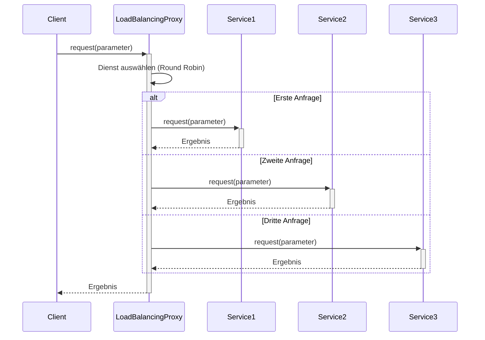
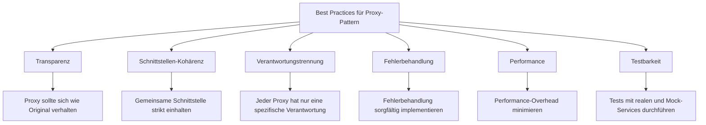
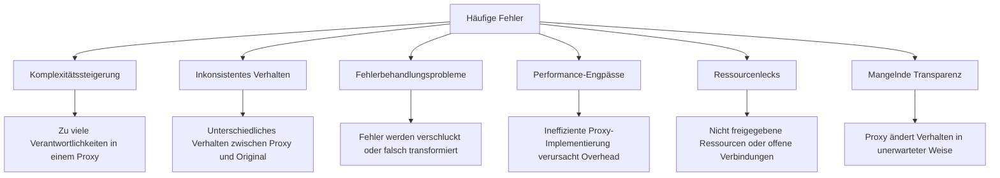
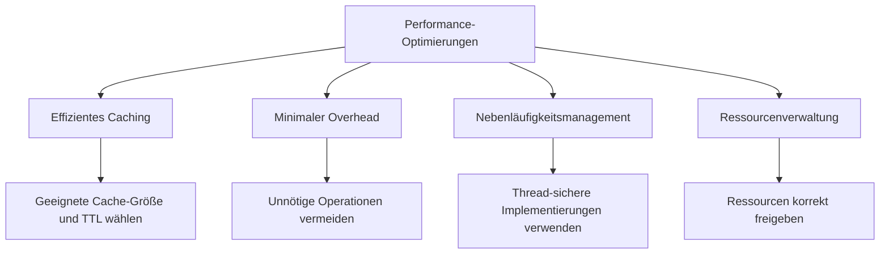

# Implementierungsleitfaden für das Proxy-Pattern

Dieser Leitfaden beschreibt den Implementierungsprozess des Proxy-Patterns in verteilten Systemen anhand praktischer Beispiele aus diesem Projekt.

## Inhaltsverzeichnis

1. [Wann sollte das Proxy-Pattern verwendet werden?](#wann-sollte-das-proxy-pattern-verwendet-werden)
2. [Schrittweise Implementierung](#schrittweise-implementierung)
3. [Implementierungsbeispiele](#implementierungsbeispiele)
4. [Best Practices](#best-practices)
5. [Häufige Fehler](#häufige-fehler)
6. [Performanceüberlegungen](#performanceüberlegungen)

## Wann sollte das Proxy-Pattern verwendet werden?

Das Proxy-Pattern ist in folgenden Situationen besonders nützlich:



## Schrittweise Implementierung

### 1. Gemeinsame Schnittstelle definieren



### 2. Konkrete Service-Klasse implementieren



### 3. Proxy-Klasse implementieren



## Implementierungsbeispiele

### Beispiel 1: Einfacher Forward-Proxy



### Beispiel 2: Caching-Proxy für Leistungsoptimierung

```mermaid
sequenceDiagram
    participant Client
    participant Proxy as CachingProxy
    participant Cache
    participant Service as RealRemoteService
    
    Client->>+Proxy: request(parameter)
    Proxy->>+Cache: getIfPresent(cacheKey)
    
    alt Cache Hit
        Cache-->>-Proxy: Cached Result
        Proxy->>Proxy: Cache Hit protokollieren
    else Cache Miss
        Cache-->>-Proxy: null
        Proxy->>Proxy: Cache Miss protokollieren
        
        Proxy->>+Service: request(parameter)
        Service-->>-Proxy: Ergebnis
        
        Proxy->>Cache: put(cacheKey, Ergebnis)
    end
    
    Proxy-->>-Client: Ergebnis
```

### Beispiel 3: Load-Balancing-Proxy



### Beispiel 4: Java-Implementierung eines Forward-Proxys

```java
public class ForwardProxy implements RemoteService {
    
    private final RemoteService targetService;
    private final AccessController accessController;
    private final ContentFilter contentFilter;
    
    public ForwardProxy(RemoteService targetService, 
                     AccessController accessController,
                     ContentFilter contentFilter) {
        this.targetService = targetService;
        this.accessController = accessController;
        this.contentFilter = contentFilter;
    }
    
    @Override
    public String request(String parameter) throws ServiceException {
        // Zugangskontrolle
        if (accessController != null && !accessController.checkAccess(parameter)) {
            throw new ServiceException("Zugriff verweigert", 
                    ServiceException.ErrorType.UNAUTHORIZED);
        }
        
        // Parameter filtern
        String filteredParameter = parameter;
        if (contentFilter != null) {
            filteredParameter = contentFilter.filterContent(parameter);
        }
        
        try {
            // Anfrage an den Zieldienst weiterleiten
            String result = targetService.request(filteredParameter);
            
            // Ergebnis filtern
            if (contentFilter != null) {
                result = contentFilter.filterContent(result);
            }
            
            return result;
        } catch (ServiceException e) {
            // Fehler behandeln und weiterleiten
            throw e;
        }
    }
    
    // Weitere Methoden der RemoteService-Schnittstelle...
}
```

### Beispiel 5: Java-Implementierung eines Caching-Proxys

```java
public class CachingProxy implements RemoteService {
    
    private final RemoteService targetService;
    private final Cache<CacheKey, String> cache;
    
    public CachingProxy(RemoteService targetService, 
                      long maximumSize, 
                      long expireAfter, 
                      TimeUnit timeUnit) {
        this.targetService = targetService;
        
        // Cache konfigurieren
        this.cache = Caffeine.newBuilder()
                .maximumSize(maximumSize)
                .expireAfterWrite(expireAfter, timeUnit)
                .build();
    }
    
    @Override
    public String request(String parameter) throws ServiceException {
        // Cache-Schlüssel erstellen
        CacheKey cacheKey = CacheKey.forParameterizedRequest(parameter);
        
        // Versuchen, aus dem Cache zu holen
        String cachedResult = cache.getIfPresent(cacheKey);
        
        if (cachedResult != null) {
            // Cache-Treffer
            return cachedResult;
        }
        
        // Cache-Miss: Anfrage an den Zieldienst weiterleiten
        String result = targetService.request(parameter);
        
        // Ergebnis im Cache speichern
        cache.put(cacheKey, result);
        
        return result;
    }
    
    // Weitere Methoden der RemoteService-Schnittstelle...
}
```

## Best Practices



### 1. Transparenz wahren

Der Proxy sollte sich für den Client genau wie das Original verhalten. Der Client sollte idealerweise nicht erkennen müssen, ob er mit dem Original oder einem Proxy interagiert.

### 2. Schnittstellen-Kohärenz sicherstellen

Stellen Sie sicher, dass der Proxy und das Original dieselbe Schnittstelle implementieren und identische Methodensignaturen haben.

### 3. Verantwortungstrennung beachten

Jeder Proxy sollte nur eine spezifische Verantwortung haben. Verwenden Sie mehrere Proxies für verschiedene Aspekte (Caching, Zugriffskontrolle, Logging).

### 4. Fehlerbehandlung sorgfältig implementieren

Behandeln Sie Fehler, die im Proxy selbst auftreten, separat von Fehlern, die vom eigentlichen Dienst kommen.

### 5. Performance-Overhead beachten

Minimieren Sie den Performance-Overhead des Proxys. Besonders wichtig bei Caching-Proxies, um die Leistungsvorteile nicht zu untergraben.

### 6. Vermeidung von Proxy-Ketten

Viele verschachtelte Proxies können die Komplexität und den Overhead erhöhen. Überlegen Sie, ob eine alternative Architektur sinnvoller ist.

## Häufige Fehler



## Performanceüberlegungen



### 1. Cache-Strategien optimieren

Bei Caching-Proxies:
- Geeignete Größenbegrenzungen für den Cache implementieren
- TTL (Time-to-Live) basierend auf der Änderungshäufigkeit der Daten festlegen
- Eviction-Strategien basierend auf Zugriffsmustern wählen

### 2. Connection Pooling

Bei Remote-Proxies:
- Connection Pooling implementieren, um den Overhead der Verbindungsherstellung zu reduzieren
- Keep-Alive-Verbindungen verwenden, wo sinnvoll

### 3. Asynchrone Verarbeitung

- Asynchrone Verarbeitung für nicht-blockierende Operationen nutzen
- CompletableFuture oder reaktive Programmierung in modernen Java-Anwendungen einsetzen

### 4. Ressourcenfreigabe

- Stellen Sie sicher, dass alle Ressourcen ordnungsgemäß freigegeben werden
- Verwenden Sie try-with-resources oder ähnliche Konstrukte
- Implementieren Sie Shutdown-Hooks für saubere Beendigung
