# Vergleich des Proxy-Patterns mit anderen strukturellen Mustern

Dieses Dokument vergleicht das Proxy-Pattern mit anderen strukturellen Entwurfsmustern und hilft bei der Entscheidung, welches Muster in verschiedenen Situationen am besten geeignet ist.

## Proxy vs. andere strukturelle Muster

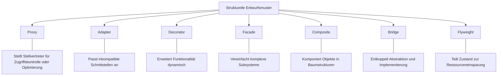

## Entscheidungshilfe: Welches Muster wann?

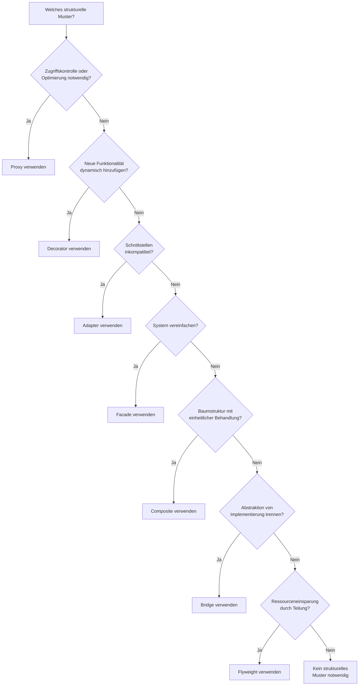

## Detaillierter Vergleich: Proxy vs. andere Muster

### Proxy vs. Decorator

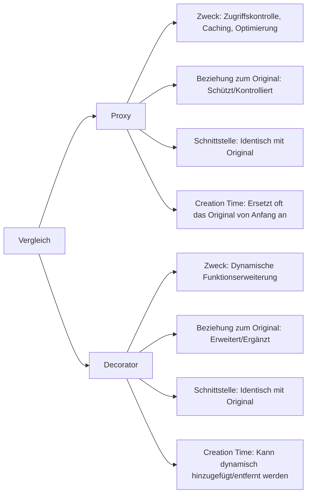

#### Schlüsselunterschied:
Der **Proxy** kontrolliert den Zugriff auf das Original, während der **Decorator** die Funktionalität des Originals erweitert. Der Proxy hat oft Kenntnis vom konkreten Objekt und seinem Verwendungszweck, der Decorator funktioniert generisch.

### Proxy vs. Adapter

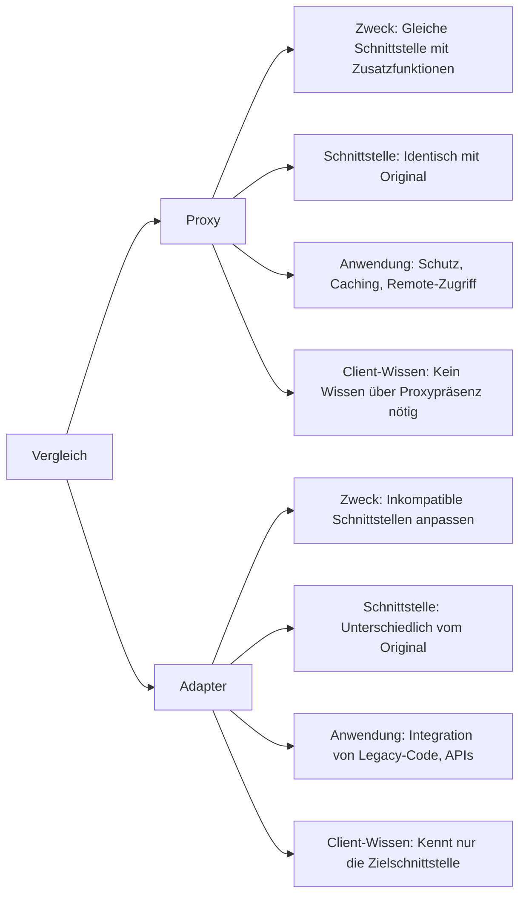

#### Schlüsselunterschied:
Der **Proxy** implementiert dieselbe Schnittstelle wie das Original und ändert nicht die Methodensignaturen, während der **Adapter** eine Schnittstelle in eine andere übersetzt.

### Proxy vs. Facade

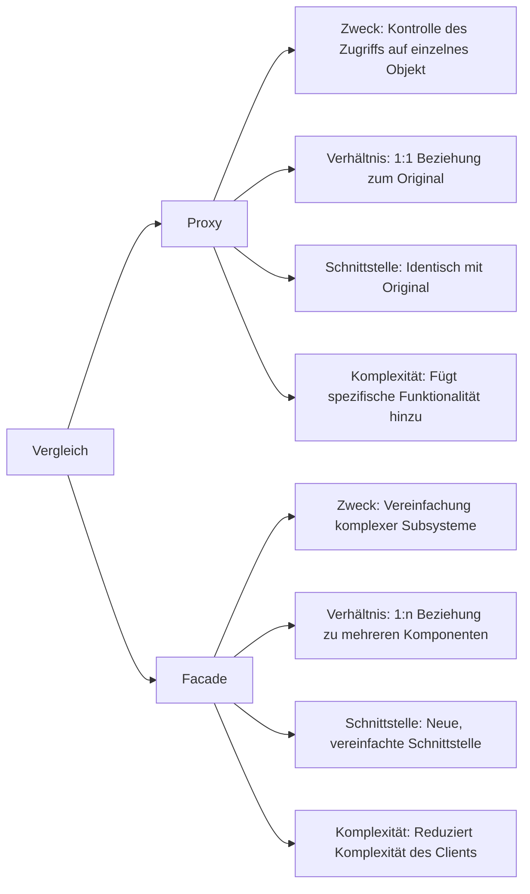

#### Schlüsselunterschied:
Der **Proxy** steht für ein einzelnes Objekt und behält dessen Schnittstelle bei, während die **Facade** eine vereinfachte Schnittstelle für ein ganzes Subsystem bietet.

## Anwendungsfälle verschiedener Muster in Verteilten Systemen

```mermaid
graph TD
    A[Strukturelle Muster in Verteilten Systemen] --> B[Proxy]
    A --> C[Adapter]
    A --> D[Facade]
    A --> E[Decorator]
    
    B --> B1[API-Gateway]
    B --> B2[Service Mesh]
    B --> B3[Caching Layer]
    B --> B4[Load Balancer]
    
    C --> C1[Protocol Translation]
    C --> C2[Legacy System Integration]
    C --> C3[Third-Party API Integration]
    
    D --> D1[Microservices Frontend]
    D --> D2[Backend for Frontend (BFF)]
    D --> D3[Cross-cutting Concerns API]
    
    E --> E1[Request/Response Logging]
    E --> E2[Authentication Layer]
    E --> E3[Transaction Management]
```

## Kombination von Mustern

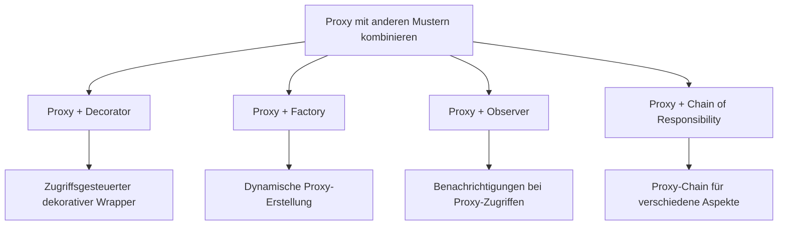

## Evolutionspfad für strukturelle Muster

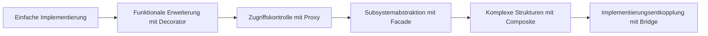

## Varianten des Proxy-Patterns im Vergleich

Im Vergleich zu den grundlegenden strukturellen Mustern gibt es auch verschiedene Varianten des Proxy-Patterns selbst, die in unterschiedlichen Kontexten anwendbar sind:

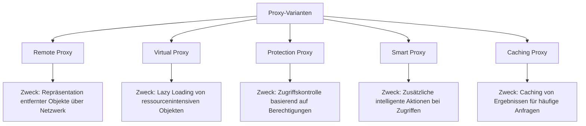

### Detaillierter Vergleich der Proxy-Varianten

| Variante | Hauptzweck | Vorteile | Nachteile | Typische Anwendung |
|----------|------------|----------|-----------|---------------------|
| Remote Proxy | Kommunikation mit entfernten Objekten | Netzwerktransparenz, Standortunabhängigkeit | Netzwerklatenz, Serialisierungsaufwand | Web Services, RPC, REST-APIs |
| Virtual Proxy | Verzögerte Instanziierung | Ressourceneffizienz, bessere Startzeit | Komplexere Implementierung | Bildlader, dokumentenbasierte Anwendungen |
| Protection Proxy | Zugriffssteuerung | Sicherheit, Autorisation | Overhead für Berechtigungsprüfungen | Sichere Systeme, Multi-Tenant-Anwendungen |
| Smart Proxy | Zusätzliche Operationen | Erweiterbarkeit, Flexibilität | Kann Decorator ähneln | Referenzzählung, Logging, Synchronisation |
| Caching Proxy | Leistungsoptimierung | Reduzierte Verarbeitungszeit, weniger Netzwerkverkehr | Cache-Invalidierung kann komplex sein | Webseiten-Caches, Datenbankabfragen |

## Herausforderungen bei der Verwendung des Proxy-Patterns

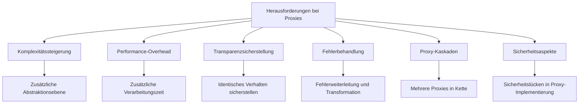

## Vergleichsmatrix: Vor- und Nachteile

| Muster | Stärken | Schwächen | Ideale Anwendungsfälle |
|--------|---------|-----------|------------------------|
| Proxy | Zugriffskontrolle, Caching, Optimierung | Komplexität, möglicher Performance-Overhead | Service-Vermittlung, Zugriffssteuerung, Caching |
| Decorator | Dynamische Funktionserweiterung, Flexibilität | Viele kleine Objekte, Komplexität | UI-Komponenten, Stream-I/O, Cross-cutting Concerns |
| Adapter | Integration inkompatiblen Codes | Zusätzliche Indirektion | Legacy-Code-Integration, Drittanbieter-APIs |
| Facade | Vereinfachung komplexer Subsysteme | Kann zu "God Object" werden | Komplexe Bibliotheken, Subsystem-APIs |
| Bridge | Entkopplung von Abstraktion und Implementierung | Initiale Designkomplexität | Plattformübergreifende Anwendungen, UI-Frameworks |
| Composite | Einheitliche Behandlung von Objekthierarchien | Kann zu generisch werden | Grafische Benutzeroberflächen, Dokumentstrukturen |
| Flyweight | Ressourceneinsparung | Komplexe Zustandsverwaltung | Textverarbeitung, Spielentwicklung, große Mengen ähnlicher Objekte |

## Wann sollte man sich GEGEN das Proxy-Pattern entscheiden?

Obwohl das Proxy-Pattern in vielen Szenarien nützlich ist, gibt es Situationen, in denen es möglicherweise nicht die beste Wahl ist:

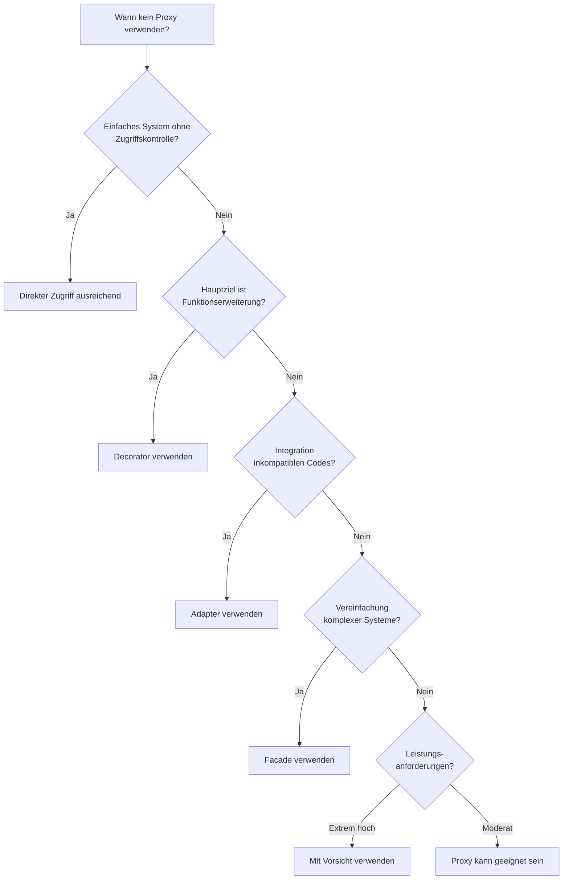

### Alternative Ansätze für Proxy-Zwecke

In einigen Fällen können modernere oder spezialisiertere Ansätze die Verwendung des traditionellen Proxy-Patterns ersetzen:

1. **Aspektorientierte Programmierung** für Cross-cutting Concerns
2. **Dependency Injection** für dynamisches Verhalten
3. **Service Mesh** für Netzwerk-Proxies in Microservices
4. **Java Dynamic Proxies/Reflection** für dynamische Proxy-Erstellung
5. **Funktionale Programmierungstechniken** wie Higher-Order Functions

## Migration von Legacy-Proxies zu modernen Alternativen

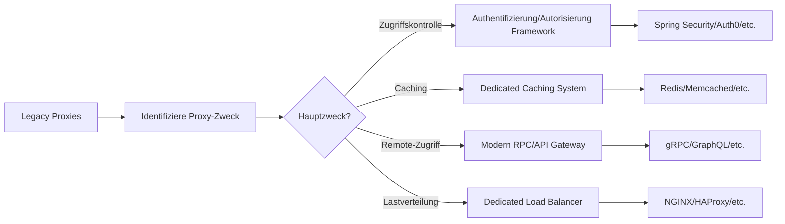