# Proxy-Pattern Dokumentation

Diese Dokumentation enthält verschiedene Diagramme zur Veranschaulichung des Proxy-Patterns und der konkreten Implementierungen in diesem Projekt.

## Inhalt

- [Komponentendiagramm](#komponentendiagramm)
- [Klassendiagramme](#klassendiagramme)
- [Sequenzdiagramme](#sequenzdiagramme)
- [Aktivitätsdiagramme](#aktivitätsdiagramme)
- [Konzeptdiagramme](#konzeptdiagramme)

## Komponentendiagramm

Das folgende Diagramm zeigt die Hauptkomponenten des Projekts und ihre Beziehungen zueinander:

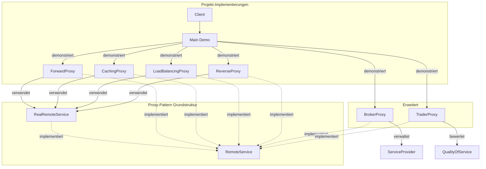
```mermaid
graph TD
    %%Client[Client] --> |verwendet| RemoteService[RemoteService Interface]
    
    subgraph "Proxy-Pattern Grundstruktur"
        RemoteService
        RealService[RealRemoteService]
        RealService -.-> |implementiert| RemoteService
        
    end
    
    subgraph "Projekt-Implementierungen"
        ForwardProxy[ForwardProxy] -.-> |implementiert| RemoteService
        CachingProxy[CachingProxy] -.-> |implementiert| RemoteService
        LoadBalancingProxy[LoadBalancingProxy] -.-> |implementiert| RemoteService
        ReverseProxy[ReverseProxy] -.-> |implementiert| RemoteService
        Client --> Main[Main Demo]
    end
    
    ForwardProxy --> |verwendet| RealService
    CachingProxy --> |verwendet| RealService
    LoadBalancingProxy --> |verwendet| RealService
    ReverseProxy --> |verwendet| RealService
    
    BrokerProxy --> |verwaltet| ServiceProvider[ServiceProvider]
    TraderProxy --> |bewertet| QualityOfService[QualityOfService]
    

    Main --> |demonstriert| ForwardProxy
    Main --> |demonstriert| CachingProxy
    Main --> |demonstriert| LoadBalancingProxy
    Main --> |demonstriert| ReverseProxy
 
  subgraph "Erweitert"
    Main --> |demonstriert| BrokerProxy
    Main --> |demonstriert| TraderProxy

    BrokerProxy[BrokerProxy] -.-> |implementiert| RemoteService
    TraderProxy[TraderProxy] -.-> |implementiert| RemoteService
  end  
```

## Klassendiagramme

### Allgemeines Proxy-Klassendiagramm

Das folgende Diagramm zeigt die allgemeine Struktur des Proxy-Patterns:

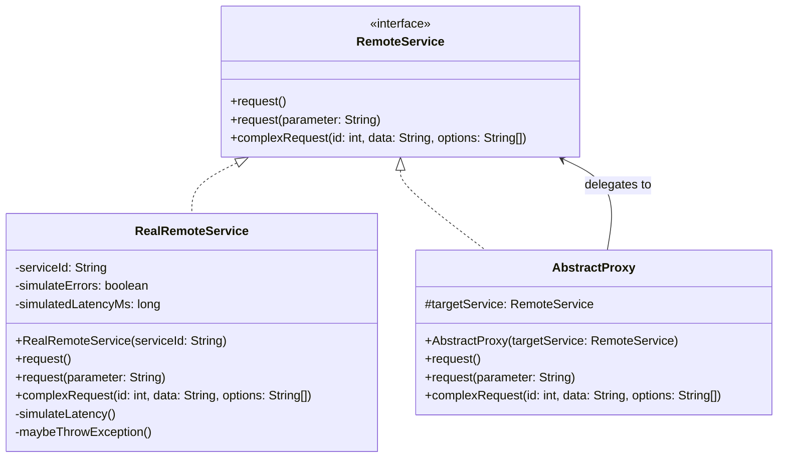
```mermaid
classDiagram
    class RemoteService {
        <<interface>>
        +request()
        +request(parameter: String)
        +complexRequest(id: int, data: String, options: String[])
    }
    
    class RealRemoteService {
        -serviceId: String
        -simulateErrors: boolean
        -simulatedLatencyMs: long
        +RealRemoteService(serviceId: String)
        +request()
        +request(parameter: String)
        +complexRequest(id: int, data: String, options: String[])
        -simulateLatency()
        -maybeThrowException()
    }
    
    class AbstractProxy {
        #targetService: RemoteService
        +AbstractProxy(targetService: RemoteService)
        +request()
        +request(parameter: String)
        +complexRequest(id: int, data: String, options: String[])
    }
    
    RemoteService <|.. RealRemoteService
    RemoteService <|.. AbstractProxy
    AbstractProxy --> RemoteService : delegates to
```

### Forward-Proxy-Klassendiagramm

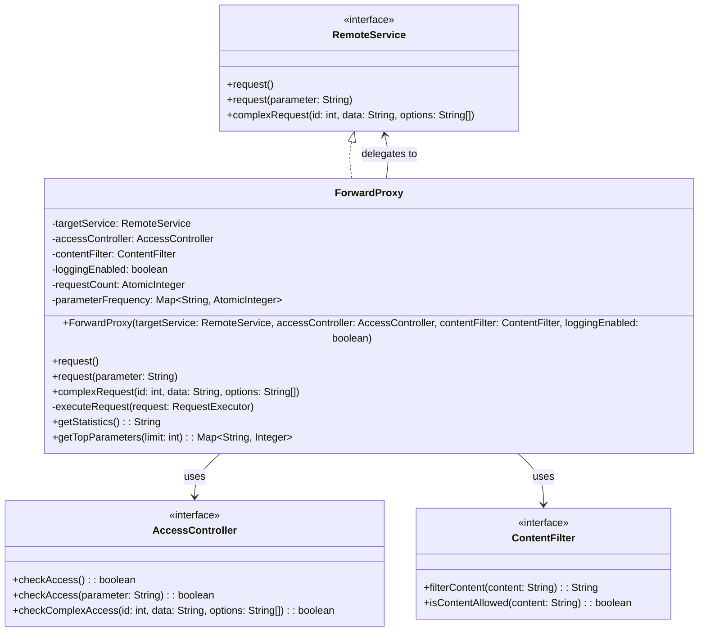
```mermaid
classDiagram
    class RemoteService {
        <<interface>>
        +request()
        +request(parameter: String)
        +complexRequest(id: int, data: String, options: String[])
    }
    
    class ForwardProxy {
        -targetService: RemoteService
        -accessController: AccessController
        -contentFilter: ContentFilter
        -loggingEnabled: boolean
        -requestCount: AtomicInteger
        -parameterFrequency: Map~String, AtomicInteger~
        +ForwardProxy(targetService: RemoteService, accessController: AccessController, contentFilter: ContentFilter, loggingEnabled: boolean)
        +request()
        +request(parameter: String)
        +complexRequest(id: int, data: String, options: String[])
        -executeRequest(request: RequestExecutor)
        +getStatistics(): String
        +getTopParameters(limit: int): Map~String, Integer~
    }
    
    class AccessController {
        <<interface>>
        +checkAccess(): boolean
        +checkAccess(parameter: String): boolean
        +checkComplexAccess(id: int, data: String, options: String[]): boolean
    }
    
    class ContentFilter {
        <<interface>>
        +filterContent(content: String): String
        +isContentAllowed(content: String): boolean
    }
    
    RemoteService <|.. ForwardProxy
    ForwardProxy --> RemoteService : delegates to
    ForwardProxy --> AccessController : uses
    ForwardProxy --> ContentFilter : uses
```

### Caching-Proxy-Klassendiagramm

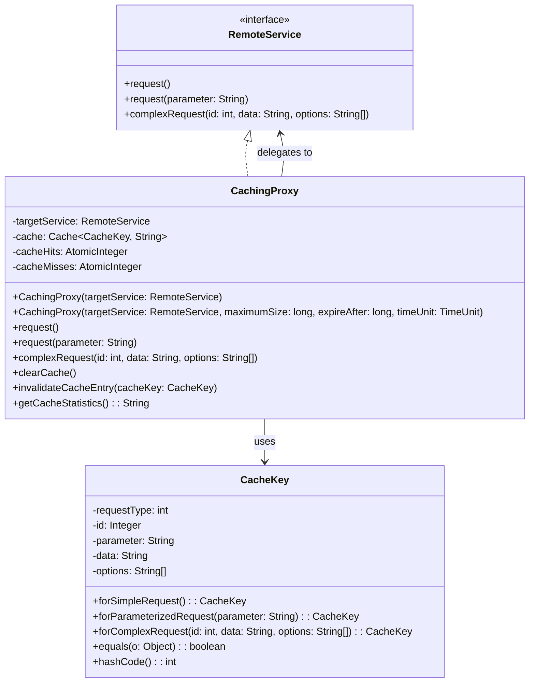
```mermaid
classDiagram
    class RemoteService {
        <<interface>>
        +request()
        +request(parameter: String)
        +complexRequest(id: int, data: String, options: String[])
    }
    
    class CachingProxy {
        -targetService: RemoteService
        -cache: Cache~CacheKey, String~
        -cacheHits: AtomicInteger
        -cacheMisses: AtomicInteger
        +CachingProxy(targetService: RemoteService)
        +CachingProxy(targetService: RemoteService, maximumSize: long, expireAfter: long, timeUnit: TimeUnit)
        +request()
        +request(parameter: String)
        +complexRequest(id: int, data: String, options: String[])
        +clearCache()
        +invalidateCacheEntry(cacheKey: CacheKey)
        +getCacheStatistics(): String
    }
    
    class CacheKey {
        -requestType: int
        -id: Integer
        -parameter: String
        -data: String
        -options: String[]
        +forSimpleRequest(): CacheKey
        +forParameterizedRequest(parameter: String): CacheKey
        +forComplexRequest(id: int, data: String, options: String[]): CacheKey
        +equals(o: Object): boolean
        +hashCode(): int
    }
    
    RemoteService <|.. CachingProxy
    CachingProxy --> RemoteService : delegates to
    CachingProxy --> CacheKey : uses
```

### Load-Balancing-Proxy-Klassendiagramm

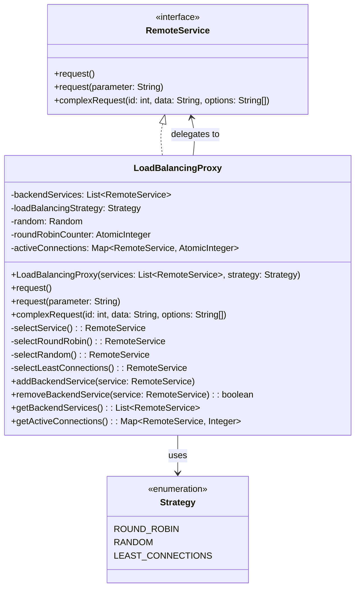
```mermaid
classDiagram
    class RemoteService {
        <<interface>>
        +request()
        +request(parameter: String)
        +complexRequest(id: int, data: String, options: String[])
    }
    
    class LoadBalancingProxy {
        -backendServices: List~RemoteService~
        -loadBalancingStrategy: Strategy
        -random: Random
        -roundRobinCounter: AtomicInteger
        -activeConnections: Map~RemoteService, AtomicInteger~
        +LoadBalancingProxy(services: List~RemoteService~, strategy: Strategy)
        +request()
        +request(parameter: String)
        +complexRequest(id: int, data: String, options: String[])
        -selectService(): RemoteService
        -selectRoundRobin(): RemoteService
        -selectRandom(): RemoteService
        -selectLeastConnections(): RemoteService
        +addBackendService(service: RemoteService)
        +removeBackendService(service: RemoteService): boolean
        +getBackendServices(): List~RemoteService~
        +getActiveConnections(): Map~RemoteService, Integer~
    }
    
    class Strategy {
        <<enumeration>>
        ROUND_ROBIN
        RANDOM
        LEAST_CONNECTIONS
    }
    
    RemoteService <|.. LoadBalancingProxy
    LoadBalancingProxy --> RemoteService : delegates to
    LoadBalancingProxy --> Strategy : uses
```

### Reverse-Proxy-Klassendiagramm

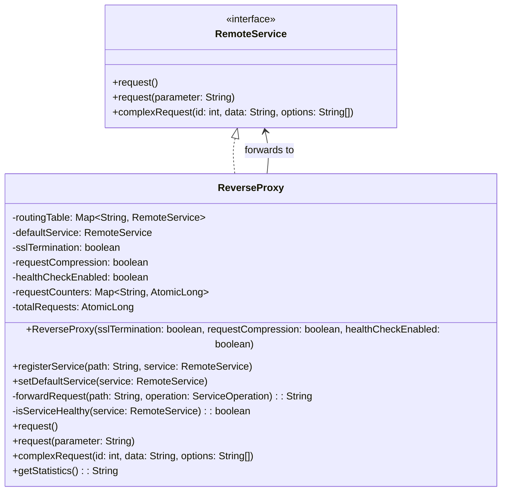
```mermaid
classDiagram
    class RemoteService {
        <<interface>>
        +request()
        +request(parameter: String)
        +complexRequest(id: int, data: String, options: String[])
    }
    
    class ReverseProxy {
        -routingTable: Map~String, RemoteService~
        -defaultService: RemoteService
        -sslTermination: boolean
        -requestCompression: boolean
        -healthCheckEnabled: boolean
        -requestCounters: Map~String, AtomicLong~
        -totalRequests: AtomicLong
        +ReverseProxy(sslTermination: boolean, requestCompression: boolean, healthCheckEnabled: boolean)
        +registerService(path: String, service: RemoteService)
        +setDefaultService(service: RemoteService)
        -forwardRequest(path: String, operation: ServiceOperation): String
        -isServiceHealthy(service: RemoteService): boolean
        +request()
        +request(parameter: String)
        +complexRequest(id: int, data: String, options: String[])
        +getStatistics(): String
    }
    
    RemoteService <|.. ReverseProxy
    ReverseProxy --> RemoteService : forwards to
```

### Broker-Proxy-Klassendiagramm

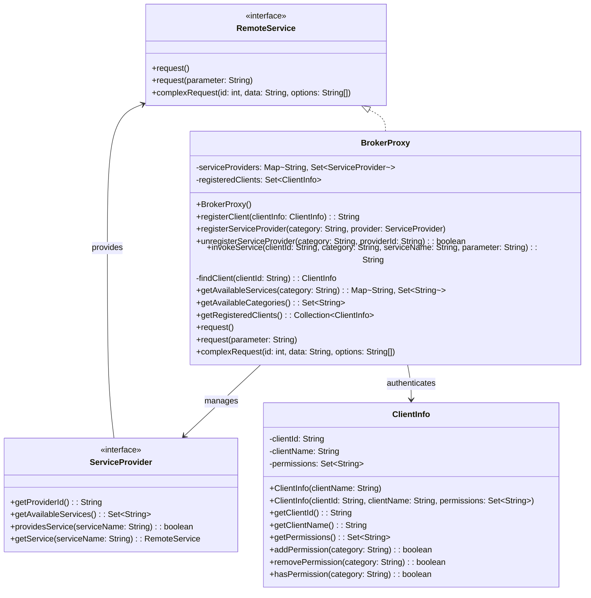
```mermaid
classDiagram
    class RemoteService {
        <<interface>>
        +request()
        +request(parameter: String)
        +complexRequest(id: int, data: String, options: String[])
    }
    
    class BrokerProxy {
        -serviceProviders: Map~String, Set~ServiceProvider~~
        -registeredClients: Set~ClientInfo~
        +BrokerProxy()
        +registerClient(clientInfo: ClientInfo): String
        +registerServiceProvider(category: String, provider: ServiceProvider)
        +unregisterServiceProvider(category: String, providerId: String): boolean
        +invokeService(clientId: String, category: String, serviceName: String, parameter: String): String
        -findClient(clientId: String): ClientInfo
        +getAvailableServices(category: String): Map~String, Set~String~~
        +getAvailableCategories(): Set~String~
        +getRegisteredClients(): Collection~ClientInfo~
        +request()
        +request(parameter: String)
        +complexRequest(id: int, data: String, options: String[])
    }
    
    class ServiceProvider {
        <<interface>>
        +getProviderId(): String
        +getAvailableServices(): Set~String~
        +providesService(serviceName: String): boolean
        +getService(serviceName: String): RemoteService
    }
    
    class ClientInfo {
        -clientId: String
        -clientName: String
        -permissions: Set~String~
        +ClientInfo(clientName: String)
        +ClientInfo(clientId: String, clientName: String, permissions: Set~String~)
        +getClientId(): String
        +getClientName(): String
        +getPermissions(): Set~String~
        +addPermission(category: String): boolean
        +removePermission(category: String): boolean
        +hasPermission(category: String): boolean
    }
    
    RemoteService <|.. BrokerProxy
    BrokerProxy --> ServiceProvider : manages
    BrokerProxy --> ClientInfo : authenticates
    ServiceProvider --> RemoteService : provides
```

### Trader-Proxy-Klassendiagramm

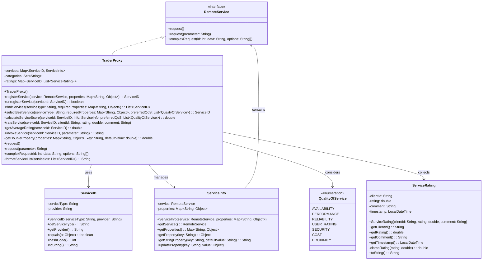
```mermaid
classDiagram
    class RemoteService {
        <<interface>>
        +request()
        +request(parameter: String)
        +complexRequest(id: int, data: String, options: String[])
    }
    
    class TraderProxy {
        -services: Map~ServiceID, ServiceInfo~
        -categories: Set~String~
        -ratings: Map~ServiceID, List~ServiceRating~~
        +TraderProxy()
        +registerService(service: RemoteService, properties: Map~String, Object~): ServiceID
        +unregisterService(serviceId: ServiceID): boolean
        +findServices(serviceType: String, requiredProperties: Map~String, Object~): List~ServiceID~
        +selectBestService(serviceType: String, requiredProperties: Map~String, Object~, preferredQoS: List~QualityOfService~): ServiceID
        -calculateServiceScore(serviceId: ServiceID, info: ServiceInfo, preferredQoS: List~QualityOfService~): double
        +rateService(serviceId: ServiceID, clientId: String, rating: double, comment: String)
        +getAverageRating(serviceId: ServiceID): double
        +invokeService(serviceId: ServiceID, parameter: String): String
        -getDoubleProperty(properties: Map~String, Object~, key: String, defaultValue: double): double
        +request()
        +request(parameter: String)
        +complexRequest(id: int, data: String, options: String[])
        -formatServiceList(serviceIds: List~ServiceID~): String
    }
    
    class ServiceID {
        -serviceType: String
        -provider: String
        +ServiceID(serviceType: String, provider: String)
        +getServiceType(): String
        +getProvider(): String
        +equals(o: Object): boolean
        +hashCode(): int
        +toString(): String
    }
    
    class ServiceInfo {
        -service: RemoteService
        -properties: Map~String, Object~
        +ServiceInfo(service: RemoteService, properties: Map~String, Object~)
        +getService(): RemoteService
        +getProperties(): Map~String, Object~
        +getProperty(key: String): Object
        +getStringProperty(key: String, defaultValue: String): String
        +updateProperty(key: String, value: Object)
    }
    
    class QualityOfService {
        <<enumeration>>
        AVAILABILITY
        PERFORMANCE
        RELIABILITY
        USER_RATING
        SECURITY
        COST
        PROXIMITY
    }
    
    class ServiceRating {
        -clientId: String
        -rating: double
        -comment: String
        -timestamp: LocalDateTime
        +ServiceRating(clientId: String, rating: double, comment: String)
        +getClientId(): String
        +getRating(): double
        +getComment(): String
        +getTimestamp(): LocalDateTime
        -clampRating(rating: double): double
        +toString(): String
    }
    
    RemoteService <|.. TraderProxy
    TraderProxy --> ServiceID : uses
    TraderProxy --> ServiceInfo : manages
    TraderProxy --> QualityOfService : considers
    TraderProxy --> ServiceRating : collects
    ServiceInfo --> RemoteService : contains
```

## Sequenzdiagramme

### Forward-Proxy-Sequenzdiagramm

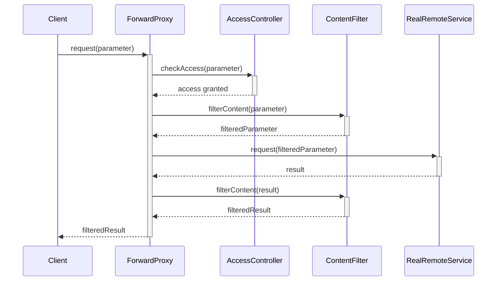
```mermaid
sequenceDiagram
    participant Client
    participant FP as ForwardProxy
    participant AC as AccessController
    participant CF as ContentFilter
    participant RS as RealRemoteService
    
    Client->>+FP: request(parameter)
    FP->>+AC: checkAccess(parameter)
    AC-->>-FP: access granted
    
    FP->>+CF: filterContent(parameter)
    CF-->>-FP: filteredParameter
    
    FP->>+RS: request(filteredParameter)
    RS-->>-FP: result
    
    FP->>+CF: filterContent(result)
    CF-->>-FP: filteredResult
    
    FP-->>-Client: filteredResult
```

### Caching-Proxy-Sequenzdiagramm

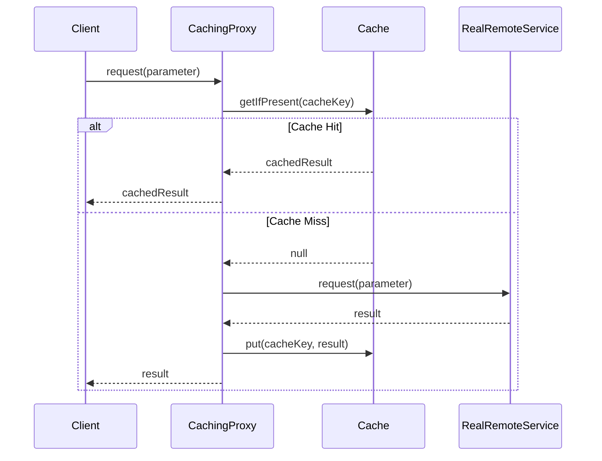
```mermaid
sequenceDiagram
    participant Client
    participant CP as CachingProxy
    participant Cache
    participant RS as RealRemoteService
    
    Client->>CP: request(parameter)
    CP->>Cache: getIfPresent(cacheKey)
    
    alt Cache Hit
        Cache-->>CP: cachedResult
        CP-->>Client: cachedResult
    else Cache Miss
        Cache-->>CP: null
        CP->>RS: request(parameter)
        RS-->>CP: result
        CP->>Cache: put(cacheKey, result)
        CP-->>Client: result
    end
```

### Load-Balancing-Proxy-Sequenzdiagramm

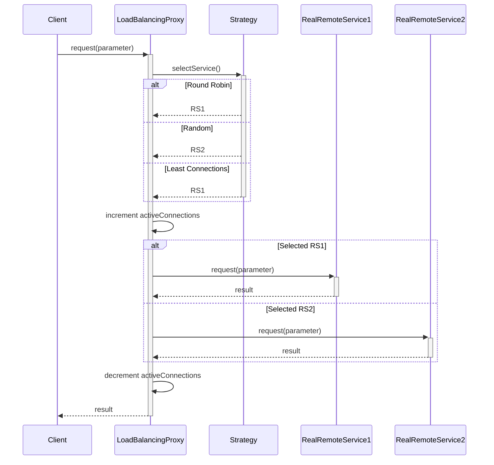
```mermaid
sequenceDiagram
    participant Client
    participant LBP as LoadBalancingProxy
    participant Strategy
    participant RS1 as RealRemoteService1
    participant RS2 as RealRemoteService2
    
    Client->>+LBP: request(parameter)
    LBP->>+Strategy: selectService()
    
    alt Round Robin
        Strategy-->>LBP: RS1
    else Random
        Strategy-->>LBP: RS2
    else Least Connections
        Strategy-->>-LBP: RS1
    end
    
    LBP->>LBP: increment activeConnections
    
    alt Selected RS1
        LBP->>+RS1: request(parameter)
        RS1-->>-LBP: result
    else Selected RS2
        LBP->>+RS2: request(parameter)
        RS2-->>-LBP: result
    end
    
    LBP->>LBP: decrement activeConnections
    LBP-->>-Client: result
```

### Reverse-Proxy-Sequenzdiagramm

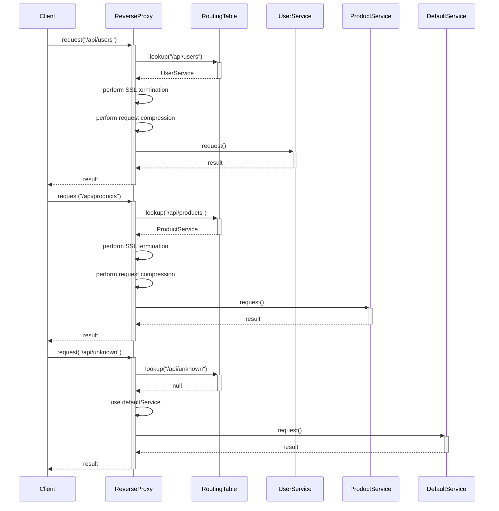
```mermaid
sequenceDiagram
    participant Client
    participant RP as ReverseProxy
    participant RT as RoutingTable
    participant RS1 as UserService
    participant RS2 as ProductService
    participant Def as DefaultService
    
    Client->>+RP: request("/api/users")
    RP->>+RT: lookup("/api/users")
    RT-->>-RP: UserService
    
    RP->>RP: perform SSL termination
    RP->>RP: perform request compression
    
    RP->>+RS1: request()
    RS1-->>-RP: result
    RP-->>-Client: result
    
    Client->>+RP: request("/api/products")
    RP->>+RT: lookup("/api/products")
    RT-->>-RP: ProductService
    
    RP->>RP: perform SSL termination
    RP->>RP: perform request compression
    
    RP->>+RS2: request()
    RS2-->>-RP: result
    RP-->>-Client: result
    
    Client->>+RP: request("/api/unknown")
    RP->>+RT: lookup("/api/unknown")
    RT-->>-RP: null
    
    RP->>RP: use defaultService
    RP->>+Def: request()
    Def-->>-RP: result
    RP-->>-Client: result
```

### Broker-Proxy-Sequenzdiagramm

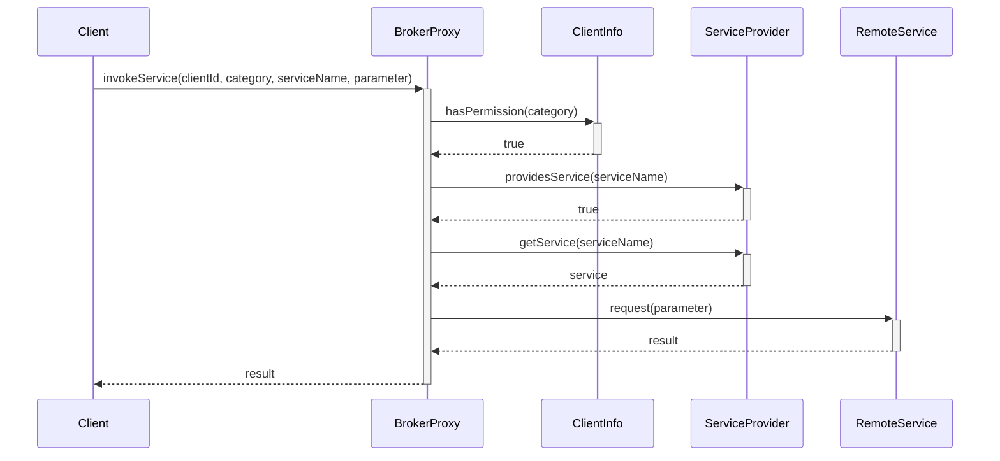
```mermaid
sequenceDiagram
    participant Client
    participant BP as BrokerProxy
    participant CI as ClientInfo
    participant SP as ServiceProvider
    participant RS as RemoteService
    
    Client->>+BP: invokeService(clientId, category, serviceName, parameter)
    BP->>+CI: hasPermission(category)
    CI-->>-BP: true
    
    BP->>+SP: providesService(serviceName)
    SP-->>-BP: true
    
    BP->>+SP: getService(serviceName)
    SP-->>-BP: service
    
    BP->>+RS: request(parameter)
    RS-->>-BP: result
    BP-->>-Client: result
```

### Trader-Proxy-Sequenzdiagramm

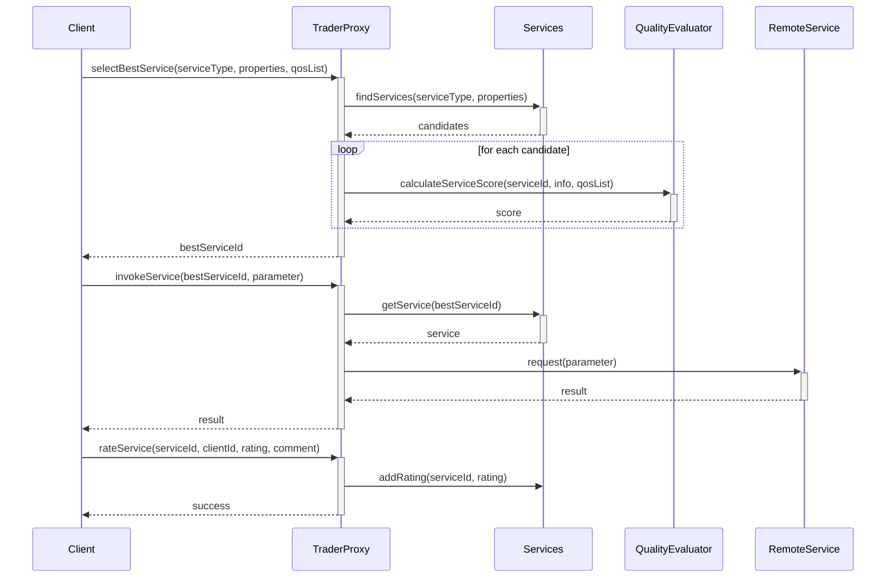
```mermaid
sequenceDiagram
    participant Client
    participant TP as TraderProxy
    participant Services
    participant QoS as QualityEvaluator
    participant RS as RemoteService
    
    Client->>+TP: selectBestService(serviceType, properties, qosList)
    TP->>+Services: findServices(serviceType, properties)
    Services-->>-TP: candidates
    
    loop for each candidate
        TP->>+QoS: calculateServiceScore(serviceId, info, qosList)
        QoS-->>-TP: score
    end
    
    TP-->>-Client: bestServiceId
    
    Client->>+TP: invokeService(bestServiceId, parameter)
    TP->>+Services: getService(bestServiceId)
    Services-->>-TP: service
    
    TP->>+RS: request(parameter)
    RS-->>-TP: result
    TP-->>-Client: result
    
    Client->>+TP: rateService(serviceId, clientId, rating, comment)
    TP->>Services: addRating(serviceId, rating)
    TP-->>-Client: success
```

## Aktivitätsdiagramme

### Forward-Proxy-Aktivitätsdiagramm

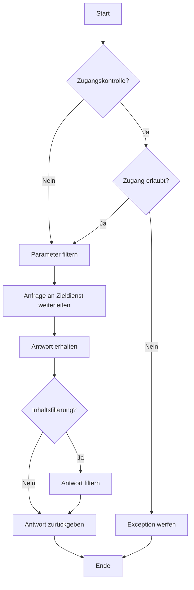
```mermaid
flowchart TD
    A[Start] --> B{Zugangskontrolle?}
    B -->|Ja| C{Zugang erlaubt?}
    B -->|Nein| E[Parameter filtern]
    
    C -->|Ja| E
    C -->|Nein| D[Exception werfen]
    
    E --> F[Anfrage an Zieldienst weiterleiten]
    F --> G[Antwort erhalten]
    G --> H{Inhaltsfilterung?}
    
    H -->|Ja| I[Antwort filtern]
    H -->|Nein| J[Antwort zurückgeben]
    
    I --> J
    J --> K[Ende]
    D --> K
```

### Caching-Proxy-Aktivitätsdiagramm

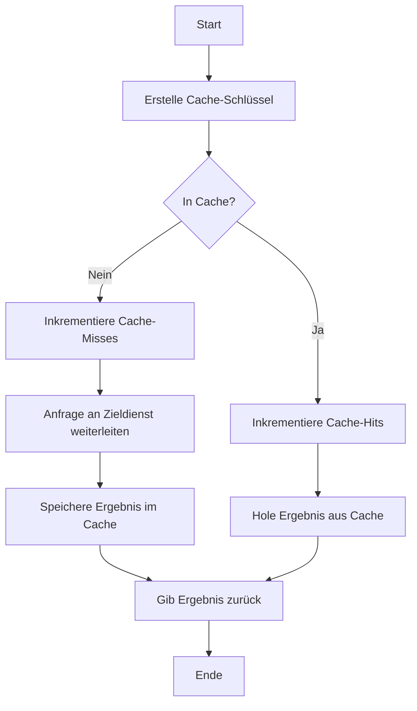
```mermaid
flowchart TD
    A[Start] --> B[Erstelle Cache-Schlüssel]
    B --> C{In Cache?}
    
    C -->|Ja| D[Inkrementiere Cache-Hits]
    C -->|Nein| E[Inkrementiere Cache-Misses]
    
    D --> F[Hole Ergebnis aus Cache]
    E --> G[Anfrage an Zieldienst weiterleiten]
    
    G --> H[Speichere Ergebnis im Cache]
    H --> I[Gib Ergebnis zurück]
    
    F --> I
    I --> J[Ende]
```

### Load-Balancing-Proxy-Aktivitätsdiagramm

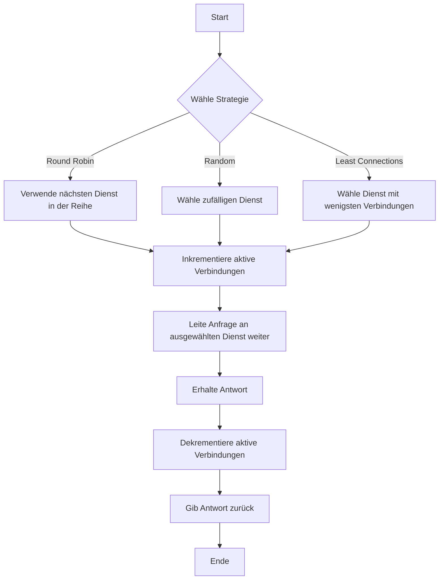
```mermaid
flowchart TD
    A[Start] --> B{Wähle Strategie}
    
    B -->|Round Robin| C[Verwende nächsten Dienst in der Reihe]
    B -->|Random| D[Wähle zufälligen Dienst]
    B -->|Least Connections| E[Wähle Dienst mit wenigsten Verbindungen]
    
    C --> F[Inkrementiere aktive Verbindungen]
    D --> F
    E --> F
    
    F --> G[Leite Anfrage an ausgewählten Dienst weiter]
    G --> H[Erhalte Antwort]
    H --> I[Dekrementiere aktive Verbindungen]
    I --> J[Gib Antwort zurück]
    J --> K[Ende]
```

## Konzeptdiagramme

### Proxy-Typen im Überblick

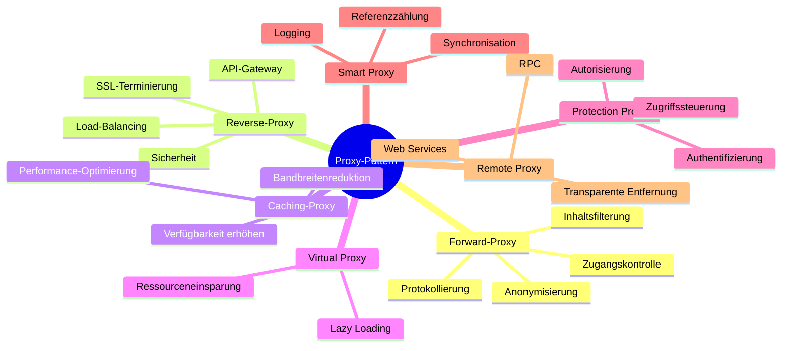
```mermaid
mindmap
  root((Proxy-Pattern))
    Forward-Proxy
      Zugangskontrolle
      Anonymisierung
      Inhaltsfilterung
      Protokollierung
    Reverse-Proxy
      API-Gateway
      Load-Balancing
      SSL-Terminierung
      Sicherheit
    Caching-Proxy
      Performance-Optimierung
      Bandbreitenreduktion
      Verfügbarkeit erhöhen
    Virtual Proxy
      Lazy Loading
      Ressourceneinsparung
    Protection Proxy
      Zugriffssteuerung
      Authentifizierung
      Autorisierung
    Smart Proxy
      Referenzzählung
      Logging
      Synchronisation
    Remote Proxy
      RPC
      Web Services
      Transparente Entfernung
```

### Anwendungsbeispiele in verteilten Systemen

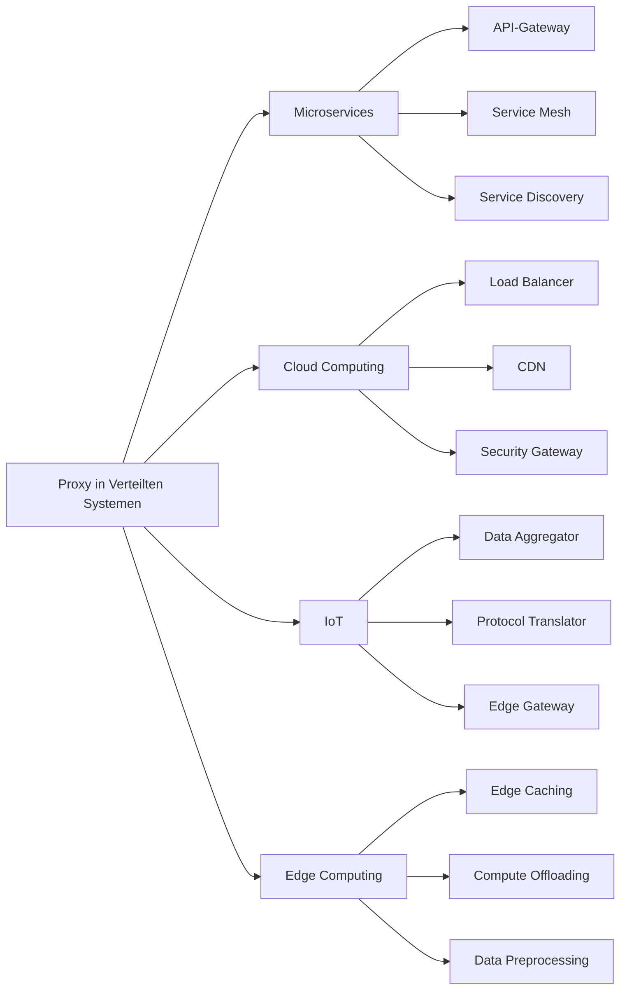
```mermaid
flowchart LR
    A[Proxy in Verteilten Systemen] --> B[Microservices]
    A --> C[Cloud Computing]
    A --> D[IoT]
    A --> E[Edge Computing]
    
    B --> B1[API-Gateway]
    B --> B2[Service Mesh]
    B --> B3[Service Discovery]
    
    C --> C1[Load Balancer]
    C --> C2[CDN]
    C --> C3[Security Gateway]
    
    D --> D1[Data Aggregator]
    D --> D2[Protocol Translator]
    D --> D3[Edge Gateway]
    
    E --> E1[Edge Caching]
    E --> E2[Compute Offloading]
    E --> E3[Data Preprocessing]
```