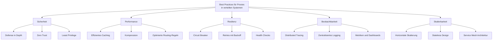

# Anwendungsbeispiele des Proxy-Patterns in verteilten Systemen

Dieses Dokument stellt reale Anwendungsfälle des Proxy-Patterns in verteilten Systemen vor und analysiert deren Implementierungsdetails.

## Übersicht der Anwendungsfälle


## Detaillierte Anwendungsfälle

### 1. API-Gateway als Proxy in Microservices-Architekturen


#### Detailliertes Sequenzdiagramm für API-Gateway


#### Implementierungsdetails mit Spring Cloud Gateway

```java
@Configuration
public class ApiGatewayConfig {
    
    @Bean
    public RouteLocator customRouteLocator(RouteLocatorBuilder builder) {
        return builder.routes()
            .route("products_route", r -> r
                .path("/api/products/**")
                .filters(f -> f
                    .rewritePath("/api/products/(?<segment>.*)", "/products/${segment}")
                    .addRequestHeader("X-Gateway-Source", "api-gateway")
                    .circuitBreaker(c -> c.setName("productsCircuitBreaker")
                                         .setFallbackUri("forward:/fallback/products"))
                    .retry(retryConfig -> retryConfig.setRetries(3)
                                                    .setMethods(HttpMethod.GET))
                )
                .uri("lb://product-service"))
                
            .route("orders_route", r -> r
                .path("/api/orders/**")
                .filters(f -> f
                    .rewritePath("/api/orders/(?<segment>.*)", "/orders/${segment}")
                    .addRequestHeader("X-Gateway-Source", "api-gateway")
                    .circuitBreaker(c -> c.setName("ordersCircuitBreaker")
                                         .setFallbackUri("forward:/fallback/orders"))
                )
                .uri("lb://order-service"))
                
            .route("auth_route", r -> r
                .path("/api/auth/**")
                .filters(f -> f
                    .rewritePath("/api/auth/(?<segment>.*)", "/auth/${segment}")
                    .addRequestHeader("X-Gateway-Source", "api-gateway")
                )
                .uri("lb://auth-service"))
            .build();
    }
    
    @Bean
    public GlobalFilter loggingFilter() {
        return (exchange, chain) -> {
            ServerHttpRequest request = exchange.getRequest();
            
            log.info("API Gateway Request: {} {}", 
                    request.getMethod(), request.getURI().getPath());
            
            return chain.filter(exchange)
                .then(Mono.fromRunnable(() -> {
                    ServerHttpResponse response = exchange.getResponse();
                    log.info("API Gateway Response: {}", response.getStatusCode());
                }));
        };
    }
}
```

### 2. Caching-Proxy für Datenbankanfragen


#### Sequenzdiagramm für Datenbankabfrage-Caching


#### Implementierungsbeispiel für Spring Boot mit Redis-Cache

```java
@Service
public class CustomerServiceCachingProxy implements CustomerService {
    
    private final CustomerRepository customerRepository;
    private final RedisTemplate<String, Customer> redisTemplate;
    private final long cacheTtlMinutes = 15;
    
    public CustomerServiceCachingProxy(
            CustomerRepository customerRepository,
            RedisTemplate<String, Customer> redisTemplate) {
        this.customerRepository = customerRepository;
        this.redisTemplate = redisTemplate;
    }
    
    @Override
    public Customer getCustomerById(Long id) {
        String cacheKey = "customer:" + id;
        
        // Versuche, aus dem Cache zu lesen
        Customer cachedCustomer = redisTemplate.opsForValue().get(cacheKey);
        
        if (cachedCustomer != null) {
            log.info("Cache HIT für Customer {}", id);
            return cachedCustomer;
        }
        
        log.info("Cache MISS für Customer {}", id);
        
        // Bei Cache-Miss: Aus Datenbank laden
        Customer customer = customerRepository.findById(id)
                .orElseThrow(() -> new CustomerNotFoundException(id));
        
        // Im Cache speichern mit TTL
        redisTemplate.opsForValue().set(
                cacheKey, 
                customer, 
                Duration.ofMinutes(cacheTtlMinutes));
        
        return customer;
    }
    
    @Override
    public void updateCustomer(Customer customer) {
        // Aktualisiere Datenbank
        customerRepository.save(customer);
        
        // Cache invalidieren
        String cacheKey = "customer:" + customer.getId();
        redisTemplate.delete(cacheKey);
        
        log.info("Cache invalidiert für Customer {}", customer.getId());
    }
    
    // Weitere Methoden des CustomerService...
}
```

### 3. Load-Balancing-Proxy für Hochverfügbarkeit


#### Aktivitätsdiagramm eines Load-Balancing-Proxys


#### NGINX Load Balancer Konfigurationsbeispiel

```nginx
http {
    upstream backend_servers {
        least_conn;                 # Load-Balancing-Strategie
        server backend1.example.com max_fails=3 fail_timeout=30s;
        server backend2.example.com max_fails=3 fail_timeout=30s;
        server backend3.example.com max_fails=3 fail_timeout=30s;
        server backup1.example.com  backup;
    }
    
    server {
        listen 80;
        server_name api.example.com;
        
        location / {
            proxy_pass http://backend_servers;
            proxy_set_header Host $host;
            proxy_set_header X-Real-IP $remote_addr;
            proxy_set_header X-Forwarded-For $proxy_add_x_forwarded_for;
            proxy_set_header X-Forwarded-Proto $scheme;
            
            # Health checks
            health_check interval=10 fails=3 passes=2;
            
            # Circuit Breaker (über fail_timeout in upstream)
            
            # Timeouts
            proxy_connect_timeout 5s;
            proxy_send_timeout 60s;
            proxy_read_timeout 60s;
            
            # Caching
            proxy_cache proxy_cache_zone;
            proxy_cache_valid 200 10m;
            proxy_cache_use_stale error timeout updating http_500 http_502 http_503 http_504;
            
            # Retry
            proxy_next_upstream error timeout http_500 http_502 http_503 http_504;
            proxy_next_upstream_tries 3;
        }
    }
}
```

### 4. Reverse-Proxy als Sicherheitsschicht


#### Komponentendiagramm eines Sicherheits-Proxys


#### ModSecurity WAF-Regel-Beispiel

```apache
# Basic XSS protection
SecRule REQUEST_COOKIES|REQUEST_COOKIES_NAMES|REQUEST_HEADERS|ARGS|ARGS_NAMES "@rx (?i)<script[^>]*>[\s\S]*?" \
    "id:1000,\
    phase:2,\
    deny,\
    status:403,\
    log,\
    msg:'XSS Attack Detected',\
    tag:'application-multi',\
    tag:'language-multi',\
    tag:'platform-multi',\
    tag:'attack-xss'"

# SQL Injection protection
SecRule REQUEST_COOKIES|REQUEST_COOKIES_NAMES|REQUEST_HEADERS|ARGS|ARGS_NAMES "@rx (?i:(?:select|union|insert|update|delete|drop|alter).*(?:from|table|database|where))" \
    "id:1001,\
    phase:2,\
    deny,\
    status:403,\
    log,\
    msg:'SQL Injection Attack Detected',\
    tag:'application-multi',\
    tag:'language-multi',\
    tag:'platform-multi',\
    tag:'attack-sqli'"

# Rate limiting
SecAction \
    "id:1002,\
    phase:1,\
    nolog,\
    pass,\
    setvar:ip.requests=+1,\
    expirevar:ip.requests=60"

SecRule IP:REQUESTS "@gt 100" \
    "id:1003,\
    phase:1,\
    deny,\
    status:429,\
    log,\
    msg:'Rate Limit Exceeded'"
```

### 5. Service Mesh als verteiltes Proxy-Netzwerk


#### Istio Service Mesh Beispielkonfiguration

```yaml
# Virtual Service für Routing
apiVersion: networking.istio.io/v1alpha3
kind: VirtualService
metadata:
  name: product-service
spec:
  hosts:
  - product-service
  http:
  - match:
    - uri:
        prefix: /api/v2/products
    rewrite:
      uri: /api/products
    route:
    - destination:
        host: product-service-v2
        port:
          number: 80
  - route:
    - destination:
        host: product-service-v1
        port:
          number: 80

---
# Destination Rules für Load Balancing
apiVersion: networking.istio.io/v1alpha3
kind: DestinationRule
metadata:
  name: product-service
spec:
  host: product-service
  trafficPolicy:
    loadBalancer:
      simple: ROUND_ROBIN
  subsets:
  - name: v1
    labels:
      version: v1
  - name: v2
    labels:
      version: v2
    trafficPolicy:
      loadBalancer:
        simple: LEAST_CONN

---
# Circuit Breaker
apiVersion: networking.istio.io/v1alpha3
kind: DestinationRule
metadata:
  name: product-service-circuit-breaker
spec:
  host: product-service
  trafficPolicy:
    outlierDetection:
      consecutiveErrors: 5
      interval: 30s
      baseEjectionTime: 30s
      maxEjectionPercent: 100
```

## Praktische Umsetzungsbeispiele

### Beispiel 1: Spring Cloud Gateway als API-Gateway

```java
@Configuration
public class SpringCloudGatewayConfig {
    
    @Bean
    public RouteLocator routes(RouteLocatorBuilder builder, RateLimiter rateLimiter) {
        return builder.routes()
            // Route für Produktdienst
            .route("products", r -> r.path("/api/products/**")
                .filters(f -> f
                    // Rate Limiting
                    .requestRateLimiter(c -> c
                        .setRateLimiter(rateLimiter)
                        .setKeyResolver(UserKeyResolver()))
                    // Retry-Mechanismus
                    .retry(config -> config
                        .setRetries(3)
                        .setMethods(HttpMethod.GET)
                        .setBackoff(Duration.ofMillis(100), 
                                    Duration.ofMillis(1000), 
                                    2, true))
                    // Circuit Breaker
                    .circuitBreaker(c -> c
                        .setName("productsCB")
                        .setFallbackUri("forward:/fallback/products"))
                    // Response Caching
                    .cache(config -> config
                        .setTimeToLive(Duration.ofMinutes(5))
                        .setCacheManager(cacheManager)))
                .uri("lb://product-service"))
            // Route für Benutzerdienst mit Authentifizierungsprüfung
            .route("users", r -> r.path("/api/users/**")
                .filters(f -> f
                    .filter(authenticationFilter())
                    .rewritePath("/api/users/(?<segment>.*)", "/users/${segment}")
                    .addResponseHeader("X-Response-Time", 
                        LocalDateTime.now().toString()))
                .uri("lb://user-service"))
            .build();
    }
    
    @Bean
    ReactiveAuthenticationFilter authenticationFilter() {
        return new ReactiveAuthenticationFilter();
    }
    
    @Bean
    public KeyResolver UserKeyResolver() {
        return exchange -> 
            Mono.justOrEmpty(exchange.getRequest().getHeaders().getFirst("user"))
                .defaultIfEmpty("anonymous");
    }
}
```

### Beispiel 2: Hazelcast Distributed Caching Proxy

```java
@Component
public class HazelcastCachingProxy implements ProductService {
    
    private final ProductRepository productRepository;
    private final HazelcastInstance hazelcastInstance;
    private final String CACHE_NAME = "products";
    
    public HazelcastCachingProxy(ProductRepository productRepository,
                               HazelcastInstance hazelcastInstance) {
        this.productRepository = productRepository;
        this.hazelcastInstance = hazelcastInstance;
    }
    
    @Override
    public Product getProductById(Long id) {
        IMap<Long, Product> cache = hazelcastInstance.getMap(CACHE_NAME);
        
        // Versuche, aus dem Cache zu lesen
        Product cachedProduct = cache.get(id);
        if (cachedProduct != null) {
            log.info("Cache HIT für Produkt {}", id);
            return cachedProduct;
        }
        
        log.info("Cache MISS für Produkt {}", id);
        
        // Bei Cache-Miss: Aus Datenbank laden
        Product product = productRepository.findById(id)
                .orElseThrow(() -> new ProductNotFoundException(id));
        
        // Im Cache speichern mit TTL
        cache.set(id, product, 10, TimeUnit.MINUTES);
        
        return product;
    }
    
    @Override
    public List<Product> searchProducts(String query) {
        // Komplexere Suche, die nicht gecacht wird
        return productRepository.searchByNameOrDescription(query);
    }
    
    @Override
    public void updateProduct(Product product) {
        // Aktualisiere Datenbank
        productRepository.save(product);
        
        // Cache invalidieren
        IMap<Long, Product> cache = hazelcastInstance.getMap(CACHE_NAME);
        cache.remove(product.getId());
        
        log.info("Cache invalidiert für Produkt {}", product.getId());
    }
}
```

### Beispiel 3: Envoy Proxy Load Balancer und Circuit Breaker

```yaml
admin:
  access_log_path: /tmp/admin_access.log
  address:
    socket_address: { address: 0.0.0.0, port_value: 9901 }

static_resources:
  listeners:
  - name: listener_0
    address:
      socket_address: { address: 0.0.0.0, port_value: 8080 }
    filter_chains:
    - filters:
      - name: envoy.filters.network.http_connection_manager
        typed_config:
          "@type": type.googleapis.com/envoy.extensions.filters.network.http_connection_manager.v3.HttpConnectionManager
          stat_prefix: ingress_http
          route_config:
            name: local_route
            virtual_hosts:
            - name: local_service
              domains: ["*"]
              routes:
              - match: { prefix: "/" }
                route:
                  cluster: service_backend
                  timeout: 5s
          http_filters:
          - name: envoy.filters.http.router
            typed_config:
              "@type": type.googleapis.com/envoy.extensions.filters.http.router.v3.Router

  clusters:
  - name: service_backend
    connect_timeout: 1s
    type: STRICT_DNS
    lb_policy: ROUND_ROBIN
    # Enable Circuit Breaker
    circuit_breakers:
      thresholds:
        max_connections: 1000
        max_pending_requests: 1000
        max_requests: 1000
        max_retries: 3
    # Health checking
    health_checks:
      timeout: 1s
      interval: 10s
      unhealthy_threshold: 2
      healthy_threshold: 2
      http_health_check:
        path: "/health"
    # Retry policy
    retries:
      retry_on: "5xx,gateway-error,connect-failure"
      num_retries: 3
      per_try_timeout: 2s
    # Multiple backend instances
    load_assignment:
      cluster_name: service_backend
      endpoints:
      - lb_endpoints:
        - endpoint:
            address:
              socket_address:
                address: service1
                port_value: 8080
        - endpoint:
            address:
              socket_address:
                address: service2
                port_value: 8080
        - endpoint:
            address:
              socket_address:
                address: service3
                port_value: 8080
```

## Zusammenfassung und Best Practices



### Entscheidungshilfe für Proxy-Technologien

| Anwendungsfall | Empfohlene Technologien | Schlüsselfunktionen |
|----------------|-------------------------|---------------------|
| API-Gateway | Spring Cloud Gateway, Kong, Zuul | Routing, Authentifizierung, Transformation |
| Load Balancing | NGINX, HAProxy, Envoy | L4/L7 Lastverteilung, Health Checks, TLS-Terminierung |
| Caching | Varnish, Redis, Hazelcast | TTL, Cache-Invalidierung, Verteiltes Caching |
| Sicherheit | ModSecurity, AWS WAF, CloudFlare | WAF-Regeln, DDoS-Schutz, Bot-Erkennung |
| Service Mesh | Istio, Linkerd, Consul Connect | Sidecar-Proxies, Zentralisierte Konfiguration, mTLS |