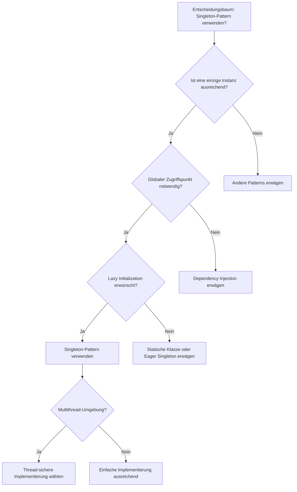
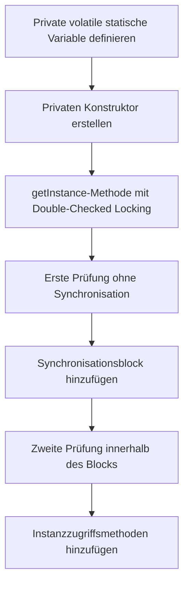
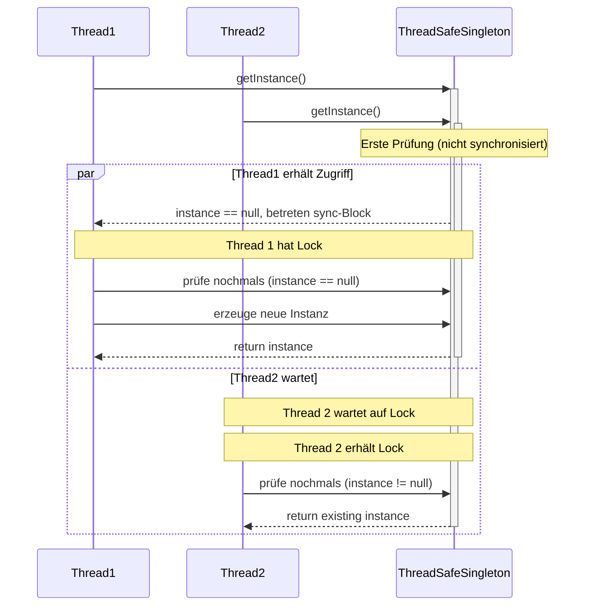
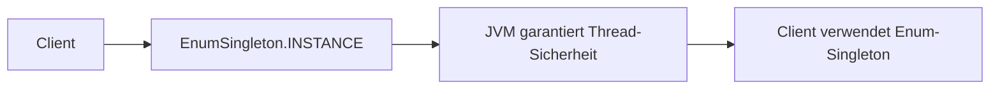
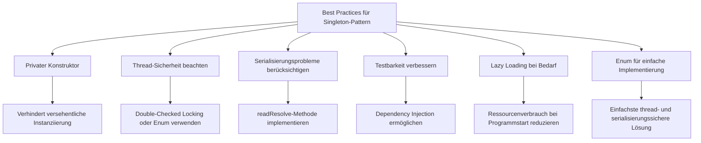
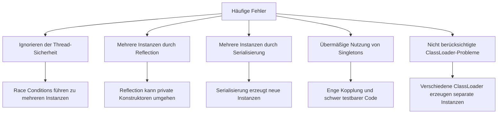
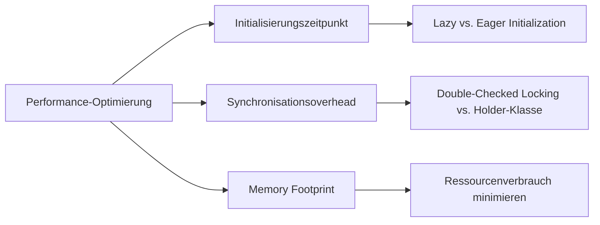
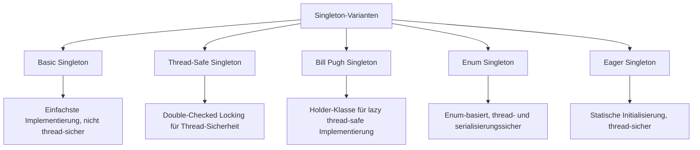
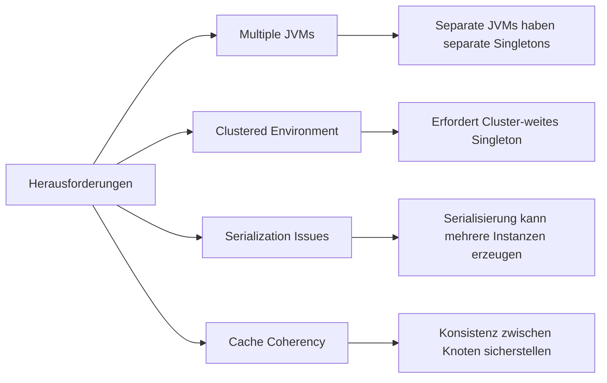
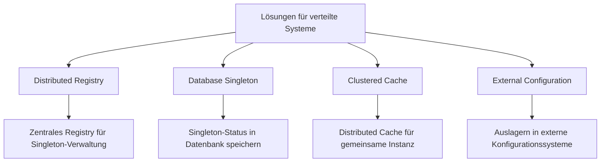

# Implementierungsleitfaden für das Singleton-Pattern

Dieser Leitfaden beschreibt den Implementierungsprozess des Singleton-Patterns in verteilten Systemen anhand praktischer Beispiele aus diesem Projekt.

## Inhaltsverzeichnis

1. [Wann sollte das Singleton-Pattern verwendet werden?](#wann-sollte-das-singleton-pattern-verwendet-werden)
2. [Schrittweise Implementierung](#schrittweise-implementierung)
3. [Implementierungsbeispiele](#implementierungsbeispiele)
4. [Best Practices](#best-practices)
5. [Häufige Fehler](#häufige-fehler)
6. [Performanceüberlegungen](#performanceüberlegungen)

## Wann sollte das Singleton-Pattern verwendet werden?

Das Singleton-Pattern ist in folgenden Situationen besonders nützlich:



## Schrittweise Implementierung

### 1. Basic Singleton (nicht thread-sicher)


### 2. Thread-sichere Implementierung (Double-Checked Locking)



## Implementierungsbeispiele

### Beispiel 1: Basic Singleton (nicht thread-sicher)

Dieses Diagramm zeigt den Kontrollfluss beim Zugriff auf ein einfaches Singleton:

```mermaid
graph LR
    A[Client] --> B[BasicSingleton.getInstance()]
    B --> C{Instanz existiert?}
    C -->|Nein| D[Neue Instanz erzeugen]
    C -->|Ja| E[Existierende Instanz verwenden]
    D --> F[Instanz zurückgeben]
    E --> F
    F --> G[Client verwendet Singleton]
```

```java
public class BasicSingleton {
    // Private statische Variable, die die einzige Instanz speichert
    private static BasicSingleton instance;
    
    // Privater Konstruktor verhindert Instanziierung von außen
    private BasicSingleton() {
        // Initialisierungscode
    }
    
    // Öffentliche statische Methode für Zugriff auf Instanz
    public static BasicSingleton getInstance() {
        if (instance == null) {
            instance = new BasicSingleton();
        }
        return instance;
    }
    
    // Businessmethoden
    public void doSomething() {
        // Implementierung
    }
}
```

### Beispiel 2: Thread-sicheres Singleton (Double-Checked Locking)



```java
public class ThreadSafeSingleton {
    // Volatile stellt sicher, dass Änderungen sofort für alle Threads sichtbar sind
    private static volatile ThreadSafeSingleton instance;
    
    // Privater Konstruktor
    private ThreadSafeSingleton() {
        // Initialisierungscode
    }
    
    // Thread-sichere getInstance-Methode mit Double-Checked Locking
    public static ThreadSafeSingleton getInstance() {
        // Erste Prüfung (nicht synchronisiert)
        if (instance == null) {
            // Synchronisieren nur bei Bedarf
            synchronized (ThreadSafeSingleton.class) {
                // Zweite Prüfung (synchronisiert)
                if (instance == null) {
                    instance = new ThreadSafeSingleton();
                }
            }
        }
        return instance;
    }
}
```

### Beispiel 3: Enum-basiertes Singleton



```java
public enum EnumSingleton {
    INSTANCE;
    
    // Private Felder
    private Map<String, String> configuration;
    
    // Konstruktor (automatisch privat in Enums)
    EnumSingleton() {
        configuration = new HashMap<>();
        // Initialisierungscode
    }
    
    // Öffentliche Methoden
    public String getConfigValue(String key) {
        return configuration.get(key);
    }
    
    public void setConfigValue(String key, String value) {
        configuration.put(key, value);
    }
}
```

## Best Practices



## Häufige Fehler

Die folgenden Fehler sollten bei der Implementierung des Singleton-Patterns vermieden werden:



## Performanceüberlegungen



## Varianten des Singleton-Patterns



### Bill Pugh Singleton (Static Inner Helper)

```java
public class BillPughSingleton {
    private BillPughSingleton() {}
    
    // Innere statische Helper-Klasse
    private static class SingletonHelper {
        private static final BillPughSingleton INSTANCE = new BillPughSingleton();
    }
    
    public static BillPughSingleton getInstance() {
        return SingletonHelper.INSTANCE;
    }
}
```

## Herausforderungen in verteilten Systemen



## Lösungen für verteilte Umgebungen

