# Vergleich des Singleton-Patterns mit anderen Entwurfsmustern

Dieses Dokument vergleicht das Singleton-Pattern mit anderen Entwurfsmustern und hilft bei der Entscheidung, welches Muster in verschiedenen Situationen am besten geeignet ist.

## Singleton vs. andere Entwurfsmuster

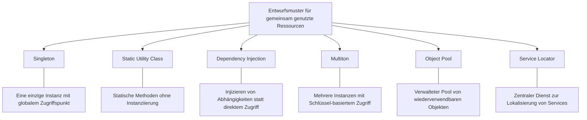

## Entscheidungshilfe: Welches Muster wann?

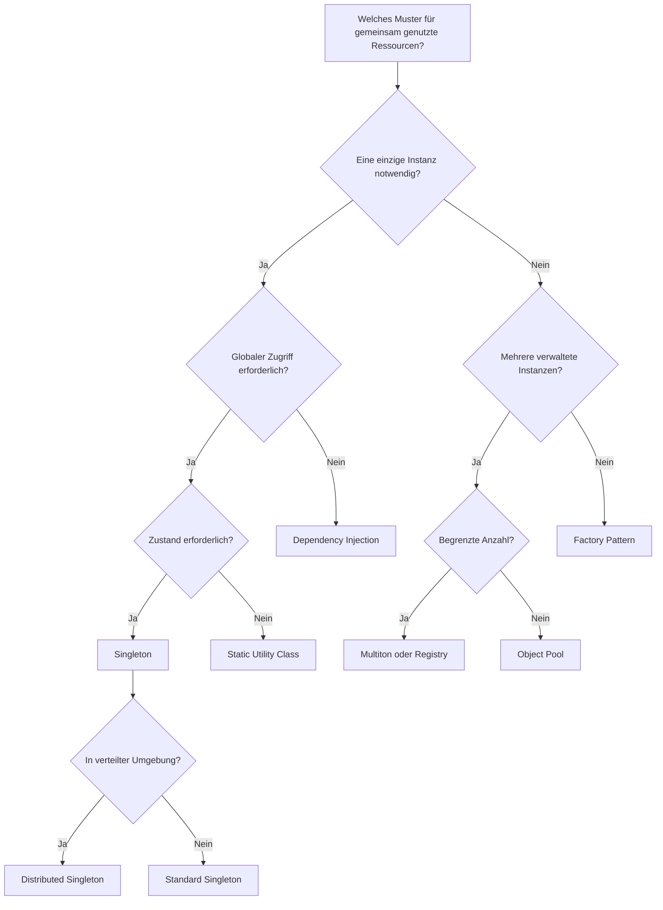

## Detaillierter Vergleich: Singleton vs. andere Muster

### Singleton vs. Static Utility Class

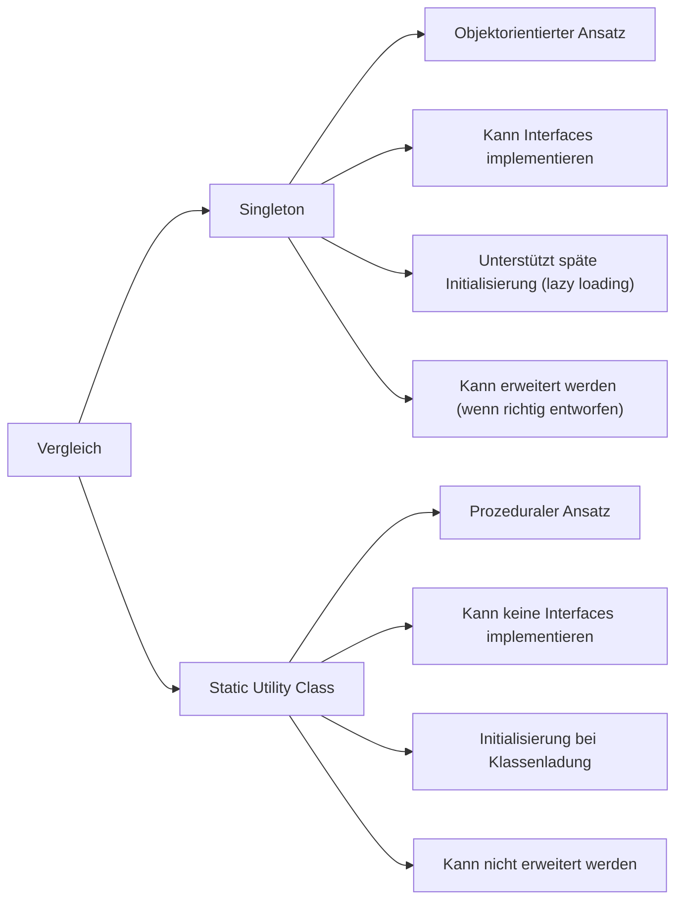

### Singleton vs. Dependency Injection

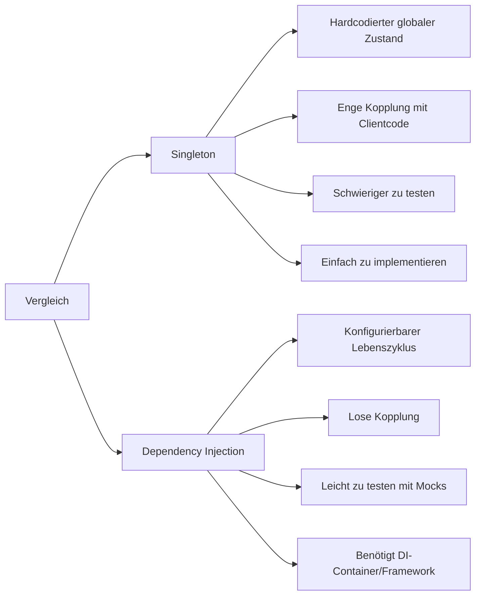

### Singleton vs. Object Pool

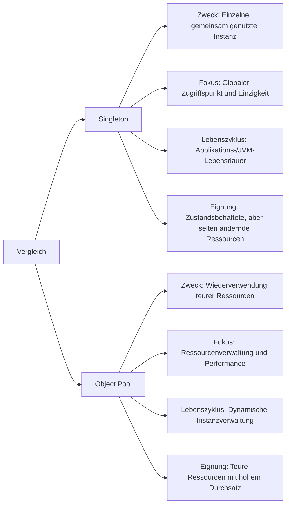

### Singleton vs. Multiton

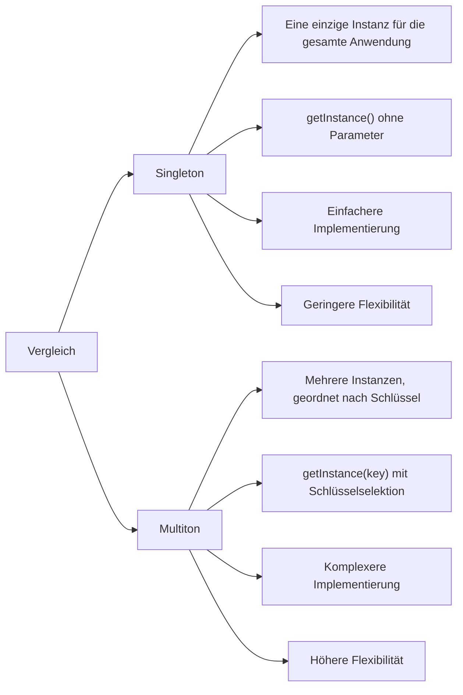

### Singleton vs. Service Locator

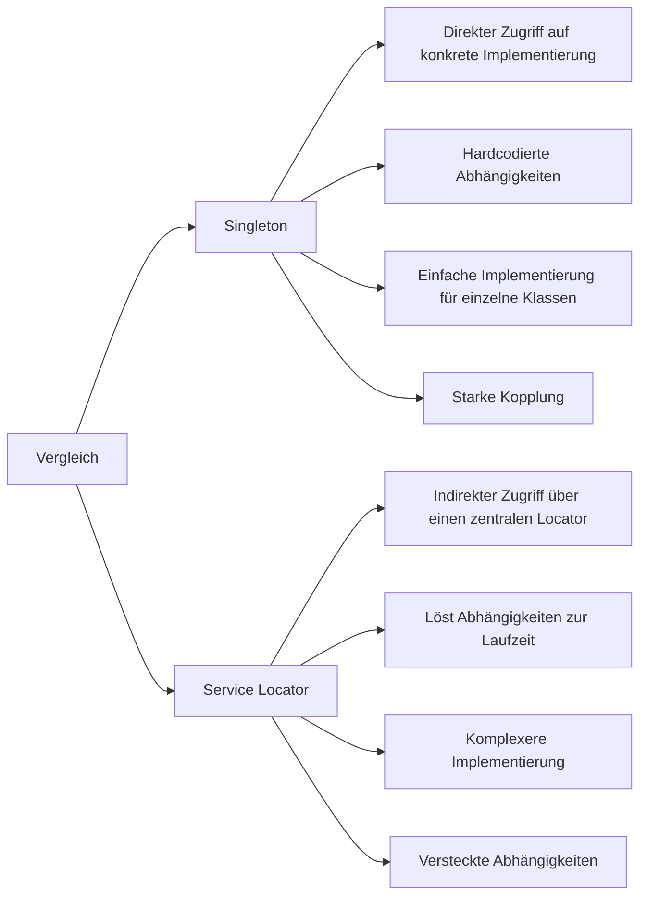

## Anwendungsfälle verschiedener Muster

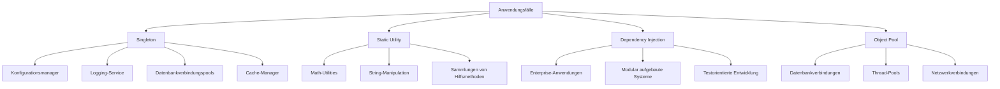

## Kombination von Mustern

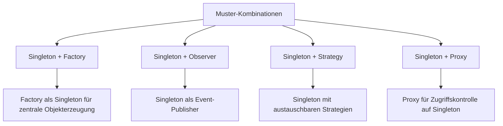

## Evolutionspfad für Singleton

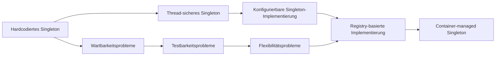

## Singleton in verschiedenen Programmiersprachen

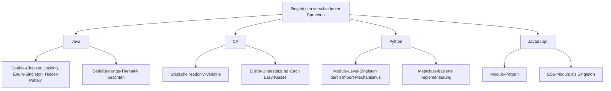

## Vergleichsmatrix: Vor- und Nachteile

| Muster | Stärken | Schwächen | Ideale Anwendungsfälle |
|--------|---------|-----------|------------------------|
| Singleton | Garantiert eine einzige Instanz, Lazy Loading möglich, globaler Zugriffspunkt | Versteckte Abhängigkeiten, schwer zu testen, potenzielle Parallelitätsprobleme | Konfigurationsmanager, Logging-Service, zentralisierte Ressourcenverwaltung |
| Static Utility | Einfache Implementierung, keine Instanziierung erforderlich, direkter Zugriff auf Funktionen | Kann keine Interfaces implementieren, kein Zustand, keine Erweiterbarkeit | Rein funktionale Operationen, Math-Utilities, String-Manipulation |
| Dependency Injection | Lose Kopplung, hohe Testbarkeit, konfigurierbare Abhängigkeiten | Komplexer Setup, Overhead durch Container, Lernkurve | Enterprise-Anwendungen, komplexe Systeme, testgetriebene Entwicklung |
| Multiton | Flexibler durch mehrere Instanzen, organisiert nach Schlüsseln | Komplexer zu implementieren, schwerer zu verfolgen, Gefahr der Instanzproliferation | Kontextabhängige Services, mehrere Konfigurationen, protokollspezifische Handler |
| Object Pool | Effiziente Ressourcennutzung, Leistungsoptimierung, Kontrolle über Ressourcenlimits | Komplexe Verwaltungslogik, potenzielle Ressourcenlecks, Synchronisationsaufwand | Datenbankverbindungen, Thread-Management, teure Ressourcen mit häufiger Wiederverwendung |

## Adaption des Singleton-Patterns in verteilten Umgebungen

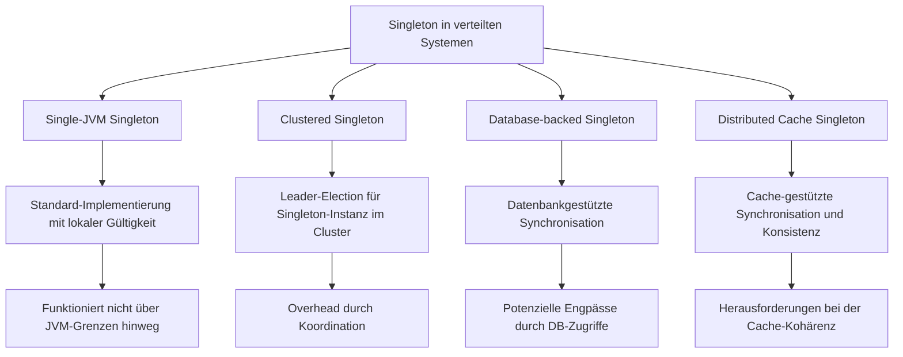

## Anti-Patterns und Alternativen

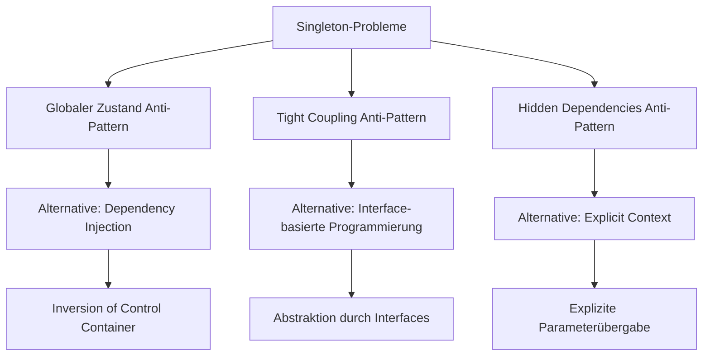

## Migration von Singleton zu modernen Alternativen

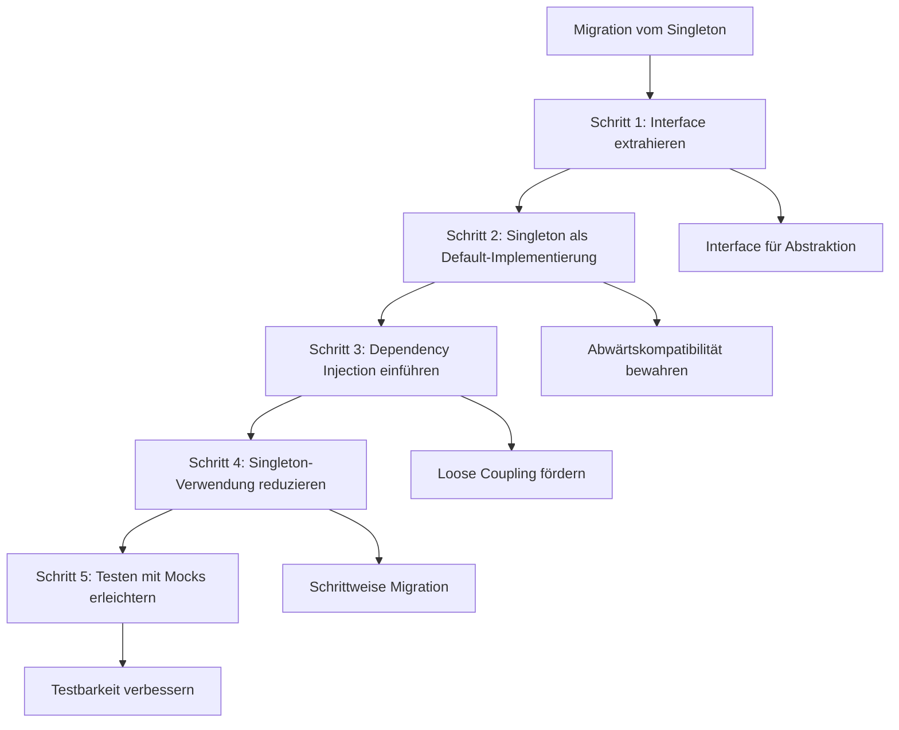