# Singleton-Pattern Dokumentation

Diese Dokumentation enthält verschiedene Diagramme zur Veranschaulichung des Singleton-Patterns und der konkreten Implementierung in diesem Projekt.

## Inhalt

- [Komponentendiagramm](#komponentendiagramm)
- [Klassendiagramme](#klassendiagramme)
- [Sequenzdiagramme](#sequenzdiagramme)
- [Zustandsdiagramme](#zustandsdiagramme)
- [Aktivitätsdiagramme](#aktivitätsdiagramme)

## Komponentendiagramm

Das folgende Diagramm zeigt die Hauptkomponenten des Projekts und ihre Beziehungen zueinander:

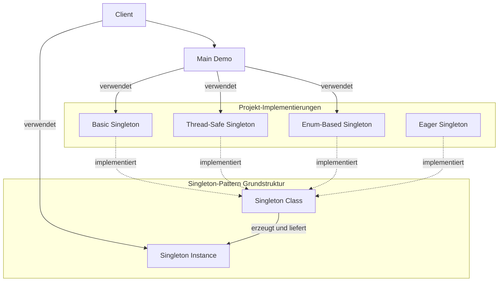

## Klassendiagramme

### Allgemeines Singleton-Klassendiagramm

Das folgende Diagramm zeigt die allgemeine Struktur des Singleton-Patterns:

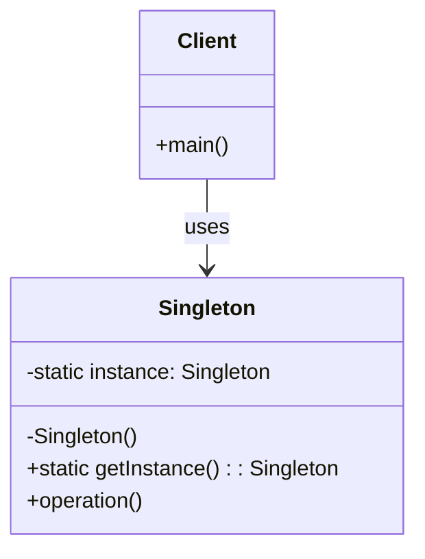

### Basic Singleton-Klassendiagramm

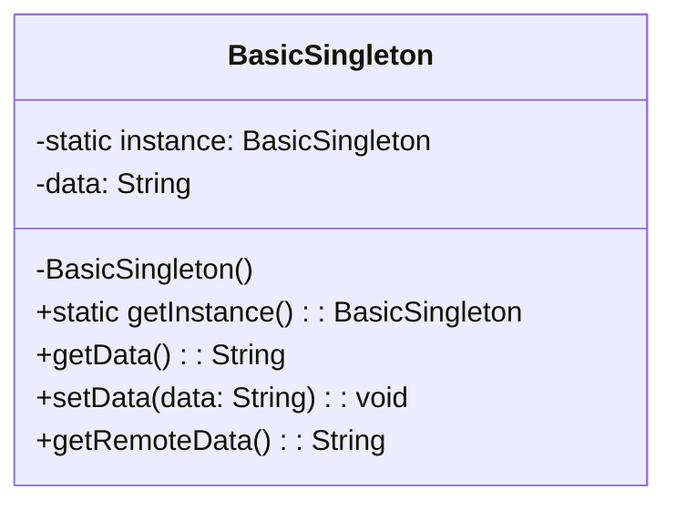

### Thread-Safe Singleton-Klassendiagramm

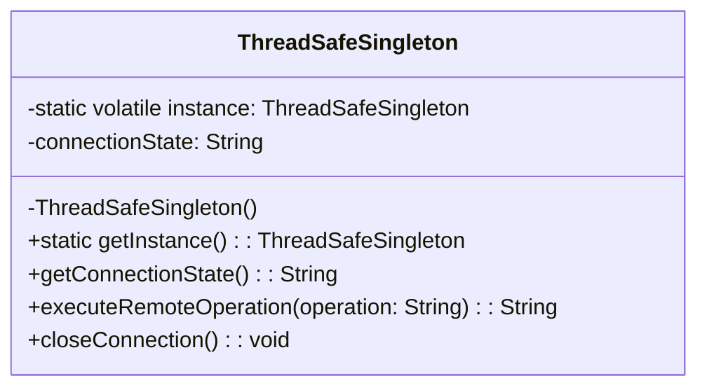

### Enum-Based Singleton-Klassendiagramm

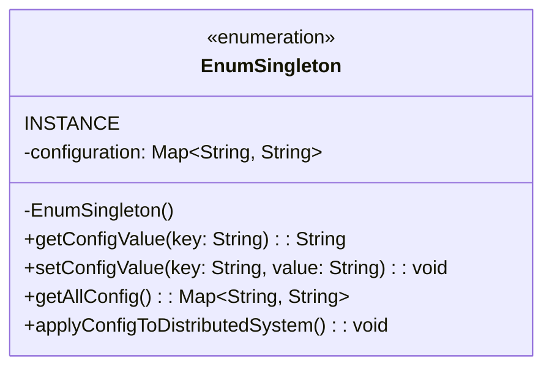

## Sequenzdiagramme

### Basic Singleton-Sequenzdiagramm

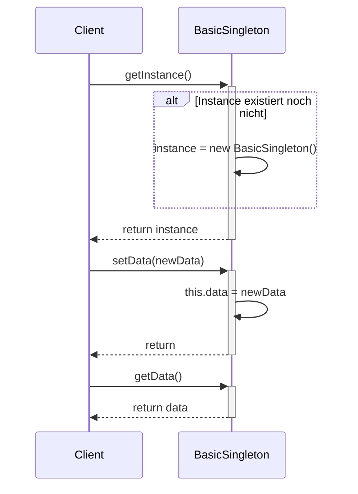

### Thread-Safe Singleton-Sequenzdiagramm

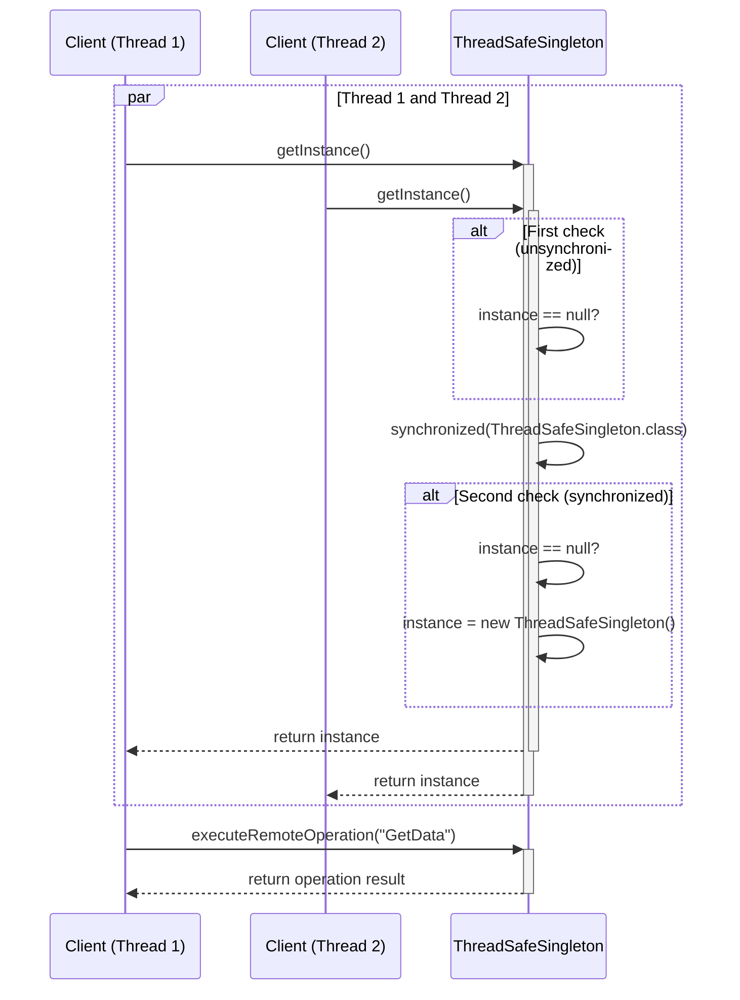

### Enum Singleton-Sequenzdiagramm

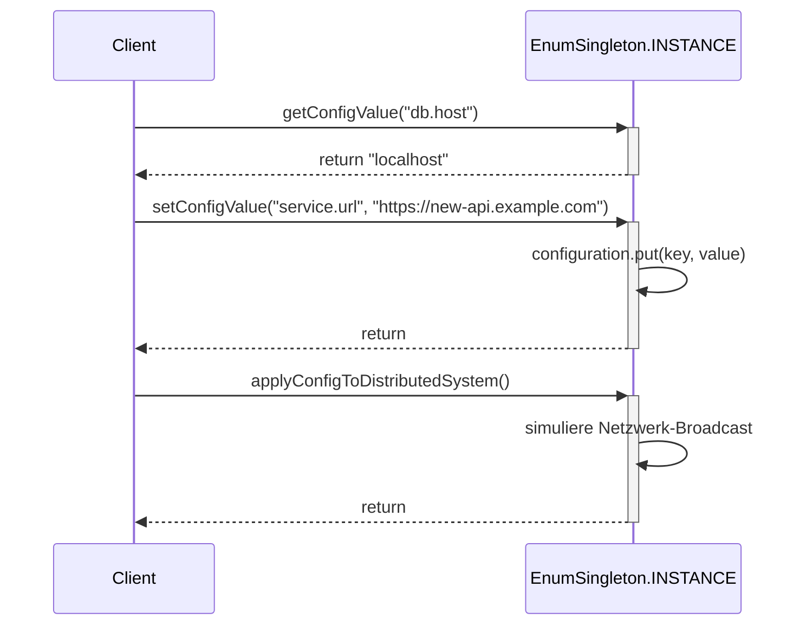

## Zustandsdiagramme

### Singleton-Initialisierungszustandsdiagramm

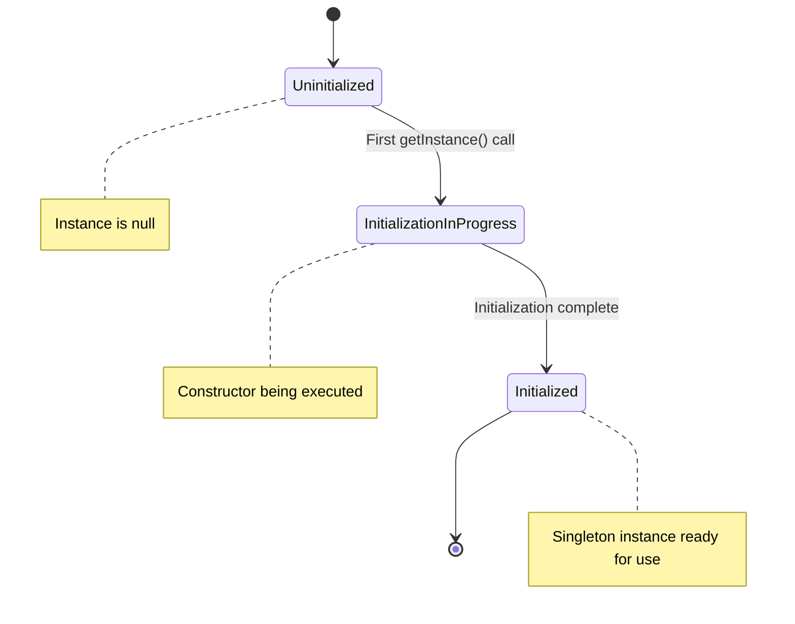

### Thread-Safe Singleton-Zustandsdiagramm

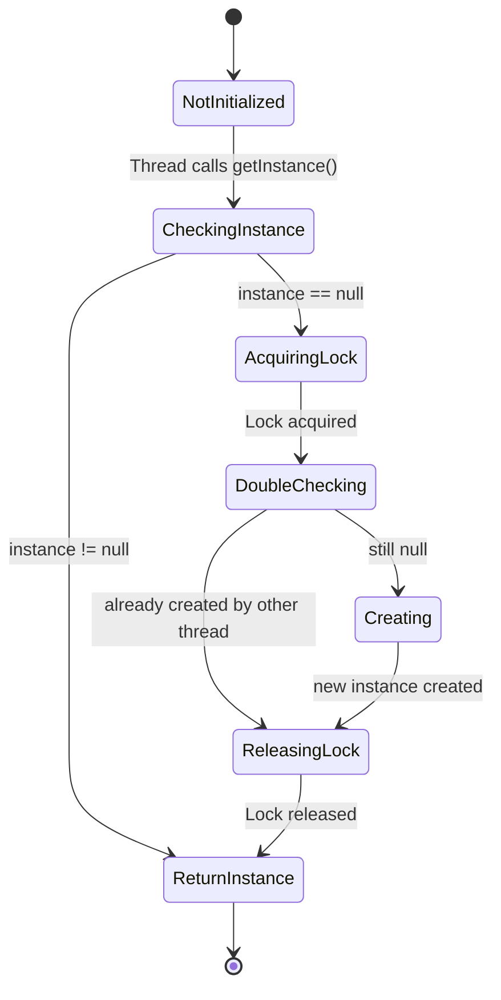

## Aktivitätsdiagramme

### Singleton-Zugriff-Aktivitätsdiagramm

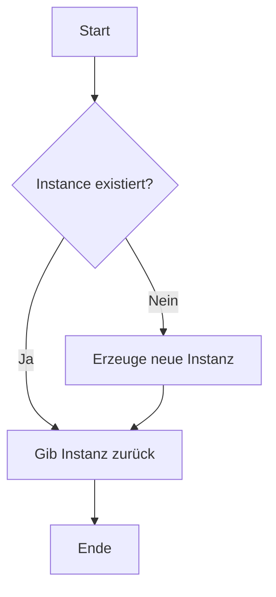

### Thread-Safe Singleton-Aktivitätsdiagramm

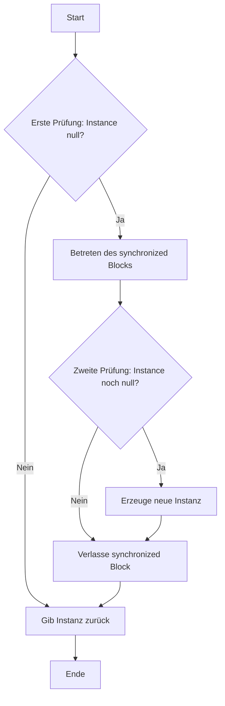

### Enum Singleton-Aktivitätsdiagramm

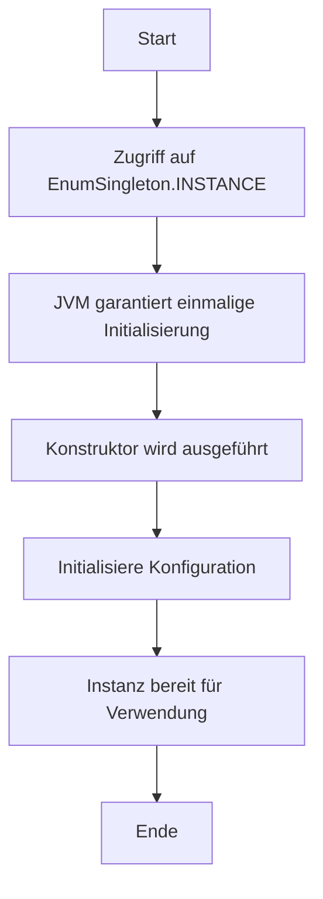